# 基础信息

|      |      |
|------|------|
| 名称 | QueryApi |
| 编码语言 | .java |
| 代码路径 | WeFe/union/union-service/src/main/java/com/welab/wefe/union/service/api/dataresource/dataset/nomal/QueryApi.java |
| 包名 | com.welab.wefe.union.service.api.dataresource.dataset.nomal |
| 依赖项 | ['com.welab.wefe.common.data.mongodb.dto.PageOutput', 'com.welab.wefe.common.web.api.base.AbstractApi', 'com.welab.wefe.common.web.api.base.Api', 'com.welab.wefe.common.web.dto.ApiResult', 'com.welab.wefe.union.service.dto.base.BaseInput', 'com.welab.wefe.union.service.dto.dataresource.dataset.table.ApiDataSetQueryOutput', 'com.welab.wefe.union.service.service.DataSetService', 'org.springframework.beans.factory.annotation.Autowired'] |
| 概述说明 | QueryApi类是一个处理数据集查询的API，路径为data_set/query，允许签名访问。它接收包含id、memberId、name等参数的Input对象，调用dataSetService.query方法进行查询，返回分页结果PageOutput<ApiDataSetQueryOutput>。默认分页大小为10。 |

# 说明

这是一个名为QueryApi的Java类，用于处理数据集查询请求。该类继承自AbstractApi，接受Input类型的输入参数，返回分页格式的ApiDataSetQueryOutput结果。Input类包含多个查询条件字段，如id、memberId、memberName、name、containsY、tag，以及分页参数pageIndex和pageSize。该类通过注入的DataSetService执行实际查询操作，并返回成功结果。API路径为"data_set/query"，允许签名访问。

# 类列表 Class Summary

| 名称   | 类型  | 说明 |
|-------|------|-------------|
| QueryApi | class | QueryApi类用于查询数据集，支持分页和多种过滤条件，如ID、成员信息、名称、标签等，默认每页10条数据。 |


## 类 QueryApi

|      |      |
|------|------|
| 访问范围 | @Api(path = "data_set/query", name = "data_set_query", allowAccessWithSign = true);public |
| 类型 | class |
| 名称 | QueryApi |
| 说明 | QueryApi类用于查询数据集，支持分页和多种过滤条件，如ID、成员信息、名称、标签等，默认每页10条数据。 |


### UML类图

```mermaid
classDiagram
    class QueryApi {
        -DataSetService dataSetService
        +handle(Input input) ApiResult~PageOutput~ApiDataSetQueryOutput~~~
    }
    
    class Input {
        -String id
        -String memberId
        -String memberName
        -String name
        -Boolean containsY
        -String tag
        -Integer pageIndex
        -Integer pageSize
        +String getId()
        +void setId(String id)
        +String getMemberId()
        +void setMemberId(String memberId)
        // ...其他getter/setter省略...
    }

    class DataSetService {
        +query(Input input) PageOutput~ApiDataSetQueryOutput~
    }

    class AbstractApi~T, R~ {
        <<Abstract>>
        +handle(T input) ApiResult~R~
    }

    class PageOutput~T~ {
        <<GenericType>>
    }

    class ApiDataSetQueryOutput {
        <<DTO>>
    }

    class ApiResult~T~ {
        <<GenericType>>
    }

    QueryApi --> AbstractApi~Input, PageOutput~ApiDataSetQueryOutput~~~ : 继承
    QueryApi --> DataSetService : 依赖
    QueryApi --> Input : 嵌套类
    DataSetService --> Input : 参数依赖
    DataSetService --> PageOutput~ApiDataSetQueryOutput~ : 返回依赖
    AbstractApi~T, R~ --> ApiResult~R~ : 返回依赖
```

这段代码展示了一个基于Spring框架的数据查询API实现。QueryApi继承自泛型抽象类AbstractApi，处理Input参数并返回分页查询结果。核心功能通过DataSetService完成数据查询，Input类封装了包含分页参数在内的查询条件。类图清晰地展示了各组件间的继承、依赖和泛型关系，体现了分层架构和DTO模式的应用。


### 内部方法调用关系图

```mermaid
graph TD
    A["类QueryApi"]
    B["注解: @Api"]
    C["继承: AbstractApi<Input, PageOutput<ApiDataSetQueryOutput>>"]
    D["依赖注入: @Autowired DataSetService"]
    E["重写方法: handle(Input input)"]
    F["内部类: Input"]
    G["属性: String id"]
    H["属性: String memberId"]
    I["属性: String memberName"]
    J["属性: String name"]
    K["属性: Boolean containsY"]
    L["属性: String tag"]
    M["属性: Integer pageIndex=0"]
    N["属性: Integer pageSize=10"]
    O["getter/setter方法"]

    A --> B
    A --> C
    A --> D
    A --> E
    A --> F
    F --> G
    F --> H
    F --> I
    F --> J
    F --> K
    F --> L
    F --> M
    F --> N
    F --> O
    E --> D
    E --> F
```



这段代码展示了一个基于Spring框架的查询API实现，主要包含QueryApi类和其内部Input类。QueryApi通过继承AbstractApi实现了带分页功能的数据集查询接口，使用@Autowired注入DataSetService进行业务处理。内部Input类定义了丰富的查询参数，包含id、memberId等基础字段和分页控制参数，所有字段都配有标准的getter/setter方法。流程图清晰展现了类结构、继承关系、依赖注入和内部类组成，体现了典型的API控制器设计模式。

### 字段列表 Field List

| 名称  | 类型  | 说明 |
|-------|-------|------|
| dataSetService | DataSetService | 自动注入数据集服务实例。 |

### 方法列表

| 名称  | 类型  | 说明 |
|-------|-------|------|
| handle | ApiResult<PageOutput<ApiDataSetQueryOutput>> | 处理查询请求，返回数据集服务查询结果。 |


