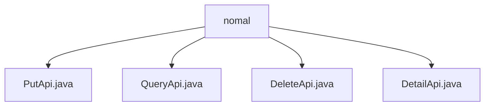

# 基础信息

|      |      |
|------|------|
| 名称 | nomal |
| 编码语言 | .java |
| 代码路径 | WeFe/union/union-service/src/main/java/com/welab/wefe/union/service/api/dataresource/dataset/nomal |
| 包名 | docs.union.union-service.src.main.java.com.welab.wefe.union.service.api.dataresource.dataset.nomal |
| 概述说明 | PutApi处理数据集添加，继承AbstractApi，使用Input和DataSetOutput。QueryApi处理查询，返回分页结果，含多种查询条件。DeleteApi处理删除，输入含id，输出DataSetOutput。DetailApi获取详情，输入需id，返回DataSetDetailOutput。均通过DataSetService处理。 |

# 说明

## 概述  
该模块是数据集管理API组件，核心职责为提供数据集的CRUD操作（创建、查询、删除、详情查看）。接口规范遵循统一设计：均继承AbstractApi，使用Input/Output模式（例如PutApi.Input包含必填字段id/name，QueryApi.Output采用分页结构）。关键数据结构包括DataSetOutput（通用响应）、DataSetDetailOutput（详情响应）和ApiDataSetQueryOutput（分页查询结果）。外部依赖仅DataSetService，通过Autowired注入实现业务逻辑。例如DeleteApi调用其delete方法完成删除。

## 主要业务场景  
模块支持完整数据集生命周期管理：PutApi处理新增（类似资源发布模式），QueryApi实现多条件分页查询（如按tag筛选），DeleteApi/DetailApi分别处理删除和详情查看。交互模式均为RESTful风格，例如DetailApi通过"data_set/detail"路径获取详情。典型应用包括：数据服务集成（通过签名API）、控制台管理（使用分页查询）。API类型覆盖写操作（Put/Delete）和读操作（Query/Detail），例如QueryApi支持组合条件检索。

### 包内部结构视图

该流程图展示了在nomal目录下的四个Java文件：PutApi.java、QueryApi.java、DeleteApi.java和DetailApi.java。这些文件都直接隶属于nomal目录，没有更深层次的嵌套结构。每个文件代表一个独立的API接口实现，共同构成了数据集常规操作的功能模块。

# 文件列表

| 名称   | 类型  | 说明 |
|-------|------|-------------|
| [PutApi.java](PutApi.md) | file | 这是一个名为PutApi的API类，用于处理数据集添加请求。它接收包含ID、名称、成员ID等必填字段的输入，调用DataSetService进行添加操作，并返回成功结果。输入类包含多个可选和必填属性，如行数、列数、特征列表等。 |
| [QueryApi.java](QueryApi.md) | file | QueryApi类是一个处理数据集查询的API，路径为data_set/query，允许签名访问。它接收包含id、memberId、name等参数的Input对象，调用dataSetService.query方法进行查询，返回分页结果PageOutput<ApiDataSetQueryOutput>。默认分页大小为10。 |
| [DeleteApi.java](DeleteApi.md) | file | 删除数据集的API类，路径为"data_set/delete"，允许签名访问，通过DataSetService删除指定ID的数据集，返回成功结果。输入参数包含ID字段。 |
| [DetailApi.java](DetailApi.md) | file | 这是一个名为DetailApi的API类，路径为"data_set/detail"，允许签名访问。它处理输入参数id并返回数据集详情，使用dataSetService的detail方法实现功能。 |

