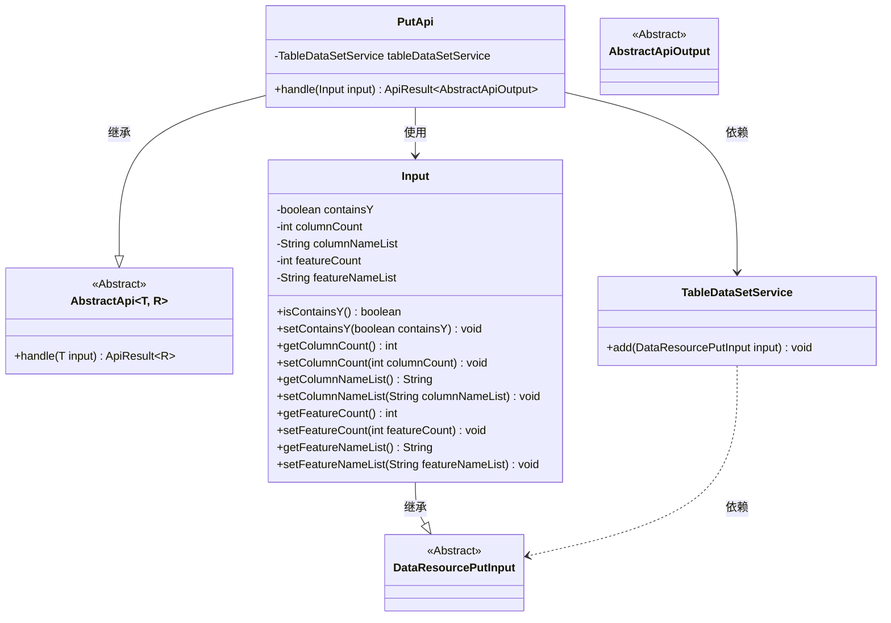
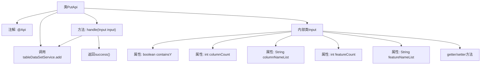

# 基础信息

|      |      |
|------|------|
| 名称 | PutApi |
| 编码语言 | .java |
| 代码路径 | WeFe/union/union-service/src/main/java/com/welab/wefe/union/service/api/dataresource/dataset/table/PutApi.java |
| 包名 | com.welab.wefe.union.service.api.dataresource.dataset.table |
| 依赖项 | ['com.welab.wefe.common.exception.StatusCodeWithException', 'com.welab.wefe.common.fieldvalidate.annotation.Check', 'com.welab.wefe.common.web.api.base.AbstractApi', 'com.welab.wefe.common.web.api.base.Api', 'com.welab.wefe.common.web.dto.AbstractApiOutput', 'com.welab.wefe.common.web.dto.ApiResult', 'com.welab.wefe.union.service.dto.dataresource.DataResourcePutInput', 'com.welab.wefe.union.service.service.TableDataSetService', 'org.springframework.beans.factory.annotation.Autowired'] |
| 概述说明 | 这是一个用于添加表格数据集的API类，包含输入参数如列数、特征数及名称列表，通过服务层将数据存入数据库。 |

# 说明

这是一个名为PutApi的API类，用于处理表格数据集的添加操作。它继承自AbstractApi，接受Input类型的输入并返回AbstractApiOutput。API路径为table_data_set/put，允许签名访问。内部通过TableDataSetService的add方法处理数据。Input类继承自DataResourcePutInput，包含五个字段：必填的containsY布尔值，以及columnCount、columnNameList、featureCount和featureNameList四个可选字段，分别表示列数、列名列表、特征数和特征名列表。所有字段都有对应的getter和setter方法。处理成功后返回成功状态。

# 类列表 Class Summary

| 名称   | 类型  | 说明 |
|-------|------|-------------|
| PutApi | class | PutApi类处理表格数据集添加请求，路径为table_data_set/put，需签名访问。输入参数包含是否含Y、列数、列名列表、特征数和特征名列表。调用TableDataSetService.add方法处理数据。 |

## 类 PutApi

|      |      |
|------|------|
| 访问范围 | @Api(path = "table_data_set/put", name = "table_data_set", allowAccessWithSign = true);public |
| 类型 | class |
| 名称 | PutApi |
| 说明 | PutApi类处理表格数据集添加请求，路径为table_data_set/put，需签名访问。输入参数包含是否含Y、列数、列名列表、特征数和特征名列表。调用TableDataSetService.add方法处理数据。 |

### UML类图

该类图展示了PutApi及其相关类的结构关系。PutApi继承自泛型类AbstractApi，指定Input作为输入类型和AbstractApiOutput作为输出类型。Input类继承自DataResourcePutInput，包含多个私有字段及其getter/setter方法。PutApi通过依赖注入使用TableDataSetService来执行数据添加操作，体现了清晰的层级结构和依赖关系。整个设计遵循了面向对象的原则，通过抽象类和接口实现了良好的扩展性。

### 内部方法调用关系图

这段代码展示了一个名为PutApi的API类，它继承自AbstractApi并处理数据集的添加操作。流程图清晰地呈现了类结构，包括类注解、服务注入、核心处理方法以及嵌套的Input数据传输对象。Input类包含5个属性和对应的getter/setter方法，用于封装数据集的特征信息。handle方法通过调用tableDataSetService.add实现核心业务逻辑，最后返回成功结果。整个设计体现了清晰的层级关系和单一职责原则。

### 字段列表 Field List

| 名称  | 类型  | 说明 |
|-------|-------|------|
| tableDataSetService | TableDataSetService | 自动注入TableDataSetService服务实例。 |

### 方法列表

| 名称  | 类型  | 说明 |
|-------|-------|------|
| handle | ApiResult<AbstractApiOutput> | Java方法重写，调用tableDataSetService.add处理输入，成功后返回ApiResult。异常时抛出StatusCodeWithException。 |

