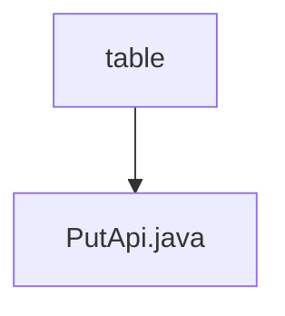

# 基础信息

|      |      |
|------|------|
| 名称 | table |
| 编码语言 | .java |
| 代码路径 | WeFe/union/union-service/src/main/java/com/welab/wefe/union/service/api/dataresource/dataset/table |
| 包名 | docs.union.union-service.src.main.java.com.welab.wefe.union.service.api.dataresource.dataset.table |
| 概述说明 | 这是一个用于添加表格数据集的API类，包含输入参数如列数、特征数及名称列表，通过服务层将数据存入数据库。 |

# 说明

这是一个名为PutApi的API类，用于处理表格数据集的添加操作。它继承自AbstractApi，接受Input类型的输入并返回AbstractApiOutput。API路径为table_data_set/put，允许签名访问。内部通过TableDataSetService的add方法处理数据。Input类继承自DataResourcePutInput，包含五个字段：必填的containsY布尔值，以及columnCount、columnNameList、featureCount和featureNameList四个可选字段，分别表示列数、列名列表、特征数和特征名列表。所有字段都有对应的getter和setter方法。处理成功后返回成功状态。

### 包内部结构视图

该流程图展示了数据资源数据集表目录下的结构关系，其中table目录包含一个PutApi.java文件。这是一个简单的单层结构，表示在table目录下直接存放着PutApi接口文件，用于处理数据资源相关的操作。

# 文件列表

| 名称   | 类型  | 说明 |
|-------|------|-------------|
| [PutApi.java](PutApi.md) | file | 这是一个用于添加表格数据集的API类，包含输入参数如列数、特征数及名称列表，通过服务层将数据存入数据库。 |

