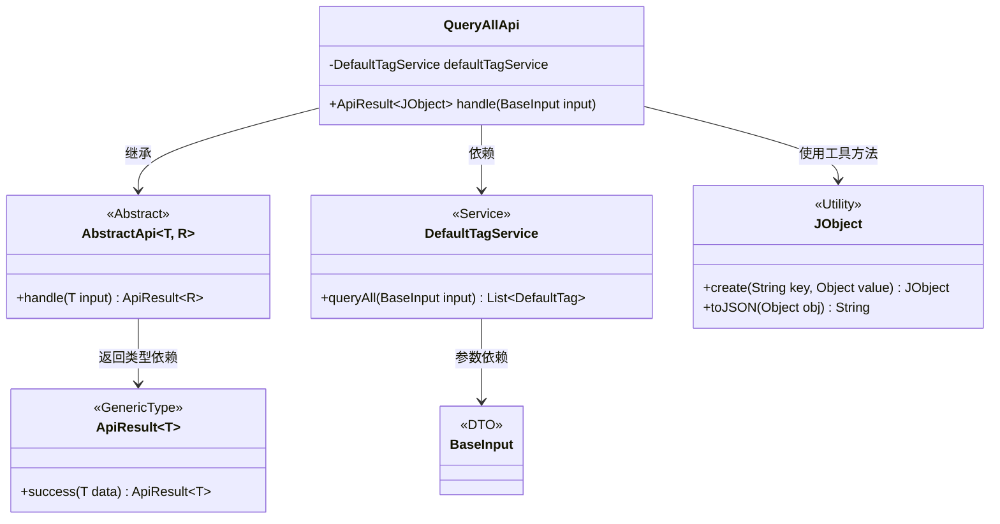
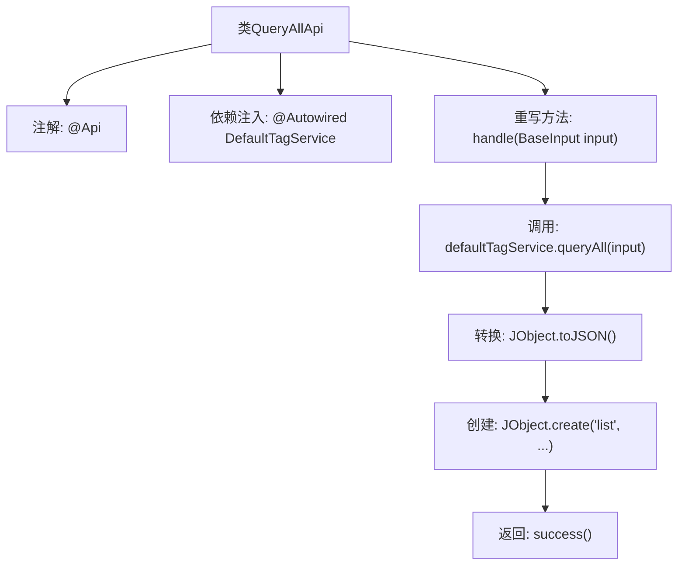

# 基础信息

|      |      |
|------|------|
| 名称 | QueryAllApi |
| 编码语言 | .java |
| 代码路径 | WeFe/union/union-service/src/main/java/com/welab/wefe/union/service/api/defaulttag/QueryAllApi.java |
| 包名 | com.welab.wefe.union.service.api.defaulttag |
| 依赖项 | ['com.welab.wefe.common.util.JObject', 'com.welab.wefe.common.web.api.base.AbstractApi', 'com.welab.wefe.common.web.api.base.Api', 'com.welab.wefe.common.web.dto.ApiResult', 'com.welab.wefe.union.service.dto.base.BaseInput', 'com.welab.wefe.union.service.service.DefaultTagService', 'org.springframework.beans.factory.annotation.Autowired'] |
| 概述说明 | Java类QueryAllApi定义了一个API接口，路径为default_tag/query，允许签名访问，调用DefaultTagService的queryAll方法查询数据并返回JSON格式结果。 |

# 说明

这是一个名为QueryAllApi的Java类，继承自AbstractApi，用于处理默认标签查询请求。类上标注了Api注解，指定路径为default_tag/query，允许带签名的访问。该类通过Autowired注入DefaultTagService服务，重写了handle方法，调用defaultTagService的queryAll方法获取数据，并将结果封装为包含list字段的JObject对象返回。整个类实现了对默认标签列表的查询功能。

# 类列表 Class Summary

| 名称   | 类型  | 说明 |
|-------|------|-------------|
| QueryAllApi | class | 这是一个Java类，定义了一个API接口，路径为"default_tag/query"，允许签名访问。它继承自AbstractApi，使用DefaultTagService查询数据并返回JSON格式的结果列表。 |

## 类 QueryAllApi

|      |      |
|------|------|
| 访问范围 | @Api(path = "default_tag/query", name = "default_tag_query", allowAccessWithSign = true);public |
| 类型 | class |
| 名称 | QueryAllApi |
| 说明 | 这是一个Java类，定义了一个API接口，路径为"default_tag/query"，允许签名访问。它继承自AbstractApi，使用DefaultTagService查询数据并返回JSON格式的结果列表。 |

### UML类图

这段类图展示了QueryAllApi作为AbstractApi的实现类，通过依赖DefaultTagService完成标签查询功能。其中涉及BaseInput作为输入DTO，JObject作为JSON处理工具类，ApiResult作为通用返回类型封装。各组件通过清晰的依赖关系协作，实现了带签名的API查询功能，符合RESTful接口设计规范。

### 内部方法调用关系图

这段代码流程图展示了QueryAllApi类的核心结构和工作流程。该类是一个带有@Api注解的API实现，通过Autowired注入DefaultTagService服务，并重写handle方法来处理请求。流程从接收BaseInput开始，调用服务层查询数据，将结果转换为JSON格式后包装成JObject，最后返回成功的ApiResult。整个过程体现了典型的API控制器模式，包含依赖注入、业务逻辑处理和响应封装三个主要阶段。

### 字段列表 Field List

| 名称  | 类型  | 说明 |
|-------|-------|------|
| defaultTagService | DefaultTagService | 代码片段使用@Autowired注解自动注入DefaultTagService实例。 |

### 方法列表

| 名称  | 类型  | 说明 |
|-------|-------|------|
| handle | ApiResult<JObject> | Java方法重写，处理输入并返回JSON格式的标签列表查询结果。 |

