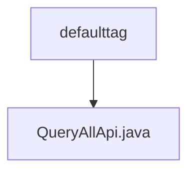

# 基础信息

|      |      |
|------|------|
| 名称 | defaulttag |
| 编码语言 | .java |
| 代码路径 | WeFe/union/union-service/src/main/java/com/welab/wefe/union/service/api/defaulttag |
| 包名 | docs.union.union-service.src.main.java.com.welab.wefe.union.service.api.defaulttag |
| 概述说明 | Java类QueryAllApi定义了一个API接口，路径为default_tag/query，允许签名访问，调用DefaultTagService的queryAll方法查询数据并返回JSON格式结果。 |

# 说明

这是一个名为QueryAllApi的Java类，继承自AbstractApi，用于处理默认标签查询请求。类上标注了Api注解，指定路径为default_tag/query，允许带签名的访问。该类通过Autowired注入DefaultTagService服务，重写了handle方法，调用defaultTagService的queryAll方法获取数据，并将结果封装为包含list字段的JObject对象返回。整个类实现了对默认标签列表的查询功能。

### 包内部结构视图

该流程图展示了defaulttag目录与QueryAllApi.java文件之间的层级关系。defaulttag作为父目录，包含一个子文件QueryAllApi.java，这是典型的Java项目API接口文件存放结构，体现了单一接口文件与其所属功能模块的从属关系。

# 文件列表

| 名称   | 类型  | 说明 |
|-------|------|-------------|
| [QueryAllApi.java](QueryAllApi.md) | file | Java类QueryAllApi定义了一个API接口，路径为default_tag/query，允许签名访问，调用DefaultTagService的queryAll方法查询数据并返回JSON格式结果。 |

