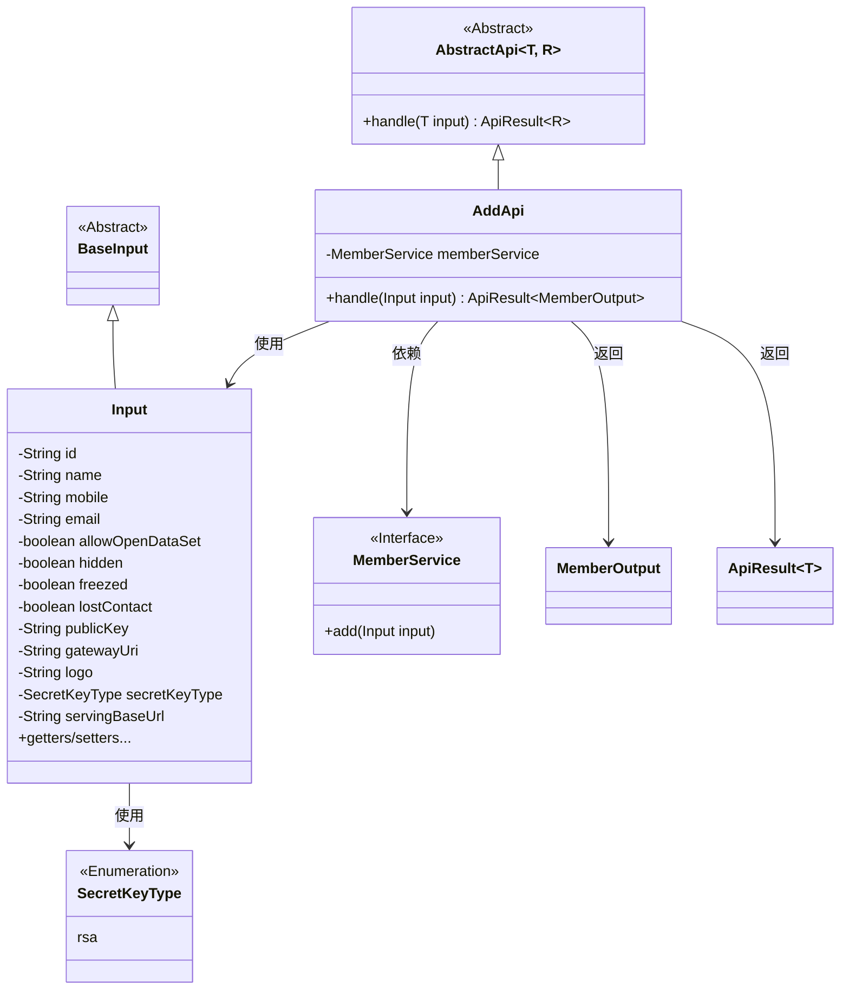

# 基础信息

|      |      |
|------|------|
| 名称 | AddApi |
| 编码语言 | .java |
| 代码路径 | WeFe/union/union-service/src/main/java/com/welab/wefe/union/service/api/member/AddApi.java |
| 包名 | com.welab.wefe.union.service.api.member |
| 依赖项 | ['com.welab.wefe.common.constant.SecretKeyType', 'com.welab.wefe.common.exception.StatusCodeWithException', 'com.welab.wefe.common.fieldvalidate.annotation.Check', 'com.welab.wefe.common.web.api.base.AbstractApi', 'com.welab.wefe.common.web.api.base.Api', 'com.welab.wefe.common.web.dto.ApiResult', 'com.welab.wefe.union.service.dto.base.BaseInput', 'com.welab.wefe.union.service.dto.member.MemberOutput', 'com.welab.wefe.union.service.service.MemberService', 'org.springframework.beans.factory.annotation.Autowired'] |
| 概述说明 | AddApi类用于添加成员，路径为member/add，需签名访问。输入包含ID、姓名、联系方式等字段，输出MemberOutput。处理逻辑调用memberService.add方法。 |

# 说明

该代码定义了一个名为AddApi的API类，用于添加成员信息。API路径为member/add，不允许签名访问。类继承自AbstractApi，输入类型为Input，输出类型为MemberOutput。通过MemberService处理添加成员请求。Input类包含多个成员属性，如id、name、mobile、email等，其中id为必填项。还包括各种布尔状态标志和配置信息，如allowOpenDataSet、hidden、freezed等。所有属性均提供getter和setter方法。处理逻辑中调用memberService.add方法并返回成功结果。

# 类列表 Class Summary

| 名称   | 类型  | 说明 |
|-------|------|-------------|
| AddApi | class | AddApi类用于添加成员，包含ID、姓名、联系方式等输入参数，调用MemberService.add方法处理请求。 |

## 类 AddApi

|      |      |
|------|------|
| 访问范围 | @Api(path = "member/add", name = "member_add", allowAccessWithSign = false);public |
| 类型 | class |
| 名称 | AddApi |
| 说明 | AddApi类用于添加成员，包含ID、姓名、联系方式等输入参数，调用MemberService.add方法处理请求。 |

### UML类图

这段代码展示了一个成员添加API的实现结构。AddApi继承自泛型抽象类AbstractApi，处理Input输入并返回MemberOutput结果。Input类继承BaseInput，包含成员信息的各种字段和对应的getter/setter方法。AddApi通过依赖注入的MemberService接口实现成员添加功能，使用枚举SecretKeyType定义密钥类型。整体架构体现了清晰的层次关系和职责分离。

### 内部方法调用关系图

```mermaid
graph TD
    A["类AddApi"]
    B["注解: @Api"]
    C["继承: AbstractApi<Input, MemberOutput>"]
    D["依赖注入: @Autowired MemberService"]
    E["重写方法: handle(Input input)"]
    F["内部类: Input"]
    G["属性: String id (必填)"]
    H["属性: String name"]
    I["属性: String mobile"]
    J["属性: String email"]
    K["属性: boolean allowOpenDataSet"]
    L["属性: boolean hidden"]
    M["属性: boolean freezed"]
    N["属性: boolean lostContact"]
    O["属性: String publicKey"]
    P["属性: String gatewayUri"]
    Q["属性: String logo"]
    R["属性: SecretKeyType secretKeyType"]
    S["属性: String servingBaseUrl"]
    T["Getter/Setter方法"]

    A --> B
    A --> C
    A --> D
    A --> E
    A --> F
    F --> G
    F --> H
    F --> I
    F --> J
    F --> K
    F --> L
    F --> M
    F --> N
    F --> O
    F --> P
    F --> Q
    F --> R
    F --> S
    F --> T
    E --> D
    E --> F
```

该流程图展示了AddApi类的完整结构，包括类注解、继承关系、依赖注入的MemberService、重写的handle方法，以及包含13个属性和对应Getter/Setter方法的Input内部类。重点突出了必填字段id的校验注解，以及handle方法通过memberService.add()处理输入参数的流程。类结构清晰展现了API接口与业务逻辑的分离设计，Input内部类封装了所有可能的成员属性配置项。

### 字段列表 Field List

| 名称  | 类型  | 说明 |
|-------|-------|------|
| memberService | MemberService | 使用@Autowired自动注入MemberService实例。 |

### 方法列表

| 名称  | 类型  | 说明 |
|-------|-------|------|
| handle | ApiResult<MemberOutput> | 处理成员添加请求，调用服务层方法并返回成功结果。 |

