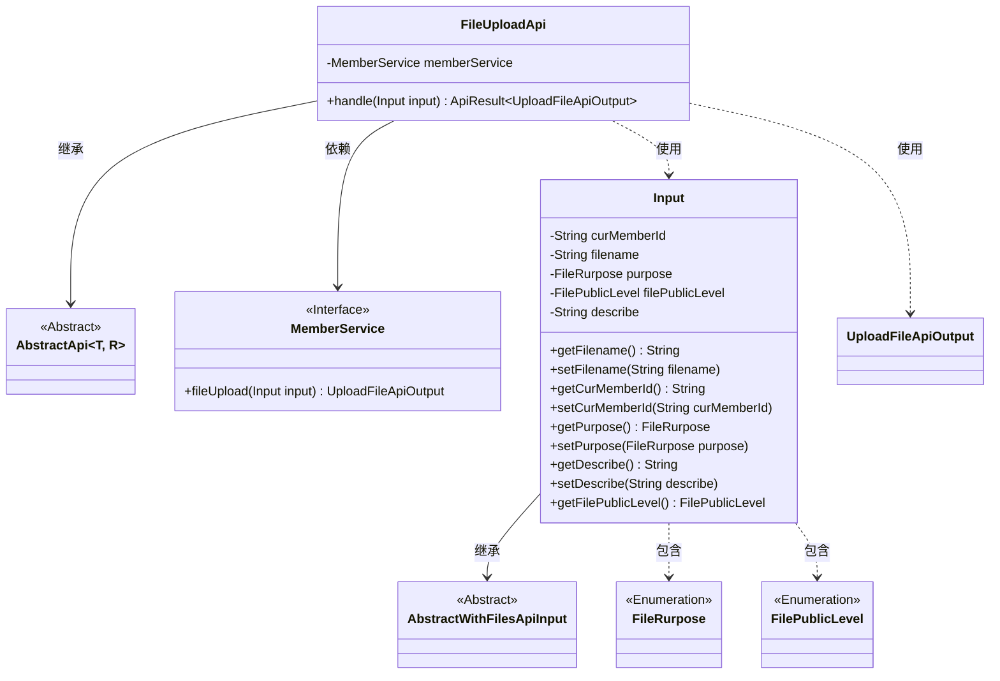
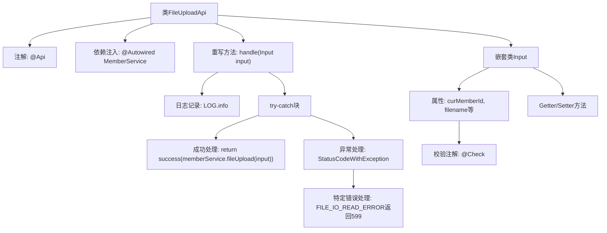

# 基础信息

|      |      |
|------|------|
| 名称 | FileUploadApi |
| 编码语言 | .java |
| 代码路径 | WeFe/union/union-service/src/main/java/com/welab/wefe/union/service/api/member/FileUploadApi.java |
| 包名 | com.welab.wefe.union.service.api.member |
| 依赖项 | ['com.welab.wefe.common.StatusCode', 'com.welab.wefe.common.enums.FilePublicLevel', 'com.welab.wefe.common.exception.StatusCodeWithException', 'com.welab.wefe.common.fieldvalidate.annotation.Check', 'com.welab.wefe.common.web.api.base.AbstractApi', 'com.welab.wefe.common.web.api.base.Api', 'com.welab.wefe.common.web.dto.AbstractWithFilesApiInput', 'com.welab.wefe.common.web.dto.ApiResult', 'com.welab.wefe.common.web.dto.UploadFileApiOutput', 'com.welab.wefe.common.wefe.enums.FileRurpose', 'com.welab.wefe.union.service.service.MemberService', 'org.springframework.beans.factory.annotation.Autowired'] |
| 概述说明 | 文件上传API类，处理成员文件上传请求，需提供成员ID、文件名、用途等参数，支持私有或公开文件级别，异常时返回特定错误码。 |

# 说明

该代码定义了一个文件上传API类FileUploadApi，继承自AbstractApi，处理文件上传请求。API路径为member/file/upload，允许签名访问。类中注入了MemberService，核心方法handle调用memberService.fileUpload处理上传逻辑，捕获异常时特殊处理FILE_IO_READ_ERROR状态码并返回599 HTTP状态码。输入类Input继承AbstractWithFilesApiInput，包含必填字段curMemberId、filename、purpose，以及可选字段filePublicLevel（默认Private）和describe，各字段均有getter/setter方法。

# 类列表 Class Summary

| 名称   | 类型  | 说明 |
|-------|------|-------------|
| FileUploadApi | class | 文件上传API类，处理成员文件上传请求，需提供成员ID、文件名、用途等必填参数，支持文件私有或公开设置，异常时返回特定错误码。 |

## 类 FileUploadApi

|      |      |
|------|------|
| 访问范围 | @Api(path = "member/file/upload", name = "member_file_upload", allowAccessWithSign = true);public |
| 类型 | class |
| 名称 | FileUploadApi |
| 说明 | 文件上传API类，处理成员文件上传请求，需提供成员ID、文件名、用途等必填参数，支持文件私有或公开设置，异常时返回特定错误码。 |

### UML类图

这段代码展示了一个文件上传API的实现类FileUploadApi，它继承自泛型抽象类AbstractApi，处理Input参数并返回UploadFileApiOutput结果。Input类继承自AbstractWithFilesApiInput，包含文件相关属性和枚举类型字段。FileUploadApi通过依赖注入的MemberService接口实现文件上传功能，并处理可能出现的异常状态码。类图清晰地展示了各组件间的继承、依赖和关联关系。

### 内部方法调用关系图

这段代码展示了一个文件上传API的实现，包含主类FileUploadApi和嵌套输入类Input。流程图清晰地呈现了类结构关系，包括API注解、服务注入、核心处理方法及其异常处理逻辑，以及输入参数的校验机制。嵌套类Input详细定义了文件上传所需的字段及其访问方法，整个设计体现了分层处理和防御性编程思想。

### 字段列表 Field List

| 名称  | 类型  | 说明 |
|-------|-------|------|
| memberService | MemberService | 自动注入MemberService实例。 |

### 方法列表

| 名称  | 类型  | 说明 |
|-------|-------|------|
| handle | ApiResult<UploadFileApiOutput> | 处理文件上传请求，成功时返回上传结果，读取错误时返回599状态码，其他异常直接抛出。 |

