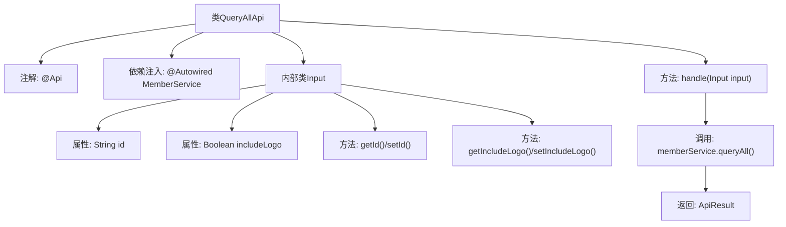

# 基础信息

|      |      |
|------|------|
| 名称 | QueryAllApi |
| 编码语言 | .java |
| 代码路径 | WeFe/union/union-service/src/main/java/com/welab/wefe/union/service/api/member/QueryAllApi.java |
| 包名 | com.welab.wefe.union.service.api.member |
| 依赖项 | ['com.welab.wefe.common.util.JObject', 'com.welab.wefe.common.web.api.base.AbstractApi', 'com.welab.wefe.common.web.api.base.Api', 'com.welab.wefe.common.web.dto.AbstractApiInput', 'com.welab.wefe.common.web.dto.ApiResult', 'com.welab.wefe.union.service.service.MemberService', 'org.springframework.beans.factory.annotation.Autowired'] |
| 概述说明 | 这是一个查询所有成员的API类，路径为"member/query_all"，支持签名访问，日志采样间隔60秒。输入参数包括ID和是否包含logo，返回成员列表的JSON数据。 |

# 说明

该代码定义了一个名为QueryAllApi的API类，用于查询所有成员信息。API路径为member/query_all，允许签名访问，日志采样间隔为60秒。输入参数包括可选的ID（为空时查询全部）和布尔值includeLogo（默认true）。处理逻辑调用memberService.queryAll方法，返回包含成员列表的JSON结果。

# 类列表 Class Summary

| 名称   | 类型  | 说明 |
|-------|------|-------------|
| QueryAllApi | class | 定义了一个查询所有成员的API接口，路径为member/query_all，支持签名访问，日志采样间隔60秒。输入参数包括主键ID和是否包含logo，默认查询全部成员并返回JSON格式列表。 |


## 类 QueryAllApi

|      |      |
|------|------|
| 访问范围 | @Api(path = "member/query_all", name = "member_query_all", allowAccessWithSign = true, logSaplingInterval = 60_000);public |
| 类型 | class |
| 名称 | QueryAllApi |
| 说明 | 定义了一个查询所有成员的API接口，路径为member/query_all，支持签名访问，日志采样间隔60秒。输入参数包括主键ID和是否包含logo，默认查询全部成员并返回JSON格式列表。 |


### UML类图

```mermaid
classDiagram
    class QueryAllApi {
        -MemberService memberService
        +handle(QueryAllApi~Input~ input) ApiResult~JObject~
    }
    QueryAllApi --> MemberService : 依赖

    class MemberService {
        <<Interface>>
        +queryAll(QueryAllApi~Input~ input) List~Member~
    }

    class AbstractApi~T, R~ {
        <<Abstract>>
        +handle(T input) ApiResult~R~
    }
    QueryAllApi --|> AbstractApi~QueryAllApi~Input~, JObject~

    class AbstractApiInput {
        <<Abstract>>
    }
    QueryAllApi~Input~ --|> AbstractApiInput

    class QueryAllApi~Input~ {
        -String id
        -Boolean includeLogo
        +String getId()
        +void setId(String id)
        +Boolean getIncludeLogo()
        +void setIncludeLogo(Boolean includeLogo)
    }

    class JObject {
        +create(String key, Object value) JObject
        +toJSON(Object obj) String
    }
```

这段类图展示了QueryAllApi及其相关类的结构。QueryAllApi继承自泛型抽象类AbstractApi，处理Input类型参数并返回JObject结果。它依赖MemberService接口查询成员数据，Input类继承自AbstractApiInput并包含id和includeLogo字段。JObject提供JSON操作工具方法。整体设计符合API分层架构，通过泛型和抽象类实现类型安全扩展。


### 内部方法调用关系图



这段代码定义了一个名为QueryAllApi的API类，继承自AbstractApi，用于查询所有成员信息。类通过@Api注解配置了API路径和访问权限，使用MemberService处理业务逻辑。内部类Input定义了查询参数id和includeLogo，并提供了相应的getter和setter方法。handle方法调用memberService.queryAll()获取数据，并将结果封装为ApiResult<JObject>返回。流程图清晰地展示了类结构、属性、方法调用关系以及数据流向。

### 字段列表 Field List

| 名称  | 类型  | 说明 |
|-------|-------|------|
| memberService | MemberService | 使用@Autowired自动注入MemberService实例。 |

### 方法列表

| 名称  | 类型  | 说明 |
|-------|-------|------|
| handle | ApiResult<JObject> | 该方法重写父类逻辑，接收输入参数后调用成员服务查询所有数据，将结果转为JSON格式并封装为成功响应返回。 |


