# 基础信息

|      |      |
|------|------|
| 名称 | QueryApi |
| 编码语言 | .java |
| 代码路径 | WeFe/union/union-service/src/main/java/com/welab/wefe/union/service/api/member/QueryApi.java |
| 包名 | com.welab.wefe.union.service.api.member |
| 依赖项 | ['com.welab.wefe.common.data.mongodb.dto.PageOutput', 'com.welab.wefe.common.exception.StatusCodeWithException', 'com.welab.wefe.common.web.api.base.AbstractApi', 'com.welab.wefe.common.web.api.base.Api', 'com.welab.wefe.common.web.dto.ApiResult', 'com.welab.wefe.union.service.dto.base.BaseInput', 'com.welab.wefe.union.service.dto.member.MemberQueryOutput', 'com.welab.wefe.union.service.service.MemberService', 'org.springframework.beans.factory.annotation.Autowired'] |
| 概述说明 | 成员查询API，支持签名访问，输入参数包括ID、姓名、分页信息，调用MemberService查询并返回分页结果。 |

# 说明

该代码定义了一个名为QueryApi的API类，用于查询会员信息。API路径为member/query，支持签名访问。继承自AbstractApi，输入类型为QueryApi.Input，输出为分页的MemberQueryOutput。内部类Input包含id、name、pageIndex和pageSize字段及对应的getter/setter方法。处理逻辑通过MemberService的query方法实现，返回分页查询结果。默认分页参数为每页10条，起始页码0。

# 类列表 Class Summary

| 名称   | 类型  | 说明 |
|-------|------|-------------|
| QueryApi | class | QueryApi类用于分页查询会员信息，包含ID、姓名参数，默认每页10条数据，调用MemberService处理请求。 |


## 类 QueryApi

|      |      |
|------|------|
| 访问范围 | @Api(path = "member/query", name = "member_query", allowAccessWithSign = true);public |
| 类型 | class |
| 名称 | QueryApi |
| 说明 | QueryApi类用于分页查询会员信息，包含ID、姓名参数，默认每页10条数据，调用MemberService处理请求。 |


### UML类图

```mermaid
classDiagram
    class QueryApi {
        -MemberService memberService
        +handle(Input input) ApiResult~PageOutput~MemberQueryOutput~~~
    }
    
    class Input {
        -String id
        -String name
        -Integer pageIndex
        -Integer pageSize
        +String getId()
        +void setId(String id)
        +String getName()
        +void setName(String name)
        +Integer getPageIndex()
        +void setPageIndex(Integer pageIndex)
        +Integer getPageSize()
        +void setPageSize(Integer pageSize)
    }
    
    class AbstractApi~T, R~ {
        <<Abstract>>
    }
    
    class MemberService {
        <<Interface>>
    }
    
    class PageOutput~T~ {
        <<Generic>>
    }
    
    class MemberQueryOutput {
    }
    
    class ApiResult~T~ {
        <<Generic>>
    }
    
    class BaseInput {
    }
    
    QueryApi --> AbstractApi~Input, PageOutput~MemberQueryOutput~~~ : 继承
    QueryApi --> MemberService : 依赖
    Input --> BaseInput : 继承
    AbstractApi~T, R~ <|-- QueryApi : 实现
    PageOutput~T~ --> MemberQueryOutput : 包含
    ApiResult~T~ --> PageOutput~MemberQueryOutput~ : 包含
```

这段代码展示了一个基于Spring框架的查询API实现。QueryApi类继承自泛型抽象类AbstractApi，处理Member查询请求，通过MemberService接口执行实际查询操作。Input内部类封装了查询参数（ID、名称、分页信息），继承自BaseInput基础类。该架构实现了清晰的层次分离：API入口、业务逻辑处理、数据传输对象和分页结果封装，体现了典型的Controller-Service分层设计模式。泛型类PageOutput和ApiResult提供了类型安全的响应封装机制。


### 内部方法调用关系图

```mermaid
graph TD
    A["类QueryApi"]
    B["注解: @Api"]
    C["继承: AbstractApi<Input, PageOutput<MemberQueryOutput>>"]
    D["依赖注入: @Autowired MemberService"]
    E["重写方法: handle(Input input)"]
    F["内部类: Input"]
    G["属性: String id"]
    H["属性: String name"]
    I["属性: Integer pageIndex"]
    J["属性: Integer pageSize"]
    K["getter/setter方法"]

    A --> B
    A --> C
    A --> D
    A --> E
    A --> F
    F --> G
    F --> H
    F --> I
    F --> J
    F --> K
    E --> D["调用memberService.query(input)"]
    E --> C["返回ApiResult<PageOutput<MemberQueryOutput>>"]
```



这段代码展示了一个基于Spring框架的查询API实现，主要包含QueryApi主类和嵌套的Input参数类。流程图清晰地呈现了类继承关系、依赖注入、核心方法调用链和参数结构。QueryApi通过handle方法处理输入参数，调用MemberService执行查询，并返回分页结果。Input类封装了查询条件(id/name)和分页参数(pageIndex/pageSize)，通过getter/setter提供访问控制。整体设计符合RESTful API的常见模式。

### 字段列表 Field List

| 名称  | 类型  | 说明 |
|-------|-------|------|
| memberService | MemberService | 使用@Autowired自动注入MemberService实例。 |

### 方法列表

| 名称  | 类型  | 说明 |
|-------|-------|------|
| handle | ApiResult<PageOutput<MemberQueryOutput>> | 处理成员查询请求，调用服务层方法并返回分页结果。 |


