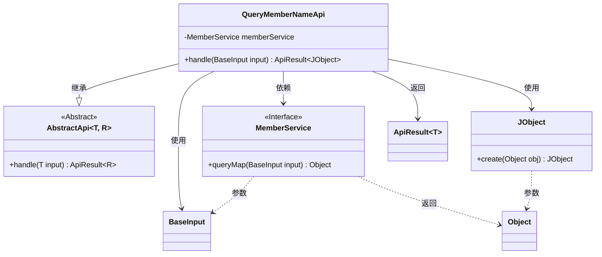
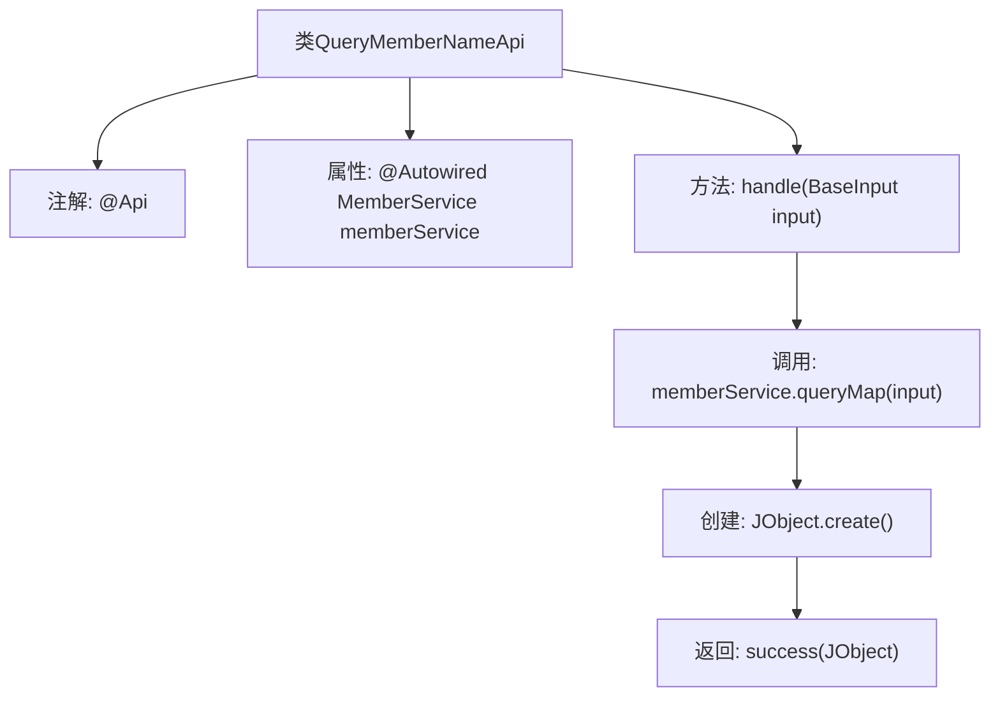

# 基础信息

|      |      |
|------|------|
| 名称 | QueryMemberNameApi |
| 编码语言 | .java |
| 代码路径 | WeFe/union/union-service/src/main/java/com/welab/wefe/union/service/api/member/QueryMemberNameApi.java |
| 包名 | com.welab.wefe.union.service.api.member |
| 依赖项 | ['com.welab.wefe.common.exception.StatusCodeWithException', 'com.welab.wefe.common.util.JObject', 'com.welab.wefe.common.web.api.base.AbstractApi', 'com.welab.wefe.common.web.api.base.Api', 'com.welab.wefe.common.web.dto.ApiResult', 'com.welab.wefe.union.service.dto.base.BaseInput', 'com.welab.wefe.union.service.service.MemberService', 'org.springframework.beans.factory.annotation.Autowired'] |
| 概述说明 | 这是一个名为member_map的API类，路径为member/map，允许签名访问。它继承自AbstractApi，使用MemberService查询成员信息并返回JSON结果。 |

# 说明

该代码定义了一个名为QueryMemberNameApi的API类，路径为"member/map"，名称为"member_map"，允许带签名访问。它继承自AbstractApi，使用BaseInput作为输入类型，JObject作为输出类型。类中注入了MemberService成员服务，并通过handle方法调用memberService.queryMap处理输入，返回封装为JObject的成功结果。该API用于查询成员名称映射信息。

# 类列表 Class Summary

| 名称   | 类型  | 说明 |
|-------|------|-------------|
| QueryMemberNameApi | class | 定义了一个名为QueryMemberNameApi的API类，路径为member/map，允许签名访问，通过MemberService查询成员信息并返回JSON结果。 |

## 类 QueryMemberNameApi

|      |      |
|------|------|
| 访问范围 | @Api(path = "member/map", name = "member_map", allowAccessWithSign = true);public |
| 类型 | class |
| 名称 | QueryMemberNameApi |
| 说明 | 定义了一个名为QueryMemberNameApi的API类，路径为member/map，允许签名访问，通过MemberService查询成员信息并返回JSON结果。 |

### UML类图

这段代码展示了一个基于抽象类`AbstractApi`实现的会员查询API类`QueryMemberNameApi`。该类通过`MemberService`接口查询会员信息，并将结果封装为`JObject`返回。类图中清晰地显示了继承关系（`AbstractApi`）、依赖注入（`MemberService`）以及输入输出数据类型（`BaseInput`和`JObject`）。该API使用泛型设计，输入类型为`BaseInput`，返回类型为包含`JObject`的`ApiResult`，体现了良好的分层架构和类型安全特性。

### 内部方法调用关系图

这段代码展示了一个继承自AbstractApi的QueryMemberNameApi类，主要用于处理成员名称查询请求。类通过@Api注解定义了API路径和权限，注入MemberService进行业务逻辑处理。核心方法handle接收BaseInput参数，调用memberService.queryMap获取数据后包装为JObject格式，最后通过success方法返回ApiResult结果。整个流程清晰展示了从请求处理到结果返回的完整调用链。

### 字段列表 Field List

| 名称  | 类型  | 说明 |
|-------|-------|------|
| memberService | MemberService | 使用@Autowired自动注入MemberService实例。 |

### 方法列表

| 名称  | 类型  | 说明 |
|-------|-------|------|
| handle | ApiResult<JObject> | 这是一个Java方法，重写父类方法，调用memberService查询数据并返回成功结果。 |

