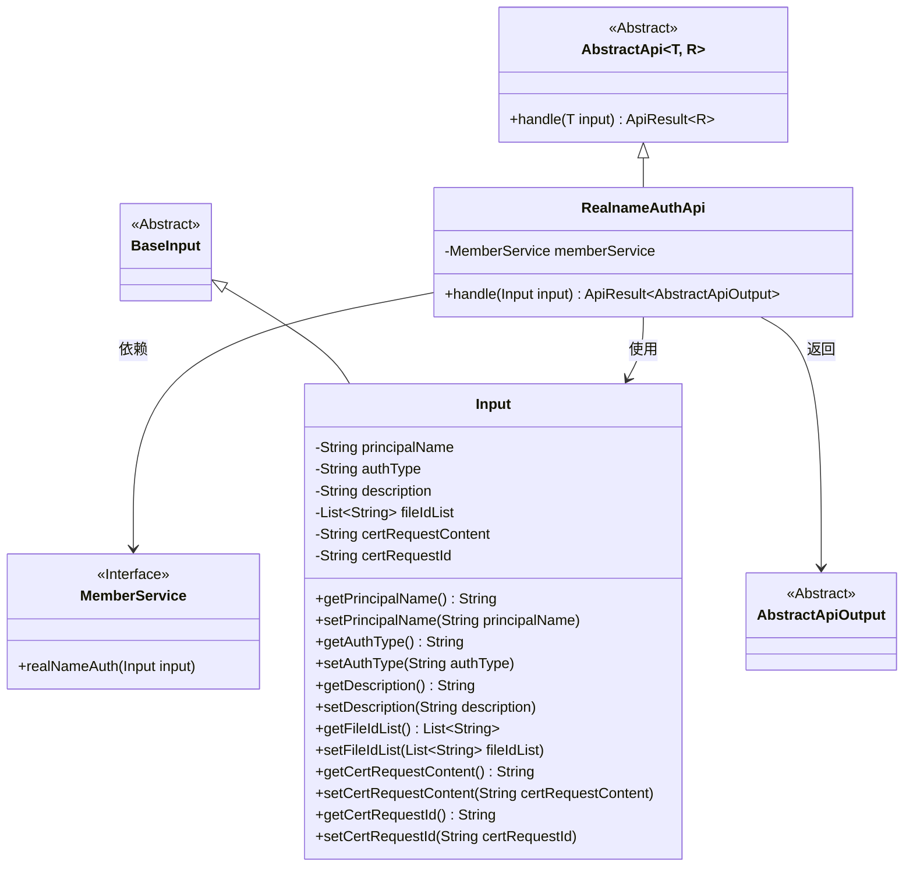

# 基础信息

|      |      |
|------|------|
| 名称 | RealnameAuthApi |
| 编码语言 | .java |
| 代码路径 | WeFe/union/union-service/src/main/java/com/welab/wefe/union/service/api/member/RealnameAuthApi.java |
| 包名 | com.welab.wefe.union.service.api.member |
| 依赖项 | ['com.welab.wefe.common.exception.StatusCodeWithException', 'com.welab.wefe.common.fieldvalidate.annotation.Check', 'com.welab.wefe.common.web.api.base.AbstractApi', 'com.welab.wefe.common.web.api.base.Api', 'com.welab.wefe.common.web.dto.AbstractApiOutput', 'com.welab.wefe.common.web.dto.ApiResult', 'com.welab.wefe.union.service.dto.base.BaseInput', 'com.welab.wefe.union.service.service.MemberService', 'org.springframework.beans.factory.annotation.Autowired', 'java.util.List'] |
| 概述说明 | 实名认证API类，处理用户实名认证请求，包含必填字段如姓名、认证类型、文件列表、证书请求内容和ID，调用MemberService完成认证。 |

# 说明

RealnameAuthApi是一个用于处理会员实名认证的API类，路径为member/realname/auth，允许签名访问。它继承自AbstractApi，输入类型为Input，输出为AbstractApiOutput。通过MemberService处理实名认证请求，日志记录处理过程。Input类包含必填字段principalName、authType、fileIdList、certRequestContent、certRequestId以及可选字段description，提供各字段的getter和setter方法。

# 类列表 Class Summary

| 名称   | 类型  | 说明 |
|-------|------|-------------|
| RealnameAuthApi | class | RealnameAuthApi是处理实名认证的API，需传入principalName、authType、fileIdList等必填字段，调用memberService完成认证并返回结果。 |

## 类 RealnameAuthApi

|      |      |
|------|------|
| 访问范围 | @Api(path = "member/realname/auth", name = "member_realname_auth", allowAccessWithSign = true);public |
| 类型 | class |
| 名称 | RealnameAuthApi |
| 说明 | RealnameAuthApi是处理实名认证的API，需传入principalName、authType、fileIdList等必填字段，调用memberService完成认证并返回结果。 |

### UML类图

这段代码展示了一个实名认证API的实现结构。RealnameAuthApi继承自AbstractApi，处理包含多个必填字段的Input参数，通过MemberService接口完成实名认证操作。类图清晰地呈现了继承关系（AbstractApi→RealnameAuthApi、BaseInput→Input）、依赖关系（RealnameAuthApi使用MemberService）以及输入输出类型关联。Input类包含7个字段，其中5个是必填项，通过@Check注解进行校验。整体设计符合API层的数据处理模式，实现了业务逻辑与框架的分离。

### 内部方法调用关系图

```mermaid
graph TD
    A["类RealnameAuthApi"]
    B["注解: @Api"]
    C["继承: AbstractApi<Input, AbstractApiOutput>"]
    D["依赖注入: @Autowired MemberService"]
    E["重写方法: handle(Input input)"]
    F["内部类: Input"]
    G["属性: String principalName"]
    H["属性: String authType"]
    I["属性: String description"]
    J["属性: List<String> fileIdList"]
    K["属性: String certRequestContent"]
    L["属性: String certRequestId"]
    M["Getter/Setter方法"]

    A --> B
    A --> C
    A --> D
    A --> E
    A --> F
    F --> G
    F --> H
    F --> I
    F --> J
    F --> K
    F --> L
    F --> M
```

这段代码定义了一个实名认证API类RealnameAuthApi，继承自AbstractApi并实现了handle方法。类包含MemberService依赖注入和Input内部类，Input类封装了认证所需的7个字段及其访问方法。流程图展示了类结构、继承关系、依赖注入和内部类组成，重点突出了核心处理方法和数据载体结构。

### 字段列表 Field List

| 名称  | 类型  | 说明 |
|-------|-------|------|
| memberService | MemberService | 使用@Autowired自动注入MemberService实例。 |

### 方法列表

| 名称  | 类型  | 说明 |
|-------|-------|------|
| handle | ApiResult<AbstractApiOutput> | 代码重写handle方法，调用memberService实名认证并返回成功结果。 |

