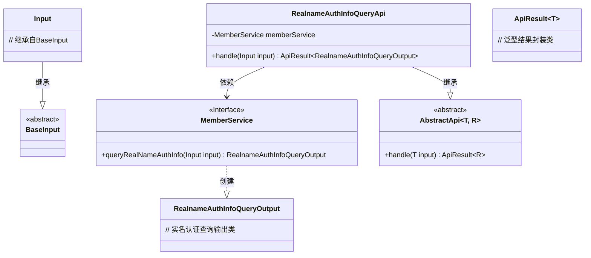
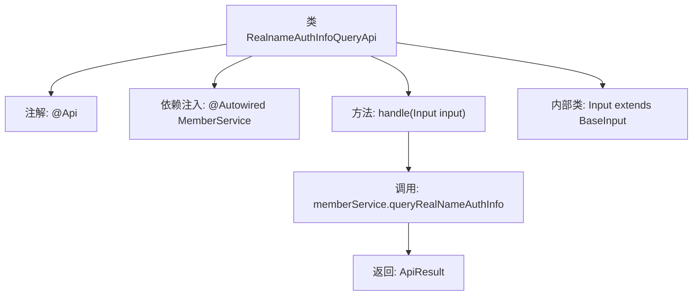

# 基础信息

|      |      |
|------|------|
| 名称 | RealnameAuthInfoQueryApi |
| 编码语言 | .java |
| 代码路径 | WeFe/union/union-service/src/main/java/com/welab/wefe/union/service/api/member/RealnameAuthInfoQueryApi.java |
| 包名 | com.welab.wefe.union.service.api.member |
| 依赖项 | ['com.welab.wefe.common.data.mongodb.dto.member.RealnameAuthInfoQueryOutput', 'com.welab.wefe.common.exception.StatusCodeWithException', 'com.welab.wefe.common.web.api.base.AbstractApi', 'com.welab.wefe.common.web.api.base.Api', 'com.welab.wefe.common.web.dto.ApiResult', 'com.welab.wefe.union.service.dto.base.BaseInput', 'com.welab.wefe.union.service.service.MemberService', 'org.springframework.beans.factory.annotation.Autowired'] |
| 概述说明 | 这是一个查询会员实名认证信息的API接口，使用签名验证访问权限，调用MemberService处理请求并返回结果。 |

# 说明

这是一个名为RealnameAuthInfoQueryApi的API类，用于查询会员实名认证信息。它继承自AbstractApi，接受Input作为输入参数，返回RealnameAuthInfoQueryOutput类型的结果。API路径为member/realname/authInfo/query，允许带签名的访问。类中注入了MemberService，通过调用其queryRealNameAuthInfo方法处理请求。Input是一个静态内部类，继承自BaseInput。handle方法负责处理请求并返回成功结果。

# 类列表 Class Summary

| 名称   | 类型  | 说明 |
|-------|------|-------------|
| RealnameAuthInfoQueryApi | class | 这是一个查询实名认证信息的API，路径为member/realname/authInfo/query，需要签名访问，调用MemberService处理请求并返回结果。 |

## 类 RealnameAuthInfoQueryApi

|      |      |
|------|------|
| 访问范围 | @Api(path = "member/realname/authInfo/query", name = "member/realname/authInfo/query", allowAccessWithSign = true);public |
| 类型 | class |
| 名称 | RealnameAuthInfoQueryApi |
| 说明 | 这是一个查询实名认证信息的API，路径为member/realname/authInfo/query，需要签名访问，调用MemberService处理请求并返回结果。 |

### UML类图

类图描述：该图展示了实名认证查询API的类结构，核心类RealnameAuthInfoQueryApi继承自泛型抽象类AbstractApi，通过依赖MemberService接口实现业务逻辑。包含嵌套类Input继承BaseInput，MemberService接口负责生成RealnameAuthInfoQueryOutput结果。整体采用泛型设计，输入输出类型明确分离，符合面向对象设计原则。

### 内部方法调用关系图

该流程图展示了RealnameAuthInfoQueryApi类的核心结构。类通过@Api注解定义API路径，通过@Autowired注入MemberService依赖。主要业务逻辑在handle方法中实现，该方法调用memberService.queryRealNameAuthInfo并返回封装结果。Input作为静态内部类继承BaseInput，用于参数传递。整体流程清晰展现了从请求处理到结果返回的调用链路。

### 字段列表 Field List

| 名称  | 类型  | 说明 |
|-------|-------|------|
| memberService | MemberService | 自动注入MemberService实例。 |

### 方法列表

| 名称  | 类型  | 说明 |
|-------|-------|------|
| handle | ApiResult<RealnameAuthInfoQueryOutput> | 重写方法，调用memberService查询实名认证信息并返回结果。 |

