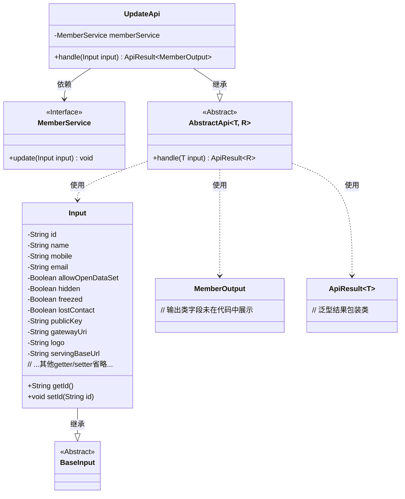

# 基础信息

|      |      |
|------|------|
| 名称 | UpdateApi |
| 编码语言 | .java |
| 代码路径 | WeFe/union/union-service/src/main/java/com/welab/wefe/union/service/api/member/UpdateApi.java |
| 包名 | com.welab.wefe.union.service.api.member |
| 依赖项 | ['com.welab.wefe.common.exception.StatusCodeWithException', 'com.welab.wefe.common.fieldvalidate.annotation.Check', 'com.welab.wefe.common.web.api.base.AbstractApi', 'com.welab.wefe.common.web.api.base.Api', 'com.welab.wefe.common.web.dto.ApiResult', 'com.welab.wefe.union.service.dto.base.BaseInput', 'com.welab.wefe.union.service.dto.member.MemberOutput', 'com.welab.wefe.union.service.service.MemberService', 'org.springframework.beans.factory.annotation.Autowired'] |
| 概述说明 | 成员更新API，需签名访问，输入包含ID、姓名、联系方式等字段，调用MemberService更新数据。 |

# 说明

这是一个名为UpdateApi的Java类，用于处理成员信息更新请求。它继承自AbstractApi，接受Input类型的输入参数并返回MemberOutput类型的结果。类通过@Api注解定义了路径为member/update，允许签名访问。内部类Input包含多个成员属性，如id、name、mobile、email等，其中id和publicKey为必填字段。该类通过注入的MemberService调用update方法处理更新逻辑，成功时返回空结果。

# 类列表 Class Summary

| 名称   | 类型  | 说明 |
|-------|------|-------------|
| UpdateApi | class | 更新会员信息的API，包含ID、姓名、联系方式等字段，必填项为ID和公钥，调用MemberService完成更新操作。 |

## 类 UpdateApi

|      |      |
|------|------|
| 访问范围 | @Api(path = "member/update", name = "member_update", allowAccessWithSign = true);public |
| 类型 | class |
| 名称 | UpdateApi |
| 说明 | 更新会员信息的API，包含ID、姓名、联系方式等字段，必填项为ID和公钥，调用MemberService完成更新操作。 |

### UML类图

这段代码展示了一个成员更新API的实现结构。UpdateApi继承自泛型抽象类AbstractApi，处理Input输入并返回MemberOutput结果。Input类继承BaseInput，包含多个带校验注解的成员字段。MemberService接口提供核心业务逻辑，通过依赖注入方式被UpdateApi调用。整体采用分层设计，输入输出与业务逻辑分离，符合API开发的常见模式。

### 内部方法调用关系图

```mermaid
graph TD
    A["类UpdateApi"]
    B["注解: @Api"]
    C["继承: AbstractApi<Input, MemberOutput>"]
    D["依赖注入: @Autowired MemberService"]
    E["重写方法: handle(Input input)"]
    F["内部类: Input extends BaseInput"]
    G["属性集合: id/name/mobile/email等"]
    H["Getter/Setter方法组"]

    A -->|"标注API信息"| B
    A -->|"继承父类"| C
    A -->|"注入服务"| D
    A -->|"核心处理"| E
    A -->|"输入参数"| F
    F -->|"包含"| G
    F -->|"提供"| H
    E -->|"调用"| D
    E -->|"参数"| F
```

该流程图展示了UpdateApi类的完整结构：通过@Api注解定义接口元数据，继承抽象父类处理通用逻辑，依赖MemberService实现业务操作。核心handle方法接收Input参数（包含12个字段及其访问方法），调用服务层完成更新操作后返回统一封装结果。类结构清晰体现了控制层、参数校验、服务调用的分层设计。

### 字段列表 Field List

| 名称  | 类型  | 说明 |
|-------|-------|------|
| memberService | MemberService | 自动注入MemberService实例。 |

### 方法列表

| 名称  | 类型  | 说明 |
|-------|-------|------|
| handle | ApiResult<MemberOutput> | 方法重写处理输入，调用memberService更新数据，成功返回结果。异常时抛出StatusCodeWithException。 |

