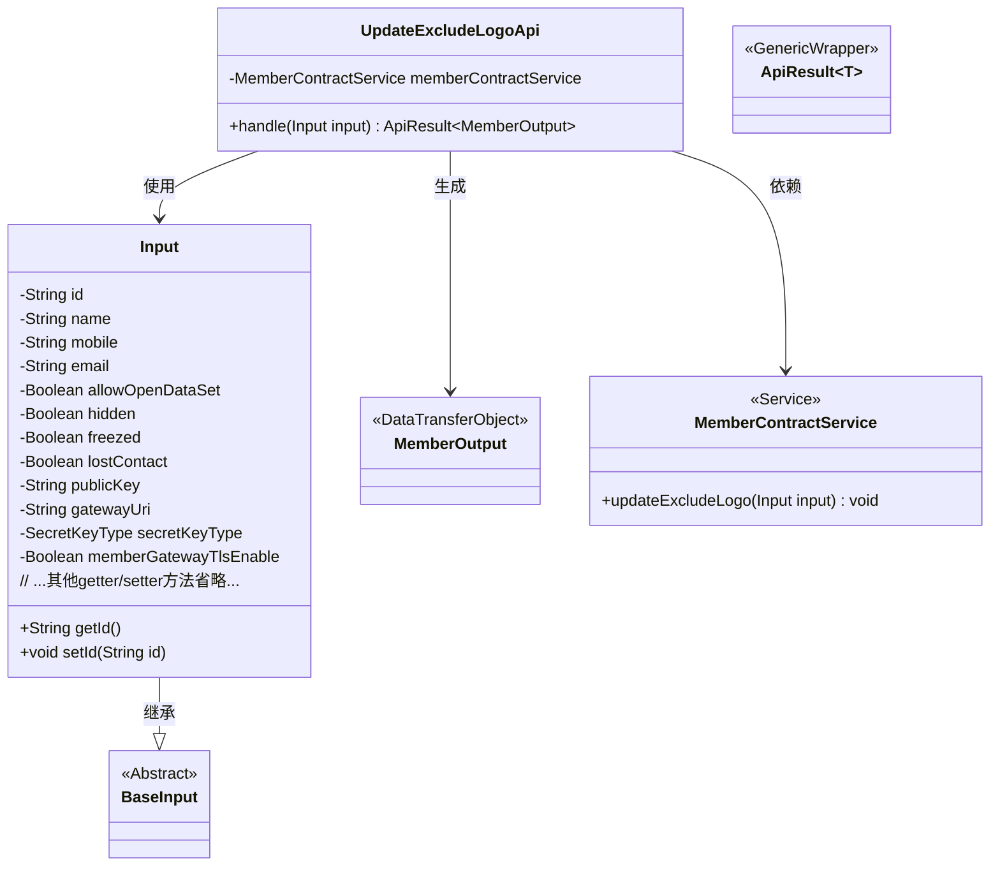

# 基础信息

|      |      |
|------|------|
| 名称 | UpdateExcludeLogoApi |
| 编码语言 | .java |
| 代码路径 | WeFe/union/union-service/src/main/java/com/welab/wefe/union/service/api/member/UpdateExcludeLogoApi.java |
| 包名 | com.welab.wefe.union.service.api.member |
| 依赖项 | ['com.welab.wefe.common.constant.SecretKeyType', 'com.welab.wefe.common.exception.StatusCodeWithException', 'com.welab.wefe.common.fieldvalidate.annotation.Check', 'com.welab.wefe.common.web.api.base.AbstractApi', 'com.welab.wefe.common.web.api.base.Api', 'com.welab.wefe.common.web.dto.ApiResult', 'com.welab.wefe.union.service.dto.base.BaseInput', 'com.welab.wefe.union.service.dto.member.MemberOutput', 'com.welab.wefe.union.service.service.contract.MemberContractService', 'org.springframework.beans.factory.annotation.Autowired'] |
| 概述说明 | 更新成员信息接口，路径member/update_exclude_logo，需签名访问。输入包含id、公钥等必填字段及其他可选字段，调用MemberContractService更新数据。 |

# 说明

该代码定义了一个名为UpdateExcludeLogoApi的API类，路径为member/update_exclude_logo，允许签名访问。它继承自AbstractApi，输入类型为Input，输出类型为MemberOutput。通过MemberContractService处理更新操作。Input类包含多个字段，其中id和publicKey为必填项，其他字段如name、mobile、email等为可选。还包括布尔类型字段如allowOpenDataSet、hidden、freezed等，以及secretKeyType和memberGatewayTlsEnable等配置项。所有字段均提供了getter和setter方法。

# 类列表 Class Summary

| 名称   | 类型  | 说明 |
|-------|------|-------------|
| UpdateExcludeLogoApi | class | 更新成员信息接口，路径member/update_exclude_logo，需签名访问。输入含ID、公钥等字段，调用MemberContractService更新数据，返回MemberOutput。 |

## 类 UpdateExcludeLogoApi

|      |      |
|------|------|
| 访问范围 | @Api(path = "member/update_exclude_logo", name = "member_update_exclude_logo", allowAccessWithSign = true);public |
| 类型 | class |
| 名称 | UpdateExcludeLogoApi |
| 说明 | 更新成员信息接口，路径member/update_exclude_logo，需签名访问。输入含ID、公钥等字段，调用MemberContractService更新数据，返回MemberOutput。 |

### UML类图

该类图展示了会员信息更新API的核心结构。UpdateExcludeLogoApi继承自AbstractApi，通过MemberContractService处理业务逻辑，使用嵌套类Input作为参数载体并继承BaseInput，返回ApiResult包装的MemberOutput结果。Input类包含会员ID、联系方式、状态标志等字段，通过@Check注解实现参数校验，体现了清晰的职责分层和类型安全设计。

### 内部方法调用关系图

```mermaid
graph TD
    A["类UpdateExcludeLogoApi"]
    B["注解: @Api"]
    C["继承: AbstractApi<Input, MemberOutput>"]
    D["依赖注入: @Autowired MemberContractService"]
    E["重写方法: handle(Input input)"]
    F["内部类: Input"]
    G["基类继承: BaseInput"]
    H["字段: String id (必填)"]
    I["字段: String name"]
    J["字段: String mobile"]
    K["字段: String email"]
    L["字段: Boolean allowOpenDataSet"]
    M["字段: Boolean hidden"]
    N["字段: Boolean freezed"]
    O["字段: Boolean lostContact"]
    P["字段: String publicKey (必填)"]
    Q["字段: String gatewayUri"]
    R["字段: SecretKeyType secretKeyType"]
    S["字段: Boolean memberGatewayTlsEnable"]
    T["getter/setter方法"]

    A --> B
    A --> C
    A --> D
    A --> E
    A --> F
    F --> G
    F --> H
    F --> I
    F --> J
    F --> K
    F --> L
    F --> M
    F --> N
    F --> O
    F --> P
    F --> Q
    F --> R
    F --> S
    F --> T
    E --> D
```

这段代码定义了一个带有API注解的UpdateExcludeLogoApi类，继承自AbstractApi并实现成员信息更新功能。主要包含一个处理请求的handle方法和一个嵌套的Input类，Input类继承BaseInput并定义了多个成员属性字段，其中id和publicKey为必填项。流程图展示了类结构、继承关系、字段定义和方法调用路径，重点突出了API处理流程与输入参数的关联性。

### 字段列表 Field List

| 名称  | 类型  | 说明 |
|-------|-------|------|
| memberContractService | MemberContractService | 自动注入MemberContractService实例。 |

### 方法列表

| 名称  | 类型  | 说明 |
|-------|-------|------|
| handle | ApiResult<MemberOutput> | 处理成员合同更新操作，排除Logo字段，成功后返回空结果。 |

