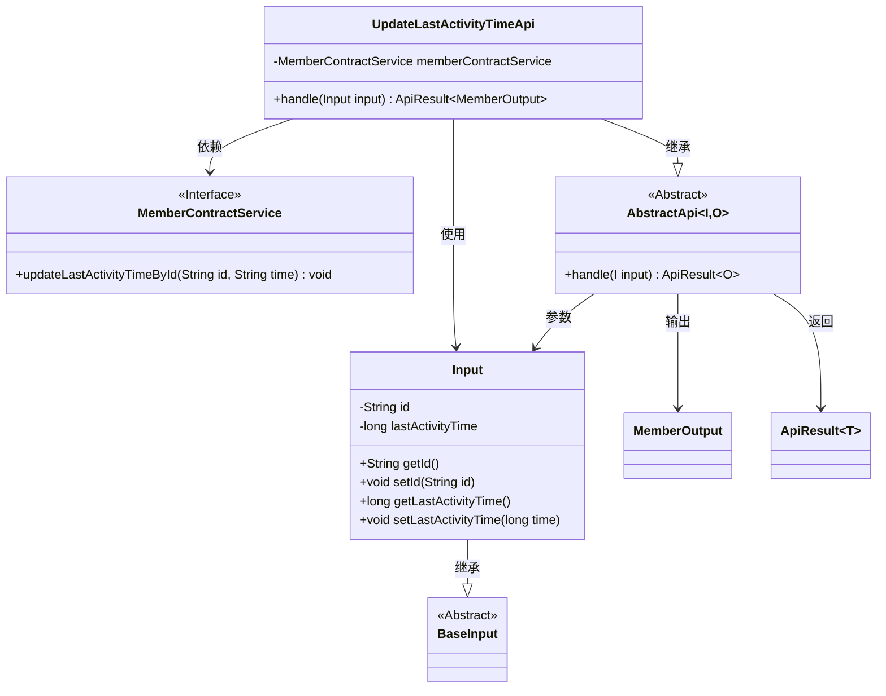
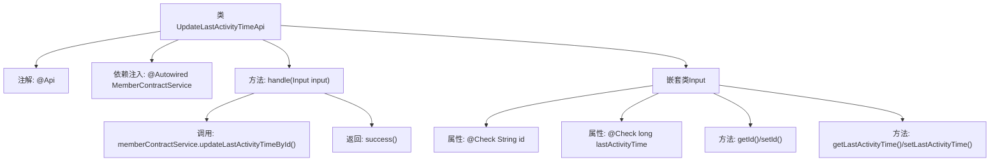

# 基础信息

|      |      |
|------|------|
| 名称 | UpdateLastActivityTimeApi |
| 编码语言 | .java |
| 代码路径 | WeFe/union/union-service/src/main/java/com/welab/wefe/union/service/api/member/UpdateLastActivityTimeApi.java |
| 包名 | com.welab.wefe.union.service.api.member |
| 依赖项 | ['com.welab.wefe.common.exception.StatusCodeWithException', 'com.welab.wefe.common.fieldvalidate.annotation.Check', 'com.welab.wefe.common.web.api.base.AbstractApi', 'com.welab.wefe.common.web.api.base.Api', 'com.welab.wefe.common.web.dto.ApiResult', 'com.welab.wefe.union.service.dto.base.BaseInput', 'com.welab.wefe.union.service.dto.member.MemberOutput', 'com.welab.wefe.union.service.service.contract.MemberContractService', 'org.springframework.beans.factory.annotation.Autowired'] |
| 概述说明 | API类UpdateLastActivityTimeApi，路径member/update_last_activity_time，通过MemberContractService更新用户最后活动时间，输入需id和lastActivityTime。 |

# 说明

该代码定义了一个名为UpdateLastActivityTimeApi的API类，用于更新会员最后活动时间。API路径为member/update_last_activity_time，允许带签名访问。它继承自AbstractApi，输入类型为内部类Input，输出类型为MemberOutput。Input类包含两个必填字段：id和lastActivityTime。处理逻辑通过memberContractService更新指定会员的最后活动时间。成功执行后返回空结果。整个API实现了会员最后活动时间的更新功能。

# 类列表 Class Summary

| 名称   | 类型  | 说明 |
|-------|------|-------------|
| UpdateLastActivityTimeApi | class | API类UpdateLastActivityTimeApi，路径member/update_last_activity_time，允许签名访问，通过MemberContractService更新用户最后活动时间，输入需包含id和lastActivityTime。 |

## 类 UpdateLastActivityTimeApi

|      |      |
|------|------|
| 访问范围 | @Api(path = "member/update_last_activity_time", name = "member_update_last_activity_time", allowAccessWithSign = true);public |
| 类型 | class |
| 名称 | UpdateLastActivityTimeApi |
| 说明 | API类UpdateLastActivityTimeApi，路径member/update_last_activity_time，允许签名访问，通过MemberContractService更新用户最后活动时间，输入需包含id和lastActivityTime。 |

### UML类图

这段代码展示了一个更新会员最后活动时间的API实现。UpdateLastActivityTimeApi继承自AbstractApi，处理Input参数并返回ApiResult<MemberOutput>。它依赖MemberContractService接口来执行实际业务逻辑。Input类继承自BaseInput，包含id和lastActivityTime两个字段，并通过getter/setter方法暴露属性。整个结构体现了清晰的层次关系和依赖关系，符合面向对象设计原则。

### 内部方法调用关系图

这段代码定义了一个带有API注解的UpdateLastActivityTimeApi类，用于更新会员最后活动时间。主要流程是通过handle方法调用memberContractService服务更新数据，使用嵌套Input类验证输入参数。流程图展示了类结构、方法调用关系和参数校验逻辑，体现了从API入口到数据库操作的处理链条。

### 字段列表 Field List

| 名称  | 类型  | 说明 |
|-------|-------|------|
| memberContractService | MemberContractService | 自动注入MemberContractService实例。 |

### 方法列表

| 名称  | 类型  | 说明 |
|-------|-------|------|
| handle | ApiResult<MemberOutput> | 该方法处理更新成员最后活动时间请求，调用服务更新指定成员的最后活动时间，并返回成功结果。 |

