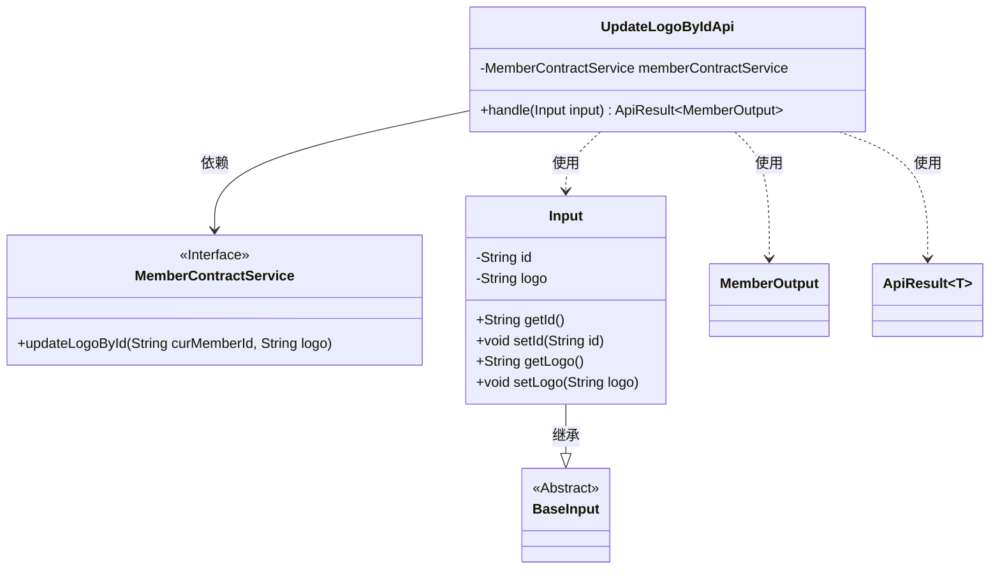
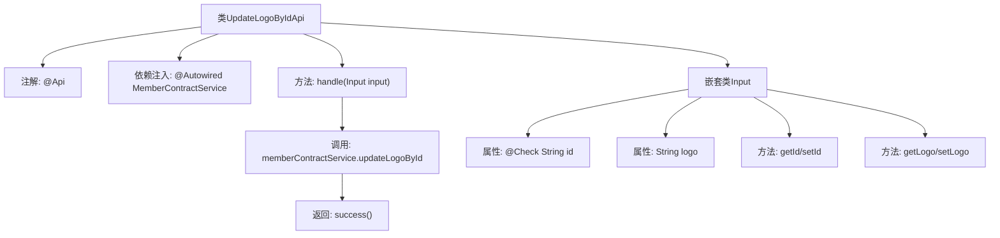

# 基础信息

|      |      |
|------|------|
| 名称 | UpdateLogoByIdApi |
| 编码语言 | .java |
| 代码路径 | WeFe/union/union-service/src/main/java/com/welab/wefe/union/service/api/member/UpdateLogoByIdApi.java |
| 包名 | com.welab.wefe.union.service.api.member |
| 依赖项 | ['com.welab.wefe.common.exception.StatusCodeWithException', 'com.welab.wefe.common.fieldvalidate.annotation.Check', 'com.welab.wefe.common.web.api.base.AbstractApi', 'com.welab.wefe.common.web.api.base.Api', 'com.welab.wefe.common.web.dto.ApiResult', 'com.welab.wefe.union.service.dto.base.BaseInput', 'com.welab.wefe.union.service.dto.member.MemberOutput', 'com.welab.wefe.union.service.service.contract.MemberContractService', 'org.springframework.beans.factory.annotation.Autowired'] |
| 概述说明 | 更新会员头像的API，路径为member/update_logo，需签名访问，输入参数为id和logo，调用memberContractService更新头像并返回成功结果。 |

# 说明

该代码定义了一个名为UpdateLogoByIdApi的API类，用于更新会员头像。API路径为member/update_logo，允许带签名访问。类继承自AbstractApi，接收Input类型参数并返回MemberOutput结果。Input类包含必填字段id和可选字段logo，通过MemberContractService的updateLogoById方法实现头像更新功能。处理成功后返回空结果。

# 类列表 Class Summary

| 名称   | 类型  | 说明 |
|-------|------|-------------|
| UpdateLogoByIdApi | class | 这是一个更新用户头像的API接口，路径为member/update_logo，需要签名验证，通过MemberContractService更新指定ID用户的头像。输入参数为id和logo，id为必填项。 |

## 类 UpdateLogoByIdApi

|      |      |
|------|------|
| 访问范围 | @Api(path = "member/update_logo", name = "member_update_logo", allowAccessWithSign = true);public |
| 类型 | class |
| 名称 | UpdateLogoByIdApi |
| 说明 | 这是一个更新用户头像的API接口，路径为member/update_logo，需要签名验证，通过MemberContractService更新指定ID用户的头像。输入参数为id和logo，id为必填项。 |

### UML类图

这段代码展示了一个用于更新会员Logo的API实现。UpdateLogoByIdApi继承自AbstractApi，处理Input输入参数并返回ApiResult<MemberOutput>结果。Input类继承自BaseInput，包含id和logo两个字段，通过MemberContractService接口实现业务逻辑。类图清晰地展示了各组件间的依赖关系，包括服务调用、参数传递和结果封装。

### 内部方法调用关系图

该流程图展示了UpdateLogoByIdApi类的结构，包含API注解、服务注入和核心处理方法。handle方法调用memberContractService更新用户logo，最后返回成功结果。嵌套类Input定义了必填的id字段和可选的logo字段，并提供了相应的getter/setter方法。整个流程清晰展现了从请求处理到数据库更新的调用链。

### 字段列表 Field List

| 名称  | 类型  | 说明 |
|-------|-------|------|
| memberContractService | MemberContractService | 代码片段使用@Autowired注解自动注入MemberContractService实例。 |

### 方法列表

| 名称  | 类型  | 说明 |
|-------|-------|------|
| handle | ApiResult<MemberOutput> | 处理成员Logo更新请求，调用服务更新指定成员的Logo，成功后返回空结果。 |

