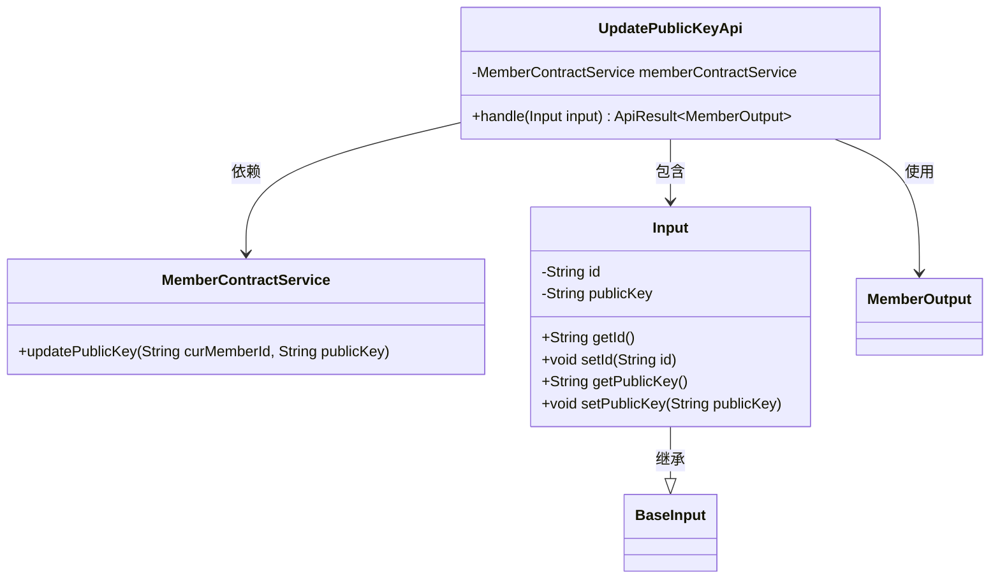
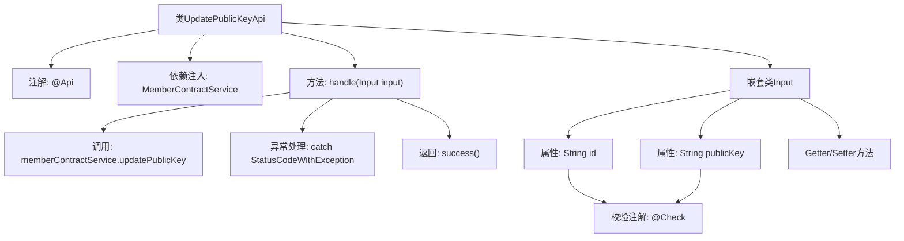

# 基础信息

|      |      |
|------|------|
| 名称 | UpdatePublicKeyApi |
| 编码语言 | .java |
| 代码路径 | WeFe/union/union-service/src/main/java/com/welab/wefe/union/service/api/member/UpdatePublicKeyApi.java |
| 包名 | com.welab.wefe.union.service.api.member |
| 依赖项 | ['com.welab.wefe.common.exception.StatusCodeWithException', 'com.welab.wefe.common.fieldvalidate.annotation.Check', 'com.welab.wefe.common.web.api.base.AbstractApi', 'com.welab.wefe.common.web.api.base.Api', 'com.welab.wefe.common.web.dto.ApiResult', 'com.welab.wefe.union.service.dto.base.BaseInput', 'com.welab.wefe.union.service.dto.member.MemberOutput', 'com.welab.wefe.union.service.service.contract.MemberContractService', 'org.springframework.beans.factory.annotation.Autowired'] |
| 概述说明 | 这是一个用于更新成员公钥的API类，路径为"member/update_public_key"，需要签名访问。它接收成员ID和新公钥作为输入，调用MemberContractService更新公钥，成功返回MemberOutput。输入参数id和publicKey为必填项。 |

# 说明

这是一个名为UpdatePublicKeyApi的API类，用于更新成员的公钥。API路径为member/update_public_key，允许带签名访问。它继承自AbstractApi，输入类型为内部类Input，输出类型为MemberOutput。Input类包含两个必填字段：id和publicKey。处理逻辑通过memberContractService的updatePublicKey方法实现，若出现异常则直接抛出。成功执行后返回成功状态。

# 类列表 Class Summary

| 名称   | 类型  | 说明 |
|-------|------|-------------|
| UpdatePublicKeyApi | class | 更新成员公钥的API，路径为member/update_public_key，需传入id和publicKey参数，调用memberContractService更新公钥，返回MemberOutput结果。 |

## 类 UpdatePublicKeyApi

|      |      |
|------|------|
| 访问范围 | @Api(path = "member/update_public_key", name = "member_update_public_key", allowAccessWithSign = true);public |
| 类型 | class |
| 名称 | UpdatePublicKeyApi |
| 说明 | 更新成员公钥的API，路径为member/update_public_key，需传入id和publicKey参数，调用memberContractService更新公钥，返回MemberOutput结果。 |

### UML类图

这段代码展示了一个用于更新成员公钥的API类结构。UpdatePublicKeyApi继承自AbstractApi，处理Input输入并返回MemberOutput结果。它依赖MemberContractService来执行实际的公钥更新操作。Input类继承自BaseInput，包含id和publicKey两个必填字段及其访问方法。整个设计体现了清晰的职责划分，Input负责数据验证，API类负责流程控制，服务类负责业务实现。

### 内部方法调用关系图

这段代码流程图展示了UpdatePublicKeyApi类的核心结构，它是一个带有API注解的Spring组件，主要功能是通过MemberContractService更新成员公钥。流程从类声明开始，经过依赖注入、请求处理方法handle()，其中包含服务调用和异常处理，最终返回成功结果。嵌套类Input定义了请求参数结构，包含两个必填字段(id和publicKey)及其校验规则。整个流程体现了API从请求接收到业务处理的完整链路，同时突出了输入验证和异常处理机制。

### 字段列表 Field List

| 名称  | 类型  | 说明 |
|-------|-------|------|
| memberContractService | MemberContractService | 自动注入会员合同服务实例。 |

### 方法列表

| 名称  | 类型  | 说明 |
|-------|-------|------|
| handle | ApiResult<MemberOutput> | 处理成员公钥更新，成功返回结果，异常时抛出。 |

