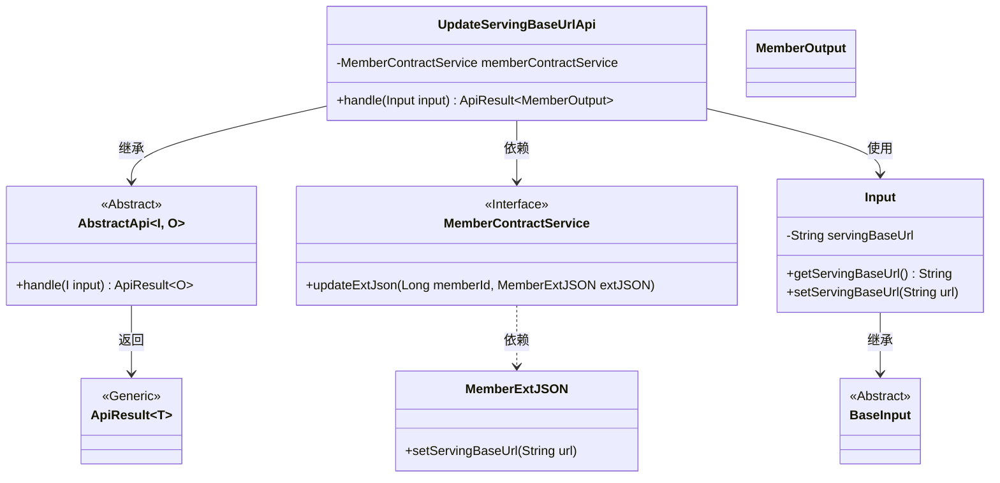
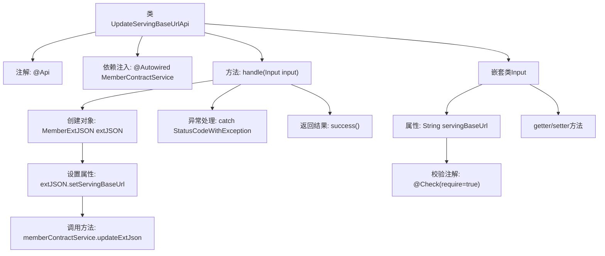

# 基础信息

|      |      |
|------|------|
| 名称 | UpdateServingBaseUrlApi |
| 编码语言 | .java |
| 代码路径 | WeFe/union/union-service/src/main/java/com/welab/wefe/union/service/api/member/UpdateServingBaseUrlApi.java |
| 包名 | com.welab.wefe.union.service.api.member |
| 依赖项 | ['com.welab.wefe.common.data.mongodb.entity.union.ext.MemberExtJSON', 'com.welab.wefe.common.exception.StatusCodeWithException', 'com.welab.wefe.common.fieldvalidate.annotation.Check', 'com.welab.wefe.common.web.api.base.AbstractApi', 'com.welab.wefe.common.web.api.base.Api', 'com.welab.wefe.common.web.dto.ApiResult', 'com.welab.wefe.union.service.dto.base.BaseInput', 'com.welab.wefe.union.service.dto.member.MemberOutput', 'com.welab.wefe.union.service.service.contract.MemberContractService', 'org.springframework.beans.factory.annotation.Autowired'] |
| 概述说明 | UpdateServingBaseUrlApi接口用于更新成员服务基础URL，通过MemberContractService处理输入参数并返回成功结果。 |

# 说明

该代码定义了一个名为UpdateServingBaseUrlApi的API类，用于更新成员服务基础URL。API路径为member/update_serving_base_url，允许带签名访问。它继承自AbstractApi，输入类型为内部类Input，输出类型为MemberOutput。Input类包含一个必填字段servingBaseUrl及其getter/setter方法。处理逻辑通过memberContractService更新成员扩展JSON中的servingBaseUrl字段。若操作成功返回空结果，异常时直接抛出。整个API通过注解配置路由和权限控制。

# 类列表 Class Summary

| 名称   | 类型  | 说明 |
|-------|------|-------------|
| UpdateServingBaseUrlApi | class | 更新会员服务基础URL的API，通过MemberContractService处理输入参数servingBaseUrl，成功时返回MemberOutput。 |

## 类 UpdateServingBaseUrlApi

|      |      |
|------|------|
| 访问范围 | @Api(path = "member/update_serving_base_url", name = "member_update_serving_base_url", allowAccessWithSign = true);public |
| 类型 | class |
| 名称 | UpdateServingBaseUrlApi |
| 说明 | 更新会员服务基础URL的API，通过MemberContractService处理输入参数servingBaseUrl，成功时返回MemberOutput。 |

### UML类图

这段代码定义了一个处理成员服务基础URL更新的API类UpdateServingBaseUrlApi，继承自泛型抽象类AbstractApi。该类通过MemberContractService接口更新成员扩展信息，包含一个嵌套的Input类用于接收请求参数。类图展示了继承关系、依赖关系和泛型参数传递，核心流程是通过handle方法处理输入并返回ApiResult封装的结果。Input类继承自BaseInput并包含servingBaseUrl字段及访问器，MemberExtJSON用于存储扩展信息。

### 内部方法调用关系图

这段代码流程图展示了UpdateServingBaseUrlApi类的完整结构和工作流程。该类是一个带有API注解的控制器，继承自AbstractApi，主要处理更新服务基础URL的请求。核心流程包括：通过handle方法接收输入参数，创建MemberExtJSON对象并设置服务URL，调用memberContractService进行数据更新，最后返回成功结果。嵌套类Input定义了必需的输入参数servingBaseUrl及其校验规则，包含标准的getter/setter方法。整个流程包含异常处理机制，能捕获并重新抛出StatusCodeWithException。

### 字段列表 Field List

| 名称  | 类型  | 说明 |
|-------|-------|------|
| memberContractService | MemberContractService | 代码片段使用@Autowired自动注入MemberContractService实例。 |

### 方法列表

| 名称  | 类型  | 说明 |
|-------|-------|------|
| handle | ApiResult<MemberOutput> | 处理输入并更新成员扩展JSON，成功返回结果，异常时抛出。 |

