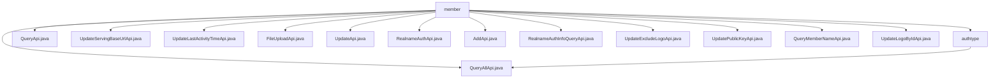

# 基础信息

|      |      |
|------|------|
| 名称 | member |
| 编码语言 | .java |
| 代码路径 | WeFe/union/union-service/src/main/java/com/welab/wefe/union/service/api/member |
| 包名 | docs.union.union-service.src.main.java.com.welab.wefe.union.service.api.member |
| 概述说明 | QueryAllApi查询会员认证类型，路径member/authtype/query。QueryApi查询会员信息，路径member/query。UpdateServingBaseUrlApi更新服务URL，路径member/update_serving_base_url。UpdateLastActivityTimeApi更新最后活动时间，路径member/update_last_activity_time。FileUploadApi处理文件上传，路径member/file/upload。UpdateApi更新成员信息，路径member/update。RealnameAuthApi处理实名认证，路径member/realname/auth。AddApi添加成员，路径member/add。RealnameAuthInfoQueryApi查询实名信息，路径member/realname/authInfo/query。UpdateExcludeLogoApi更新成员信息，路径member/update_exclude_logo。UpdatePublicKeyApi更新公钥，路径member/update_public_key。QueryMemberNameApi查询成员名称，路径member/map。UpdateLogoByIdApi更新头像，路径member/update_logo。QueryAllApi查询所有成员，路径member/query_all。 |

# 说明

## 概述  
该模块核心职责为提供会员全生命周期管理服务，包括基础信息CRUD、实名认证、文件上传及活动状态更新等功能。接口规范遵循统一设计：继承AbstractApi基类，通过@Api注解定义路径和访问权限，输入输出采用特定DTO（如BaseInput/JObject），依赖MemberService实现业务逻辑。关键数据结构包括MemberOutput（成员信息）、RealnameAuthInfoQueryOutput（实名认证结果）及分页查询结果封装类。外部依赖主要为MemberService和MemberContractService。例如UpdatePublicKeyApi通过memberContractService更新公钥，FileUploadApi处理文件IO异常返回599状态码。

## 主要业务场景  
模块支持会员信息全流程管理：1)基础操作如AddApi添加成员、QueryApi分页查询；2)扩展功能如RealnameAuthApi处理实名认证，FileUploadApi管理文件；3)状态维护如UpdateLastActivityTimeApi记录活跃时间。交互模式类似RESTful设计，通过路径区分功能（如member/update更新信息，member/realname/auth提交认证）。典型应用包括成员注册-认证-信息维护闭环，例如先通过AddApi创建账号，再调用RealnameAuthApi完成认证。API类型涵盖CRUD（如QueryAllApi）、状态变更（如UpdateServingBaseUrlApi）和文件操作（如FileUploadApi）。

### 包内部结构视图

该流程图展示了WeFe项目中member模块的API文件结构。顶层为member目录，包含15个子节点，其中authtype是一个子目录，其余均为Java API文件。authtype目录下又包含一个QueryAllApi.java文件。整个结构清晰地反映了member模块的API分层设计。

# 文件列表

| 名称   | 类型  | 说明 |
|-------|------|-------------|
| [QueryApi.java](QueryApi.md) | file | 成员查询API，支持签名访问，输入参数包括ID、姓名、分页信息，调用MemberService查询并返回分页结果。 |
| [UpdateServingBaseUrlApi.java](UpdateServingBaseUrlApi.md) | file | UpdateServingBaseUrlApi接口用于更新成员服务基础URL，通过MemberContractService处理输入参数并返回成功结果。 |
| [UpdateLastActivityTimeApi.java](UpdateLastActivityTimeApi.md) | file | API类UpdateLastActivityTimeApi，路径member/update_last_activity_time，通过MemberContractService更新用户最后活动时间，输入需id和lastActivityTime。 |
| [FileUploadApi.java](FileUploadApi.md) | file | 文件上传API类，处理成员文件上传请求，需提供成员ID、文件名、用途等参数，支持私有或公开文件级别，异常时返回特定错误码。 |
| [UpdateApi.java](UpdateApi.md) | file | 成员更新API，需签名访问，输入包含ID、姓名、联系方式等字段，调用MemberService更新数据。 |
| [RealnameAuthApi.java](RealnameAuthApi.md) | file | 实名认证API类，处理用户实名认证请求，包含必填字段如姓名、认证类型、文件列表、证书请求内容和ID，调用MemberService完成认证。 |
| [AddApi.java](AddApi.md) | file | AddApi类用于添加成员，路径为member/add，需签名访问。输入包含ID、姓名、联系方式等字段，输出MemberOutput。处理逻辑调用memberService.add方法。 |
| [RealnameAuthInfoQueryApi.java](RealnameAuthInfoQueryApi.md) | file | 这是一个查询会员实名认证信息的API接口，使用签名验证访问权限，调用MemberService处理请求并返回结果。 |
| [UpdateExcludeLogoApi.java](UpdateExcludeLogoApi.md) | file | 更新成员信息接口，路径member/update_exclude_logo，需签名访问。输入包含id、公钥等必填字段及其他可选字段，调用MemberContractService更新数据。 |
| [UpdatePublicKeyApi.java](UpdatePublicKeyApi.md) | file | 这是一个用于更新成员公钥的API类，路径为"member/update_public_key"，需要签名访问。它接收成员ID和新公钥作为输入，调用MemberContractService更新公钥，成功返回MemberOutput。输入参数id和publicKey为必填项。 |
| [QueryMemberNameApi.java](QueryMemberNameApi.md) | file | 这是一个名为member_map的API类，路径为member/map，允许签名访问。它继承自AbstractApi，使用MemberService查询成员信息并返回JSON结果。 |
| [UpdateLogoByIdApi.java](UpdateLogoByIdApi.md) | file | 更新会员头像的API，路径为member/update_logo，需签名访问，输入参数为id和logo，调用memberContractService更新头像并返回成功结果。 |
| [QueryAllApi.java](QueryAllApi.md) | file | 这是一个查询所有成员的API类，路径为"member/query_all"，支持签名访问，日志采样间隔60秒。输入参数包括ID和是否包含logo，返回成员列表的JSON数据。 |
| [authtype](authtype/_module.md) | package | 这是一个查询会员认证类型的API类，路径为member/authtype/query，允许签名访问，调用MemberService的queryAllAuthType方法并返回结果列表。 |

