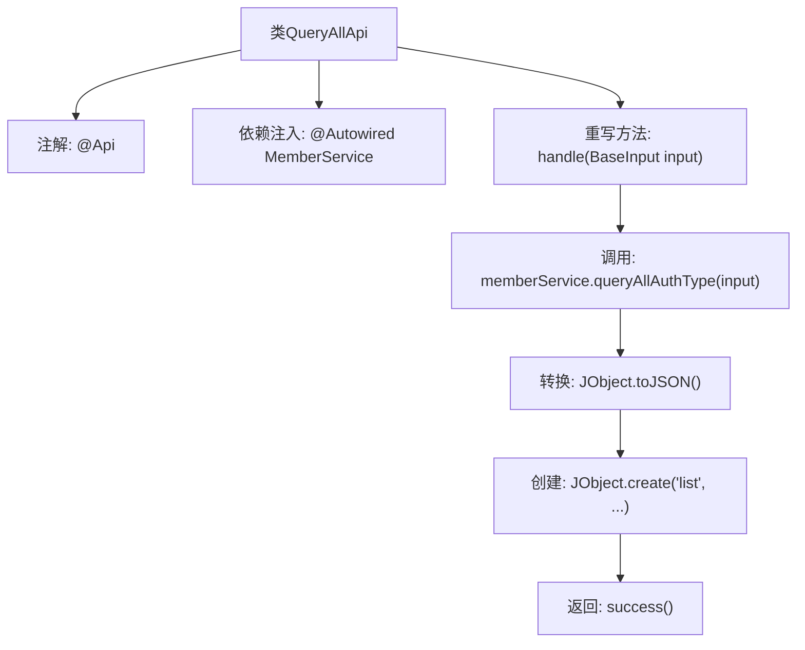

# 基础信息

|      |      |
|------|------|
| 名称 | QueryAllApi |
| 编码语言 | .java |
| 代码路径 | WeFe/union/union-service/src/main/java/com/welab/wefe/union/service/api/member/authtype/QueryAllApi.java |
| 包名 | com.welab.wefe.union.service.api.member.authtype |
| 依赖项 | ['com.welab.wefe.common.util.JObject', 'com.welab.wefe.common.web.api.base.AbstractApi', 'com.welab.wefe.common.web.api.base.Api', 'com.welab.wefe.common.web.dto.ApiResult', 'com.welab.wefe.union.service.dto.base.BaseInput', 'com.welab.wefe.union.service.service.MemberService', 'org.springframework.beans.factory.annotation.Autowired'] |
| 概述说明 | 这是一个查询会员认证类型的API类，路径为member/authtype/query，允许签名访问，调用MemberService的queryAllAuthType方法并返回结果列表。 |

# 说明

该代码定义了一个名为QueryAllApi的API类，用于查询所有会员认证类型。类注解指定了API路径为member/authtype/query，名称为member_authtype_query，并允许签名访问。该类继承自AbstractApi，使用BaseInput作为输入参数，返回JObject类型结果。通过注入MemberService成员服务，在handle方法中调用queryAllAuthType查询所有认证类型，并将结果转换为JSON格式后封装为成功响应返回。

# 类列表 Class Summary

| 名称   | 类型  | 说明 |
|-------|------|-------------|
| QueryAllApi | class | 这是一个查询会员认证类型的API类，路径为"member/authtype/query"，允许签名访问，调用MemberService的queryAllAuthType方法返回结果列表。 |


## 类 QueryAllApi

|      |      |
|------|------|
| 访问范围 | @Api(path = "member/authtype/query", name = "member_authtype_query", allowAccessWithSign = true);public |
| 类型 | class |
| 名称 | QueryAllApi |
| 说明 | 这是一个查询会员认证类型的API类，路径为"member/authtype/query"，允许签名访问，调用MemberService的queryAllAuthType方法返回结果列表。 |


### UML类图

```mermaid
classDiagram
    class QueryAllApi {
        -MemberService memberService
        +handle(BaseInput input) ApiResult~JObject~
    }
    class BaseInput
    class JObject {
        +create(String key, Object value) JObject
        +toJSON(Object obj) String
    }
    class MemberService {
        +queryAllAuthType(BaseInput input) Object
    }
    class ApiResult~T~ {
        <<Interface>>
    }
    class AbstractApi~I~O~ {
        <<Abstract>>
        +handle(I input) ApiResult~O~
    }

    QueryAllApi --> MemberService : 依赖
    QueryAllApi --|> AbstractApi~BaseInput,JObject~
    AbstractApi~BaseInput,JObject~ ..|> ApiResult~JObject~ : 实现
    MemberService ..> BaseInput : 使用
    QueryAllApi ..> JObject : 使用
```

这段代码展示了一个查询所有认证类型的API类`QueryAllApi`，它继承自泛型抽象类`AbstractApi`，使用`BaseInput`作为输入类型和`JObject`作为输出类型。类中注入了`MemberService`服务，通过调用其`queryAllAuthType`方法处理请求，并将结果封装为`ApiResult<JObject>`返回。`JObject`提供了JSON数据创建和转换的静态方法。整个设计体现了依赖注入和模板方法模式的应用，实现了业务逻辑与API处理的分离。


### 内部方法调用关系图



该流程图展示了QueryAllApi类的核心处理流程。类通过@Api注解定义接口元数据，注入MemberService依赖，重写handle方法处理请求。流程依次调用服务层查询数据、JSON序列化、封装结果对象并返回成功响应，完整呈现了从请求处理到结果返回的调用链。

### 字段列表 Field List

| 名称  | 类型  | 说明 |
|-------|-------|------|
| memberService | MemberService | 自动注入MemberService实例。 |

### 方法列表

| 名称  | 类型  | 说明 |
|-------|-------|------|
| handle | ApiResult<JObject> | Java方法重写，处理输入并返回成员服务查询结果的JSON格式数据。 |


