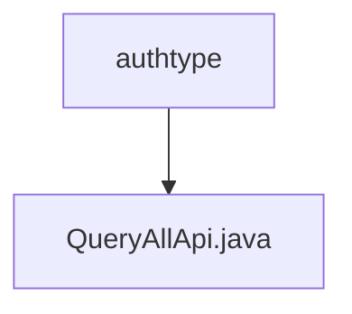

# 基础信息

|      |      |
|------|------|
| 名称 | authtype |
| 编码语言 | .java |
| 代码路径 | WeFe/union/union-service/src/main/java/com/welab/wefe/union/service/api/member/authtype |
| 包名 | docs.union.union-service.src.main.java.com.welab.wefe.union.service.api.member.authtype |
| 概述说明 | 这是一个查询会员认证类型的API类，路径为member/authtype/query，允许签名访问，调用MemberService的queryAllAuthType方法并返回结果列表。 |

# 说明

该代码定义了一个名为QueryAllApi的API类，用于查询所有会员认证类型。类注解指定了API路径为member/authtype/query，名称为member_authtype_query，并允许签名访问。该类继承自AbstractApi，使用BaseInput作为输入参数，返回JObject类型结果。通过注入MemberService成员服务，在handle方法中调用queryAllAuthType查询所有认证类型，并将结果转换为JSON格式后封装为成功响应返回。

### 包内部结构视图

该流程图展示了WeFe项目中union-service模块下member/authtype目录的层级结构。根节点authtype包含一个子节点QueryAllApi.java，表示这是一个处理成员认证类型查询的API接口文件。整个结构简洁明了，体现了单一功能模块的文件组织方式。

# 文件列表

| 名称   | 类型  | 说明 |
|-------|------|-------------|
| [QueryAllApi.java](QueryAllApi.md) | file | 这是一个查询会员认证类型的API类，路径为member/authtype/query，允许签名访问，调用MemberService的queryAllAuthType方法并返回结果列表。 |

