# 基础信息

|      |      |
|------|------|
| 名称 | UnionAliveApi |
| 编码语言 | .java |
| 代码路径 | WeFe/union/union-service/src/main/java/com/welab/wefe/union/service/api/server/UnionAliveApi.java |
| 包名 | com.welab.wefe.union.service.api.server |
| 依赖项 | ['com.welab.wefe.common.web.api.base.AbstractApi', 'com.welab.wefe.common.web.api.base.Api', 'com.welab.wefe.common.web.dto.ApiResult', 'com.welab.wefe.common.web.dto.NoneApiOutput', 'com.welab.wefe.union.service.dto.base.BaseInput'] |
| 概述说明 | UnionAliveApi类是一个服务存活检查接口，路径为"service/alive"，无需签名验证，继承自AbstractApi，输入为Input类，输出为空。 |

# 说明

该代码定义了一个名为UnionAliveApi的API类，用于处理存活检测请求。类注解指定了API路径为"service/alive"，名称为"alive"，并禁止签名访问。该类继承自AbstractApi，使用Input作为输入参数类型和NoneApiOutput作为输出类型。handle方法直接返回成功结果，无需处理输入参数。内部静态类Input继承自BaseInput，表示该API不需要特定输入参数。整体实现简洁，仅用于服务存活状态检查。

# 类列表 Class Summary

| 名称   | 类型  | 说明 |
|-------|------|-------------|
| UnionAliveApi | class | Java类UnionAliveApi定义了一个无签名的存活检测API接口，路径为service/alive，处理输入后返回成功结果。 |


## 类 UnionAliveApi

|      |      |
|------|------|
| 访问范围 | @Api(path = "service/alive", name = "alive", allowAccessWithSign = false);public |
| 类型 | class |
| 名称 | UnionAliveApi |
| 说明 | Java类UnionAliveApi定义了一个无签名的存活检测API接口，路径为service/alive，处理输入后返回成功结果。 |


### UML类图

```mermaid
classDiagram
    class UnionAliveApi {
        +handle(Input input) ApiResult~NoneApiOutput~
    }
    UnionAliveApi --|> AbstractApi : 继承
    UnionAliveApi ..|> <<Interface>> Api : 实现

    class AbstractApi~T, R~ {
        <<abstract>>
        +handle(T input) ApiResult~R~
    }
    AbstractApi ..|> <<Interface>> Api : 实现

    class <<Interface>> Api {
        <<Interface>>
    }

    class Input {
    }
    Input --|> BaseInput : 继承

    class NoneApiOutput {
    }
    class ApiResult~T~ {
    }

    // 依赖关系
    UnionAliveApi --> Input : 使用
    UnionAliveApi --> NoneApiOutput : 使用
    AbstractApi --> ApiResult : 使用
```

这段代码展示了一个名为`UnionAliveApi`的API类，继承自泛型抽象类`AbstractApi`并实现`Api`接口。该类处理`Input`类型参数并返回`ApiResult<NoneApiOutput>`结果。`Input`是继承自`BaseInput`的静态嵌套类，而`NoneApiOutput`表示空响应类型。整体结构体现了模板方法模式，通过抽象类规范API处理流程，具体实现由子类完成。注解表明这是一个无需签名的存活检测接口。


### 内部方法调用关系图

```mermaid
graph TD
    A["类UnionAliveApi"]
    B["注解: @Api"]
    C["父类: AbstractApi<Input, NoneApiOutput>"]
    D["方法: handle(Input input)"]
    E["嵌套类: Input"]
    F["父类: BaseInput"]
    G["返回: ApiResult<NoneApiOutput>"]

    A --> B
    A --> C
    A --> D
    D --> G
    A --> E
    E --> F
```



该流程图展示了UnionAliveApi类的结构，包含类注解、继承关系、核心方法及嵌套类定义。主要流程为：类通过@Api注解配置服务路径，继承AbstractApi模板类，实现handle方法处理输入参数并返回封装结果。嵌套类Input继承BaseInput作为请求参数载体，整体构成一个完整的API服务端点结构。

### 字段列表 Field List

| 名称  | 类型  | 说明 |
|-------|-------|------|

### 方法列表

| 名称  | 类型  | 说明 |
|-------|-------|------|
| handle | ApiResult<NoneApiOutput> | 这是一个Java方法，重写父类方法，处理输入后返回成功的空API结果。 |


