# 基础信息

|      |      |
|------|------|
| 名称 | UnionAvailableApi |
| 编码语言 | .java |
| 代码路径 | WeFe/union/union-service/src/main/java/com/welab/wefe/union/service/api/server/UnionAvailableApi.java |
| 包名 | com.welab.wefe.union.service.api.server |
| 依赖项 | ['com.welab.wefe.common.web.api.base.AbstractApi', 'com.welab.wefe.common.web.api.base.Api', 'com.welab.wefe.common.web.dto.ApiResult', 'com.welab.wefe.common.wefe.checkpoint.CheckpointManager', 'com.welab.wefe.common.wefe.checkpoint.dto.ServiceAvailableCheckOutput', 'com.welab.wefe.union.service.dto.base.BaseInput', 'org.springframework.beans.factory.annotation.Autowired'] |
| 概述说明 | Java类UnionAvailableApi提供可用性检查服务接口，路径为"service/available"，支持签名访问，调用CheckpointManager检查并返回结果。输入为空，输出为ServiceAvailableCheckOutput。 |

# 说明

该代码定义了一个名为UnionAvailableApi的API类，用于检查服务可用性。它继承自AbstractApi，接收Input参数并返回ServiceAvailableCheckOutput结果。类注解表明该API路径为"service/available"，允许签名访问。内部通过CheckpointManager的checkAll方法执行检查，并返回成功结果。Input类继承自BaseInput，当前未定义额外字段。整个API封装了服务可用性检查的核心逻辑。

# 类列表 Class Summary

| 名称   | 类型  | 说明 |
|-------|------|-------------|
| UnionAvailableApi | class | Java API类UnionAvailableApi，路径"service/available"，允许签名访问，通过CheckpointManager检查服务可用性并返回结果。输入为BaseInput，输出ServiceAvailableCheckOutput。 |


## 类 UnionAvailableApi

|      |      |
|------|------|
| 访问范围 | @Api(path = "service/available", name = "available", allowAccessWithSign = true);public |
| 类型 | class |
| 名称 | UnionAvailableApi |
| 说明 | Java API类UnionAvailableApi，路径"service/available"，允许签名访问，通过CheckpointManager检查服务可用性并返回结果。输入为BaseInput，输出ServiceAvailableCheckOutput。 |


### UML类图

```mermaid
classDiagram
    class UnionAvailableApi {
        -CheckpointManager checkpointManager
        +handle(Input input) ApiResult~ServiceAvailableCheckOutput~
    }
    <<Interface>> UnionAvailableApi {
        <<AbstractApi>>
    }
    class AbstractApi~T, R~ {
        <<abstract>>
    }
    class Input {
        <<BaseInput>>
    }
    class ServiceAvailableCheckOutput
    class ApiResult~T~
    class CheckpointManager {
        +checkAll() ServiceAvailableCheckOutput
    }

    UnionAvailableApi --> AbstractApi : 继承
    UnionAvailableApi --> CheckpointManager : 依赖
    UnionAvailableApi --> Input : 嵌套类
    AbstractApi --> ApiResult : 使用泛型
    AbstractApi --> ServiceAvailableCheckOutput : 使用泛型
    Input --> BaseInput : 继承
```

这段代码展示了一个名为UnionAvailableApi的API类，继承自泛型抽象类AbstractApi，处理服务可用性检查请求。类图清晰地呈现了以下关系：1) UnionAvailableApi继承AbstractApi并指定了输入/输出泛型类型；2) 通过Autowired注入CheckpointManager依赖；3) 使用嵌套类Input作为请求参数；4) 核心方法handle调用checkpointManager.checkAll()并返回封装结果。整体结构体现了Spring Boot应用中典型的API层实现模式，包含依赖注入、泛型继承和嵌套DTO等特性。


### 内部方法调用关系图

```mermaid
graph TD
    A["类UnionAvailableApi"]
    B["注解: @Api"]
    C["继承: AbstractApi<Input, ServiceAvailableCheckOutput>"]
    D["依赖注入: CheckpointManager checkpointManager"]
    E["重写方法: handle(Input input)"]
    F["内部类: Input extends BaseInput"]
    G["调用: checkpointManager.checkAll()"]
    H["返回: success(output)"]

    A --> B
    A --> C
    A --> D
    A --> E
    E --> G
    G --> H
    A --> F
```



这段代码定义了一个名为UnionAvailableApi的API类，通过@Api注解配置了服务路径和访问权限。该类继承自AbstractApi并指定了输入输出泛型类型，核心逻辑是通过checkpointManager检查服务可用性并返回结果。流程图展示了类结构、依赖关系以及handle方法内部的处理流程，包括依赖注入、方法调用和返回结果等关键步骤。

### 字段列表 Field List

| 名称  | 类型  | 说明 |
|-------|-------|------|
| checkpointManager | CheckpointManager | 自动注入CheckpointManager实例。 |

### 方法列表

| 名称  | 类型  | 说明 |
|-------|-------|------|
| handle | ApiResult<ServiceAvailableCheckOutput> | 方法重写，调用检查点管理器验证所有服务可用性，返回成功结果及检查输出。 |


