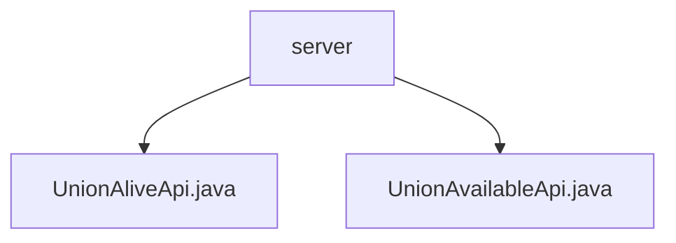

# 基础信息

|      |      |
|------|------|
| 名称 | server |
| 编码语言 | .java |
| 代码路径 | WeFe/union/union-service/src/main/java/com/welab/wefe/union/service/api/server |
| 包名 | docs.union.union-service.src.main.java.com.welab.wefe.union.service.api.server |
| 概述说明 | UnionAliveApi类处理存活检测，路径"service/alive"，无需输入直接返回成功。UnionAvailableApi类检查服务可用性，路径"service/available"，执行检查后返回结果。两者均继承AbstractApi。 |

# 说明

## 概述  
该模块提供基础服务状态检测功能，包含存活检测和可用性检查两个核心API。接口规范遵循统一路径前缀"service/"，分别通过`UnionAliveApi`（无签名）和`UnionAvailableApi`（需签名）实现，继承自`AbstractApi`基础类。关键数据结构包括`BaseInput`派生的空参`Input`类，以及`ServiceAvailableCheckOutput`响应体。依赖项仅涉及内部`CheckpointManager`组件。例如存活检测直接返回成功，而可用性检查会触发`checkAll`方法验证服务状态。

## 主要业务场景  
模块采用"心跳检测"模式，类似健康检查探针机制。`UnionAliveApi`用于轻量级存活确认，`UnionAvailableApi`则执行深度可用性验证。典型应用包括服务注册中心的状态轮询、网关层熔断判断等场景。API类型均为查询类接口，例如K8s就绪检测会组合调用这两个接口，先确认进程存活再验证依赖服务连通性。

### 包内部结构视图

该流程图展示了WeFe项目中union-service模块下server目录的层级结构。server作为父节点包含两个子节点：UnionAliveApi.java和UnionAvailableApi.java接口文件，这两个文件直接位于server目录下，属于同一层级关系。整个结构清晰地呈现了服务端API文件的基础组织方式。

# 文件列表

| 名称   | 类型  | 说明 |
|-------|------|-------------|
| [UnionAliveApi.java](UnionAliveApi.md) | file | UnionAliveApi类是一个服务存活检查接口，路径为"service/alive"，无需签名验证，继承自AbstractApi，输入为Input类，输出为空。 |
| [UnionAvailableApi.java](UnionAvailableApi.md) | file | Java类UnionAvailableApi提供可用性检查服务接口，路径为"service/available"，支持签名访问，调用CheckpointManager检查并返回结果。输入为空，输出为ServiceAvailableCheckOutput。 |

