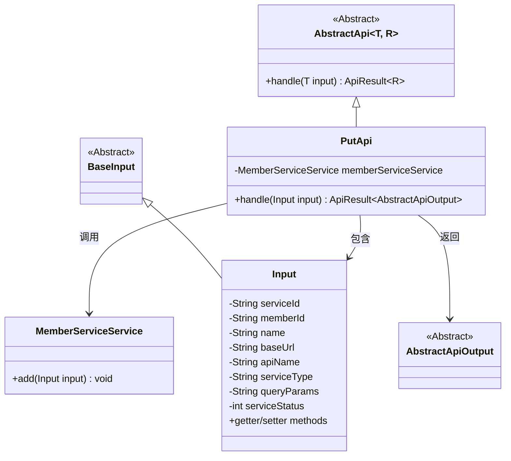
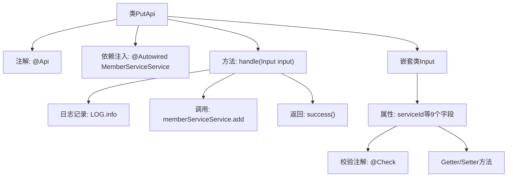

# 基础信息

|      |      |
|------|------|
| 名称 | PutApi |
| 编码语言 | .java |
| 代码路径 | WeFe/union/union-service/src/main/java/com/welab/wefe/union/service/api/service/PutApi.java |
| 包名 | com.welab.wefe.union.service.api.service |
| 依赖项 | ['com.welab.wefe.common.exception.StatusCodeWithException', 'com.welab.wefe.common.fieldvalidate.annotation.Check', 'com.welab.wefe.common.web.api.base.AbstractApi', 'com.welab.wefe.common.web.api.base.Api', 'com.welab.wefe.common.web.dto.AbstractApiOutput', 'com.welab.wefe.common.web.dto.ApiResult', 'com.welab.wefe.union.service.dto.base.BaseInput', 'com.welab.wefe.union.service.service.MemberServiceService', 'org.springframework.beans.factory.annotation.Autowired'] |
| 概述说明 | PutApi类处理会员服务添加请求，需必填serviceId、baseUrl、apiName、serviceType等字段，调用memberServiceService.add方法完成操作。 |

# 说明

该代码定义了一个名为PutApi的API类，路径为member/service/put，允许签名访问。它继承自AbstractApi，处理Input输入并返回AbstractApiOutput。类中注入了MemberServiceService，handle方法调用其add方法处理输入。Input类包含多个字段，其中serviceId、baseUrl、apiName、serviceType和serviceStatus为必填项，其余如memberId、name、queryParams为可选。每个字段都有对应的getter和setter方法。

# 类列表 Class Summary

| 名称   | 类型  | 说明 |
|-------|------|-------------|
| PutApi | class | 这是一个会员服务添加API，路径为"member/service/put"，需要签名访问。输入参数包含serviceId、baseUrl、apiName、serviceType和serviceStatus等必填字段，调用MemberServiceService的add方法处理请求。 |

## 类 PutApi

|      |      |
|------|------|
| 访问范围 | @Api(path = "member/service/put", name = "member_service_put", allowAccessWithSign = true);public |
| 类型 | class |
| 名称 | PutApi |
| 说明 | 这是一个会员服务添加API，路径为"member/service/put"，需要签名访问。输入参数包含serviceId、baseUrl、apiName、serviceType和serviceStatus等必填字段，调用MemberServiceService的add方法处理请求。 |

### UML类图

类图描述：该图展示了一个基于抽象类AbstractApi实现的PutApi类结构。PutApi继承自泛型类AbstractApi<Input, AbstractApiOutput>，包含对MemberServiceService的依赖调用。Input作为内部静态类继承BaseInput，包含多个带校验注解的字段及其getter/setter。整体结构体现了API处理层通过服务类执行业务逻辑的典型模式，输入输出通过泛型参数实现类型安全。

### 内部方法调用关系图

该流程图展示了PutApi类的核心结构，包含API注解、依赖注入的MemberServiceService、主要处理方法handle()及其内部操作流程。嵌套类Input详细描述了9个字段属性及其校验规则，每个字段都配有对应的Getter/Setter方法。handle方法依次执行日志记录、服务调用和成功返回三个关键步骤，形成完整的API处理链路。

### 字段列表 Field List

| 名称  | 类型  | 说明 |
|-------|-------|------|
| memberServiceService | MemberServiceService | 使用@Autowired自动注入MemberServiceService实例。 |

### 方法列表

| 名称  | 类型  | 说明 |
|-------|-------|------|
| handle | ApiResult<AbstractApiOutput> | 处理输入并调用成员服务添加数据，成功后返回结果。 |

