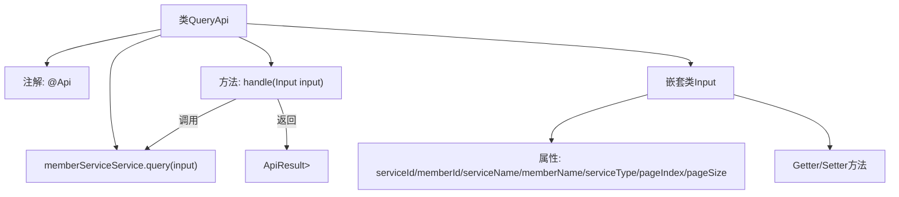

# 基础信息

|      |      |
|------|------|
| 名称 | QueryApi |
| 编码语言 | .java |
| 代码路径 | WeFe/union/union-service/src/main/java/com/welab/wefe/union/service/api/service/QueryApi.java |
| 包名 | com.welab.wefe.union.service.api.service |
| 依赖项 | ['com.welab.wefe.common.data.mongodb.dto.PageOutput', 'com.welab.wefe.common.exception.StatusCodeWithException', 'com.welab.wefe.common.web.api.base.AbstractApi', 'com.welab.wefe.common.web.api.base.Api', 'com.welab.wefe.common.web.dto.ApiResult', 'com.welab.wefe.union.service.dto.base.BaseInput', 'com.welab.wefe.union.service.dto.member.ApiMemberServiceQueryOutput', 'com.welab.wefe.union.service.service.MemberServiceService', 'org.springframework.beans.factory.annotation.Autowired'] |
| 概述说明 | 成员服务查询API，支持签名访问，输入参数包括服务ID、成员ID、名称等，分页查询返回成员服务列表。 |

# 说明

这是一个名为QueryApi的Java类，用于处理会员服务查询的API请求。该类继承自AbstractApi，定义了输入参数Input和输出结果PageOutput<ApiMemberServiceQueryOutput>。API路径为"member/service/query"，允许签名访问。输入参数包括serviceId、memberId、serviceName、memberName、serviceType以及分页参数pageIndex和pageSize，默认分页大小为10。处理逻辑通过调用memberServiceService.query方法实现查询功能，并返回分页结果。所有输入参数都提供了getter和setter方法。

# 类列表 Class Summary

| 名称   | 类型  | 说明 |
|-------|------|-------------|
| QueryApi | class | 查询会员服务的API，支持分页，输入参数包括服务ID、会员ID、服务名称、会员名称和服务类型，默认每页10条数据。 |


## 类 QueryApi

|      |      |
|------|------|
| 访问范围 | @Api(path = "member/service/query", name = "member_service_query", allowAccessWithSign = true);public |
| 类型 | class |
| 名称 | QueryApi |
| 说明 | 查询会员服务的API，支持分页，输入参数包括服务ID、会员ID、服务名称、会员名称和服务类型，默认每页10条数据。 |


### UML类图

```mermaid
classDiagram
    class QueryApi {
        -MemberServiceService memberServiceService
        +handle(Input input) ApiResult~PageOutput~ApiMemberServiceQueryOutput~~
    }
    QueryApi --> MemberServiceService : 依赖
    QueryApi --> Input : 包含
    QueryApi --> AbstractApi~Input, PageOutput~ApiMemberServiceQueryOutput~~ : 继承

    class AbstractApi~T, R~ {
        <<Abstract>>
        +handle(T input) ApiResult~R~
    }

    class MemberServiceService {
        <<Interface>>
        +query(Input input) PageOutput~ApiMemberServiceQueryOutput~
    }

    class Input {
        -String serviceId
        -String memberId
        -String serviceName
        -String memberName
        -Integer serviceType
        -Integer pageIndex
        -Integer pageSize
        +get/set方法...
    }
    Input --> BaseInput : 继承

    class BaseInput {
        <<Abstract>>
    }

    class PageOutput~T~ {
        +泛型分页输出类
    }

    class ApiMemberServiceQueryOutput {
        +成员服务查询输出DTO
    }
```

这段代码展示了一个查询API的实现，QueryApi继承自泛型抽象类AbstractApi，处理Input参数并返回分页查询结果。类图中清晰地显示了类之间的继承、依赖和包含关系，包括核心的MemberServiceService接口、Input参数类以及相关的泛型输出类结构。整个设计体现了清晰的职责划分和类型安全的数据处理流程。


### 内部方法调用关系图



这段代码定义了一个名为QueryApi的API类，用于查询会员服务信息。类中包含一个嵌套的Input类作为输入参数，通过handle方法调用MemberServiceService的query方法进行查询，并返回分页结果。流程图展示了类结构、方法调用关系和数据处理流程，包括注解、属性、方法调用链和返回结果类型。

### 字段列表 Field List

| 名称  | 类型  | 说明 |
|-------|-------|------|
| memberServiceService | MemberServiceService | 使用@Autowired自动注入MemberServiceService实例。 |

### 方法列表

| 名称  | 类型  | 说明 |
|-------|-------|------|
| handle | ApiResult<PageOutput<ApiMemberServiceQueryOutput>> | Java方法重写，调用memberServiceService.query处理输入并返回分页结果。 |


