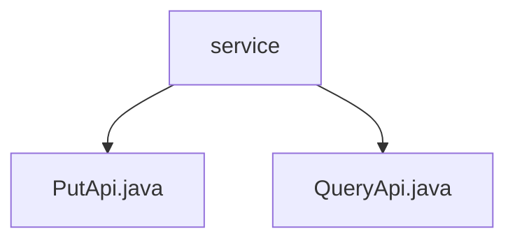

# 基础信息

|      |      |
|------|------|
| 名称 | service |
| 编码语言 | .java |
| 代码路径 | WeFe/union/union-service/src/main/java/com/welab/wefe/union/service/api/service |
| 包名 | docs.union.union-service.src.main.java.com.welab.wefe.union.service.api.service |
| 概述说明 | PutApi是处理会员服务添加的API，路径member/service/put，继承AbstractApi，必填字段serviceId等，调用MemberServiceService.add。QueryApi是查询会员服务的API，路径member/service/query，继承AbstractApi，输入含serviceId等，分页查询默认10条，调用memberServiceService.query。 |

# 说明

## 概述  
该模块核心职责是提供会员服务的增删改查能力，通过PutApi实现服务注册更新，QueryApi实现分页查询功能。接口规范统一继承AbstractApi，采用签名认证，路径分别为`member/service/put`和`member/service/query`。  

关键数据结构包括Input类（含必填字段serviceId/baseUrl/apiName和服务状态）和分页输出PageOutput<ApiMemberServiceQueryOutput>。外部依赖仅为MemberServiceService，通过JNI方式注入。例如PutApi调用add方法，QueryApi使用query方法。  

## 主要业务场景  
模块支持两种典型交互：服务注册更新（类似CRUD模式）和服务分页查询（类似数据筛选器）。业务流程中，PutApi处理带必填校验的输入，QueryApi实现多条件过滤与分页返回。例如通过serviceType筛选服务，或通过memberId查询关联服务。  

完整功能覆盖服务全生命周期管理，API类型包含写操作和读操作。集成案例表现为：前端提交服务配置后，通过PutApi持久化；管理台调用QueryApi分页展示服务列表。

### 包内部结构视图

该流程图展示了WeFe项目中union-service模块的API服务结构。根节点"service"下包含两个Java接口文件：PutApi.java和QueryApi.java，分别代表不同的API服务实现。这种结构清晰地反映了服务层的基本组成，符合典型Spring Boot项目的分层设计模式。

# 文件列表

| 名称   | 类型  | 说明 |
|-------|------|-------------|
| [PutApi.java](PutApi.md) | file | PutApi类处理会员服务添加请求，需必填serviceId、baseUrl、apiName、serviceType等字段，调用memberServiceService.add方法完成操作。 |
| [QueryApi.java](QueryApi.md) | file | 成员服务查询API，支持签名访问，输入参数包括服务ID、成员ID、名称等，分页查询返回成员服务列表。 |

