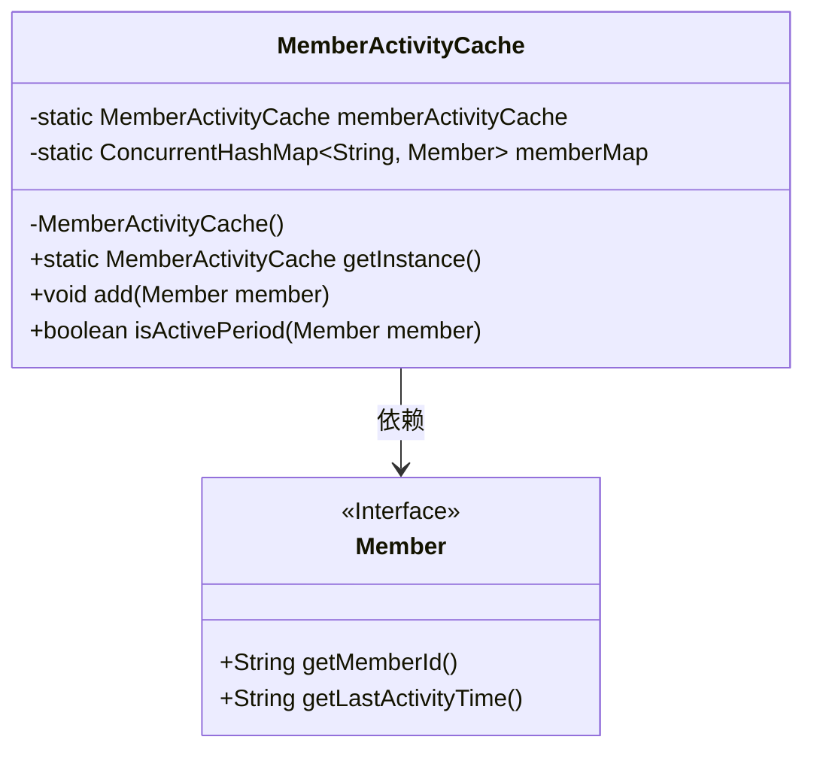
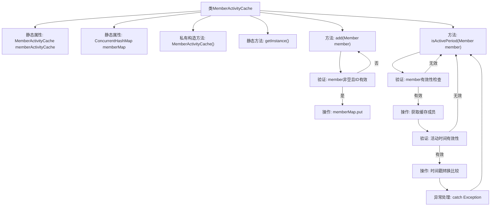

# 基础信息

|      |      |
|------|------|
| 名称 | MemberActivityCache |
| 编码语言 | .java |
| 代码路径 | WeFe/union/union-service/src/main/java/com/welab/wefe/union/service/cache/MemberActivityCache.java |
| 包名 | com.welab.wefe.union.service.cache |
| 依赖项 | ['com.welab.wefe.common.data.mongodb.entity.union.Member', 'com.welab.wefe.common.util.DateUtil', 'com.welab.wefe.common.util.StringUtil', 'java.util.Date', 'java.util.concurrent.ConcurrentHashMap'] |
| 概述说明 | MemberActivityCache是单例类，使用ConcurrentHashMap缓存会员信息，提供添加和检查会员活动时间是否有效的功能。 |

# 说明

MemberActivityCache是一个单例类，用于缓存会员活动信息。它使用ConcurrentHashMap存储会员ID与会员对象的映射关系。类提供了添加会员到缓存的方法add，以及检查会员活动时间是否在有效期内的方法isActivePeriod。isActivePeriod会比对传入会员与缓存中会员的最后活动时间戳，确保传入时间不晚于缓存时间。所有操作都包含空值检查和异常处理。

# 类列表 Class Summary

| 名称   | 类型  | 说明 |
|-------|------|-------------|
| MemberActivityCache | class | 单例类MemberActivityCache，使用ConcurrentHashMap缓存会员信息，提供添加和检查会员活动时间是否在有效期内的方法。 |

## 类 MemberActivityCache

|      |      |
|------|------|
| 访问范围 | public |
| 类型 | class |
| 名称 | MemberActivityCache |
| 说明 | 单例类MemberActivityCache，使用ConcurrentHashMap缓存会员信息，提供添加和检查会员活动时间是否在有效期内的方法。 |

### UML类图

这段代码展示了一个单例模式的MemberActivityCache类，用于缓存会员活动信息。该类使用ConcurrentHashMap存储会员ID与会员对象的映射关系，提供添加会员到缓存和检查会员活动时间是否在有效期内的方法。Member接口定义了获取会员ID和最后活动时间的方法。缓存类通过私有构造方法和静态getInstance()方法确保单例，并通过线程安全的ConcurrentHashMap实现并发访问控制。

### 内部方法调用关系图

该流程图展示了MemberActivityCache类的完整结构和工作流程。类采用单例模式，通过静态方法getInstance获取实例，包含添加成员(add)和检查活动状态(isActivePeriod)两个核心方法。add方法会验证成员对象有效性后存入ConcurrentHashMap；isActivePeriod方法通过多级验证（成员ID、缓存存在性、时间戳有效性）后，最终比较时间戳判断活动状态。所有异常情况均会中断流程并返回false，体现了严谨的防御式编程思想。

### 字段列表 Field List

| 名称  | 类型  | 说明 |
|-------|-------|------|
| memberMap = new ConcurrentHashMap<>() | ConcurrentHashMap<String, Member> | 定义一个线程安全的ConcurrentHashMap，键为String类型，值为Member类型，用于存储成员信息。 |
| memberActivityCache = new MemberActivityCache() | MemberActivityCache | 私有静态成员变量memberActivityCache初始化为MemberActivityCache实例。 |

### 方法列表

| 名称  | 类型  | 说明 |
|-------|-------|------|
| isActivePeriod | boolean | 检查成员活动状态：验证成员ID有效性，比较最后活动时间，若输入时间小于等于缓存时间则返回真，否则为假。异常时返回假。 |
| getInstance | MemberActivityCache | 静态方法getInstance返回成员活动缓存实例memberActivityCache。 |
| add | void | 该方法检查成员对象及其ID是否有效，无效则直接返回，有效则将成员存入映射表，键为成员ID。 |

