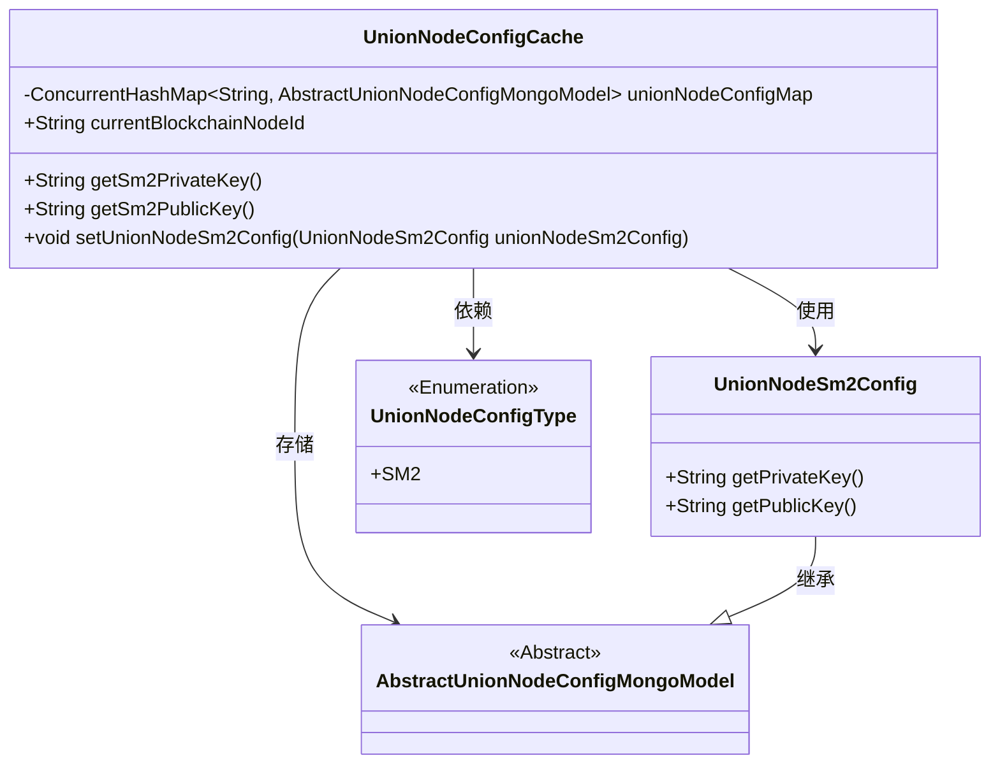
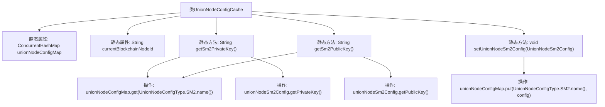

# 基础信息

|      |      |
|------|------|
| 名称 | UnionNodeConfigCache |
| 编码语言 | .java |
| 代码路径 | WeFe/union/union-service/src/main/java/com/welab/wefe/union/service/cache/UnionNodeConfigCache.java |
| 包名 | com.welab.wefe.union.service.cache |
| 依赖项 | ['com.welab.wefe.common.data.mongodb.entity.base.AbstractUnionNodeConfigMongoModel', 'com.welab.wefe.common.data.mongodb.entity.union.UnionNodeSm2Config', 'com.welab.wefe.union.service.constant.UnionNodeConfigType', 'java.util.concurrent.ConcurrentHashMap'] |
| 概述说明 | UnionNodeConfigCache类使用ConcurrentHashMap存储节点配置，提供SM2公私钥的获取和设置方法，并维护当前区块链节点ID。 |

# 说明

UnionNodeConfigCache类是一个静态配置缓存类，使用ConcurrentHashMap存储AbstractUnionNodeConfigMongoModel类型的节点配置。它包含currentBlockchainNodeId静态字段，以及三个静态方法：getSm2PrivateKey和getSm2PublicKey分别用于获取SM2密钥配置中的私钥和公钥，setUnionNodeSm2Config用于设置SM2密钥配置。所有操作都基于UnionNodeConfigType.SM2.name()作为键来访问和存储配置数据。

# 类列表 Class Summary

| 名称   | 类型  | 说明 |
|-------|------|-------------|
| UnionNodeConfigCache | class | UnionNodeConfigCache类使用ConcurrentHashMap存储节点配置，提供SM2公私钥的获取和设置方法，并记录当前区块链节点ID。 |

## 类 UnionNodeConfigCache

|      |      |
|------|------|
| 访问范围 | public |
| 类型 | class |
| 名称 | UnionNodeConfigCache |
| 说明 | UnionNodeConfigCache类使用ConcurrentHashMap存储节点配置，提供SM2公私钥的获取和设置方法，并记录当前区块链节点ID。 |

### UML类图

这段代码展示了一个配置缓存系统，其中UnionNodeConfigCache类通过ConcurrentHashMap存储不同类型的节点配置。UnionNodeSm2Config继承自抽象类AbstractUnionNodeConfigMongoModel，提供SM2加密相关的公私钥管理功能。UnionNodeConfigType枚举用于标识配置类型。缓存类通过静态方法提供密钥访问和配置设置功能，线程安全地管理配置数据。

### 内部方法调用关系图

该流程图展示了UnionNodeConfigCache类的结构和关键方法调用关系。类包含两个静态属性和三个静态方法，其中getSm2PrivateKey()和getSm2PublicKey()都通过unionNodeConfigMap获取SM2配置对象并返回相应密钥，setUnionNodeSm2Config()方法则用于更新配置映射。所有方法都围绕ConcurrentHashMap类型的unionNodeConfigMap展开操作，实现了线程安全的配置管理功能。

### 字段列表 Field List

| 名称  | 类型  | 说明 |
|-------|-------|------|
| unionNodeConfigMap = new ConcurrentHashMap<>() | ConcurrentHashMap<String, AbstractUnionNodeConfigMongoModel> | 定义了一个线程安全的哈希映射，键为字符串类型，值为抽象联合节点配置的Mongo模型对象。 |
| currentBlockchainNodeId | String | 静态字符串变量，存储当前区块链节点ID。 |

### 方法列表

| 名称  | 类型  | 说明 |
|-------|-------|------|
| getSm2PrivateKey | String | 获取SM2私钥的静态方法，从配置映射中读取UnionNodeSm2Config实例并返回其私钥。 |
| getSm2PublicKey | String | 获取SM2公钥：从配置映射中提取SM2配置对象并返回其公钥。 |
| setUnionNodeSm2Config | void | 该方法将SM2配置对象存入配置映射，键为UnionNodeConfigType.SM2的枚举名称。 |

