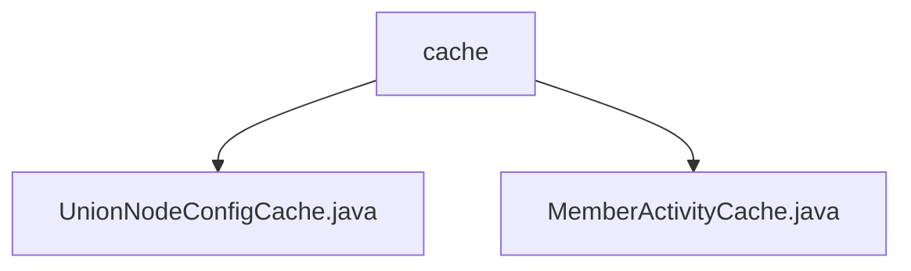

# 基础信息

|      |      |
|------|------|
| 名称 | cache |
| 编码语言 | .java |
| 代码路径 | WeFe/union/union-service/src/main/java/com/welab/wefe/union/service/cache |
| 包名 | docs.union.union-service.src.main.java.com.welab.wefe.union.service.cache |
| 概述说明 | UnionNodeConfigCache类缓存节点配置，提供SM2密钥的获取和设置方法。MemberActivityCache类单例管理会员活动信息，支持添加和有效期检查功能。 |

# 说明

## 概述  
该模块核心职责是提供线程安全的配置与活动信息缓存管理，采用ConcurrentHashMap实现多线程环境下的数据存储。接口规范包含密钥配置的读写（如SM2密钥对获取/设置）和会员活动状态校验，均通过类型安全键值对（如UnionNodeConfigType.SM2.name()）进行数据访问。  

关键数据结构包括AbstractUnionNodeConfigMongoModel（节点配置基类）和会员对象映射表。外部依赖仅涉及MongoDB模型和SM2加密算法。例如UnionNodeConfigCache通过currentBlockchainNodeId字段关联区块链节点，MemberActivityCache采用时间戳比对实现活动有效期验证。  

## 主要业务场景  
典型应用模式包含两类：1）节点密钥管理场景，如通过setUnionNodeSm2Config动态更新SM2配置；2）会员状态维护场景，类似事件总线模式，通过add/isActivePeriod方法实现活动状态同步与校验。  

功能完整性体现在双缓存体系覆盖静态配置（如密钥）与动态数据（如会员活动），所有操作均内置空值检查。例如MemberActivityCache会拒绝晚于缓存时间的传入时间戳，确保数据一致性。API类型均为内存操作接口，集成案例包括区块链节点初始化时的密钥加载和会员服务中的活动状态追踪。

### 包内部结构视图

该流程图展示了union-service项目中cache目录下的文件结构关系。cache作为父节点，包含两个子节点：UnionNodeConfigCache.java和MemberActivityCache.java两个缓存类文件。这反映了项目中缓存模块的基本组成，用于管理联盟节点配置和成员活动数据的缓存功能。

# 文件列表

| 名称   | 类型  | 说明 |
|-------|------|-------------|
| [UnionNodeConfigCache.java](UnionNodeConfigCache.md) | file | UnionNodeConfigCache类使用ConcurrentHashMap存储节点配置，提供SM2公私钥的获取和设置方法，并维护当前区块链节点ID。 |
| [MemberActivityCache.java](MemberActivityCache.md) | file | MemberActivityCache是单例类，使用ConcurrentHashMap缓存会员信息，提供添加和检查会员活动时间是否有效的功能。 |

