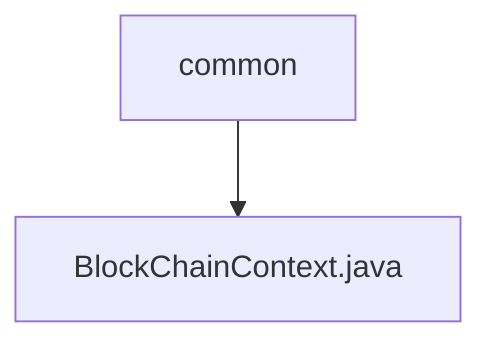

# 基础信息

|      |      |
|------|------|
| 名称 | common |
| 编码语言 | .java |
| 代码路径 | WeFe/union/union-service/src/main/java/com/welab/wefe/union/service/common |
| 包名 | docs.union.union-service.src.main.java.com.welab.wefe.union.service.common |
| 概述说明 | 输入内容为空，无法生成概要描述。 |

# 说明

输入内容为空，无法生成总结描述。请提供需要总结的具体内容。

### 包内部结构视图

流程图展示了WeFe项目中union-service模块的Java代码结构。根节点"common"表示公共代码目录，其下包含一个区块链相关的Java文件"BlockChainContext.java"。该结构反映了项目中区块链上下文类的存放位置，属于服务层公共组件的一部分。

# 文件列表

| 名称   | 类型  | 说明 |
|-------|------|-------------|
| [BlockChainContext.java](BlockChainContext.md) | file | 输入内容为空，无法生成概要描述。 |

