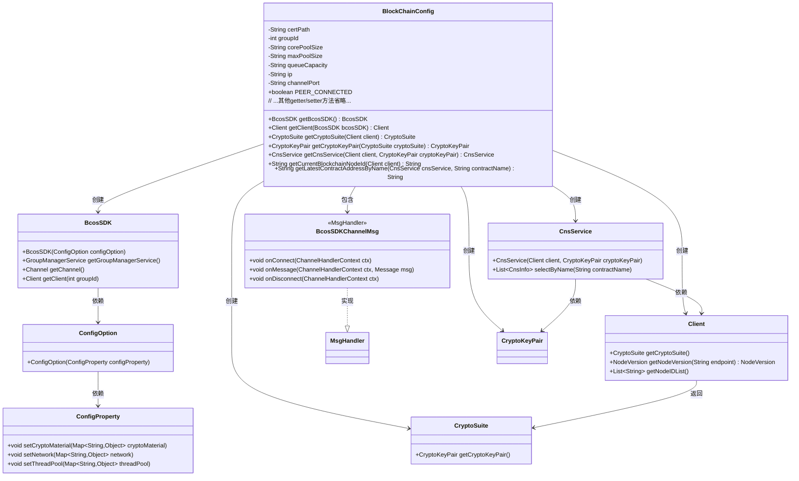

# 基础信息

|      |      |
|------|------|
| 名称 | BlockChainConfig |
| 编码语言 | .java |
| 代码路径 | WeFe/union/union-service/src/main/java/com/welab/wefe/union/service/config/BlockChainConfig.java |
| 包名 | com.welab.wefe.union.service.config |
| 依赖项 | ['com.welab.wefe.common.StatusCode', 'com.welab.wefe.common.exception.StatusCodeWithException', 'com.welab.wefe.common.wefe.enums.ContractName', 'com.welab.wefe.union.service.contract', 'io.netty.channel.ChannelHandlerContext', 'org.apache.commons.collections4.CollectionUtils', 'org.fisco.bcos.sdk.BcosSDK', 'org.fisco.bcos.sdk.client.Client', 'org.fisco.bcos.sdk.config.ConfigOption', 'org.fisco.bcos.sdk.config.model.ConfigProperty', 'org.fisco.bcos.sdk.contract.precompiled.cns.CnsInfo', 'org.fisco.bcos.sdk.contract.precompiled.cns.CnsService', 'org.fisco.bcos.sdk.crypto.CryptoSuite', 'org.fisco.bcos.sdk.crypto.keypair.CryptoKeyPair', 'org.fisco.bcos.sdk.model.Message', 'org.fisco.bcos.sdk.model.NodeVersion.ClientVersion', 'org.fisco.bcos.sdk.network.MsgHandler', 'org.slf4j.Logger', 'org.slf4j.LoggerFactory', 'org.springframework.boot.context.properties.ConfigurationProperties', 'org.springframework.context.annotation.Bean', 'org.springframework.context.annotation.Configuration', 'java.util.ArrayList', 'java.util.HashMap', 'java.util.List', 'java.util.Map'] |
| 概述说明 | 这是一个区块链配置类，用于初始化BcosSDK和相关合约服务。包含证书路径、线程池配置、网络节点设置，以及多个智能合约的加载逻辑。通过CNS服务获取最新合约地址，并管理连接状态。 |

# 说明

这是一个基于Spring Boot的区块链配置类，主要用于初始化FISCO BCOS区块链SDK和相关服务。类中定义了证书路径、群组ID、线程池配置、节点IP和端口等属性，并通过@Bean方法创建BcosSDK实例、客户端、加密套件、密钥对以及多个智能合约服务。内部类BcosSDKChannelMsg处理节点连接状态变更，通过日志记录连接和断开事件。getLatestContractAddressByName方法根据合约名称从CNS服务获取最新合约地址。所有配置属性都可通过setter方法修改，并支持从配置文件加载。

# 类列表 Class Summary

| 名称   | 类型  | 说明 |
|-------|------|-------------|
| BlockChainConfig | class | BlockChainConfig类配置区块链SDK，包含证书路径、线程池、节点网络等参数，并初始化多个智能合约实例。 |

## 类 BlockChainConfig

|      |      |
|------|------|
| 访问范围 | @Configuration;@ConfigurationProperties(prefix = "block.chain");public |
| 类型 | class |
| 名称 | BlockChainConfig |
| 说明 | BlockChainConfig类配置区块链SDK，包含证书路径、线程池、节点网络等参数，并初始化多个智能合约实例。 |

### UML类图

该代码是一个区块链配置类，主要功能是初始化区块链SDK和相关服务。BlockChainConfig类通过@ConfigurationProperties加载配置参数，包含证书路径、线程池配置等属性。核心方法getBcosSDK()会创建BcosSDK实例，并配置加密材料、网络节点和线程池参数。该类还通过多个@Bean方法创建Client、CryptoSuite等区块链组件，并实现了合约地址查询功能。内部类BcosSDKChannelMsg实现了网络连接状态监控。整体结构展示了Spring配置类如何与区块链SDK进行集成。

### 内部方法调用关系图

```mermaid
graph TD
    A["类BlockChainConfig"]
    B["静态内部类: BcosSDKChannelMsg"]
    C["属性: String certPath"]
    D["属性: int groupId"]
    E["属性: String corePoolSize"]
    F["属性: String maxPoolSize"]
    G["属性: String queueCapacity"]
    H["属性: String ip"]
    I["属性: String channelPort"]
    J["静态属性: boolean PEER_CONNECTED"]
    K["方法: getBcosSDK()"]
    L["方法: getClient()"]
    M["方法: getCryptoSuite()"]
    N["方法: getCryptoKeyPair()"]
    O["方法: getCnsService()"]
    P["方法: getCurrentBlockchainNodeId()"]
    Q["方法: getLatestContractAddressByName()"]
    R["方法: 多个getLatestVersionXXXContract()"]
    S["方法: 各属性的getter/setter"]

    A --> B
    A --> C
    A --> D
    A --> E
    A --> F
    A --> G
    A --> H
    A --> I
    A --> J
    A --> K
    A --> L
    A --> M
    A --> N
    A --> O
    A --> P
    A --> Q
    A --> R
    A --> S

    B --> B1["onConnect(ChannelHandlerContext)"]
    B --> B2["onMessage(ChannelHandlerContext, Message)"]
    B --> B3["onDisconnect(ChannelHandlerContext)"]

    K --> K1["初始化cryptoMaterial"]
    K --> K2["初始化network"]
    K --> K3["初始化threadPool"]
    K --> K4["创建ConfigProperty"]
    K --> K5["创建ConfigOption"]
    K --> K6["创建BcosSDK实例"]
    K --> K7["获取ClientVersion"]
    K --> K8["添加连接/断开处理器"]
```

这段代码是一个Spring配置类，用于初始化区块链相关的服务和合约。主要功能包括：1) 配置区块链网络参数；2) 创建BcosSDK核心服务；3) 初始化各类智能合约的Bean。流程图展示了类结构、属性关系和方法调用链，特别是getBcosSDK()方法的详细初始化流程和BcosSDKChannelMsg内部类的事件处理方法。该配置类通过分层初始化方式，最终提供完整的区块链服务访问能力。

### 字段列表 Field List

| 名称  | 类型  | 说明 |
|-------|-------|------|
| ip = "127.0.0.1" | String | 定义私有字符串变量ip，初始值为本地回环地址127.0.0.1。 |
| PEER_CONNECTED = true | boolean | 静态布尔变量PEER_CONNECTED，值为true，表示对等连接已建立。 |
| channelPort = "20200" | String | 私有字符串变量channelPort被初始化为"20200"。 |
| log =            LoggerFactory.getLogger(BlockChainConfig.class) | Logger | 定义BlockChainConfig类的私有静态日志常量，使用LoggerFactory获取日志实例。 |
| maxPoolSize | String | 声明一个私有字符串变量maxPoolSize。 |
| groupId | int | 私有整型变量groupId |
| corePoolSize | String | 声明一个私有字符串变量corePoolSize。 |
| queueCapacity | String | 私有字符串变量queueCapacity，用于表示队列容量。 |
| certPath = "conf" | String | Java变量certPath，存储证书路径，默认值"conf"。 |

### 方法列表

| 名称  | 类型  | 说明 |
|-------|-------|------|
| getLatestVersionMemberServiceContract | MemberServiceContract | 该方法通过CNS服务获取最新版MemberService合约地址，并加载合约实例。需传入CNS服务、客户端和密钥对，可能抛出异常。 |
| setMaxPoolSize | void | 设置最大池大小的公共方法，将输入字符串赋值给类变量maxPoolSize。 |
| getLatestContractAddressByName | String | 方法通过CNS服务按名称获取最新合约地址。查询失败或结果为空时抛出异常，成功则返回列表末位地址。 |
| setGroupId | void | 设置组ID的方法，将参数groupId赋值给当前对象的groupId属性。 |
| getLatestVersionBloomFilterContract | BloomFilterContract | 该方法通过CNS服务获取最新版布隆过滤器合约地址，并加载合约实例。需传入CNS服务、客户端和密钥对参数，可能抛出异常。 |
| getMaxPoolSize | String | 获取最大线程池大小的方法，返回字符串类型的maxPoolSize值。 |
| setCorePoolSize | void | 设置线程池核心线程数的方法，参数为字符串类型。 |
| getCurrentBlockchainNodeId | String | 该方法通过客户端获取区块链节点ID列表并返回第一个节点ID。 |
| setCertPath | void | 设置证书路径的方法，将输入参数certPath赋值给类成员变量certPath。 |
| getLatestVersionDataSetMemberPermissionContract | DataSetMemberPermissionContract | 该方法通过CNS服务获取最新版数据集成员权限合约地址，并加载合约实例返回。需传入CNS服务、客户端和密钥对参数，可能抛出异常。 |
| getCnsService | CnsService | 创建CnsService实例的Bean方法，接收Client和CryptoKeyPair参数并返回初始化后的CnsService对象。 |
| getLatestVersionDataResourceContract | DataResourceContract | 定义一个Bean方法，通过CNS服务获取最新数据资源合约地址并加载合约实例。 |
| getCryptoKeyPair | CryptoKeyPair | 创建返回加密套件密钥对的Bean方法。 |
| getCryptoSuite | CryptoSuite | 创建一个返回客户端加密套件的Spring Bean。 |
| getLatestVersionMemberContract | MemberContract | 该方法通过CNS服务获取最新版MemberContract合约地址，并使用客户端和密钥对加载合约实例。 |
| getBcosSDK | BcosSDK | 初始化BcosSDK实例，配置证书路径、节点网络和线程池参数，创建ConfigOption并设置连接处理器。 |
| getLatestVersionUnionNodeContract | UnionNodeContract | 该方法通过CNS服务获取最新版UnionNode合约地址，并使用客户端和密钥对加载合约实例。 |
| getClient | Client | 创建Bean方法，通过BcosSDK获取指定群组的Client实例并返回。 |
| getLatestVersionTableDataSetContract | TableDataSetContract | 该方法通过CNS服务获取最新版TableDataSet合约地址，并加载合约实例。需传入CNS服务、客户端和密钥对参数，可能抛出异常。 |
| getLatestVersionMemberFileInfoContract | MemberFileInfoContract | 该方法通过CNS服务获取最新版MemberFileInfo合约地址，并加载合约实例。需传入CNS服务、客户端和密钥对参数，可能抛出异常。 |
| getCertPath | String | 获取证书路径的方法，返回字符串类型的certPath变量值。 |
| getCorePoolSize | String | 获取线程池核心线程数的方法，返回字符串类型的corePoolSize值。 |
| getGroupId | int | 方法返回整型变量groupId的值。 |
| getLatestVersionDataSetContract | DataSetContract | 定义一个Bean方法，通过CNS服务获取最新数据集合约地址并加载合约实例。 |
| getQueueCapacity | String | 获取队列容量的方法，返回字符串类型的队列容量值。 |
| getLatestVersionImageDataSetContract | ImageDataSetContract | 加载最新版ImageDataSetContract，通过CNS服务获取合约地址并使用客户端及密钥对初始化。 |
| setQueueCapacity | void | 设置队列容量的方法，将输入参数queueCapacity赋值给类的同名属性。 |
| getIp | String | 获取IP地址的方法，返回字符串类型的ip值。 |
| setIp | void | 设置IP地址的方法，将传入的字符串参数赋值给类的ip变量。 |
| getChannelPort | String | 获取channelPort值的公开方法。 |
| setChannelPort | void | 设置通道端口的方法，将输入参数channelPort赋值给类成员变量channelPort。 |

