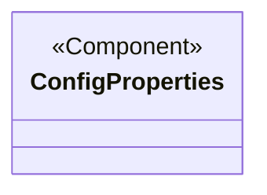
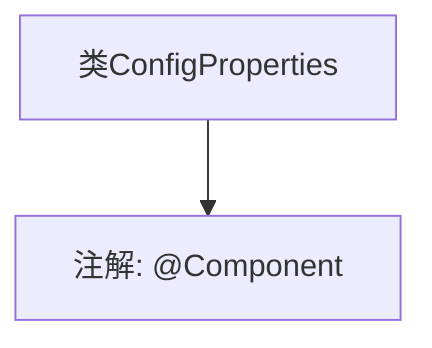

# 基础信息

|      |      |
|------|------|
| 名称 | ConfigProperties |
| 编码语言 | .java |
| 代码路径 | WeFe/union/union-service/src/main/java/com/welab/wefe/union/service/config/ConfigProperties.java |
| 包名 | com.welab.wefe.union.service.config |
| 依赖项 | ['org.springframework.stereotype.Component'] |
| 概述说明 | 配置属性组件类 |

# 说明

这是一个名为ConfigProperties的Spring组件类，使用@Component注解标记，表明它是一个可被Spring容器管理的组件。该类当前为空，未定义任何属性或方法，可能用于后续配置属性的注入或存储。作为配置类，它通常用于集中管理应用程序的配置参数。

# 类列表 Class Summary

| 名称   | 类型  | 说明 |
|-------|------|-------------|
| ConfigProperties | class | 配置属性组件类。 |

## 类 ConfigProperties

|      |      |
|------|------|
| 访问范围 | @Component;public |
| 类型 | class |
| 名称 | ConfigProperties |
| 说明 | 配置属性组件类。 |

### UML类图

该类图展示了一个简单的Spring组件类`ConfigProperties`，使用`<<Component>>`标注表示这是一个Spring框架管理的组件类。当前类为空实现，通常用于存放配置属性，后续可通过`@Value`或`@ConfigurationProperties`注入外部配置。类图符合Spring组件的基本结构，为后续扩展配置属性预留了空间。

### 内部方法调用关系图

这段代码定义了一个名为`ConfigProperties`的Spring组件类，标记了`@Component`注解。该注解表明这个类会被Spring框架自动检测并注册为应用上下文中的Bean，通常用于配置属性或工具类。由于类体为空，当前仅作为基础组件容器使用，后续可添加配置相关属性或方法。

### 字段列表 Field List

| 名称  | 类型  | 说明 |
|-------|-------|------|

### 方法列表

| 名称  | 类型  | 说明 |
|-------|-------|------|

