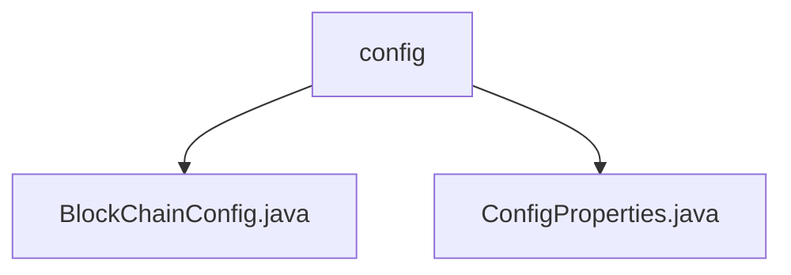

# 基础信息

|      |      |
|------|------|
| 名称 | config |
| 编码语言 | .java |
| 代码路径 | WeFe/union/union-service/src/main/java/com/welab/wefe/union/service/config |
| 包名 | docs.union.union-service.src.main.java.com.welab.wefe.union.service.config |
| 概述说明 | BlockChainConfig类初始化FISCO BCOS区块链SDK，配置证书、群组ID等属性，创建SDK实例和智能合约服务。ConfigProperties是空的Spring组件类，用于后续配置管理。 |

# 说明

## 概述  
该模块基于Spring Boot实现，核心职责是初始化FISCO BCOS区块链SDK并管理相关服务配置。通过@Bean方法创建BcosSDK实例、客户端、加密套件等组件，类似工厂模式构建区块链基础设施。关键数据结构包括证书路径、群组ID、节点IP/端口等配置属性，以及处理节点连接状态变更的BcosSDKChannelMsg内部类。外部依赖主要为FISCO BCOS SDK和Spring框架。例如通过getLatestContractAddressByName方法从CNS服务动态获取合约地址。

## 主要业务场景  
模块支持区块链服务的快速初始化与动态配置，典型场景包括智能合约部署和节点连接管理。通过属性注入实现灵活配置，例如线程池参数和证书路径可动态调整。交互模式采用事件驱动机制，类似事件总线模式监听节点连接状态变更。功能完整性体现在同时支持基础SDK构建（如密钥对生成）和高级服务（如CNS查询）。API类型涵盖配置注入与合约地址查询，例如通过setter方法覆盖默认配置。

### 包内部结构视图

该流程图展示了WeFe项目中union-service模块下的config配置目录结构。config目录包含两个Java配置文件：BlockChainConfig.java和ConfigProperties.java，分别用于区块链配置和通用属性配置。这种结构清晰地反映了配置文件的组织方式，便于开发者快速定位相关配置类。

# 文件列表

| 名称   | 类型  | 说明 |
|-------|------|-------------|
| [BlockChainConfig.java](BlockChainConfig.md) | file | 这是一个区块链配置类，用于初始化BcosSDK和相关合约服务。包含证书路径、线程池配置、网络节点设置，以及多个智能合约的加载逻辑。通过CNS服务获取最新合约地址，并管理连接状态。 |
| [ConfigProperties.java](ConfigProperties.md) | file | 配置属性组件类 |

