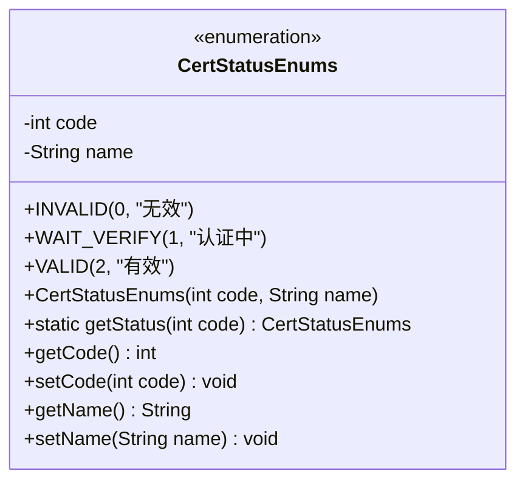
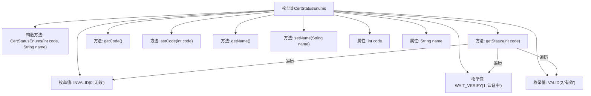

# 基础信息

|      |      |
|------|------|
| 名称 | CertStatusEnums |
| 编码语言 | .java |
| 代码路径 | WeFe/union/union-service/src/main/java/com/welab/wefe/union/service/constant/CertStatusEnums.java |
| 包名 | com.welab.wefe.union.service.constant |
| 依赖项 | [] |
| 概述说明 | 枚举CertStatusEnums定义了认证状态：0无效，1认证中，2有效，提供根据code获取状态的方法。 |

# 说明

该枚举类CertStatusEnums定义了三种认证状态：INVALID（无效，code=0）、WAIT_VERIFY（认证中，code=1）、VALID（有效，code=2）。每个枚举项包含code和name属性，提供getter/setter方法。类中实现了通过code值查找对应枚举项的静态方法getStatus，若未找到则返回null。整体结构用于管理认证状态码与状态的映射关系。

# 类列表 Class Summary

| 名称   | 类型  | 说明 |
|-------|------|-------------|
| CertStatusEnums | enum | 枚举CertStatusEnums定义了认证状态：0无效，1认证中，2有效，包含获取状态方法。 |

## 类 CertStatusEnums

|      |      |
|------|------|
| 访问范围 | public |
| 类型 | enum |
| 名称 | CertStatusEnums |
| 说明 | 枚举CertStatusEnums定义了认证状态：0无效，1认证中，2有效，包含获取状态方法。 |

### UML类图

这段代码定义了一个枚举类`CertStatusEnums`，用于表示认证状态。枚举包含三个常量值：`INVALID`(无效)、`WAIT_VERIFY`(认证中)和`VALID`(有效)，每个常量都有对应的状态码和名称。类提供了获取和设置状态码及名称的方法，以及一个静态方法`getStatus`用于根据状态码查找对应的枚举值。枚举类通过私有构造函数初始化，封装了状态码和名称两个属性。

### 内部方法调用关系图

该流程图展示了CertStatusEnums枚举类的完整结构，包含三个预定义枚举值(INVALID/WAIT_VERIFY/VALID)及其对应的状态码和描述。类中包含构造方法、通过code查找枚举的静态方法getStatus()、以及code和name属性的getter/setter方法。核心逻辑getStatus()会遍历所有枚举值进行匹配，流程图清晰体现了枚举值与查找方法之间的调用关系。

### 字段列表 Field List

| 名称  | 类型  | 说明 |
|-------|-------|------|

### 方法列表

| 名称  | 类型  | 说明 |
|-------|-------|------|

