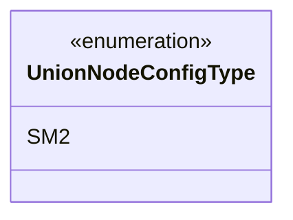
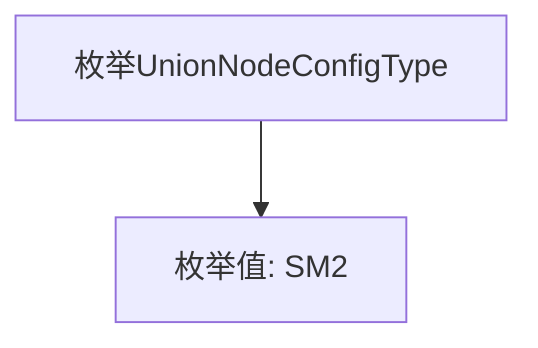

# 基础信息

|      |      |
|------|------|
| 名称 | UnionNodeConfigType |
| 编码语言 | .java |
| 代码路径 | WeFe/union/union-service/src/main/java/com/welab/wefe/union/service/constant/UnionNodeConfigType.java |
| 包名 | com.welab.wefe.union.service.constant |
| 依赖项 | [] |
| 概述说明 | UnionNodeConfigType枚举类型，当前仅包含SM2配置项。 |

# 说明

该内容定义了一个名为UnionNodeConfigType的公共枚举类型，其中仅包含一个枚举值SM2。枚举用于表示配置类型的有限集合，此处SM2可能是特定配置或算法的标识。整个定义简洁明确，没有其他修饰或扩展。

# 类列表 Class Summary

| 名称   | 类型  | 说明 |
|-------|------|-------------|
| UnionNodeConfigType | enum | UnionNodeConfigType枚举类型，当前仅包含SM2配置项。 |

## 类 UnionNodeConfigType

|      |      |
|------|------|
| 访问范围 | public |
| 类型 | enum |
| 名称 | UnionNodeConfigType |
| 说明 | UnionNodeConfigType枚举类型，当前仅包含SM2配置项。 |

### UML类图

这段代码定义了一个名为UnionNodeConfigType的枚举类型，目前只包含一个枚举值SM2。枚举类型用于表示一组固定的常量，这里可能用于配置节点类型。由于是枚举类型，在类图中使用<<enumeration>>标记，并列出其所有枚举值。该枚举结构简单，但为系统提供了明确的类型安全约束。

### 内部方法调用关系图

这段代码定义了一个名为UnionNodeConfigType的枚举类型，其中包含一个枚举值SM2。枚举类型是一种特殊的类，用于表示一组固定的常量。在这个例子中，UnionNodeConfigType枚举仅包含一个常量SM2，可能用于表示某种配置类型或模式。枚举类型通常用于替代常量定义，提供更好的类型安全性和可读性。整个结构非常简单，没有定义任何方法或属性，仅包含最基本的枚举声明。

### 字段列表 Field List

| 名称  | 类型  | 说明 |
|-------|-------|------|

### 方法列表

| 名称  | 类型  | 说明 |
|-------|-------|------|

