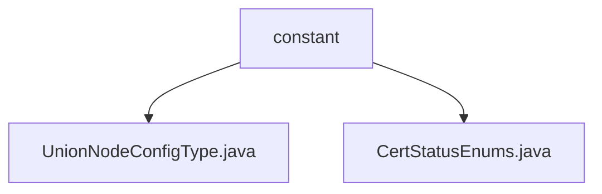

# 基础信息

|      |      |
|------|------|
| 名称 | constant |
| 编码语言 | .java |
| 代码路径 | WeFe/union/union-service/src/main/java/com/welab/wefe/union/service/constant |
| 包名 | docs.union.union-service.src.main.java.com.welab.wefe.union.service.constant |
| 概述说明 | UnionNodeConfigType枚举含SM2值，表示配置类型。CertStatusEnums枚举定义三种认证状态：无效(0)、认证中(1)、有效(2)，含状态码查找方法。 |

# 说明

## 概述  
该模块核心职责是提供枚举类型定义，用于管理配置类型和认证状态的标准化标识。接口规范包括通过Code值查询枚举项的静态方法（例如getStatus）以及基础属性访问器。关键数据结构为UnionNodeConfigType（含SM2值）和CertStatusEnums（含INVALID/WAIT_VERIFY/VALID三态）。无外部依赖项，实现案例包括SM2算法标识和认证状态码映射（例如Code=2对应VALID状态）。

## 主要业务场景  
模块支撑配置类型识别和认证流程状态管理，类似状态机模式。完整业务流程涉及从Code到枚举值的转换（例如getStatus(1)返回WAIT_VERIFY）及类型校验。典型应用包括算法配置选择（如SM2）和证书状态跟踪，API类型为枚举查询接口。集成案例覆盖认证系统状态流转和加密配置标识场景。

### 包内部结构视图

该流程图展示了WeFe项目中union-service模块下constant目录的层级结构。constant作为父节点包含两个枚举类文件：UnionNodeConfigType.java和CertStatusEnums.java，这两个文件分别定义了联盟节点配置类型和证书状态枚举值，属于服务层的基础常量定义部分。整个结构简洁明了，体现了Java项目中典型的常量包组织方式。

# 文件列表

| 名称   | 类型  | 说明 |
|-------|------|-------------|
| [UnionNodeConfigType.java](UnionNodeConfigType.md) | file | UnionNodeConfigType枚举类型，当前仅包含SM2配置项。 |
| [CertStatusEnums.java](CertStatusEnums.md) | file | 枚举CertStatusEnums定义了认证状态：0无效，1认证中，2有效，提供根据code获取状态的方法。 |

