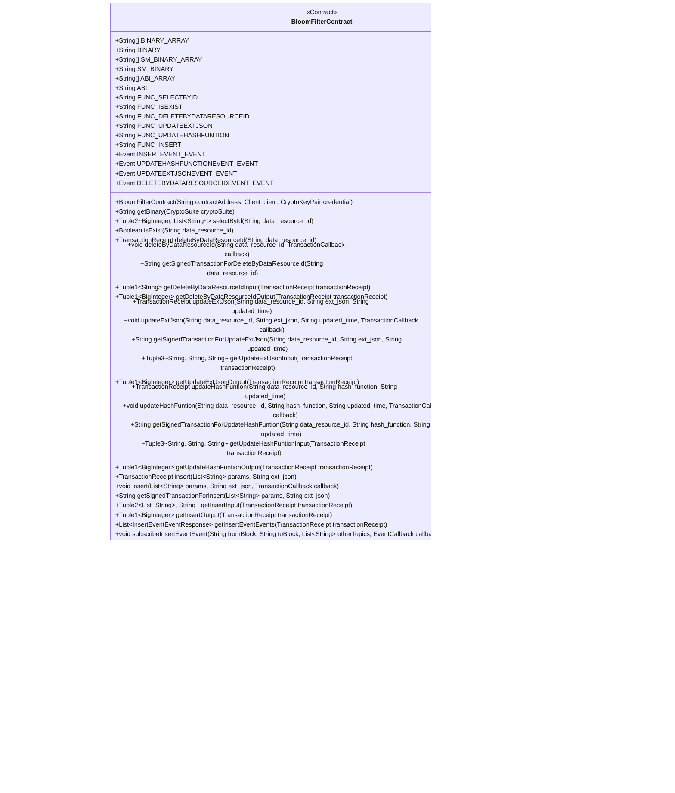

# 基础信息

|      |      |
|------|------|
| 名称 | BloomFilterContract |
| 编码语言 | .java |
| 代码路径 | WeFe/union/union-service/src/main/java/com/welab/wefe/union/service/contract/BloomFilterContract.java |
| 包名 | com.welab.wefe.union.service.contract |
| 依赖项 | ['java.math.BigInteger', 'java.util.ArrayList', 'java.util.Arrays', 'java.util.Collections', 'java.util.List', 'org.fisco.bcos.sdk.abi.FunctionReturnDecoder', 'org.fisco.bcos.sdk.abi.TypeReference', 'org.fisco.bcos.sdk.abi.datatypes.Bool', 'org.fisco.bcos.sdk.abi.datatypes.DynamicArray', 'org.fisco.bcos.sdk.abi.datatypes.Event', 'org.fisco.bcos.sdk.abi.datatypes.Function', 'org.fisco.bcos.sdk.abi.datatypes.Type', 'org.fisco.bcos.sdk.abi.datatypes.Utf8String', 'org.fisco.bcos.sdk.abi.datatypes.generated.Int256', 'org.fisco.bcos.sdk.abi.datatypes.generated.tuples.generated.Tuple1', 'org.fisco.bcos.sdk.abi.datatypes.generated.tuples.generated.Tuple2', 'org.fisco.bcos.sdk.abi.datatypes.generated.tuples.generated.Tuple3', 'org.fisco.bcos.sdk.client.Client', 'org.fisco.bcos.sdk.contract.Contract', 'org.fisco.bcos.sdk.crypto.CryptoSuite', 'org.fisco.bcos.sdk.crypto.keypair.CryptoKeyPair', 'org.fisco.bcos.sdk.eventsub.EventCallback', 'org.fisco.bcos.sdk.model.CryptoType', 'org.fisco.bcos.sdk.model.TransactionReceipt', 'org.fisco.bcos.sdk.model.callback.TransactionCallback', 'org.fisco.bcos.sdk.transaction.model.exception.ContractException'] |
| 概述说明 | BloomFilterContract是一个智能合约类，提供布隆过滤器功能，包含插入、查询、更新和删除操作。支持事件监听，适用于数据资源管理场景。 |

# 说明

这是一个名为BloomFilterContract的智能合约类，主要功能包括：

1. 合约基础信息：
- 包含BINARY_ARRAY和BINARY字段，存储合约的二进制代码
- 包含SM_BINARY_ARRAY和SM_BINARY字段，存储国密版合约的二进制代码
- 包含ABI_ARRAY和ABI字段，存储合约的ABI定义
- 定义了6个合约函数常量名(FUNC_开头的常量)

2. 合约功能：
- 提供了布隆过滤器相关操作：
  * selectById - 根据ID查询数据
  * isExist - 检查数据是否存在
  * deleteByDataResourceId - 删除数据
  * updateExtJson - 更新扩展JSON
  * updateHashFuntion - 更新哈希函数
  * insert - 插入新数据

3. 事件处理：
- 定义了4个事件类型(INSERTEVENT_EVENT等)
- 提供了获取事件响应的方法(getInsertEventEvents等)
- 提供了订阅事件的方法(subscribeInsertEventEvent等)

4. 辅助功能：
- 提供了交易输入/输出的解析方法
- 支持同步和异步交易执行
- 支持国密和非国密两种加密方式

5. 结构体定义：
- 定义了4个事件响应内部类(InsertEventEventResponse等)

该类是一个完整的智能合约封装，提供了布隆过滤器数据结构的链上实现，支持数据的增删改查操作，并可以通过事件监听获取操作结果。

# 类列表 Class Summary

| 名称   | 类型  | 说明 |
|-------|------|-------------|
| BloomFilterContract | class | BloomFilterContract是一个Java智能合约类，用于实现布隆过滤器功能。它包含以下主要功能：1. 提供数据增删改查操作：插入数据、根据ID查询、更新扩展JSON、更新哈希函数、删除数据2. 包含4个事件：插入事件、更新哈希函数事件、更新JSON事件、删除事件3. 支持ECDSA和SM2两种加密算法4. 提供交易回调功能5. 包含合约二进制代码和ABI定义关键点：- 继承自Contract基类- 包含6个主要函数和4个事件- 支持两种加密算法- 提供完整的交易处理流程- 包含输入输出参数解析功能 |

## 类 BloomFilterContract

|      |      |
|------|------|
| 访问范围 | @SuppressWarnings("unchecked");public |
| 类型 | class |
| 名称 | BloomFilterContract |
| 说明 | BloomFilterContract是一个Java智能合约类，用于实现布隆过滤器功能。它包含以下主要功能：1. 提供数据增删改查操作：插入数据、根据ID查询、更新扩展JSON、更新哈希函数、删除数据2. 包含4个事件：插入事件、更新哈希函数事件、更新JSON事件、删除事件3. 支持ECDSA和SM2两种加密算法4. 提供交易回调功能5. 包含合约二进制代码和ABI定义关键点：- 继承自Contract基类- 包含6个主要函数和4个事件- 支持两种加密算法- 提供完整的交易处理流程- 包含输入输出参数解析功能 |

### UML类图

这段代码定义了一个名为BloomFilterContract的智能合约类，主要用于实现布隆过滤器相关的功能。该合约包含多个常量字符串（如BINARY、ABI等）用于合约部署和交互，提供了数据增删改查等核心功能方法（如insert、deleteByDataResourceId等），并定义了四种事件响应类来处理不同类型的合约事件。合约支持ECDSA和SM两种加密算法，通过getBinary方法自动选择对应的合约二进制代码。整体结构清晰，通过类图可以直观看到合约的主要组成和关系。

### 内部方法调用关系图

这段代码定义了一个名为BloomFilterContract的智能合约类，主要用于实现布隆过滤器相关的功能。代码结构包含常量定义（合约二进制码和ABI）、核心功能方法（如数据插入、查询、更新等）、事件定义以及合约加载和部署方法。流程图展示了类的主要组成部分及其相互关系，包括常量、方法、事件和静态方法。该合约支持ECDSA和SM2两种加密算法，提供了完整的数据资源管理功能，包括增删改查操作和相应的事件通知机制。

### 字段列表 Field List

| 名称  | 类型  | 说明 |
|-------|-------|------|
| BINARY_ARRAY = {"60806040523480156200001157600080fd5b506110016000806101000a81548173ffffffffffffffffffffffffffffffffffffffff021916908373ffffffffffffffffffffffffffffffffffffffff1602179055506000809054906101000a900473ffffffffffffffffffffffffffffffffffffffff1673ffffffffffffffffffffffffffffffffffffffff166356004b6a6040805190810160405280600c81526020017f626c6f6f6d5f66696c74657200000000000000000000000000000000000000008152506040518263ffffffff167c010000000000000000000000000000000000000000000000000000000002815260040162000101919062000296565b602060405180830381600087803b1580156200011c57600080fd5b505af115801562000131573d6000803e3d6000fd5b505050506040513d601f19601f8201168201806040525062000157919081019062000174565b5062000340565b60006200016c8251620002ef565b905092915050565b6000602082840312156200018757600080fd5b600062000197848285016200015e565b91505092915050565b6000620001ad82620002e4565b808452620001c3816020860160208601620002f9565b620001ce816200032f565b602085010191505092915050565b6000600682527f6669785f696400000000000000000000000000000000000000000000000000006020830152604082019050919050565b6000604182527f646174615f7265736f757263655f69642c686173685f66756e6374696f6e2c6360208301527f7265617465645f74696d652c757064617465645f74696d652c6578745f6a736f60408301527f6e000000000000000000000000000000000000000000000000000000000000006060830152608082019050919050565b60006060820190508181036000830152620002b28184620001a0565b90508181036020830152620002c781620001dc565b90508181036040830152620002dc8162000213565b905092915050565b600081519050919050565b6000819050919050565b60005b8381101562000319578082015181840152602081019050620002fc565b8381111562000329576000848401525b50505050565b6000601f19601f8301169050919050565b61372780620003506000396000f300608060405260043610610078576000357c0100000000000000000000000000000000000000000000000000000000900463ffffffff16806326b477fd1461007d5780634d3d096b146100bb5780635d536a93146100f857806363964aa3146101355780637291440b1461017257806397291150146101af575b600080fd5b34801561008957600080fd5b506100a4600480360361009f9190810190612ce4565b6101ec565b6040516100b29291906130ca565b60405180910390f35b3480156100c757600080fd5b506100e260048036036100dd9190810190612ce4565b61061e565b6040516100ef9190613094565b60405180910390f35b34801561010457600080fd5b5061011f600480360361011a9190810190612ce4565b6109e2565b60405161012c91906130af565b60405180910390f35b34801561014157600080fd5b5061015c60048036036101579190810190612d66565b610dbe565b60405161016991906130af565b60405180910390f35b34801561017e57600080fd5b5061019960048036036101949190810190612d66565b611300565b6040516101a691906130af565b60405180910390f35b3480156101bb57600080fd5b506101d660048036036101d19190810190612bab565b611941565b6040516101e391906130af565b60405180910390f35b6000606060008060008060009054906101000a900473ffffffffffffffffffffffffffffffffffffffff1673ffffffffffffffffffffffffffffffffffffffff1663f23f63c96040805190810160405280600c81526020017f626c6f6f6d5f66696c74657200000000000000000000000000000000000000008152506040518263ffffffff167c01000000000000000000000000000000000000000000000000000000000281526004016102a091906131c9565b602060405180830381600087803b1580156102ba57600080fd5b505af11580156102ce573d6000803e3d6000fd5b505050506040513d601f19601f820116820180604052506102f29190810190612c92565b92508273ffffffffffffffffffffffffffffffffffffffff16637857d7c96040518163ffffffff167c0100000000000000000000000000000000000000000000000000000000028152600401602060405180830381600087803b15801561035857600080fd5b505af115801561036c573d6000803e3d6000fd5b505050506040513d601f19601f820116820180604052506103909190810190612c17565b91508173ffffffffffffffffffffffffffffffffffffffff1663cd30a1d1876040518263ffffffff167c01000000000000000000000000000000000000000000000000000000000281526004016103e791906134b1565b600060405180830381600087803b15801561040157600080fd5b505af1158015610415573d6000803e3d6000fd5b505050508273ffffffffffffffffffffffffffffffffffffffff1663e8434e396040805190810160405280600a81526020017f6669785f69645f30313100000000000000000000000000000000000000000000815250846040518363ffffffff167c01000000000000000000000000000000000000000000000000000000000281526004016104a59291906131eb565b602060405180830381600087803b1580156104bf57600080fd5b505af11580156104d3573d6000803e3d6000fd5b505050506040513d601f19601f820116820180604052506104f79190810190612c40565b90508073ffffffffffffffffffffffffffffffffffffffff1663949d225d6040518163ffffffff167c0100000000000000000000000000000000000000000000000000000000028152600401602060405180830381600087803b15801561055d57600080fd5b505af1158015610571573d6000803e3d6000fd5b505050506040513d601f19601f820116820180604052506105959190810190612cbb565b60001415610603577ffffffffffffffffffffffffffffffffffffffffffffffffffffffffffffffffd60006040519080825280602002602001820160405280156105f357816020015b60608152602001906001900390816105de5790505b5081915080905094509450610616565b600061060e82612093565b819150945094505b505050915091565b6000806000806000809054906101000a900473ffffffffffffffffffffffffffffffffffffffff1673ffffffffffffffffffffffffffffffffffffffff1663f23f63c96040805190810160405280600c81526020017f626c6f6f6d5f66696c74657200000000000000000000000000000000000000008152506040518263ffffffff167c01000000000000000000000000000000000000000000000000000000000281526004016106cf91906131c9565b602060405180830381600087803b1580156106e957600080fd5b505af11580156106fd573d6000803e3d6000fd5b505050506040513d601f19601f820116820180604052506107219190810190612c92565b92508273ffffffffffffffffffffffffffffffffffffffff16637857d7c96040518163ffffffff167c0100000000000000000000000000000000000000000000000000000000028152600401602060405180830381600087803b15801561078757600080fd5b505af115801561079b573d6000803e3d6000fd5b505050506040513d601f19601f820116820180604052506107bf9190810190612c17565b91508173ffffffffffffffffffffffffffffffffffffffff1663cd30a1d1866040518263ffffffff167c010000000000000000000000000000000000000000000000000000000002815260040161081691906134b1565b600060405180830381600087803b15801561083057600080fd5b505af1158015610844573d6000803e3d6000fd5b505050508273ffffffffffffffffffffffffffffffffffffffff1663e8434e396040805190810160405280600a81526020017f6669785f69645f30313100000000000000000000000000000000000000000000815250846040518363ffffffff167c01000000000000000000000000000000000000000000000000000000000281526004016108d49291906131eb565b602060405180830381600087803b1580156108ee57600080fd5b505af1158015610902573d6000803e3d6000fd5b505050506040513d601f19601f820116820180604052506109269190810190612c40565b905060008173ffffffffffffffffffffffffffffffffffffffff1663949d225d6040518163ffffffff167c0100000000000000000000000000000000000000000000000000000000028152600401602060405180830381600087803b15801561098e57600080fd5b505af11580156109a2573d6000803e3d6000fd5b505050506040513d601f19601f820116820180604052506109c69190810190612cbb565b11156109d557600193506109da565b600093505b505050919050565b60008060008060008093506109f68661061e565b1515610a3d577fd22fb9033b9b4d290a6e3f3ff139198183826a80f0850ac55f195cc8705cf2ca8487604051610a2d92919061313f565b60405180910390a1839450610db5565b6000809054906101000a900473ffffffffffffffffffffffffffffffffffffffff1673ffffffffffffffffffffffffffffffffffffffff1663f23f63c96040805190810160405280600c81526020017f626c6f6f6d5f66696c74657200000000000000000000000000000000000000008152506040518263ffffffff167c0100000000000000000000000000000000000000000000000000000000028152600401610ae891906131c9565b602060405180830381600087803b158015610b0257600080fd5b505af1158015610b16573d6000803e3d6000fd5b505050506040513d601f19601f82011682018060405250610b3a9190810190612c92565b92508273ffffffffffffffffffffffffffffffffffffffff16637857d7c96040518163ffffffff167c0100000000000000000000000000000000000000000000000000000000028152600401602060405180830381600087803b158015610ba057600080fd5b505af1158015610bb4573d6000803e3d6000fd5b505050506040513d601f19601f82011682018060405250610bd89190810190612c17565b91508173ffffffffffffffffffffffffffffffffffffffff1663cd30a1d1876040518263ffffffff167c0100000000000000000000000000000000000000000000000000000000028152600401610c2f91906134b1565b600060405180830381600087803b158015610c4957600080fd5b505af1158015610c5d573d6000803e3d6000fd5b505050508273ffffffffffffffffffffffffffffffffffffffff166328bb21176040805190810160405280600a81526020017f6669785f69645f303131000000000000000000000000000000000000000000","00815250846040518363ffffffff167c0100000000000000000000000000000000000000000000000000000000028152600401610ced9291906131eb565b602060405180830381600087803b158015610d0757600080fd5b505af1158015610d1b573d6000803e3d6000fd5b505050506040513d601f19601f82011682018060405250610d3f9190810190612cbb565b9050600181121515610d545760009350610d78565b7ffffffffffffffffffffffffffffffffffffffffffffffffffffffffffffffffe93505b7fd22fb9033b9b4d290a6e3f3ff139198183826a80f0850ac55f195cc8705cf2ca8487604051610da992919061313f565b60405180910390a18394505b50505050919050565b6000806000806000806000809054906101000a900473ffffffffffffffffffffffffffffffffffffffff1673ffffffffffffffffffffffffffffffffffffffff1663f23f63c96040805190810160405280600c81526020017f626c6f6f6d5f66696c74657200000000000000000000000000000000000000008152506040518263ffffffff167c0100000000000000000000000000000000000000000000000000000000028152600401610e7291906131c9565b602060405180830381600087803b158015610e8c57600080fd5b505af1158015610ea0573d6000803e3d6000fd5b505050506040513d601f19601f82011682018060405250610ec49190810190612c92565b94508473ffffffffffffffffffffffffffffffffffffffff16637857d7c96040518163ffffffff167c0100000000000000000000000000000000000000000000000000000000028152600401602060405180830381600087803b158015610f2a57600080fd5b505af1158015610f3e573d6000803e3d6000fd5b505050506040513d601f19601f82011682018060405250610f629190810190612c17565b93508373ffffffffffffffffffffffffffffffffffffffff1663cd30a1d18a6040518263ffffffff167c0100000000000000000000000000000000000000000000000000000000028152600401610fb991906134b1565b600060405180830381600087803b158015610fd357600080fd5b505af1158015610fe7573d6000803e3d6000fd5b505050508473ffffffffffffffffffffffffffffffffffffffff166313db93466040518163ffffffff167c0100000000000000000000000000000000000000000000000000000000028152600401602060405180830381600087803b15801561104f57600080fd5b505af1158015611063573d6000803e3d6000fd5b505050506040513d601f19601f820116820180604052506110879190810190612c69565b92508273ffffffffffffffffffffffffffffffffffffffff1663e942b516896040518263ffffffff167c01000000000000000000000000000000000000000000000000000000000281526004016110de9190613313565b600060405180830381600087803b1580156110f857600080fd5b505af115801561110c573d6000803e3d6000fd5b505050508273ffffffffffffffffffffffffffffffffffffffff1663e942b516886040518263ffffffff167c010000000000000000000000000000000000000000000000000000000002815260040161116591906133d2565b600060405180830381600087803b15801561117f57600080fd5b505af1158015611193573d6000803e3d6000fd5b505050508473ffffffffffffffffffffffffffffffffffffffff1663bf2b70a16040805190810160405280600a81526020017f6669785f69645f3031310000000000000000000000000000000000000000000081525085876040518463ffffffff167c01000000000000000000000000000000000000000000000000000000000281526004016112259392919061324b565b602060405180830381600087803b15801561123f57600080fd5b505af1158015611253573d6000803e3d6000fd5b505050506040513d601f19601f820116820180604052506112779190810190612cbb565b91506000905060018212151561129057600090506112b4565b7ffffffffffffffffffffffffffffffffffffffffffffffffffffffffffffffffe90505b7f91fa9d6109b9b8b47733f98f4b6858346683ebdf73ba3c2f98b90c0d352f83e1818a8a8a6040516112e9949392919061316f565b60405180910390a180955050505050509392505050565b600080600080600080600094506113168961061e565b1515611384577ffffffffffffffffffffffffffffffffffffffffffffffffffffffffffffffffd94507f9a7f95a08114585df56e335cc7d7c8408a6ee0be6f3f2250ef933b4f7e158932858a8a8a604051611374949392919061316f565b60405180910390a1849550611935565b6000809054906101000a900473ffffffffffffffffffffffffffffffffffffffff1673ffffffffffffffffffffffffffffffffffffffff1663f23f63c96040805190810160405280600c81526020017f626c6f6f6d5f66696c74657200000000000000000000000000000000000000008152506040518263ffffffff167c010000000000000000000000000000000000000000000000000000000002815260040161142f91906131c9565b602060405180830381600087803b15801561144957600080fd5b505af115801561145d573d6000803e3d6000fd5b505050506040513d601f19601f820116820180604052506114819190810190612c92565b93508373ffffffffffffffffffffffffffffffffffffffff16637857d7c96040518163ffffffff167c0100000000000000000000000000000000000000000000000000000000028152600401602060405180830381600087803b1580156114e757600080fd5b505af11580156114fb573d6000803e3d6000fd5b505050506040513d601f19601f8201168201806040525061151f9190810190612c17565b92508273ffffffffffffffffffffffffffffffffffffffff1663cd30a1d18a6040518263ffffffff167c010000000000000000000000000000000000000000000000000000000002815260040161157691906134b1565b600060405180830381600087803b15801561159057600080fd5b505af11580156115a4573d6000803e3d6000fd5b505050508273ffffffffffffffffffffffffffffffffffffffff1663cd30a1d1896040518263ffffffff167c01000000000000000000000000000000000000000000000000000000000281526004016115fd91906132be565b600060405180830381600087803b15801561161757600080fd5b505af115801561162b573d6000803e3d6000fd5b505050508373ffffffffffffffffffffffffffffffffffffffff166313db93466040518163ffffffff167c0100000000000000000000000000000000000000000000000000000000028152600401602060405180830381600087803b15801561169357600080fd5b505af11580156116a7573d6000803e3d6000fd5b505050506040513d601f19601f820116820180604052506116cb9190810190612c69565b91508173ffffffffffffffffffffffffffffffffffffffff1663e942b516896040518263ffffffff167c010000000000000000000000000000000000000000000000000000000002815260040161172291906132be565b600060405180830381600087803b15801561173c57600080fd5b505af1158015611750573d6000803e3d6000fd5b505050508173ffffffffffffffffffffffffffffffffffffffff1663e942b516886040518263ffffffff167c01000000000000000000000000000000000000000000000000000000000281526004016117a991906133d2565b600060405180830381600087803b1580156117c357600080fd5b505af11580156117d7573d6000803e3d6000fd5b505050508373ffffffffffffffffffffffffffffffffffffffff1663bf2b70a16040805190810160405280600a81526020017f6669785f69645f3031310000000000000000000000000000000000000000000081525084866040518463ffffffff167c01000000000000000000000000000000000000000000000000000000000281526004016118699392919061324b565b602060405180830381600087803b15801561188357600080fd5b505af1158015611897573d6000803e3d6000fd5b505050506040513d601f19601f820116820180604052506118bb9190810190612cbb565b90506001811215156118d057600094506118f4565b7ffffffffffffffffffffffffffffffffffffffffffffffffffffffffffffffffe94505b7f9a7f95a08114585df56e335cc7d7c8408a6ee0be6f3f2250ef933b4f7e158932858a8a8a604051611929949392919061316f565b60405180910390a18495505b50505050509392505050565b600080600080600080935061196d87600081518110151561195e57fe5b9060200190602002015161061e565b156119d8577fffffffffffffffffffffffffffffffffffffffffffffffffffffffffffffffff93507f5157dc1ab0b55c7621be94a34b2ae4228f7d16e8271628060cc027b1a513b12f8488886040516119c8939291906130fa565b60405180910390a1839450612089565b6000809054906101000a900473ffffffffffffffffffffffffffffffffffffffff1673ffffffffffffffffffffffffffffffffffffffff1663f23f63c96040805190810160405280600c81526020017f626c6f6f6d5f66696c74657200000000000000000000000000000000000000008152506040518263ffffffff167c0100000000000000000000000000000000000000000000000000000000028152600401611a8391906131c9565b602060405180830381600087803b158015611a9d57600080fd5b505af1158015611ab1573d6000803e3d6000fd5b505050506040513d601f19601f82011682018060405250611ad59190810190612c92565b92508273ffffffffffffffffffffffffffffffffffffffff166313db93466040518163ffffffff167c0100000000000000000000000000000000000000000000000000000000028152600401602060405180830381600087803b158015611b3b57600080fd5b505af1158015611b4f573d6000803e3d6000fd5b505050506040513d601f19601f82011682018060405250611b739190810190612c69565b91508173ffffffffffffffffffffffffffffffffffffffff1663e942b5166040805190810160405280600a81526020017f6669785f69645f303131000000000000000000000000000000000000000000008152506040518263ffffffff167c0100000000000000000000000000000000000000000000000000000000028152600401611bff9190613348565b600060405180830381600087803b158015611c1957600080fd5b505af1158015611c2d573d6000803e3d6000fd5b505050508173ffffffffffffffffffffffffffffffffffffffff1663e942b516886000815181101515611c5c57fe5b906020019060200201516040518263ffffffff167c0100000000000000000000000000000000000000000000000000000000028152600401611c9e919061347c565b600060405180830381600087803b158015","611cb857600080fd5b505af1158015611ccc573d6000803e3d6000fd5b505050508173ffffffffffffffffffffffffffffffffffffffff1663e942b516886001815181101515611cfb57fe5b906020019060200201516040518263ffffffff167c0100000000000000000000000000000000000000000000000000000000028152600401611d3d9190613289565b600060405180830381600087803b158015611d5757600080fd5b505af1158015611d6b573d6000803e3d6000fd5b505050508173ffffffffffffffffffffffffffffffffffffffff1663e942b516886002815181101515611d9a57fe5b906020019060200201516040518263ffffffff167c0100000000000000000000000000000000000000000000000000000000028152600401611ddc9190613427565b600060405180830381600087803b158015611df657600080fd5b505af1158015611e0a573d6000803e3d6000fd5b505050508173ffffffffffffffffffffffffffffffffffffffff1663e942b516886003815181101515611e3957fe5b906020019060200201516040518263ffffffff167c0100000000000000000000000000000000000000000000000000000000028152600401611e7b919061339d565b600060405180830381600087803b158015611e9557600080fd5b505af1158015611ea9573d6000803e3d6000fd5b505050508173ffffffffffffffffffffffffffffffffffffffff1663e942b516876040518263ffffffff167c0100000000000000000000000000000000000000000000000000000000028152600401611f029190613313565b600060405180830381600087803b158015611f1c57600080fd5b505af1158015611f30573d6000803e3d6000fd5b505050508273ffffffffffffffffffffffffffffffffffffffff166331afac366040805190810160405280600a81526020017f6669785f69645f30313100000000000000000000000000000000000000000000815250846040518363ffffffff167c0100000000000000000000000000000000000000000000000000000000028152600401611fc092919061321b565b602060405180830381600087803b158015611fda57600080fd5b505af1158015611fee573d6000803e3d6000fd5b505050506040513d601f19601f820116820180604052506120129190810190612cbb565b90506001811415612026576000935061204a565b7ffffffffffffffffffffffffffffffffffffffffffffffffffffffffffffffffe93505b7f5157dc1ab0b55c7621be94a34b2ae4228f7d16e8271628060cc027b1a513b12f84888860405161207d939291906130fa565b60405180910390a18394505b5050505092915050565b60608060008060608573ffffffffffffffffffffffffffffffffffffffff1663949d225d6040518163ffffffff167c0100000000000000000000000000000000000000000000000000000000028152600401602060405180830381600087803b1580156120ff57600080fd5b505af1158015612113573d6000803e3d6000fd5b505050506040513d601f19601f820116820180604052506121379190810190612cbb565b60405190808252806020026020018201604052801561216a57816020015b60608152602001906001900390816121555790505b509350600092505b8573ffffffffffffffffffffffffffffffffffffffff1663949d225d6040518163ffffffff167c0100000000000000000000000000000000000000000000000000000000028152600401602060405180830381600087803b1580156121d657600080fd5b505af11580156121ea573d6000803e3d6000fd5b505050506040513d601f19601f8201168201806040525061220e9190810190612cbb565b83121561278e578573ffffffffffffffffffffffffffffffffffffffff1663846719e0846040518263ffffffff167c010000000000000000000000000000000000000000000000000000000002815260040161226a91906130af565b602060405180830381600087803b15801561228457600080fd5b505af1158015612298573d6000803e3d6000fd5b505050506040513d601f19601f820116820180604052506122bc9190810190612c69565b91506123ae6123738373ffffffffffffffffffffffffffffffffffffffff16639c981fcb6040518163ffffffff167c01000000000000000000000000000000000000000000000000000000000281526004016123179061345c565b600060405180830381600087803b15801561233157600080fd5b505af1158015612345573d6000803e3d6000fd5b505050506040513d6000823e3d601f19601f8201168201806040525061236e9190810190612d25565b61279a565b6040805190810160405280600181526020017f7c000000000000000000000000000000000000000000000000000000000000008152506127f3565b905061246b816124668473ffffffffffffffffffffffffffffffffffffffff16639c981fcb6040518163ffffffff167c010000000000000000000000000000000000000000000000000000000002815260040161240a906134e6565b600060405180830381600087803b15801561242457600080fd5b505af1158015612438573d6000803e3d6000fd5b505050506040513d6000823e3d601f19601f820116820180604052506124619190810190612d25565b61279a565b6127f3565b90506124ac816040805190810160405280600181526020017f7c000000000000000000000000000000000000000000000000000000000000008152506127f3565b9050612569816125648473ffffffffffffffffffffffffffffffffffffffff16639c981fcb6040518163ffffffff167c010000000000000000000000000000000000000000000000000000000002815260040161250890613407565b600060405180830381600087803b15801561252257600080fd5b505af1158015612536573d6000803e3d6000fd5b505050506040513d6000823e3d601f19601f8201168201806040525061255f9190810190612d25565b61279a565b6127f3565b90506125aa816040805190810160405280600181526020017f7c000000000000000000000000000000000000000000000000000000000000008152506127f3565b9050612667816126628473ffffffffffffffffffffffffffffffffffffffff16639c981fcb6040518163ffffffff167c01000000000000000000000000000000000000000000000000000000000281526004016126069061337d565b600060405180830381600087803b15801561262057600080fd5b505af1158015612634573d6000803e3d6000fd5b505050506040513d6000823e3d601f19601f8201168201806040525061265d9190810190612d25565b61279a565b6127f3565b90506126a8816040805190810160405280600181526020017f7c000000000000000000000000000000000000000000000000000000000000008152506127f3565b9050612765816127608473ffffffffffffffffffffffffffffffffffffffff16639c981fcb6040518163ffffffff167c0100000000000000000000000000000000000000000000000000000000028152600401612704906132f3565b600060405180830381600087803b15801561271e57600080fd5b505af1158015612732573d6000803e3d6000fd5b505050506040513d6000823e3d601f19601f8201168201806040525061275b9190810190612d25565b61279a565b6127f3565b905080848481518110151561277657fe5b90602001906020020181905250826001019250612172565b83945050505050919050565b606060006127a7836129c4565b14156127ea576040805190810160405280600181526020017f200000000000000000000000000000000000000000000000000000000000000081525090506127ee565b8190505b919050565b606080606080606060008088955087945084518651016040519080825280601f01601f19166020018201604052801561283b5781602001602082028038833980820191505090505b50935083925060009150600090505b85518110156128fd57858181518110151561286157fe5b9060200101517f010000000000000000000000000000000000000000000000000000000000000090047f01000000000000000000000000000000000000000000000000000000000000000283838060010194508151811015156128c057fe5b9060200101907effffffffffffffffffffffffffffffffffffffffffffffffffffffffffffff1916908160001a905350808060010191505061284a565b600090505b84518110156129b557848181518110151561291957fe5b9060200101517f010000000000000000000000000000000000000000000000000000000000000090047f010000000000000000000000000000000000000000000000000000000000000002838380600101945081518110151561297857fe5b9060200101907effffffffffffffffffffffffffffffffffffffffffffffffffffffffffffff1916908160001a9053508080600101915050612902565b83965050505050505092915050565b600081519050919050565b600082601f83011215156129e257600080fd5b81356129f56129f082613533565b613506565b9150818183526020840193506020810190508360005b83811015612a3b5781358601612a218882612aa9565b845260208401935060208301925050600181019050612a0b565b5050505092915050565b6000612a518251613624565b905092915050565b6000612a658251613636565b905092915050565b6000612a798251613648565b905092915050565b6000612a8d825161365a565b905092915050565b6000612aa1825161366c565b905092915050565b600082601f8301121515612abc57600080fd5b8135612acf612aca8261355b565b613506565b91508082526020830160208301858383011115612aeb57600080fd5b612af683828461369a565b50505092915050565b600082601f8301121515612b1257600080fd5b8135612b25612b2082613587565b613506565b91508082526020830160208301858383011115612b4157600080fd5b612b4c83828461369a565b50505092915050565b600082601f8301121515612b6857600080fd5b8151612b7b612b7682613587565b613506565b91508082526020830160208301858383011115612b9757600080fd5b612ba28382846136a9565b50505092915050565b60008060408385031215612bbe57600080fd5b600083013567ffffffffffffffff811115612bd857600080fd5b612be4858286016129cf565b925050602083013567ffffffffffffffff811115612c0157600080fd5b612c0d85828601612aff565b9150509250929050565b600060208284031215612c2957600080fd5b6000612c3784828501612a45565b91505092915050565b600060208284031215612c5257600080fd5b6000612c6084828501612a59565b91505092915050565b600060208284031215612c7b57600080fd5b6000612c8984828501612a6d565b91505092915050565b600060208284031215612ca457600080fd5b6000612cb284828501612a","81565b91505092915050565b600060208284031215612ccd57600080fd5b6000612cdb84828501612a95565b91505092915050565b600060208284031215612cf657600080fd5b600082013567ffffffffffffffff811115612d1057600080fd5b612d1c84828501612aff565b91505092915050565b600060208284031215612d3757600080fd5b600082015167ffffffffffffffff811115612d5157600080fd5b612d5d84828501612b55565b91505092915050565b600080600060608486031215612d7b57600080fd5b600084013567ffffffffffffffff811115612d9557600080fd5b612da186828701612aff565b935050602084013567ffffffffffffffff811115612dbe57600080fd5b612dca86828701612aff565b925050604084013567ffffffffffffffff811115612de757600080fd5b612df386828701612aff565b9150509250925092565b6000612e08826135c0565b80845260208401935083602082028501612e21856135b3565b60005b84811015612e5a578383038852612e3c838351612edd565b9250612e47826135e1565b9150602088019750600181019050612e24565b508196508694505050505092915050565b612e748161360e565b82525050565b612e8381613676565b82525050565b612e9281613688565b82525050565b612ea18161361a565b82525050565b6000612eb2826135d6565b808452612ec68160208601602086016136a9565b612ecf816136dc565b602085010191505092915050565b6000612ee8826135cb565b808452612efc8160208601602086016136a9565b612f05816136dc565b602085010191505092915050565b6000600d82527f686173685f66756e6374696f6e000000000000000000000000000000000000006020830152604082019050919050565b6000600882527f6578745f6a736f6e0000000000000000000000000000000000000000000000006020830152604082019050919050565b6000600682527f6669785f696400000000000000000000000000000000000000000000000000006020830152604082019050919050565b6000600c82527f757064617465645f74696d6500000000000000000000000000000000000000006020830152604082019050919050565b6000600c82527f637265617465645f74696d6500000000000000000000000000000000000000006020830152604082019050919050565b6000601082527f646174615f7265736f757263655f6964000000000000000000000000000000006020830152604082019050919050565b6000601182527f7570646174654861736846756e74696f6e0000000000000000000000000000006020830152604082019050919050565b60006020820190506130a96000830184612e6b565b92915050565b60006020820190506130c46000830184612e98565b92915050565b60006040820190506130df6000830185612e98565b81810360208301526130f18184612dfd565b90509392505050565b600060608201905061310f6000830186612e98565b81810360208301526131218185612dfd565b905081810360408301526131358184612ea7565b9050949350505050565b60006040820190506131546000830185612e98565b81810360208301526131668184612ea7565b90509392505050565b60006080820190506131846000830187612e98565b81810360208301526131968186612ea7565b905081810360408301526131aa8185612ea7565b905081810360608301526131be8184612ea7565b905095945050505050565b600060208201905081810360008301526131e38184612edd565b905092915050565b600060408201905081810360008301526132058185612edd565b90506132146020830184612e7a565b9392505050565b600060408201905081810360008301526132358185612edd565b90506132446020830184612e89565b9392505050565b600060608201905081810360008301526132658186612edd565b90506132746020830185612e89565b6132816040830184612e7a565b949350505050565b600060408201905081810360008301526132a281612f13565b905081810360208301526132b68184612edd565b905092915050565b600060408201905081810360008301526132d781612f13565b905081810360208301526132eb8184612ea7565b905092915050565b6000602082019050818103600083015261330c81612f4a565b9050919050565b6000604082019050818103600083015261332c81612f4a565b905081810360208301526133408184612ea7565b905092915050565b6000604082019050818103600083015261336181612f81565b905081810360208301526133758184612edd565b905092915050565b6000602082019050818103600083015261339681612fb8565b9050919050565b600060408201905081810360008301526133b681612fb8565b905081810360208301526133ca8184612edd565b905092915050565b600060408201905081810360008301526133eb81612fb8565b905081810360208301526133ff8184612ea7565b905092915050565b6000602082019050818103600083015261342081612fef565b9050919050565b6000604082019050818103600083015261344081612fef565b905081810360208301526134548184612edd565b905092915050565b6000602082019050818103600083015261347581613026565b9050919050565b6000604082019050818103600083015261349581613026565b905081810360208301526134a98184612edd565b905092915050565b600060408201905081810360008301526134ca81613026565b905081810360208301526134de8184612ea7565b905092915050565b600060208201905081810360008301526134ff8161305d565b9050919050565b6000604051905081810181811067ffffffffffffffff8211171561352957600080fd5b8060405250919050565b600067ffffffffffffffff82111561354a57600080fd5b602082029050602081019050919050565b600067ffffffffffffffff82111561357257600080fd5b601f19601f8301169050602081019050919050565b600067ffffffffffffffff82111561359e57600080fd5b601f19601f8301169050602081019050919050565b6000602082019050919050565b600081519050919050565b600081519050919050565b600081519050919050565b6000602082019050919050565b600073ffffffffffffffffffffffffffffffffffffffff82169050919050565b60008115159050919050565b6000819050919050565b600061362f826135ee565b9050919050565b6000613641826135ee565b9050919050565b6000613653826135ee565b9050919050565b6000613665826135ee565b9050919050565b6000819050919050565b6000613681826135ee565b9050919050565b6000613693826135ee565b9050919050565b82818337600083830152505050565b60005b838110156136c75780820151818401526020810190506136ac565b838111156136d6576000848401525b50505050565b6000601f19601f83011690509190505600a265627a7a723058204389f311a54e325a42e12ce463643da11bb19d7468c3f0d77880057937c1b7146c6578706572696d656e74616cf50037"} | String[] | 这是一个名为BINARY_ARRAY的公共静态最终字符串数组，包含十六进制编码的智能合约字节码，可能与Bloom过滤器相关。 |
| FUNC_ISEXIST = "isExist" | String | 定义静态常量FUNC_ISEXIST，值为"isExist"。 |
| INSERTEVENT_EVENT = new Event("insertEvent",             Arrays.<TypeReference<?>>asList(new TypeReference<Int256>() {}, new TypeReference<DynamicArray<Utf8String>>() {}, new TypeReference<Utf8String>() {})) | Event | 定义静态常量INSERTEVENT_EVENT，类型为Event，包含事件名"insertEvent"及三个参数类型：Int256、动态数组Utf8String和Utf8String。 |
| SM_BINARY = String.join("", SM_BINARY_ARRAY) | String | 将字符串数组SM_BINARY_ARRAY拼接为单个字符串SM_BINARY。 |
| FUNC_DELETEBYDATARESOURCEID = "deleteByDataResourceId" | String | 静态常量FUNC_DELETEBYDATARESOURCEID，值为"deleteByDataResourceId"。 |
| UPDATEEXTJSONEVENT_EVENT = new Event("updateExtJsonEvent",             Arrays.<TypeReference<?>>asList(new TypeReference<Int256>() {}, new TypeReference<Utf8String>() {}, new TypeReference<Utf8String>() {}, new TypeReference<Utf8String>() {})) | Event | 定义静态常量UPDATEEXTJSONEVENT_EVENT，类型为Event，包含四个参数：Int256和三个Utf8String。 |
| FUNC_INSERT = "insert" | String | 定义静态常量FUNC_INSERT，值为"insert"。 |
| ABI_ARRAY = {"[{\"constant\":true,\"inputs\":[{\"name\":\"data_resource_id\",\"type\":\"string\"}],\"name\":\"selectById\",\"outputs\":[{\"name\":\"\",\"type\":\"int256\"},{\"name\":\"\",\"type\":\"string[]\"}],\"payable\":false,\"stateMutability\":\"view\",\"type\":\"function\"},{\"constant\":true,\"inputs\":[{\"name\":\"data_resource_id\",\"type\":\"string\"}],\"name\":\"isExist\",\"outputs\":[{\"name\":\"\",\"type\":\"bool\"}],\"payable\":false,\"stateMutability\":\"view\",\"type\":\"function\"},{\"constant\":false,\"inputs\":[{\"name\":\"data_resource_id\",\"type\":\"string\"}],\"name\":\"deleteByDataResourceId\",\"outputs\":[{\"name\":\"\",\"type\":\"int256\"}],\"payable\":false,\"stateMutability\":\"nonpayable\",\"type\":\"function\"},{\"constant\":false,\"inputs\":[{\"name\":\"data_resource_id\",\"type\":\"string\"},{\"name\":\"ext_json\",\"type\":\"string\"},{\"name\":\"updated_time\",\"type\":\"string\"}],\"name\":\"updateExtJson\",\"outputs\":[{\"name\":\"\",\"type\":\"int256\"}],\"payable\":false,\"stateMutability\":\"nonpayable\",\"type\":\"function\"},{\"constant\":false,\"inputs\":[{\"name\":\"data_resource_id\",\"type\":\"string\"},{\"name\":\"hash_function\",\"type\":\"string\"},{\"name\":\"updated_time\",\"type\":\"string\"}],\"name\":\"updateHashFuntion\",\"outputs\":[{\"name\":\"\",\"type\":\"int256\"}],\"payable\":false,\"stateMutability\":\"nonpayable\",\"type\":\"function\"},{\"constant\":false,\"inputs\":[{\"name\":\"params\",\"type\":\"string[]\"},{\"name\":\"ext_json\",\"type\":\"string\"}],\"name\":\"insert\",\"outputs\":[{\"name\":\"\",\"type\":\"int256\"}],\"payable\":false,\"stateMutability\":\"nonpayable\",\"type\":\"function\"},{\"inputs\":[],\"payable\":false,\"stateMutability\":\"nonpayable\",\"type\":\"constructor\"},{\"anonymous\":false,\"inputs\":[{\"indexed\":false,\"name\":\"ret_code\",\"type\":\"int256\"},{\"indexed\":false,\"name\":\"params\",\"type\":\"string[]\"},{\"indexed\":false,\"name\":\"ext_json\",\"type\":\"string\"}],\"name\":\"insertEvent\",\"type\":\"event\"},{\"anonymous\":false,\"inputs\":[{\"indexed\":false,\"name\":\"ret_code\",\"type\":\"int256\"},{\"indexed\":false,\"name\":\"data_resource_id\",\"type\":\"string\"},{\"indexed\":false,\"name\":\"hash_function\",\"type\":\"string\"},{\"indexed\":false,\"name\":\"updated_time\",\"type\":\"string\"}],\"name\":\"updateHashFunctionEvent\",\"type\":\"event\"},{\"anonymous\":false,\"inputs\":[{\"indexed\":false,\"name\":\"ret_code\",\"type\":\"int256\"},{\"indexed\":false,\"name\":\"data_resource_id\",\"type\":\"string\"},{\"indexed\":false,\"name\":\"ext_json\",\"type\":\"string\"},{\"indexed\":false,\"name\":\"updated_time\",\"type\":\"string\"}],\"name\":\"updateExtJsonEvent\",\"type\":\"event\"},{\"anonymous\":false,\"inputs\":[{\"indexed\":false,\"name\":\"ret_code\",\"type\":\"int256\"},{\"indexed\":false,\"name\":\"data_resource_id\",\"type\":\"string\"}],\"name\":\"deleteByDataResourceIdEvent\",\"type\":\"event\"}]"} | String[] | 定义智能合约ABI，包含查询、插入、更新、删除功能及对应事件，涉及数据资源ID、扩展JSON等参数。 |
| BINARY = String.join("", BINARY_ARRAY) | String | 将BINARY_ARRAY拼接为BINARY字符串常量。 |
| UPDATEHASHFUNCTIONEVENT_EVENT = new Event("updateHashFunctionEvent",             Arrays.<TypeReference<?>>asList(new TypeReference<Int256>() {}, new TypeReference<Utf8String>() {}, new TypeReference<Utf8String>() {}, new TypeReference<Utf8String>() {})) | Event | 定义了一个名为UPDATEHASHFUNCTIONEVENT_EVENT的公共静态最终事件，包含四个参数类型：Int256和三个Utf8String。 |
| FUNC_UPDATEEXTJSON = "updateExtJson" | String | 静态常量字符串，功能为更新扩展JSON数据。 |
| SM_BINARY_ARRAY = {"60806040523480156200001157600080fd5b506110016000806101000a81548173ffffffffffffffffffffffffffffffffffffffff021916908373ffffffffffffffffffffffffffffffffffffffff1602179055506000809054906101000a900473ffffffffffffffffffffffffffffffffffffffff1673ffffffffffffffffffffffffffffffffffffffff1663c92a78016040805190810160405280600c81526020017f626c6f6f6d5f66696c74657200000000000000000000000000000000000000008152506040518263ffffffff167c010000000000000000000000000000000000000000000000000000000002815260040162000101919062000296565b602060405180830381600087803b1580156200011c57600080fd5b505af115801562000131573d6000803e3d6000fd5b505050506040513d601f19601f8201168201806040525062000157919081019062000174565b5062000340565b60006200016c8251620002ef565b905092915050565b6000602082840312156200018757600080fd5b600062000197848285016200015e565b91505092915050565b6000620001ad82620002e4565b808452620001c3816020860160208601620002f9565b620001ce816200032f565b602085010191505092915050565b6000604182527f646174615f7265736f757263655f69642c686173685f66756e6374696f6e2c6360208301527f7265617465645f74696d652c757064617465645f74696d652c6578745f6a736f60408301527f6e000000000000000000000000000000000000000000000000000000000000006060830152608082019050919050565b6000600682527f6669785f696400000000000000000000000000000000000000000000000000006020830152604082019050919050565b60006060820190508181036000830152620002b28184620001a0565b90508181036020830152620002c7816200025f565b90508181036040830152620002dc81620001dc565b905092915050565b600081519050919050565b6000819050919050565b60005b8381101562000319578082015181840152602081019050620002fc565b8381111562000329576000848401525b50505050565b6000601f19601f8301169050919050565b61372780620003506000396000f300608060405260043610610078576000357c0100000000000000000000000000000000000000000000000000000000900463ffffffff1680630140088c1461007d57806315d0d625146100ba578063568fe885146100f757806392a690d9146101345780639eb03ade14610171578063e5dc3570146101ae575b600080fd5b34801561008957600080fd5b506100a4600480360361009f9190810190612d66565b6101ec565b6040516100b191906130af565b60405180910390f35b3480156100c657600080fd5b506100e160048036036100dc9190810190612d66565b61082d565b6040516100ee91906130af565b60405180910390f35b34801561010357600080fd5b5061011e60048036036101199190810190612ce4565b610d6f565b60405161012b9190613094565b60405180910390f35b34801561014057600080fd5b5061015b60048036036101569190810190612ce4565b611133565b60405161016891906130af565b60405180910390f35b34801561017d57600080fd5b5061019860048036036101939190810190612bab565b61150f565b6040516101a591906130af565b60405180910390f35b3480156101ba57600080fd5b506101d560048036036101d09190810190612ce4565b611c61565b6040516101e39291906130ca565b60405180910390f35b6000806000806000806000945061020289610d6f565b1515610270577ffffffffffffffffffffffffffffffffffffffffffffffffffffffffffffffffd94507f1db165e21ad44e1f69710df8e6e711f92b7b85027f964003788f68fe2840eb1d858a8a8a604051610260949392919061316f565b60405180910390a1849550610821565b6000809054906101000a900473ffffffffffffffffffffffffffffffffffffffff1673ffffffffffffffffffffffffffffffffffffffff166359a48b656040805190810160405280600c81526020017f626c6f6f6d5f66696c74657200000000000000000000000000000000000000008152506040518263ffffffff167c010000000000000000000000000000000000000000000000000000000002815260040161031b91906131c9565b602060405180830381600087803b15801561033557600080fd5b505af1158015610349573d6000803e3d6000fd5b505050506040513d601f19601f8201168201806040525061036d9190810190612c92565b93508373ffffffffffffffffffffffffffffffffffffffff1663c74f8caf6040518163ffffffff167c0100000000000000000000000000000000000000000000000000000000028152600401602060405180830381600087803b1580156103d357600080fd5b505af11580156103e7573d6000803e3d6000fd5b505050506040513d601f19601f8201168201806040525061040b9190810190612c17565b92508273ffffffffffffffffffffffffffffffffffffffff1663ae763db58a6040518263ffffffff167c010000000000000000000000000000000000000000000000000000000002815260040161046291906132de565b600060405180830381600087803b15801561047c57600080fd5b505af1158015610490573d6000803e3d6000fd5b505050508273ffffffffffffffffffffffffffffffffffffffff1663ae763db5896040518263ffffffff167c01000000000000000000000000000000000000000000000000000000000281526004016104e99190613447565b600060405180830381600087803b15801561050357600080fd5b505af1158015610517573d6000803e3d6000fd5b505050508373ffffffffffffffffffffffffffffffffffffffff16635887ab246040518163ffffffff167c0100000000000000000000000000000000000000000000000000000000028152600401602060405180830381600087803b15801561057f57600080fd5b505af1158015610593573d6000803e3d6000fd5b505050506040513d601f19601f820116820180604052506105b79190810190612c69565b91508173ffffffffffffffffffffffffffffffffffffffff16631a391cb4896040518263ffffffff167c010000000000000000000000000000000000000000000000000000000002815260040161060e9190613447565b600060405180830381600087803b15801561062857600080fd5b505af115801561063c573d6000803e3d6000fd5b505050508173ffffffffffffffffffffffffffffffffffffffff16631a391cb4886040518263ffffffff167c01000000000000000000000000000000000000000000000000000000000281526004016106959190613368565b600060405180830381600087803b1580156106af57600080fd5b505af11580156106c3573d6000803e3d6000fd5b505050508373ffffffffffffffffffffffffffffffffffffffff1663664b37d66040805190810160405280600a81526020017f6669785f69645f3031310000000000000000000000000000000000000000000081525084866040518463ffffffff167c01000000000000000000000000000000000000000000000000000000000281526004016107559392919061324b565b602060405180830381600087803b15801561076f57600080fd5b505af1158015610783573d6000803e3d6000fd5b505050506040513d601f19601f820116820180604052506107a79190810190612cbb565b90506001811215156107bc57600094506107e0565b7ffffffffffffffffffffffffffffffffffffffffffffffffffffffffffffffffe94505b7f1db165e21ad44e1f69710df8e6e711f92b7b85027f964003788f68fe2840eb1d858a8a8a604051610815949392919061316f565b60405180910390a18495505b50505050509392505050565b6000806000806000806000809054906101000a900473ffffffffffffffffffffffffffffffffffffffff1673ffffffffffffffffffffffffffffffffffffffff166359a48b656040805190810160405280600c81526020017f626c6f6f6d5f66696c74657200000000000000000000000000000000000000008152506040518263ffffffff167c01000000000000000000000000000000000000000000000000000000000281526004016108e191906131c9565b602060405180830381600087803b1580156108fb57600080fd5b505af115801561090f573d6000803e3d6000fd5b505050506040513d601f19601f820116820180604052506109339190810190612c92565b94508473ffffffffffffffffffffffffffffffffffffffff1663c74f8caf6040518163ffffffff167c0100000000000000000000000000000000000000000000000000000000028152600401602060405180830381600087803b15801561099957600080fd5b505af11580156109ad573d6000803e3d6000fd5b505050506040513d601f19601f820116820180604052506109d19190810190612c17565b93508373ffffffffffffffffffffffffffffffffffffffff1663ae763db58a6040518263ffffffff167c0100000000000000000000000000000000000000000000000000000000028152600401610a2891906132de565b600060405180830381600087803b158015610a4257600080fd5b505af1158015610a56573d6000803e3d6000fd5b505050508473ffffffffffffffffffffffffffffffffffffffff16635887ab246040518163ffffffff167c0100000000000000000000000000000000000000000000000000000000028152600401602060405180830381600087803b158015610abe57600080fd5b505af1158015610ad2573d6000803e3d6000fd5b505050506040513d601f19601f82011682018060405250610af69190810190612c69565b92508273ffffffffffffffffffffffffffffffffffffffff16631a391cb4896040518263ffffffff167c0100000000000000000000000000000000000000000000000000000000028152600401610b4d91906134d1565b600060405180830381600087803b158015610b6757600080fd5b505af1158015610b7b573d6000803e3d6000fd5b505050508273ffffffffffffffffffffffffffffffffffffffff16631a391cb4886040518263ffffffff167c0100000000000000000000000000000000000000000000000000000000028152600401610bd49190613368565b600060405180830381600087803b158015610bee57600080fd5b505af1158015610c02573d6000803e3d6000fd5b505050508473ffffffffffffffffffffffffffffffffffffffff1663664b37d66040805190810160405280600a81526020017f6669785f69645f3031310000000000000000000000000000000000000000000081525085876040518463ffffffff167c0100000000000000000000000000000000000000000000000000000000028152600401610c949392919061324b565b602060405180830381600087803b158015610cae57600080fd5b50","5af1158015610cc2573d6000803e3d6000fd5b505050506040513d601f19601f82011682018060405250610ce69190810190612cbb565b915060009050600182121515610cff5760009050610d23565b7ffffffffffffffffffffffffffffffffffffffffffffffffffffffffffffffffe90505b7fb36a4960db7128c065f905021bc6b7ab38c8106c359c6ac8dcd55ed9356c994c818a8a8a604051610d58949392919061316f565b60405180910390a180955050505050509392505050565b6000806000806000809054906101000a900473ffffffffffffffffffffffffffffffffffffffff1673ffffffffffffffffffffffffffffffffffffffff166359a48b656040805190810160405280600c81526020017f626c6f6f6d5f66696c74657200000000000000000000000000000000000000008152506040518263ffffffff167c0100000000000000000000000000000000000000000000000000000000028152600401610e2091906131c9565b602060405180830381600087803b158015610e3a57600080fd5b505af1158015610e4e573d6000803e3d6000fd5b505050506040513d601f19601f82011682018060405250610e729190810190612c92565b92508273ffffffffffffffffffffffffffffffffffffffff1663c74f8caf6040518163ffffffff167c0100000000000000000000000000000000000000000000000000000000028152600401602060405180830381600087803b158015610ed857600080fd5b505af1158015610eec573d6000803e3d6000fd5b505050506040513d601f19601f82011682018060405250610f109190810190612c17565b91508173ffffffffffffffffffffffffffffffffffffffff1663ae763db5866040518263ffffffff167c0100000000000000000000000000000000000000000000000000000000028152600401610f6791906132de565b600060405180830381600087803b158015610f8157600080fd5b505af1158015610f95573d6000803e3d6000fd5b505050508273ffffffffffffffffffffffffffffffffffffffff1663d8ac59576040805190810160405280600a81526020017f6669785f69645f30313100000000000000000000000000000000000000000000815250846040518363ffffffff167c01000000000000000000000000000000000000000000000000000000000281526004016110259291906131eb565b602060405180830381600087803b15801561103f57600080fd5b505af1158015611053573d6000803e3d6000fd5b505050506040513d601f19601f820116820180604052506110779190810190612c40565b905060008173ffffffffffffffffffffffffffffffffffffffff1663d3e9af5a6040518163ffffffff167c0100000000000000000000000000000000000000000000000000000000028152600401602060405180830381600087803b1580156110df57600080fd5b505af11580156110f3573d6000803e3d6000fd5b505050506040513d601f19601f820116820180604052506111179190810190612cbb565b1115611126576001935061112b565b600093505b505050919050565b600080600080600080935061114786610d6f565b151561118e577fbd9cffb3c2fee8f78eb1338faa81fd19badc50fceb4a0a6a050f9c0cf3560910848760405161117e92919061313f565b60405180910390a1839450611506565b6000809054906101000a900473ffffffffffffffffffffffffffffffffffffffff1673ffffffffffffffffffffffffffffffffffffffff166359a48b656040805190810160405280600c81526020017f626c6f6f6d5f66696c74657200000000000000000000000000000000000000008152506040518263ffffffff167c010000000000000000000000000000000000000000000000000000000002815260040161123991906131c9565b602060405180830381600087803b15801561125357600080fd5b505af1158015611267573d6000803e3d6000fd5b505050506040513d601f19601f8201168201806040525061128b9190810190612c92565b92508273ffffffffffffffffffffffffffffffffffffffff1663c74f8caf6040518163ffffffff167c0100000000000000000000000000000000000000000000000000000000028152600401602060405180830381600087803b1580156112f157600080fd5b505af1158015611305573d6000803e3d6000fd5b505050506040513d601f19601f820116820180604052506113299190810190612c17565b91508173ffffffffffffffffffffffffffffffffffffffff1663ae763db5876040518263ffffffff167c010000000000000000000000000000000000000000000000000000000002815260040161138091906132de565b600060405180830381600087803b15801561139a57600080fd5b505af11580156113ae573d6000803e3d6000fd5b505050508273ffffffffffffffffffffffffffffffffffffffff166309ff42f06040805190810160405280600a81526020017f6669785f69645f30313100000000000000000000000000000000000000000000815250846040518363ffffffff167c010000000000000000000000000000000000000000000000000000000002815260040161143e9291906131eb565b602060405180830381600087803b15801561145857600080fd5b505af115801561146c573d6000803e3d6000fd5b505050506040513d601f19601f820116820180604052506114909190810190612cbb565b90506001811215156114a557600093506114c9565b7ffffffffffffffffffffffffffffffffffffffffffffffffffffffffffffffffe93505b7fbd9cffb3c2fee8f78eb1338faa81fd19badc50fceb4a0a6a050f9c0cf356091084876040516114fa92919061313f565b60405180910390a18394505b50505050919050565b600080600080600080935061153b87600081518110151561152c57fe5b90602001906020020151610d6f565b156115a6577fffffffffffffffffffffffffffffffffffffffffffffffffffffffffffffffff93507fcb263a23d186eec891d55f1e0ba96ec8290af8c893d32d644c22dbff0953e51f848888604051611596939291906130fa565b60405180910390a1839450611c57565b6000809054906101000a900473ffffffffffffffffffffffffffffffffffffffff1673ffffffffffffffffffffffffffffffffffffffff166359a48b656040805190810160405280600c81526020017f626c6f6f6d5f66696c74657200000000000000000000000000000000000000008152506040518263ffffffff167c010000000000000000000000000000000000000000000000000000000002815260040161165191906131c9565b602060405180830381600087803b15801561166b57600080fd5b505af115801561167f573d6000803e3d6000fd5b505050506040513d601f19601f820116820180604052506116a39190810190612c92565b92508273ffffffffffffffffffffffffffffffffffffffff16635887ab246040518163ffffffff167c0100000000000000000000000000000000000000000000000000000000028152600401602060405180830381600087803b15801561170957600080fd5b505af115801561171d573d6000803e3d6000fd5b505050506040513d601f19601f820116820180604052506117419190810190612c69565b91508173ffffffffffffffffffffffffffffffffffffffff16631a391cb46040805190810160405280600a81526020017f6669785f69645f303131000000000000000000000000000000000000000000008152506040518263ffffffff167c01000000000000000000000000000000000000000000000000000000000281526004016117cd919061347c565b600060405180830381600087803b1580156117e757600080fd5b505af11580156117fb573d6000803e3d6000fd5b505050508173ffffffffffffffffffffffffffffffffffffffff16631a391cb488600081518110151561182a57fe5b906020019060200201516040518263ffffffff167c010000000000000000000000000000000000000000000000000000000002815260040161186c91906132a9565b600060405180830381600087803b15801561188657600080fd5b505af115801561189a573d6000803e3d6000fd5b505050508173ffffffffffffffffffffffffffffffffffffffff16631a391cb48860018151811015156118c957fe5b906020019060200201516040518263ffffffff167c010000000000000000000000000000000000000000000000000000000002815260040161190b9190613412565b600060405180830381600087803b15801561192557600080fd5b505af1158015611939573d6000803e3d6000fd5b505050508173ffffffffffffffffffffffffffffffffffffffff16631a391cb488600281518110151561196857fe5b906020019060200201516040518263ffffffff167c01000000000000000000000000000000000000000000000000000000000281526004016119aa91906133bd565b600060405180830381600087803b1580156119c457600080fd5b505af11580156119d8573d6000803e3d6000fd5b505050508173ffffffffffffffffffffffffffffffffffffffff16631a391cb4886003815181101515611a0757fe5b906020019060200201516040518263ffffffff167c0100000000000000000000000000000000000000000000000000000000028152600401611a499190613333565b600060405180830381600087803b158015611a6357600080fd5b505af1158015611a77573d6000803e3d6000fd5b505050508173ffffffffffffffffffffffffffffffffffffffff16631a391cb4876040518263ffffffff167c0100000000000000000000000000000000000000000000000000000000028152600401611ad091906134d1565b600060405180830381600087803b158015611aea57600080fd5b505af1158015611afe573d6000803e3d6000fd5b505050508273ffffffffffffffffffffffffffffffffffffffff16634c6f30c06040805190810160405280600a81526020017f6669785f69645f30313100000000000000000000000000000000000000000000815250846040518363ffffffff167c0100000000000000000000000000000000000000000000000000000000028152600401611b8e92919061321b565b602060405180830381600087803b158015611ba857600080fd5b505af1158015611bbc573d6000803e3d6000fd5b505050506040513d601f19601f82011682018060405250611be09190810190612cbb565b90506001811415611bf45760009350611c18565b7ffffffffffffffffffffffffffffffffffffffffffffffffffffffffffffffffe93505b7fcb263a23d186eec891d55f1e0ba96ec8290af8c893d32d644c22dbff0953e51f848888604051611c4b939291906130fa565b60405180910390a18394505b5050505092915050565b6000606060008060008060009054906101000a900473ffffffffffffffffffffffffffffffffffffffff1673ffffffffffffffffffffffffffffffffffffffff166359a48b656040805190810160","405280600c81526020017f626c6f6f6d5f66696c74657200000000000000000000000000000000000000008152506040518263ffffffff167c0100000000000000000000000000000000000000000000000000000000028152600401611d1591906131c9565b602060405180830381600087803b158015611d2f57600080fd5b505af1158015611d43573d6000803e3d6000fd5b505050506040513d601f19601f82011682018060405250611d679190810190612c92565b92508273ffffffffffffffffffffffffffffffffffffffff1663c74f8caf6040518163ffffffff167c0100000000000000000000000000000000000000000000000000000000028152600401602060405180830381600087803b158015611dcd57600080fd5b505af1158015611de1573d6000803e3d6000fd5b505050506040513d601f19601f82011682018060405250611e059190810190612c17565b91508173ffffffffffffffffffffffffffffffffffffffff1663ae763db5876040518263ffffffff167c0100000000000000000000000000000000000000000000000000000000028152600401611e5c91906132de565b600060405180830381600087803b158015611e7657600080fd5b505af1158015611e8a573d6000803e3d6000fd5b505050508273ffffffffffffffffffffffffffffffffffffffff1663d8ac59576040805190810160405280600a81526020017f6669785f69645f30313100000000000000000000000000000000000000000000815250846040518363ffffffff167c0100000000000000000000000000000000000000000000000000000000028152600401611f1a9291906131eb565b602060405180830381600087803b158015611f3457600080fd5b505af1158015611f48573d6000803e3d6000fd5b505050506040513d601f19601f82011682018060405250611f6c9190810190612c40565b90508073ffffffffffffffffffffffffffffffffffffffff1663d3e9af5a6040518163ffffffff167c0100000000000000000000000000000000000000000000000000000000028152600401602060405180830381600087803b158015611fd257600080fd5b505af1158015611fe6573d6000803e3d6000fd5b505050506040513d601f19601f8201168201806040525061200a9190810190612cbb565b60001415612078577ffffffffffffffffffffffffffffffffffffffffffffffffffffffffffffffffd600060405190808252806020026020018201604052801561206857816020015b60608152602001906001900390816120535790505b508191508090509450945061208b565b600061208382612093565b819150945094505b505050915091565b60608060008060608573ffffffffffffffffffffffffffffffffffffffff1663d3e9af5a6040518163ffffffff167c0100000000000000000000000000000000000000000000000000000000028152600401602060405180830381600087803b1580156120ff57600080fd5b505af1158015612113573d6000803e3d6000fd5b505050506040513d601f19601f820116820180604052506121379190810190612cbb565b60405190808252806020026020018201604052801561216a57816020015b60608152602001906001900390816121555790505b509350600092505b8573ffffffffffffffffffffffffffffffffffffffff1663d3e9af5a6040518163ffffffff167c0100000000000000000000000000000000000000000000000000000000028152600401602060405180830381600087803b1580156121d657600080fd5b505af11580156121ea573d6000803e3d6000fd5b505050506040513d601f19601f8201168201806040525061220e9190810190612cbb565b83121561278e578573ffffffffffffffffffffffffffffffffffffffff16633dd2b614846040518263ffffffff167c010000000000000000000000000000000000000000000000000000000002815260040161226a91906130af565b602060405180830381600087803b15801561228457600080fd5b505af1158015612298573d6000803e3d6000fd5b505050506040513d601f19601f820116820180604052506122bc9190810190612c69565b91506123ae6123738373ffffffffffffffffffffffffffffffffffffffff16639bca41e86040518163ffffffff167c010000000000000000000000000000000000000000000000000000000002815260040161231790613289565b600060405180830381600087803b15801561233157600080fd5b505af1158015612345573d6000803e3d6000fd5b505050506040513d6000823e3d601f19601f8201168201806040525061236e9190810190612d25565b61279a565b6040805190810160405280600181526020017f7c000000000000000000000000000000000000000000000000000000000000008152506127f3565b905061246b816124668473ffffffffffffffffffffffffffffffffffffffff16639bca41e86040518163ffffffff167c010000000000000000000000000000000000000000000000000000000002815260040161240a906133f2565b600060405180830381600087803b15801561242457600080fd5b505af1158015612438573d6000803e3d6000fd5b505050506040513d6000823e3d601f19601f820116820180604052506124619190810190612d25565b61279a565b6127f3565b90506124ac816040805190810160405280600181526020017f7c000000000000000000000000000000000000000000000000000000000000008152506127f3565b9050612569816125648473ffffffffffffffffffffffffffffffffffffffff16639bca41e86040518163ffffffff167c01000000000000000000000000000000000000000000000000000000000281526004016125089061339d565b600060405180830381600087803b15801561252257600080fd5b505af1158015612536573d6000803e3d6000fd5b505050506040513d6000823e3d601f19601f8201168201806040525061255f9190810190612d25565b61279a565b6127f3565b90506125aa816040805190810160405280600181526020017f7c000000000000000000000000000000000000000000000000000000000000008152506127f3565b9050612667816126628473ffffffffffffffffffffffffffffffffffffffff16639bca41e86040518163ffffffff167c010000000000000000000000000000000000000000000000000000000002815260040161260690613313565b600060405180830381600087803b15801561262057600080fd5b505af1158015612634573d6000803e3d6000fd5b505050506040513d6000823e3d601f19601f8201168201806040525061265d9190810190612d25565b61279a565b6127f3565b90506126a8816040805190810160405280600181526020017f7c000000000000000000000000000000000000000000000000000000000000008152506127f3565b9050612765816127608473ffffffffffffffffffffffffffffffffffffffff16639bca41e86040518163ffffffff167c0100000000000000000000000000000000000000000000000000000000028152600401612704906134b1565b600060405180830381600087803b15801561271e57600080fd5b505af1158015612732573d6000803e3d6000fd5b505050506040513d6000823e3d601f19601f8201168201806040525061275b9190810190612d25565b61279a565b6127f3565b905080848481518110151561277657fe5b90602001906020020181905250826001019250612172565b83945050505050919050565b606060006127a7836129c4565b14156127ea576040805190810160405280600181526020017f200000000000000000000000000000000000000000000000000000000000000081525090506127ee565b8190505b919050565b606080606080606060008088955087945084518651016040519080825280601f01601f19166020018201604052801561283b5781602001602082028038833980820191505090505b50935083925060009150600090505b85518110156128fd57858181518110151561286157fe5b9060200101517f010000000000000000000000000000000000000000000000000000000000000090047f01000000000000000000000000000000000000000000000000000000000000000283838060010194508151811015156128c057fe5b9060200101907effffffffffffffffffffffffffffffffffffffffffffffffffffffffffffff1916908160001a905350808060010191505061284a565b600090505b84518110156129b557848181518110151561291957fe5b9060200101517f010000000000000000000000000000000000000000000000000000000000000090047f010000000000000000000000000000000000000000000000000000000000000002838380600101945081518110151561297857fe5b9060200101907effffffffffffffffffffffffffffffffffffffffffffffffffffffffffffff1916908160001a9053508080600101915050612902565b83965050505050505092915050565b600081519050919050565b600082601f83011215156129e257600080fd5b81356129f56129f082613533565b613506565b9150818183526020840193506020810190508360005b83811015612a3b5781358601612a218882612aa9565b845260208401935060208301925050600181019050612a0b565b5050505092915050565b6000612a518251613624565b905092915050565b6000612a658251613636565b905092915050565b6000612a798251613648565b905092915050565b6000612a8d825161365a565b905092915050565b6000612aa1825161366c565b905092915050565b600082601f8301121515612abc57600080fd5b8135612acf612aca8261355b565b613506565b91508082526020830160208301858383011115612aeb57600080fd5b612af683828461369a565b50505092915050565b600082601f8301121515612b1257600080fd5b8135612b25612b2082613587565b613506565b91508082526020830160208301858383011115612b4157600080fd5b612b4c83828461369a565b50505092915050565b600082601f8301121515612b6857600080fd5b8151612b7b612b7682613587565b613506565b91508082526020830160208301858383011115612b9757600080fd5b612ba28382846136a9565b50505092915050565b60008060408385031215612bbe57600080fd5b600083013567ffffffffffffffff811115612bd857600080fd5b612be4858286016129cf565b925050602083013567ffffffffffffffff811115612c0157600080fd5b612c0d85828601612aff565b9150509250929050565b600060208284031215612c2957600080fd5b6000612c3784828501612a45565b91505092915050565b600060208284031215612c5257600080fd5b6000612c6084828501612a59565b91505092915050565b600060208284031215612c7b57600080fd5b6000612c8984828501612a6d565b91505092915050565b600060208284031215612ca457600080fd5b6000612cb284828501612a","81565b91505092915050565b600060208284031215612ccd57600080fd5b6000612cdb84828501612a95565b91505092915050565b600060208284031215612cf657600080fd5b600082013567ffffffffffffffff811115612d1057600080fd5b612d1c84828501612aff565b91505092915050565b600060208284031215612d3757600080fd5b600082015167ffffffffffffffff811115612d5157600080fd5b612d5d84828501612b55565b91505092915050565b600080600060608486031215612d7b57600080fd5b600084013567ffffffffffffffff811115612d9557600080fd5b612da186828701612aff565b935050602084013567ffffffffffffffff811115612dbe57600080fd5b612dca86828701612aff565b925050604084013567ffffffffffffffff811115612de757600080fd5b612df386828701612aff565b9150509250925092565b6000612e08826135c0565b80845260208401935083602082028501612e21856135b3565b60005b84811015612e5a578383038852612e3c838351612edd565b9250612e47826135e1565b9150602088019750600181019050612e24565b508196508694505050505092915050565b612e748161360e565b82525050565b612e8381613676565b82525050565b612e9281613688565b82525050565b612ea18161361a565b82525050565b6000612eb2826135d6565b808452612ec68160208601602086016136a9565b612ecf816136dc565b602085010191505092915050565b6000612ee8826135cb565b808452612efc8160208601602086016136a9565b612f05816136dc565b602085010191505092915050565b6000601082527f646174615f7265736f757263655f6964000000000000000000000000000000006020830152604082019050919050565b6000600c82527f757064617465645f74696d6500000000000000000000000000000000000000006020830152604082019050919050565b6000600c82527f637265617465645f74696d6500000000000000000000000000000000000000006020830152604082019050919050565b6000601182527f7570646174654861736846756e74696f6e0000000000000000000000000000006020830152604082019050919050565b6000600d82527f686173685f66756e6374696f6e000000000000000000000000000000000000006020830152604082019050919050565b6000600682527f6669785f696400000000000000000000000000000000000000000000000000006020830152604082019050919050565b6000600882527f6578745f6a736f6e0000000000000000000000000000000000000000000000006020830152604082019050919050565b60006020820190506130a96000830184612e6b565b92915050565b60006020820190506130c46000830184612e98565b92915050565b60006040820190506130df6000830185612e98565b81810360208301526130f18184612dfd565b90509392505050565b600060608201905061310f6000830186612e98565b81810360208301526131218185612dfd565b905081810360408301526131358184612ea7565b9050949350505050565b60006040820190506131546000830185612e98565b81810360208301526131668184612ea7565b90509392505050565b60006080820190506131846000830187612e98565b81810360208301526131968186612ea7565b905081810360408301526131aa8185612ea7565b905081810360608301526131be8184612ea7565b905095945050505050565b600060208201905081810360008301526131e38184612edd565b905092915050565b600060408201905081810360008301526132058185612edd565b90506132146020830184612e7a565b9392505050565b600060408201905081810360008301526132358185612edd565b90506132446020830184612e89565b9392505050565b600060608201905081810360008301526132658186612edd565b90506132746020830185612e89565b6132816040830184612e7a565b949350505050565b600060208201905081810360008301526132a281612f13565b9050919050565b600060408201905081810360008301526132c281612f13565b905081810360208301526132d68184612edd565b905092915050565b600060408201905081810360008301526132f781612f13565b9050818103602083015261330b8184612ea7565b905092915050565b6000602082019050818103600083015261332c81612f4a565b9050919050565b6000604082019050818103600083015261334c81612f4a565b905081810360208301526133608184612edd565b905092915050565b6000604082019050818103600083015261338181612f4a565b905081810360208301526133958184612ea7565b905092915050565b600060208201905081810360008301526133b681612f81565b9050919050565b600060408201905081810360008301526133d681612f81565b905081810360208301526133ea8184612edd565b905092915050565b6000602082019050818103600083015261340b81612fb8565b9050919050565b6000604082019050818103600083015261342b81612fef565b9050818103602083015261343f8184612edd565b905092915050565b6000604082019050818103600083015261346081612fef565b905081810360208301526134748184612ea7565b905092915050565b6000604082019050818103600083015261349581613026565b905081810360208301526134a98184612edd565b905092915050565b600060208201905081810360008301526134ca8161305d565b9050919050565b600060408201905081810360008301526134ea8161305d565b905081810360208301526134fe8184612ea7565b905092915050565b6000604051905081810181811067ffffffffffffffff8211171561352957600080fd5b8060405250919050565b600067ffffffffffffffff82111561354a57600080fd5b602082029050602081019050919050565b600067ffffffffffffffff82111561357257600080fd5b601f19601f8301169050602081019050919050565b600067ffffffffffffffff82111561359e57600080fd5b601f19601f8301169050602081019050919050565b6000602082019050919050565b600081519050919050565b600081519050919050565b600081519050919050565b6000602082019050919050565b600073ffffffffffffffffffffffffffffffffffffffff82169050919050565b60008115159050919050565b6000819050919050565b600061362f826135ee565b9050919050565b6000613641826135ee565b9050919050565b6000613653826135ee565b9050919050565b6000613665826135ee565b9050919050565b6000819050919050565b6000613681826135ee565b9050919050565b6000613693826135ee565b9050919050565b82818337600083830152505050565b60005b838110156136c75780820151818401526020810190506136ac565b838111156136d6576000848401525b50505050565b6000601f19601f83011690509190505600a265627a7a72305820d33f95806e4bf75456844682ff7779510b80881dcc296ae49e8b36287e5c12466c6578706572696d656e74616cf50037"} | String[] | SM_BINARY_ARRAY是一个包含智能合约字节码的字符串数组，用于区块链开发。 |
| FUNC_UPDATEHASHFUNTION = "updateHashFuntion" | String | 这是一个Java静态常量字符串，名为FUNC_UPDATEHASHFUNTION，值为"updateHashFuntion"，可能用于标识或调用哈希函数更新操作。 |
| FUNC_SELECTBYID = "selectById" | String | 静态常量FUNC_SELECTBYID定义为"selectById"。 |
| ABI = String.join("", ABI_ARRAY) | String | 将ABI_ARRAY数组元素拼接为ABI字符串常量。 |
| DELETEBYDATARESOURCEIDEVENT_EVENT = new Event("deleteByDataResourceIdEvent",             Arrays.<TypeReference<?>>asList(new TypeReference<Int256>() {}, new TypeReference<Utf8String>() {})) | Event | 定义静态常量DELETEBYDATARESOURCEIDEVENT_EVENT，类型为Event，包含事件名"deleteByDataResourceIdEvent"和两个参数类型Int256与Utf8String。 |

### 方法列表

| 名称  | 类型  | 说明 |
|-------|-------|------|
| subscribeInsertEventEvent | void | 订阅插入事件方法，参数包括起始块、结束块、其他主题列表和回调函数，调用内部订阅事件方法。 |
| getInsertInput | Tuple2<List<String>, String> | 方法getInsertInput解析交易收据输入数据，解码后返回字符串列表和单个字符串的元组。输入截取后通过FunctionReturnDecoder解码，转换后输出结果。 |
| isExist | Boolean | 检查指定ID的数据资源是否存在。调用智能合约函数，返回布尔值结果。 |
| getSignedTransactionForInsert | String | 方法生成带签名的插入交易，接收参数列表和JSON字符串，构建函数对象后调用签名方法返回结果。 |
| getSignedTransactionForUpdateExtJson | String | 该方法生成用于更新外部JSON数据的签名交易，接收数据资源ID、JSON内容和更新时间作为参数，调用智能合约函数并返回签名交易。 |
| getInsertOutput | Tuple1<BigInteger> | 该方法解码交易收据的输出数据，提取并返回一个包含BigInteger值的元组。 |
| getDeleteByDataResourceIdOutput | Tuple1<BigInteger> | 该方法通过交易回执解析删除操作的输出结果，使用Function解码返回的BigInteger值。 |
| getUpdateHashFuntionInput | Tuple3<String, String, String> | 该方法从交易回执中提取输入数据，解码后返回包含三个字符串的元组。 |
| deleteByDataResourceId | void | 删除指定数据资源ID的记录，异步执行事务回调。 |
| updateExtJson | void | 该方法用于异步更新外部JSON数据，接收资源ID、JSON内容和更新时间，通过回调函数处理交易结果。 |
| insert | void | 该方法定义了一个插入函数，接收参数列表、JSON字符串和回调接口。它构造一个Function对象，包含操作标识、参数映射和空返回类型列表，最后异步执行交易并回调。 |
| getUpdateExtJsonOutput | Tuple1<BigInteger> | 方法getUpdateExtJsonOutput解析交易收据输出，解码并返回包含BigInteger的元组。 |
| deleteByDataResourceId | TransactionReceipt | 该方法通过给定数据资源ID删除记录，构建函数对象后执行交易并返回回执。 |
| subscribeUpdateHashFunctionEventEvent | void | 订阅更新哈希函数事件的方法，参数包括起始块、结束块、其他主题和回调函数，调用内部订阅事件功能。 |
| getSignedTransactionForUpdateHashFuntion | String | 该方法生成用于更新哈希函数的签名交易，接收数据资源ID、哈希函数和更新时间作为参数，构建函数对象后调用创建签名交易的方法。 |
| updateExtJson | TransactionReceipt | 该方法用于更新外部JSON数据，接收资源ID、JSON内容和更新时间三个参数，构造函数调用后执行交易并返回交易回执。 |
| getSignedTransactionForDeleteByDataResourceId | String | 该方法生成并返回一个用于根据数据资源ID删除数据的签名交易，通过调用内部函数创建签名交易。 |
| getUpdateExtJsonInput | Tuple3<String, String, String> | 该方法从交易回执中解码输入数据，提取三个字符串参数并返回为三元组。 |
| getDeleteByDataResourceIdInput | Tuple1<String> | 该方法从交易回执中提取输入数据，解码后返回删除数据资源ID的结果字符串。 |
| selectById | Tuple2<BigInteger, List<String>> | 该方法通过ID查询数据，返回包含BigInteger和字符串列表的元组。输入为data_resource_id，可能抛出ContractException异常。 |
| subscribeInsertEventEvent | void | 订阅插入事件的方法，使用事件编码器生成主题，调用订阅事件函数。 |
| getBinary | String | 该方法根据加密套件类型返回对应的二进制字符串：若配置为ECDSA类型返回BINARY，否则返回SM_BINARY。 |
| getUpdateHashFunctionEventEvents | List<UpdateHashFunctionEventEventResponse> | 该方法从交易收据中提取事件参数，生成包含返回码、资源ID、哈希函数和更新时间的事件响应列表。 |
| getUpdateHashFuntionOutput | Tuple1<BigInteger> | 该方法从交易收据中解码并返回更新哈希函数的输出结果，使用BigInteger类型封装。 |
| updateHashFuntion | void | 更新哈希函数方法，接收数据资源ID、哈希函数和更新时间，通过异步交易执行。 |
| subscribeUpdateHashFunctionEventEvent | void | 订阅更新哈希函数事件的方法，通过编码事件主题并调用订阅功能，传入ABI、二进制数据和回调函数。 |
| getUpdateExtJsonEventEvents | List<UpdateExtJsonEventEventResponse> | 该方法从交易收据中提取UpdateExtJsonEvent事件参数，构建响应对象列表，包含日志、返回码、数据资源ID、扩展JSON和更新时间，最后返回响应列表。 |
| subscribeUpdateExtJsonEventEvent | void | 订阅更新扩展JSON事件的方法，参数包括起始块、结束块、其他主题列表和回调函数，调用内部订阅事件功能。 |
| getDeleteByDataResourceIdEventEvents | List<DeleteByDataResourceIdEventEventResponse> | 方法从交易回执中提取事件参数，生成包含日志、返回码和数据资源ID的响应列表。 |
| subscribeDeleteByDataResourceIdEventEvent | void | 订阅删除数据资源ID事件的方法，参数包括起始块、结束块、其他主题和回调函数，调用内部订阅事件功能。 |
| subscribeDeleteByDataResourceIdEventEvent | void | 订阅删除数据资源ID事件的回调方法，通过编码主题并调用事件订阅函数实现。 |
| load | BloomFilterContract | 加载布隆过滤器合约：通过合约地址、客户端和密钥凭证初始化合约实例。 |
| deploy | BloomFilterContract | Java方法：部署布隆过滤器合约，需客户端和密钥对参数，调用内部部署方法并返回合约实例。 |
| subscribeUpdateExtJsonEventEvent | void | 订阅更新扩展JSON事件的方法，通过编码事件主题并调用订阅事件函数实现。 |
| getInsertEventEvents | List<InsertEventEventResponse> | 该方法从交易回执中提取事件参数，生成包含日志、返回码、参数列表和扩展JSON的响应对象列表。 |
| insert | TransactionReceipt | Java方法`insert`接收字符串列表和JSON字符串，构造智能合约函数调用并执行交易，返回交易回执。 |
| updateHashFuntion | TransactionReceipt | 该方法用于更新哈希函数，接收数据资源ID、哈希函数和更新时间三个参数，构造交易函数后执行并返回交易回执。 |

