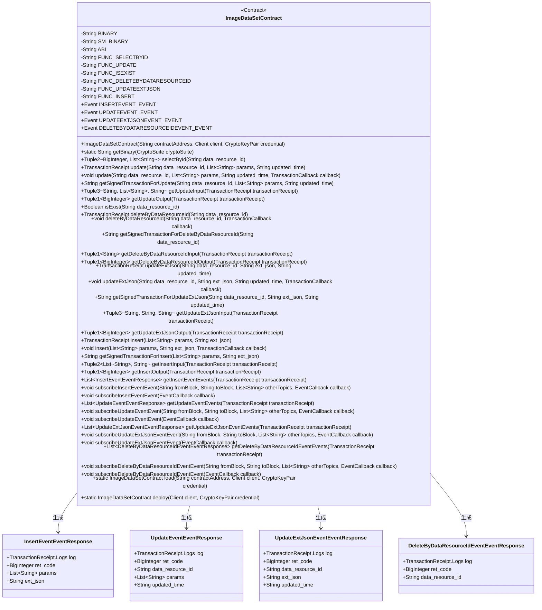

# 基础信息

|      |      |
|------|------|
| 名称 | ImageDataSetContract |
| 编码语言 | .java |
| 代码路径 | WeFe/union/union-service/src/main/java/com/welab/wefe/union/service/contract/ImageDataSetContract.java |
| 包名 | com.welab.wefe.union.service.contract |
| 依赖项 | ['java.math.BigInteger', 'java.util.ArrayList', 'java.util.Arrays', 'java.util.Collections', 'java.util.List', 'org.fisco.bcos.sdk.abi.FunctionReturnDecoder', 'org.fisco.bcos.sdk.abi.TypeReference', 'org.fisco.bcos.sdk.abi.datatypes.Bool', 'org.fisco.bcos.sdk.abi.datatypes.DynamicArray', 'org.fisco.bcos.sdk.abi.datatypes.Event', 'org.fisco.bcos.sdk.abi.datatypes.Function', 'org.fisco.bcos.sdk.abi.datatypes.Type', 'org.fisco.bcos.sdk.abi.datatypes.Utf8String', 'org.fisco.bcos.sdk.abi.datatypes.generated.Int256', 'org.fisco.bcos.sdk.abi.datatypes.generated.tuples.generated.Tuple1', 'org.fisco.bcos.sdk.abi.datatypes.generated.tuples.generated.Tuple2', 'org.fisco.bcos.sdk.abi.datatypes.generated.tuples.generated.Tuple3', 'org.fisco.bcos.sdk.client.Client', 'org.fisco.bcos.sdk.contract.Contract', 'org.fisco.bcos.sdk.crypto.CryptoSuite', 'org.fisco.bcos.sdk.crypto.keypair.CryptoKeyPair', 'org.fisco.bcos.sdk.eventsub.EventCallback', 'org.fisco.bcos.sdk.model.CryptoType', 'org.fisco.bcos.sdk.model.TransactionReceipt', 'org.fisco.bcos.sdk.model.callback.TransactionCallback', 'org.fisco.bcos.sdk.transaction.model.exception.ContractException'] |
| 概述说明 | ImageDataSetContract是一个智能合约类，用于管理图像数据集。主要功能包括：1. 数据操作：- selectById：根据ID查询数据- update：更新数据- insert：插入新数据- deleteByDataResourceId：删除数据- updateExtJson：更新扩展JSON数据2. 状态检查：- isExist：检查数据是否存在3. 事件通知：- 插入、更新、删除等操作都有对应的事件通知合约使用ABI编码与区块链交互，支持ECDSA和SM2两种加密算法。提供了同步和异步两种调用方式，并支持交易回执解析和事件订阅功能。 |

# 说明

ImageDataSetContract 是一个智能合约类，主要用于管理图像数据集。以下是该合约的详细总结描述：

1. 合约功能
- 提供图像数据集的增删改查功能
- 支持数据资源ID查询、存在性检查
- 支持数据集更新和扩展JSON更新
- 支持数据集删除

2. 主要方法
- selectById: 根据数据资源ID查询数据集
- update: 更新数据集
- isExist: 检查数据资源是否存在
- deleteByDataResourceId: 删除指定数据资源
- updateExtJson: 更新扩展JSON数据
- insert: 插入新数据集

3. 事件
- insertEvent: 数据集插入事件
- updateEvent: 数据集更新事件
- updateExtJsonEvent: 扩展JSON更新事件
- deleteByDataResourceIdEvent: 数据删除事件

4. 技术特性
- 支持ECDSA和SM2两种加密算法
- 提供同步和异步交易执行方式
- 包含输入输出参数解析功能
- 支持事件订阅和回调

5. 数据结构
- 使用动态数组存储字符串参数
- 使用BigInteger返回操作结果代码
- 使用Tuple封装多返回值

6. 部署方式
- 可通过load方法加载已有合约
- 可通过deploy方法部署新合约

该合约设计用于区块链环境，提供完整的图像数据集管理功能，支持多种操作方式和事件通知机制。

# 类列表 Class Summary

| 名称   | 类型  | 说明 |
|-------|------|-------------|
| ImageDataSetContract | class | ImageDataSetContract是一个智能合约类，用于管理图像数据集。主要功能包括：1. 核心功能：- 查询数据(selectById)- 更新数据(update)- 检查数据是否存在(isExist) - 删除数据(deleteByDataResourceId)- 更新扩展JSON数据(updateExtJson)- 插入新数据(insert)2. 事件通知：- 插入事件(insertEvent)- 更新事件(updateEvent)- 更新JSON事件(updateExtJsonEvent)- 删除事件(deleteByDataResourceIdEvent)3. 技术特性：- 支持国密(SM)和ECDSA两种加密算法- 提供同步和异步交易方式- 包含完整的ABI定义- 支持事件订阅功能4. 数据结构：- 使用字符串数组存储参数- 使用BigInteger返回状态码- 支持扩展JSON字段5. 辅助功能：- 提供交易输入输出解析方法- 支持事件响应处理- 包含合约部署功能该合约适用于需要管理结构化图像数据的区块链应用场景。 |

## 类 ImageDataSetContract

|      |      |
|------|------|
| 访问范围 | @SuppressWarnings("unchecked");public |
| 类型 | class |
| 名称 | ImageDataSetContract |
| 说明 | ImageDataSetContract是一个智能合约类，用于管理图像数据集。主要功能包括：1. 核心功能：- 查询数据(selectById)- 更新数据(update)- 检查数据是否存在(isExist) - 删除数据(deleteByDataResourceId)- 更新扩展JSON数据(updateExtJson)- 插入新数据(insert)2. 事件通知：- 插入事件(insertEvent)- 更新事件(updateEvent)- 更新JSON事件(updateExtJsonEvent)- 删除事件(deleteByDataResourceIdEvent)3. 技术特性：- 支持国密(SM)和ECDSA两种加密算法- 提供同步和异步交易方式- 包含完整的ABI定义- 支持事件订阅功能4. 数据结构：- 使用字符串数组存储参数- 使用BigInteger返回状态码- 支持扩展JSON字段5. 辅助功能：- 提供交易输入输出解析方法- 支持事件响应处理- 包含合约部署功能该合约适用于需要管理结构化图像数据的区块链应用场景。 |

### UML类图

这段代码定义了一个名为ImageDataSetContract的智能合约类，主要用于管理图像数据集。合约包含多个功能方法如数据查询(selectById)、更新(update)、存在性检查(isExist)、删除(deleteByDataResourceId)等，并定义了4种事件类型用于记录操作日志。类图展示了合约的主要结构，包括常量字段、方法、嵌套事件响应类以及它们之间的关系。该合约支持普通交易和异步回调操作，提供了完整的ABI接口和二进制代码，可以部署到区块链上执行。

### 内部方法调用关系图

这段代码是一个智能合约类ImageDataSetContract，主要功能包括数据集的增删改查操作。流程图展示了类结构关系：包含常量定义、核心业务方法（如数据操作和查询）、事件定义及其响应类。关键流程是数据修改方法（update/delete/insert）会触发相应事件，而selectById和isExist提供只读查询功能。所有方法都通过ABI定义与区块链交互，支持普通和国密两种二进制格式。

### 字段列表 Field List

| 名称  | 类型  | 说明 |
|-------|-------|------|
| BINARY_ARRAY = {"60806040523480156200001157600080fd5b506110016000806101000a81548173ffffffffffffffffffffffffffffffffffffffff021916908373ffffffffffffffffffffffffffffffffffffffff1602179055506000809054906101000a900473ffffffffffffffffffffffffffffffffffffffff1673ffffffffffffffffffffffffffffffffffffffff166356004b6a6040805190810160405280600e81526020017f696d6167655f646174615f7365740000000000000000000000000000000000008152506040518263ffffffff167c0100000000000000000000000000000000000000000000000000000000028152600401620001019190620002bc565b602060405180830381600087803b1580156200011c57600080fd5b505af115801562000131573d6000803e3d6000fd5b505050506040513d601f19601f8201168201806040525062000157919081019062000174565b5062000366565b60006200016c825162000315565b905092915050565b6000602082840312156200018757600080fd5b600062000197848285016200015e565b91505092915050565b6000620001ad826200030a565b808452620001c38160208601602086016200031f565b620001ce8162000355565b602085010191505092915050565b6000600682527f6669785f696400000000000000000000000000000000000000000000000000006020830152604082019050919050565b6000607382527f646174615f7265736f757263655f69642c666f725f6a6f625f747970652c6c6160208301527f62656c5f6c6973742c6c6162656c65645f636f756e742c6c6162656c5f636f6d60408301527f706c657465642c66696c655f73697a652c637265617465645f74696d652c757060608301527f64617465645f74696d652c6578745f6a736f6e00000000000000000000000000608083015260a082019050919050565b60006060820190508181036000830152620002d88184620001a0565b90508181036020830152620002ed81620001dc565b90508181036040830152620003028162000213565b905092915050565b600081519050919050565b6000819050919050565b60005b838110156200033f57808201518184015260208101905062000322565b838111156200034f576000848401525b50505050565b6000601f19601f8301169050919050565b61425d80620003766000396000f300608060405260043610610078576000357c0100000000000000000000000000000000000000000000000000000000900463ffffffff16806326b477fd1461007d578063456cdeff146100bb5780634d3d096b146100f85780635d536a931461013557806363964aa31461017257806397291150146101af575b600080fd5b34801561008957600080fd5b506100a4600480360361009f9190810190613565565b6101ec565b6040516100b2929190613a87565b60405180910390f35b3480156100c757600080fd5b506100e260048036036100dd91908101906135e7565b61061e565b6040516100ef9190613a6c565b60405180910390f35b34801561010457600080fd5b5061011f600480360361011a9190810190613565565b610e6c565b60405161012c9190613a51565b60405180910390f35b34801561014157600080fd5b5061015c60048036036101579190810190613565565b611230565b6040516101699190613a6c565b60405180910390f35b34801561017e57600080fd5b506101996004803603610194919081019061367e565b61160c565b6040516101a69190613a6c565b60405180910390f35b3480156101bb57600080fd5b506101d660048036036101d1919081019061342c565b611b4e565b6040516101e39190613a6c565b60405180910390f35b6000606060008060008060009054906101000a900473ffffffffffffffffffffffffffffffffffffffff1673ffffffffffffffffffffffffffffffffffffffff1663f23f63c96040805190810160405280600e81526020017f696d6167655f646174615f7365740000000000000000000000000000000000008152506040518263ffffffff167c01000000000000000000000000000000000000000000000000000000000281526004016102a09190613be0565b602060405180830381600087803b1580156102ba57600080fd5b505af11580156102ce573d6000803e3d6000fd5b505050506040513d601f19601f820116820180604052506102f29190810190613513565b92508273ffffffffffffffffffffffffffffffffffffffff16637857d7c96040518163ffffffff167c0100000000000000000000000000000000000000000000000000000000028152600401602060405180830381600087803b15801561035857600080fd5b505af115801561036c573d6000803e3d6000fd5b505050506040513d601f19601f820116820180604052506103909190810190613498565b91508173ffffffffffffffffffffffffffffffffffffffff1663cd30a1d1876040518263ffffffff167c01000000000000000000000000000000000000000000000000000000000281526004016103e79190614007565b600060405180830381600087803b15801561040157600080fd5b505af1158015610415573d6000803e3d6000fd5b505050508273ffffffffffffffffffffffffffffffffffffffff1663e8434e396040805190810160405280600a81526020017f6669785f69645f30303700000000000000000000000000000000000000000000815250846040518363ffffffff167c01000000000000000000000000000000000000000000000000000000000281526004016104a5929190613c02565b602060405180830381600087803b1580156104bf57600080fd5b505af11580156104d3573d6000803e3d6000fd5b505050506040513d601f19601f820116820180604052506104f791908101906134c1565b90508073ffffffffffffffffffffffffffffffffffffffff1663949d225d6040518163ffffffff167c0100000000000000000000000000000000000000000000000000000000028152600401602060405180830381600087803b15801561055d57600080fd5b505af1158015610571573d6000803e3d6000fd5b505050506040513d601f19601f82011682018060405250610595919081019061353c565b60001415610603577ffffffffffffffffffffffffffffffffffffffffffffffffffffffffffffffffd60006040519080825280602002602001820160405280156105f357816020015b60608152602001906001900390816105de5790505b5081915080905094509450610616565b600061060e8261251c565b819150945094505b505050915091565b6000806000806000806000945061063489610e6c565b15156106a2577ffffffffffffffffffffffffffffffffffffffffffffffffffffffffffffffffd94507fe51e5a2c44f24c199548148fdf95a942915d28d8fe38f362720cc6b0557cc51d858a8a8a6040516106929493929190613b2c565b60405180910390a1849550610e60565b6000809054906101000a900473ffffffffffffffffffffffffffffffffffffffff1673ffffffffffffffffffffffffffffffffffffffff1663f23f63c96040805190810160405280600e81526020017f696d6167655f646174615f7365740000000000000000000000000000000000008152506040518263ffffffff167c010000000000000000000000000000000000000000000000000000000002815260040161074d9190613be0565b602060405180830381600087803b15801561076757600080fd5b505af115801561077b573d6000803e3d6000fd5b505050506040513d601f19601f8201168201806040525061079f9190810190613513565b93508373ffffffffffffffffffffffffffffffffffffffff16637857d7c96040518163ffffffff167c0100000000000000000000000000000000000000000000000000000000028152600401602060405180830381600087803b15801561080557600080fd5b505af1158015610819573d6000803e3d6000fd5b505050506040513d601f19601f8201168201806040525061083d9190810190613498565b92508273ffffffffffffffffffffffffffffffffffffffff1663cd30a1d18a6040518263ffffffff167c01000000000000000000000000000000000000000000000000000000000281526004016108949190614007565b600060405180830381600087803b1580156108ae57600080fd5b505af11580156108c2573d6000803e3d6000fd5b505050508373ffffffffffffffffffffffffffffffffffffffff166313db93466040518163ffffffff167c0100000000000000000000000000000000000000000000000000000000028152600401602060405180830381600087803b15801561092a57600080fd5b505af115801561093e573d6000803e3d6000fd5b505050506040513d601f19601f8201168201806040525061096291908101906134ea565b91508173ffffffffffffffffffffffffffffffffffffffff1663e942b51689600081518110151561098f57fe5b906020019060200201516040518263ffffffff167c01000000000000000000000000000000000000000000000000000000000281526004016109d19190613ed3565b600060405180830381600087803b1580156109eb57600080fd5b505af11580156109ff573d6000803e3d6000fd5b505050508173ffffffffffffffffffffffffffffffffffffffff1663e942b516896001815181101515610a2e57fe5b906020019060200201516040518263ffffffff167c0100000000000000000000000000000000000000000000000000000000028152600401610a709190613dd4565b600060405180830381600087803b158015610a8a57600080fd5b505af1158015610a9e573d6000803e3d6000fd5b505050508173ffffffffffffffffffffffffffffffffffffffff1663e942b516896002815181101515610acd57fe5b906020019060200201516040518263ffffffff167c0100000000000000000000000000000000000000000000000000000000028152600401610b0f9190613f28565b600060405180830381600087803b158015610b2957600080fd5b505af1158015610b3d573d6000803e3d6000fd5b505050508173ffffffffffffffffffffffffffffffffffffffff1663e942b516896003815181101515610b6c57fe5b906020019060200201516040518263ffffffff167c0100000000000000000000000000000000000000000000000000000000028152600401610bae9190613e29565b600060405180830381600087803b158015610bc857600080fd5b505af1158015610bdc573d6000803e3d6000fd5b505050508173ffffffffffffffffffffffffffffffffffffffff1663e942b516896004815181101515610c0b57fe5b906020019060200201516040518263ffffffff167c0100000000000000000000000000000000000000000000000000000000028152600401610c4d9190613f7d565b600060405180830381600087803b158015610c6757600080fd5b505af1158015610c7b573d6000803e3d6000fd5b505050508173ffffffffffffffff","ffffffffffffffffffffffff1663e942b516886040518263ffffffff167c0100000000000000000000000000000000000000000000000000000000028152600401610cd49190613d7f565b600060405180830381600087803b158015610cee57600080fd5b505af1158015610d02573d6000803e3d6000fd5b505050508373ffffffffffffffffffffffffffffffffffffffff1663bf2b70a16040805190810160405280600a81526020017f6669785f69645f3030370000000000000000000000000000000000000000000081525084866040518463ffffffff167c0100000000000000000000000000000000000000000000000000000000028152600401610d9493929190613c62565b602060405180830381600087803b158015610dae57600080fd5b505af1158015610dc2573d6000803e3d6000fd5b505050506040513d601f19601f82011682018060405250610de6919081019061353c565b9050600181121515610dfb5760009450610e1f565b7ffffffffffffffffffffffffffffffffffffffffffffffffffffffffffffffffe94505b7fe51e5a2c44f24c199548148fdf95a942915d28d8fe38f362720cc6b0557cc51d858a8a8a604051610e549493929190613b2c565b60405180910390a18495505b50505050509392505050565b6000806000806000809054906101000a900473ffffffffffffffffffffffffffffffffffffffff1673ffffffffffffffffffffffffffffffffffffffff1663f23f63c96040805190810160405280600e81526020017f696d6167655f646174615f7365740000000000000000000000000000000000008152506040518263ffffffff167c0100000000000000000000000000000000000000000000000000000000028152600401610f1d9190613be0565b602060405180830381600087803b158015610f3757600080fd5b505af1158015610f4b573d6000803e3d6000fd5b505050506040513d601f19601f82011682018060405250610f6f9190810190613513565b92508273ffffffffffffffffffffffffffffffffffffffff16637857d7c96040518163ffffffff167c0100000000000000000000000000000000000000000000000000000000028152600401602060405180830381600087803b158015610fd557600080fd5b505af1158015610fe9573d6000803e3d6000fd5b505050506040513d601f19601f8201168201806040525061100d9190810190613498565b91508173ffffffffffffffffffffffffffffffffffffffff1663cd30a1d1866040518263ffffffff167c01000000000000000000000000000000000000000000000000000000000281526004016110649190614007565b600060405180830381600087803b15801561107e57600080fd5b505af1158015611092573d6000803e3d6000fd5b505050508273ffffffffffffffffffffffffffffffffffffffff1663e8434e396040805190810160405280600a81526020017f6669785f69645f30303700000000000000000000000000000000000000000000815250846040518363ffffffff167c0100000000000000000000000000000000000000000000000000000000028152600401611122929190613c02565b602060405180830381600087803b15801561113c57600080fd5b505af1158015611150573d6000803e3d6000fd5b505050506040513d601f19601f8201168201806040525061117491908101906134c1565b905060008173ffffffffffffffffffffffffffffffffffffffff1663949d225d6040518163ffffffff167c0100000000000000000000000000000000000000000000000000000000028152600401602060405180830381600087803b1580156111dc57600080fd5b505af11580156111f0573d6000803e3d6000fd5b505050506040513d601f19601f82011682018060405250611214919081019061353c565b11156112235760019350611228565b600093505b505050919050565b600080600080600080935061124486610e6c565b151561128b577fd22fb9033b9b4d290a6e3f3ff139198183826a80f0850ac55f195cc8705cf2ca848760405161127b929190613afc565b60405180910390a1839450611603565b6000809054906101000a900473ffffffffffffffffffffffffffffffffffffffff1673ffffffffffffffffffffffffffffffffffffffff1663f23f63c96040805190810160405280600e81526020017f696d6167655f646174615f7365740000000000000000000000000000000000008152506040518263ffffffff167c01000000000000000000000000000000000000000000000000000000000281526004016113369190613be0565b602060405180830381600087803b15801561135057600080fd5b505af1158015611364573d6000803e3d6000fd5b505050506040513d601f19601f820116820180604052506113889190810190613513565b92508273ffffffffffffffffffffffffffffffffffffffff16637857d7c96040518163ffffffff167c0100000000000000000000000000000000000000000000000000000000028152600401602060405180830381600087803b1580156113ee57600080fd5b505af1158015611402573d6000803e3d6000fd5b505050506040513d601f19601f820116820180604052506114269190810190613498565b91508173ffffffffffffffffffffffffffffffffffffffff1663cd30a1d1876040518263ffffffff167c010000000000000000000000000000000000000000000000000000000002815260040161147d9190614007565b600060405180830381600087803b15801561149757600080fd5b505af11580156114ab573d6000803e3d6000fd5b505050508273ffffffffffffffffffffffffffffffffffffffff166328bb21176040805190810160405280600a81526020017f6669785f69645f30303700000000000000000000000000000000000000000000815250846040518363ffffffff167c010000000000000000000000000000000000000000000000000000000002815260040161153b929190613c02565b602060405180830381600087803b15801561155557600080fd5b505af1158015611569573d6000803e3d6000fd5b505050506040513d601f19601f8201168201806040525061158d919081019061353c565b90506001811215156115a257600093506115c6565b7ffffffffffffffffffffffffffffffffffffffffffffffffffffffffffffffffe93505b7fd22fb9033b9b4d290a6e3f3ff139198183826a80f0850ac55f195cc8705cf2ca84876040516115f7929190613afc565b60405180910390a18394505b50505050919050565b6000806000806000806000809054906101000a900473ffffffffffffffffffffffffffffffffffffffff1673ffffffffffffffffffffffffffffffffffffffff1663f23f63c96040805190810160405280600e81526020017f696d6167655f646174615f7365740000000000000000000000000000000000008152506040518263ffffffff167c01000000000000000000000000000000000000000000000000000000000281526004016116c09190613be0565b602060405180830381600087803b1580156116da57600080fd5b505af11580156116ee573d6000803e3d6000fd5b505050506040513d601f19601f820116820180604052506117129190810190613513565b94508473ffffffffffffffffffffffffffffffffffffffff16637857d7c96040518163ffffffff167c0100000000000000000000000000000000000000000000000000000000028152600401602060405180830381600087803b15801561177857600080fd5b505af115801561178c573d6000803e3d6000fd5b505050506040513d601f19601f820116820180604052506117b09190810190613498565b93508373ffffffffffffffffffffffffffffffffffffffff1663cd30a1d18a6040518263ffffffff167c01000000000000000000000000000000000000000000000000000000000281526004016118079190614007565b600060405180830381600087803b15801561182157600080fd5b505af1158015611835573d6000803e3d6000fd5b505050508473ffffffffffffffffffffffffffffffffffffffff166313db93466040518163ffffffff167c0100000000000000000000000000000000000000000000000000000000028152600401602060405180830381600087803b15801561189d57600080fd5b505af11580156118b1573d6000803e3d6000fd5b505050506040513d601f19601f820116820180604052506118d591908101906134ea565b92508273ffffffffffffffffffffffffffffffffffffffff1663e942b516896040518263ffffffff167c010000000000000000000000000000000000000000000000000000000002815260040161192c9190613cc0565b600060405180830381600087803b15801561194657600080fd5b505af115801561195a573d6000803e3d6000fd5b505050508273ffffffffffffffffffffffffffffffffffffffff1663e942b516886040518263ffffffff167c01000000000000000000000000000000000000000000000000000000000281526004016119b39190613d7f565b600060405180830381600087803b1580156119cd57600080fd5b505af11580156119e1573d6000803e3d6000fd5b505050508473ffffffffffffffffffffffffffffffffffffffff1663bf2b70a16040805190810160405280600a81526020017f6669785f69645f3030370000000000000000000000000000000000000000000081525085876040518463ffffffff167c0100000000000000000000000000000000000000000000000000000000028152600401611a7393929190613c62565b602060405180830381600087803b158015611a8d57600080fd5b505af1158015611aa1573d6000803e3d6000fd5b505050506040513d601f19601f82011682018060405250611ac5919081019061353c565b915060009050600182121515611ade5760009050611b02565b7ffffffffffffffffffffffffffffffffffffffffffffffffffffffffffffffffe90505b7f91fa9d6109b9b8b47733f98f4b6858346683ebdf73ba3c2f98b90c0d352f83e1818a8a8a604051611b379493929190613b86565b60405180910390a180955050505050509392505050565b6000806000806000809350611b7a876000815181101515611b6b57fe5b90602001906020020151610e6c565b15611be5577fffffffffffffffffffffffffffffffffffffffffffffffffffffffffffffffff93507f5157dc1ab0b55c7621be94a34b2ae4228f7d16e8271628060cc027b1a513b12f848888604051611bd593929190613ab7565b60405180910390a1839450612512565b6000809054906101000a900473ffffffffffffffffffffffffffffffffffffffff1673ffffffffffffffffffffffffffffffffffffffff1663f23f63c96040805190810160405280600e81526020017f696d6167655f646174615f7365740000000000000000000000000000000000008152506040518263ffffffff167c0100000000000000000000000000000000000000000000000000000000028152600401611c90","9190613be0565b602060405180830381600087803b158015611caa57600080fd5b505af1158015611cbe573d6000803e3d6000fd5b505050506040513d601f19601f82011682018060405250611ce29190810190613513565b92508273ffffffffffffffffffffffffffffffffffffffff166313db93466040518163ffffffff167c0100000000000000000000000000000000000000000000000000000000028152600401602060405180830381600087803b158015611d4857600080fd5b505af1158015611d5c573d6000803e3d6000fd5b505050506040513d601f19601f82011682018060405250611d8091908101906134ea565b91508173ffffffffffffffffffffffffffffffffffffffff1663e942b5166040805190810160405280600a81526020017f6669785f69645f303037000000000000000000000000000000000000000000008152506040518263ffffffff167c0100000000000000000000000000000000000000000000000000000000028152600401611e0c9190613cf5565b600060405180830381600087803b158015611e2657600080fd5b505af1158015611e3a573d6000803e3d6000fd5b505050508173ffffffffffffffffffffffffffffffffffffffff1663e942b516886000815181101515611e6957fe5b906020019060200201516040518263ffffffff167c0100000000000000000000000000000000000000000000000000000000028152600401611eab9190613fd2565b600060405180830381600087803b158015611ec557600080fd5b505af1158015611ed9573d6000803e3d6000fd5b505050508173ffffffffffffffffffffffffffffffffffffffff1663e942b516886001815181101515611f0857fe5b906020019060200201516040518263ffffffff167c0100000000000000000000000000000000000000000000000000000000028152600401611f4a9190613ed3565b600060405180830381600087803b158015611f6457600080fd5b505af1158015611f78573d6000803e3d6000fd5b505050508173ffffffffffffffffffffffffffffffffffffffff1663e942b516886002815181101515611fa757fe5b906020019060200201516040518263ffffffff167c0100000000000000000000000000000000000000000000000000000000028152600401611fe99190613dd4565b600060405180830381600087803b15801561200357600080fd5b505af1158015612017573d6000803e3d6000fd5b505050508173ffffffffffffffffffffffffffffffffffffffff1663e942b51688600381518110151561204657fe5b906020019060200201516040518263ffffffff167c01000000000000000000000000000000000000000000000000000000000281526004016120889190613f28565b600060405180830381600087803b1580156120a257600080fd5b505af11580156120b6573d6000803e3d6000fd5b505050508173ffffffffffffffffffffffffffffffffffffffff1663e942b5168860048151811015156120e557fe5b906020019060200201516040518263ffffffff167c01000000000000000000000000000000000000000000000000000000000281526004016121279190613e29565b600060405180830381600087803b15801561214157600080fd5b505af1158015612155573d6000803e3d6000fd5b505050508173ffffffffffffffffffffffffffffffffffffffff1663e942b51688600581518110151561218457fe5b906020019060200201516040518263ffffffff167c01000000000000000000000000000000000000000000000000000000000281526004016121c69190613f7d565b600060405180830381600087803b1580156121e057600080fd5b505af11580156121f4573d6000803e3d6000fd5b505050508173ffffffffffffffffffffffffffffffffffffffff1663e942b51688600681518110151561222357fe5b906020019060200201516040518263ffffffff167c01000000000000000000000000000000000000000000000000000000000281526004016122659190613e7e565b600060405180830381600087803b15801561227f57600080fd5b505af1158015612293573d6000803e3d6000fd5b505050508173ffffffffffffffffffffffffffffffffffffffff1663e942b5168860078151811015156122c257fe5b906020019060200201516040518263ffffffff167c01000000000000000000000000000000000000000000000000000000000281526004016123049190613d4a565b600060405180830381600087803b15801561231e57600080fd5b505af1158015612332573d6000803e3d6000fd5b505050508173ffffffffffffffffffffffffffffffffffffffff1663e942b516876040518263ffffffff167c010000000000000000000000000000000000000000000000000000000002815260040161238b9190613cc0565b600060405180830381600087803b1580156123a557600080fd5b505af11580156123b9573d6000803e3d6000fd5b505050508273ffffffffffffffffffffffffffffffffffffffff166331afac366040805190810160405280600a81526020017f6669785f69645f30303700000000000000000000000000000000000000000000815250846040518363ffffffff167c0100000000000000000000000000000000000000000000000000000000028152600401612449929190613c32565b602060405180830381600087803b15801561246357600080fd5b505af1158015612477573d6000803e3d6000fd5b505050506040513d601f19601f8201168201806040525061249b919081019061353c565b905060018114156124af57600093506124d3565b7ffffffffffffffffffffffffffffffffffffffffffffffffffffffffffffffffe93505b7f5157dc1ab0b55c7621be94a34b2ae4228f7d16e8271628060cc027b1a513b12f84888860405161250693929190613ab7565b60405180910390a18394505b5050505092915050565b60608060008060608573ffffffffffffffffffffffffffffffffffffffff1663949d225d6040518163ffffffff167c0100000000000000000000000000000000000000000000000000000000028152600401602060405180830381600087803b15801561258857600080fd5b505af115801561259c573d6000803e3d6000fd5b505050506040513d601f19601f820116820180604052506125c0919081019061353c565b6040519080825280602002602001820160405280156125f357816020015b60608152602001906001900390816125de5790505b509350600092505b8573ffffffffffffffffffffffffffffffffffffffff1663949d225d6040518163ffffffff167c0100000000000000000000000000000000000000000000000000000000028152600401602060405180830381600087803b15801561265f57600080fd5b505af1158015612673573d6000803e3d6000fd5b505050506040513d601f19601f82011682018060405250612697919081019061353c565b83121561300f578573ffffffffffffffffffffffffffffffffffffffff1663846719e0846040518263ffffffff167c01000000000000000000000000000000000000000000000000000000000281526004016126f39190613a6c565b602060405180830381600087803b15801561270d57600080fd5b505af1158015612721573d6000803e3d6000fd5b505050506040513d601f19601f8201168201806040525061274591908101906134ea565b91506128376127fc8373ffffffffffffffffffffffffffffffffffffffff16639c981fcb6040518163ffffffff167c01000000000000000000000000000000000000000000000000000000000281526004016127a090613fb2565b600060405180830381600087803b1580156127ba57600080fd5b505af11580156127ce573d6000803e3d6000fd5b505050506040513d6000823e3d601f19601f820116820180604052506127f791908101906135a6565b61301b565b6040805190810160405280600181526020017f7c00000000000000000000000000000000000000000000000000000000000000815250613074565b90506128f4816128ef8473ffffffffffffffffffffffffffffffffffffffff16639c981fcb6040518163ffffffff167c010000000000000000000000000000000000000000000000000000000002815260040161289390613eb3565b600060405180830381600087803b1580156128ad57600080fd5b505af11580156128c1573d6000803e3d6000fd5b505050506040513d6000823e3d601f19601f820116820180604052506128ea91908101906135a6565b61301b565b613074565b9050612935816040805190810160405280600181526020017f7c00000000000000000000000000000000000000000000000000000000000000815250613074565b90506129f2816129ed8473ffffffffffffffffffffffffffffffffffffffff16639c981fcb6040518163ffffffff167c010000000000000000000000000000000000000000000000000000000002815260040161299190613db4565b600060405180830381600087803b1580156129ab57600080fd5b505af11580156129bf573d6000803e3d6000fd5b505050506040513d6000823e3d601f19601f820116820180604052506129e891908101906135a6565b61301b565b613074565b9050612a33816040805190810160405280600181526020017f7c00000000000000000000000000000000000000000000000000000000000000815250613074565b9050612af081612aeb8473ffffffffffffffffffffffffffffffffffffffff16639c981fcb6040518163ffffffff167c0100000000000000000000000000000000000000000000000000000000028152600401612a8f90613f08565b600060405180830381600087803b158015612aa957600080fd5b505af1158015612abd573d6000803e3d6000fd5b505050506040513d6000823e3d601f19601f82011682018060405250612ae691908101906135a6565b61301b565b613074565b9050612b31816040805190810160405280600181526020017f7c00000000000000000000000000000000000000000000000000000000000000815250613074565b9050612bee81612be98473ffffffffffffffffffffffffffffffffffffffff16639c981fcb6040518163ffffffff167c0100000000000000000000000000000000000000000000000000000000028152600401612b8d90613e09565b600060405180830381600087803b158015612ba757600080fd5b505af1158015612bbb573d6000803e3d6000fd5b505050506040513d6000823e3d601f19601f82011682018060405250612be491908101906135a6565b61301b565b613074565b9050612c2f816040805190810160405280600181526020017f7c00000000000000000000000000000000000000000000000000000000000000815250613074565b9050612cec81612ce78473ffffffffffffffffffffffffffffffffffffffff16639c981fcb6040518163ffffffff167c0100000000000000000000000000000000000000000000000000000000028152600401612c8b90613f5d","565b600060405180830381600087803b158015612ca557600080fd5b505af1158015612cb9573d6000803e3d6000fd5b505050506040513d6000823e3d601f19601f82011682018060405250612ce291908101906135a6565b61301b565b613074565b9050612d2d816040805190810160405280600181526020017f7c00000000000000000000000000000000000000000000000000000000000000815250613074565b9050612dea81612de58473ffffffffffffffffffffffffffffffffffffffff16639c981fcb6040518163ffffffff167c0100000000000000000000000000000000000000000000000000000000028152600401612d8990613e5e565b600060405180830381600087803b158015612da357600080fd5b505af1158015612db7573d6000803e3d6000fd5b505050506040513d6000823e3d601f19601f82011682018060405250612de091908101906135a6565b61301b565b613074565b9050612e2b816040805190810160405280600181526020017f7c00000000000000000000000000000000000000000000000000000000000000815250613074565b9050612ee881612ee38473ffffffffffffffffffffffffffffffffffffffff16639c981fcb6040518163ffffffff167c0100000000000000000000000000000000000000000000000000000000028152600401612e8790613d2a565b600060405180830381600087803b158015612ea157600080fd5b505af1158015612eb5573d6000803e3d6000fd5b505050506040513d6000823e3d601f19601f82011682018060405250612ede91908101906135a6565b61301b565b613074565b9050612f29816040805190810160405280600181526020017f7c00000000000000000000000000000000000000000000000000000000000000815250613074565b9050612fe681612fe18473ffffffffffffffffffffffffffffffffffffffff16639c981fcb6040518163ffffffff167c0100000000000000000000000000000000000000000000000000000000028152600401612f8590613ca0565b600060405180830381600087803b158015612f9f57600080fd5b505af1158015612fb3573d6000803e3d6000fd5b505050506040513d6000823e3d601f19601f82011682018060405250612fdc91908101906135a6565b61301b565b613074565b9050808484815181101515612ff757fe5b906020019060200201819052508260010192506125fb565b83945050505050919050565b6060600061302883613245565b141561306b576040805190810160405280600181526020017f2000000000000000000000000000000000000000000000000000000000000000815250905061306f565b8190505b919050565b606080606080606060008088955087945084518651016040519080825280601f01601f1916602001820160405280156130bc5781602001602082028038833980820191505090505b50935083925060009150600090505b855181101561317e5785818151811015156130e257fe5b9060200101517f010000000000000000000000000000000000000000000000000000000000000090047f010000000000000000000000000000000000000000000000000000000000000002838380600101945081518110151561314157fe5b9060200101907effffffffffffffffffffffffffffffffffffffffffffffffffffffffffffff1916908160001a90535080806001019150506130cb565b600090505b845181101561323657848181518110151561319a57fe5b9060200101517f010000000000000000000000000000000000000000000000000000000000000090047f01000000000000000000000000000000000000000000000000000000000000000283838060010194508151811015156131f957fe5b9060200101907effffffffffffffffffffffffffffffffffffffffffffffffffffffffffffff1916908160001a9053508080600101915050613183565b83965050505050505092915050565b600081519050919050565b600082601f830112151561326357600080fd5b813561327661327182614069565b61403c565b9150818183526020840193506020810190508360005b838110156132bc57813586016132a2888261332a565b84526020840193506020830192505060018101905061328c565b5050505092915050565b60006132d2825161415a565b905092915050565b60006132e6825161416c565b905092915050565b60006132fa825161417e565b905092915050565b600061330e8251614190565b905092915050565b600061332282516141a2565b905092915050565b600082601f830112151561333d57600080fd5b813561335061334b82614091565b61403c565b9150808252602083016020830185838301111561336c57600080fd5b6133778382846141d0565b50505092915050565b600082601f830112151561339357600080fd5b81356133a66133a1826140bd565b61403c565b915080825260208301602083018583830111156133c257600080fd5b6133cd8382846141d0565b50505092915050565b600082601f83011215156133e957600080fd5b81516133fc6133f7826140bd565b61403c565b9150808252602083016020830185838301111561341857600080fd5b6134238382846141df565b50505092915050565b6000806040838503121561343f57600080fd5b600083013567ffffffffffffffff81111561345957600080fd5b61346585828601613250565b925050602083013567ffffffffffffffff81111561348257600080fd5b61348e85828601613380565b9150509250929050565b6000602082840312156134aa57600080fd5b60006134b8848285016132c6565b91505092915050565b6000602082840312156134d357600080fd5b60006134e1848285016132da565b91505092915050565b6000602082840312156134fc57600080fd5b600061350a848285016132ee565b91505092915050565b60006020828403121561352557600080fd5b600061353384828501613302565b91505092915050565b60006020828403121561354e57600080fd5b600061355c84828501613316565b91505092915050565b60006020828403121561357757600080fd5b600082013567ffffffffffffffff81111561359157600080fd5b61359d84828501613380565b91505092915050565b6000602082840312156135b857600080fd5b600082015167ffffffffffffffff8111156135d257600080fd5b6135de848285016133d6565b91505092915050565b6000806000606084860312156135fc57600080fd5b600084013567ffffffffffffffff81111561361657600080fd5b61362286828701613380565b935050602084013567ffffffffffffffff81111561363f57600080fd5b61364b86828701613250565b925050604084013567ffffffffffffffff81111561366857600080fd5b61367486828701613380565b9150509250925092565b60008060006060848603121561369357600080fd5b600084013567ffffffffffffffff8111156136ad57600080fd5b6136b986828701613380565b935050602084013567ffffffffffffffff8111156136d657600080fd5b6136e286828701613380565b925050604084013567ffffffffffffffff8111156136ff57600080fd5b61370b86828701613380565b9150509250925092565b6000613720826140f6565b80845260208401935083602082028501613739856140e9565b60005b848110156137725783830388526137548383516137f5565b925061375f82614117565b915060208801975060018101905061373c565b508196508694505050505092915050565b61378c81614144565b82525050565b61379b816141ac565b82525050565b6137aa816141be565b82525050565b6137b981614150565b82525050565b60006137ca8261410c565b8084526137de8160208601602086016141df565b6137e781614212565b602085010191505092915050565b600061380082614101565b8084526138148160208601602086016141df565b61381d81614212565b602085010191505092915050565b6000600882527f6578745f6a736f6e0000000000000000000000000000000000000000000000006020830152604082019050919050565b6000600682527f6669785f696400000000000000000000000000000000000000000000000000006020830152604082019050919050565b6000600c82527f757064617465645f74696d6500000000000000000000000000000000000000006020830152604082019050919050565b6000600a82527f6c6162656c5f6c697374000000000000000000000000000000000000000000006020830152604082019050919050565b6000600f82527f6c6162656c5f636f6d706c6574656400000000000000000000000000000000006020830152604082019050919050565b6000600c82527f637265617465645f74696d6500000000000000000000000000000000000000006020830152604082019050919050565b6000600c82527f666f725f6a6f625f7479706500000000000000000000000000000000000000006020830152604082019050919050565b6000600d82527f6c6162656c65645f636f756e74000000000000000000000000000000000000006020830152604082019050919050565b6000600982527f66696c655f73697a6500000000000000000000000000000000000000000000006020830152604082019050919050565b6000601082527f646174615f7265736f757263655f6964000000000000000000000000000000006020830152604082019050919050565b6000602082019050613a666000830184613783565b92915050565b6000602082019050613a8160008301846137b0565b92915050565b6000604082019050613a9c60008301856137b0565b8181036020830152613aae8184613715565b90509392505050565b6000606082019050613acc60008301866137b0565b8181036020830152613ade8185613715565b90508181036040830152613af281846137bf565b9050949350505050565b6000604082019050613b1160008301856137b0565b8181036020830152613b2381846137bf565b90509392505050565b6000608082019050613b4160008301876137b0565b8181036020830152613b5381866137bf565b90508181036040830152613b678185613715565b90508181036060830152613b7b81846137bf565b905095945050505050565b6000608082019050613b9b60008301876137b0565b8181036020830152613bad81866137bf565b90508181036040830152613bc181856137bf565b90508181036060830152613bd581846137bf565b905095945050505050565b60006020820190508181036000830152613bfa81846137f5565b905092915050565b60006040820190508181036000830152613c1c81856137f5565b9050613c2b6020830184613792565b9392505050565b60006040820190508181036000830152613c4c81856137f5565b9050613c5b60208301846137a1565b9392505050565b60006060820190508181036000830152613c7c81866137f5565b9050613c8b60208301856137a1","565b613c986040830184613792565b949350505050565b60006020820190508181036000830152613cb98161382b565b9050919050565b60006040820190508181036000830152613cd98161382b565b90508181036020830152613ced81846137bf565b905092915050565b60006040820190508181036000830152613d0e81613862565b90508181036020830152613d2281846137f5565b905092915050565b60006020820190508181036000830152613d4381613899565b9050919050565b60006040820190508181036000830152613d6381613899565b90508181036020830152613d7781846137f5565b905092915050565b60006040820190508181036000830152613d9881613899565b90508181036020830152613dac81846137bf565b905092915050565b60006020820190508181036000830152613dcd816138d0565b9050919050565b60006040820190508181036000830152613ded816138d0565b90508181036020830152613e0181846137f5565b905092915050565b60006020820190508181036000830152613e2281613907565b9050919050565b60006040820190508181036000830152613e4281613907565b90508181036020830152613e5681846137f5565b905092915050565b60006020820190508181036000830152613e778161393e565b9050919050565b60006040820190508181036000830152613e978161393e565b90508181036020830152613eab81846137f5565b905092915050565b60006020820190508181036000830152613ecc81613975565b9050919050565b60006040820190508181036000830152613eec81613975565b90508181036020830152613f0081846137f5565b905092915050565b60006020820190508181036000830152613f21816139ac565b9050919050565b60006040820190508181036000830152613f41816139ac565b90508181036020830152613f5581846137f5565b905092915050565b60006020820190508181036000830152613f76816139e3565b9050919050565b60006040820190508181036000830152613f96816139e3565b90508181036020830152613faa81846137f5565b905092915050565b60006020820190508181036000830152613fcb81613a1a565b9050919050565b60006040820190508181036000830152613feb81613a1a565b90508181036020830152613fff81846137f5565b905092915050565b6000604082019050818103600083015261402081613a1a565b9050818103602083015261403481846137bf565b905092915050565b6000604051905081810181811067ffffffffffffffff8211171561405f57600080fd5b8060405250919050565b600067ffffffffffffffff82111561408057600080fd5b602082029050602081019050919050565b600067ffffffffffffffff8211156140a857600080fd5b601f19601f8301169050602081019050919050565b600067ffffffffffffffff8211156140d457600080fd5b601f19601f8301169050602081019050919050565b6000602082019050919050565b600081519050919050565b600081519050919050565b600081519050919050565b6000602082019050919050565b600073ffffffffffffffffffffffffffffffffffffffff82169050919050565b60008115159050919050565b6000819050919050565b600061416582614124565b9050919050565b600061417782614124565b9050919050565b600061418982614124565b9050919050565b600061419b82614124565b9050919050565b6000819050919050565b60006141b782614124565b9050919050565b60006141c982614124565b9050919050565b82818337600083830152505050565b60005b838110156141fd5780820151818401526020810190506141e2565b8381111561420c576000848401525b50505050565b6000601f19601f83011690509190505600a265627a7a723058205e90b5e6aba7d6738e3ce9e40693867be5f4669abdef4f80c8e18ec99d98d7466c6578706572696d656e74616cf50037"} | String[] | 这是一个名为BINARY_ARRAY的公共静态最终字符串数组，包含十六进制编码的智能合约字节码。 |
| SM_BINARY_ARRAY = {"60806040523480156200001157600080fd5b506110016000806101000a81548173ffffffffffffffffffffffffffffffffffffffff021916908373ffffffffffffffffffffffffffffffffffffffff1602179055506000809054906101000a900473ffffffffffffffffffffffffffffffffffffffff1673ffffffffffffffffffffffffffffffffffffffff1663c92a78016040805190810160405280600e81526020017f696d6167655f646174615f7365740000000000000000000000000000000000008152506040518263ffffffff167c0100000000000000000000000000000000000000000000000000000000028152600401620001019190620002bc565b602060405180830381600087803b1580156200011c57600080fd5b505af115801562000131573d6000803e3d6000fd5b505050506040513d601f19601f8201168201806040525062000157919081019062000174565b5062000366565b60006200016c825162000315565b905092915050565b6000602082840312156200018757600080fd5b600062000197848285016200015e565b91505092915050565b6000620001ad826200030a565b808452620001c38160208601602086016200031f565b620001ce8162000355565b602085010191505092915050565b6000607382527f646174615f7265736f757263655f69642c666f725f6a6f625f747970652c6c6160208301527f62656c5f6c6973742c6c6162656c65645f636f756e742c6c6162656c5f636f6d60408301527f706c657465642c66696c655f73697a652c637265617465645f74696d652c757060608301527f64617465645f74696d652c6578745f6a736f6e00000000000000000000000000608083015260a082019050919050565b6000600682527f6669785f696400000000000000000000000000000000000000000000000000006020830152604082019050919050565b60006060820190508181036000830152620002d88184620001a0565b90508181036020830152620002ed8162000285565b905081810360408301526200030281620001dc565b905092915050565b600081519050919050565b6000819050919050565b60005b838110156200033f57808201518184015260208101905062000322565b838111156200034f576000848401525b50505050565b6000601f19601f8301169050919050565b61425d80620003766000396000f300608060405260043610610078576000357c0100000000000000000000000000000000000000000000000000000000900463ffffffff16806315d0d6251461007d578063568fe885146100ba57806392a690d9146100f75780639eb03ade14610134578063e5dc357014610171578063e76d39af146101af575b600080fd5b34801561008957600080fd5b506100a4600480360361009f919081019061367e565b6101ec565b6040516100b19190613a6c565b60405180910390f35b3480156100c657600080fd5b506100e160048036036100dc9190810190613565565b61072e565b6040516100ee9190613a51565b60405180910390f35b34801561010357600080fd5b5061011e60048036036101199190810190613565565b610af2565b60405161012b9190613a6c565b60405180910390f35b34801561014057600080fd5b5061015b6004803603610156919081019061342c565b610ece565b6040516101689190613a6c565b60405180910390f35b34801561017d57600080fd5b5061019860048036036101939190810190613565565b61189c565b6040516101a6929190613a87565b60405180910390f35b3480156101bb57600080fd5b506101d660048036036101d191908101906135e7565b611cce565b6040516101e39190613a6c565b60405180910390f35b6000806000806000806000809054906101000a900473ffffffffffffffffffffffffffffffffffffffff1673ffffffffffffffffffffffffffffffffffffffff166359a48b656040805190810160405280600e81526020017f696d6167655f646174615f7365740000000000000000000000000000000000008152506040518263ffffffff167c01000000000000000000000000000000000000000000000000000000000281526004016102a09190613be0565b602060405180830381600087803b1580156102ba57600080fd5b505af11580156102ce573d6000803e3d6000fd5b505050506040513d601f19601f820116820180604052506102f29190810190613513565b94508473ffffffffffffffffffffffffffffffffffffffff1663c74f8caf6040518163ffffffff167c0100000000000000000000000000000000000000000000000000000000028152600401602060405180830381600087803b15801561035857600080fd5b505af115801561036c573d6000803e3d6000fd5b505050506040513d601f19601f820116820180604052506103909190810190613498565b93508373ffffffffffffffffffffffffffffffffffffffff1663ae763db58a6040518263ffffffff167c01000000000000000000000000000000000000000000000000000000000281526004016103e79190613cf5565b600060405180830381600087803b15801561040157600080fd5b505af1158015610415573d6000803e3d6000fd5b505050508473ffffffffffffffffffffffffffffffffffffffff16635887ab246040518163ffffffff167c0100000000000000000000000000000000000000000000000000000000028152600401602060405180830381600087803b15801561047d57600080fd5b505af1158015610491573d6000803e3d6000fd5b505050506040513d601f19601f820116820180604052506104b591908101906134ea565b92508273ffffffffffffffffffffffffffffffffffffffff16631a391cb4896040518263ffffffff167c010000000000000000000000000000000000000000000000000000000002815260040161050c9190614007565b600060405180830381600087803b15801561052657600080fd5b505af115801561053a573d6000803e3d6000fd5b505050508273ffffffffffffffffffffffffffffffffffffffff16631a391cb4886040518263ffffffff167c01000000000000000000000000000000000000000000000000000000000281526004016105939190613dd4565b600060405180830381600087803b1580156105ad57600080fd5b505af11580156105c1573d6000803e3d6000fd5b505050508473ffffffffffffffffffffffffffffffffffffffff1663664b37d66040805190810160405280600a81526020017f6669785f69645f3030370000000000000000000000000000000000000000000081525085876040518463ffffffff167c010000000000000000000000000000000000000000000000000000000002815260040161065393929190613c62565b602060405180830381600087803b15801561066d57600080fd5b505af1158015610681573d6000803e3d6000fd5b505050506040513d601f19601f820116820180604052506106a5919081019061353c565b9150600090506001821215156106be57600090506106e2565b7ffffffffffffffffffffffffffffffffffffffffffffffffffffffffffffffffe90505b7fb36a4960db7128c065f905021bc6b7ab38c8106c359c6ac8dcd55ed9356c994c818a8a8a6040516107179493929190613b86565b60405180910390a180955050505050509392505050565b6000806000806000809054906101000a900473ffffffffffffffffffffffffffffffffffffffff1673ffffffffffffffffffffffffffffffffffffffff166359a48b656040805190810160405280600e81526020017f696d6167655f646174615f7365740000000000000000000000000000000000008152506040518263ffffffff167c01000000000000000000000000000000000000000000000000000000000281526004016107df9190613be0565b602060405180830381600087803b1580156107f957600080fd5b505af115801561080d573d6000803e3d6000fd5b505050506040513d601f19601f820116820180604052506108319190810190613513565b92508273ffffffffffffffffffffffffffffffffffffffff1663c74f8caf6040518163ffffffff167c0100000000000000000000000000000000000000000000000000000000028152600401602060405180830381600087803b15801561089757600080fd5b505af11580156108ab573d6000803e3d6000fd5b505050506040513d601f19601f820116820180604052506108cf9190810190613498565b91508173ffffffffffffffffffffffffffffffffffffffff1663ae763db5866040518263ffffffff167c01000000000000000000000000000000000000000000000000000000000281526004016109269190613cf5565b600060405180830381600087803b15801561094057600080fd5b505af1158015610954573d6000803e3d6000fd5b505050508273ffffffffffffffffffffffffffffffffffffffff1663d8ac59576040805190810160405280600a81526020017f6669785f69645f30303700000000000000000000000000000000000000000000815250846040518363ffffffff167c01000000000000000000000000000000000000000000000000000000000281526004016109e4929190613c02565b602060405180830381600087803b1580156109fe57600080fd5b505af1158015610a12573d6000803e3d6000fd5b505050506040513d601f19601f82011682018060405250610a3691908101906134c1565b905060008173ffffffffffffffffffffffffffffffffffffffff1663d3e9af5a6040518163ffffffff167c0100000000000000000000000000000000000000000000000000000000028152600401602060405180830381600087803b158015610a9e57600080fd5b505af1158015610ab2573d6000803e3d6000fd5b505050506040513d601f19601f82011682018060405250610ad6919081019061353c565b1115610ae55760019350610aea565b600093505b505050919050565b6000806000806000809350610b068661072e565b1515610b4d577fbd9cffb3c2fee8f78eb1338faa81fd19badc50fceb4a0a6a050f9c0cf35609108487604051610b3d929190613afc565b60405180910390a1839450610ec5565b6000809054906101000a900473ffffffffffffffffffffffffffffffffffffffff1673ffffffffffffffffffffffffffffffffffffffff166359a48b656040805190810160405280600e81526020017f696d6167655f646174615f7365740000000000000000000000000000000000008152506040518263ffffffff167c0100000000000000000000000000000000000000000000000000000000028152600401610bf89190613be0565b602060405180830381600087803b158015610c1257600080fd5b505af1158015610c26573d6000803e3d6000fd5b505050506040513d601f19601f82011682018060405250610c4a9190810190613513565b92508273ffffffffffffffffffffffffffffffffffffffff1663c74f8caf6040518163ffffffff167c01000000000000000000000000000000000000000000","00000000000000028152600401602060405180830381600087803b158015610cb057600080fd5b505af1158015610cc4573d6000803e3d6000fd5b505050506040513d601f19601f82011682018060405250610ce89190810190613498565b91508173ffffffffffffffffffffffffffffffffffffffff1663ae763db5876040518263ffffffff167c0100000000000000000000000000000000000000000000000000000000028152600401610d3f9190613cf5565b600060405180830381600087803b158015610d5957600080fd5b505af1158015610d6d573d6000803e3d6000fd5b505050508273ffffffffffffffffffffffffffffffffffffffff166309ff42f06040805190810160405280600a81526020017f6669785f69645f30303700000000000000000000000000000000000000000000815250846040518363ffffffff167c0100000000000000000000000000000000000000000000000000000000028152600401610dfd929190613c02565b602060405180830381600087803b158015610e1757600080fd5b505af1158015610e2b573d6000803e3d6000fd5b505050506040513d601f19601f82011682018060405250610e4f919081019061353c565b9050600181121515610e645760009350610e88565b7ffffffffffffffffffffffffffffffffffffffffffffffffffffffffffffffffe93505b7fbd9cffb3c2fee8f78eb1338faa81fd19badc50fceb4a0a6a050f9c0cf35609108487604051610eb9929190613afc565b60405180910390a18394505b50505050919050565b6000806000806000809350610efa876000815181101515610eeb57fe5b9060200190602002015161072e565b15610f65577fffffffffffffffffffffffffffffffffffffffffffffffffffffffffffffffff93507fcb263a23d186eec891d55f1e0ba96ec8290af8c893d32d644c22dbff0953e51f848888604051610f5593929190613ab7565b60405180910390a1839450611892565b6000809054906101000a900473ffffffffffffffffffffffffffffffffffffffff1673ffffffffffffffffffffffffffffffffffffffff166359a48b656040805190810160405280600e81526020017f696d6167655f646174615f7365740000000000000000000000000000000000008152506040518263ffffffff167c01000000000000000000000000000000000000000000000000000000000281526004016110109190613be0565b602060405180830381600087803b15801561102a57600080fd5b505af115801561103e573d6000803e3d6000fd5b505050506040513d601f19601f820116820180604052506110629190810190613513565b92508273ffffffffffffffffffffffffffffffffffffffff16635887ab246040518163ffffffff167c0100000000000000000000000000000000000000000000000000000000028152600401602060405180830381600087803b1580156110c857600080fd5b505af11580156110dc573d6000803e3d6000fd5b505050506040513d601f19601f8201168201806040525061110091908101906134ea565b91508173ffffffffffffffffffffffffffffffffffffffff16631a391cb46040805190810160405280600a81526020017f6669785f69645f303037000000000000000000000000000000000000000000008152506040518263ffffffff167c010000000000000000000000000000000000000000000000000000000002815260040161118c9190613f5d565b600060405180830381600087803b1580156111a657600080fd5b505af11580156111ba573d6000803e3d6000fd5b505050508173ffffffffffffffffffffffffffffffffffffffff16631a391cb48860008151811015156111e957fe5b906020019060200201516040518263ffffffff167c010000000000000000000000000000000000000000000000000000000002815260040161122b9190613cc0565b600060405180830381600087803b15801561124557600080fd5b505af1158015611259573d6000803e3d6000fd5b505050508173ffffffffffffffffffffffffffffffffffffffff16631a391cb488600181518110151561128857fe5b906020019060200201516040518263ffffffff167c01000000000000000000000000000000000000000000000000000000000281526004016112ca9190613ed3565b600060405180830381600087803b1580156112e457600080fd5b505af11580156112f8573d6000803e3d6000fd5b505050508173ffffffffffffffffffffffffffffffffffffffff16631a391cb488600281518110151561132757fe5b906020019060200201516040518263ffffffff167c01000000000000000000000000000000000000000000000000000000000281526004016113699190613e29565b600060405180830381600087803b15801561138357600080fd5b505af1158015611397573d6000803e3d6000fd5b505050508173ffffffffffffffffffffffffffffffffffffffff16631a391cb48860038151811015156113c657fe5b906020019060200201516040518263ffffffff167c01000000000000000000000000000000000000000000000000000000000281526004016114089190613d4a565b600060405180830381600087803b15801561142257600080fd5b505af1158015611436573d6000803e3d6000fd5b505050508173ffffffffffffffffffffffffffffffffffffffff16631a391cb488600481518110151561146557fe5b906020019060200201516040518263ffffffff167c01000000000000000000000000000000000000000000000000000000000281526004016114a79190613fb2565b600060405180830381600087803b1580156114c157600080fd5b505af11580156114d5573d6000803e3d6000fd5b505050508173ffffffffffffffffffffffffffffffffffffffff16631a391cb488600581518110151561150457fe5b906020019060200201516040518263ffffffff167c01000000000000000000000000000000000000000000000000000000000281526004016115469190613f28565b600060405180830381600087803b15801561156057600080fd5b505af1158015611574573d6000803e3d6000fd5b505050508173ffffffffffffffffffffffffffffffffffffffff16631a391cb48860068151811015156115a357fe5b906020019060200201516040518263ffffffff167c01000000000000000000000000000000000000000000000000000000000281526004016115e59190613e7e565b600060405180830381600087803b1580156115ff57600080fd5b505af1158015611613573d6000803e3d6000fd5b505050508173ffffffffffffffffffffffffffffffffffffffff16631a391cb488600781518110151561164257fe5b906020019060200201516040518263ffffffff167c01000000000000000000000000000000000000000000000000000000000281526004016116849190613d9f565b600060405180830381600087803b15801561169e57600080fd5b505af11580156116b2573d6000803e3d6000fd5b505050508173ffffffffffffffffffffffffffffffffffffffff16631a391cb4876040518263ffffffff167c010000000000000000000000000000000000000000000000000000000002815260040161170b9190614007565b600060405180830381600087803b15801561172557600080fd5b505af1158015611739573d6000803e3d6000fd5b505050508273ffffffffffffffffffffffffffffffffffffffff16634c6f30c06040805190810160405280600a81526020017f6669785f69645f30303700000000000000000000000000000000000000000000815250846040518363ffffffff167c01000000000000000000000000000000000000000000000000000000000281526004016117c9929190613c32565b602060405180830381600087803b1580156117e357600080fd5b505af11580156117f7573d6000803e3d6000fd5b505050506040513d601f19601f8201168201806040525061181b919081019061353c565b9050600181141561182f5760009350611853565b7ffffffffffffffffffffffffffffffffffffffffffffffffffffffffffffffffe93505b7fcb263a23d186eec891d55f1e0ba96ec8290af8c893d32d644c22dbff0953e51f84888860405161188693929190613ab7565b60405180910390a18394505b5050505092915050565b6000606060008060008060009054906101000a900473ffffffffffffffffffffffffffffffffffffffff1673ffffffffffffffffffffffffffffffffffffffff166359a48b656040805190810160405280600e81526020017f696d6167655f646174615f7365740000000000000000000000000000000000008152506040518263ffffffff167c01000000000000000000000000000000000000000000000000000000000281526004016119509190613be0565b602060405180830381600087803b15801561196a57600080fd5b505af115801561197e573d6000803e3d6000fd5b505050506040513d601f19601f820116820180604052506119a29190810190613513565b92508273ffffffffffffffffffffffffffffffffffffffff1663c74f8caf6040518163ffffffff167c0100000000000000000000000000000000000000000000000000000000028152600401602060405180830381600087803b158015611a0857600080fd5b505af1158015611a1c573d6000803e3d6000fd5b505050506040513d601f19601f82011682018060405250611a409190810190613498565b91508173ffffffffffffffffffffffffffffffffffffffff1663ae763db5876040518263ffffffff167c0100000000000000000000000000000000000000000000000000000000028152600401611a979190613cf5565b600060405180830381600087803b158015611ab157600080fd5b505af1158015611ac5573d6000803e3d6000fd5b505050508273ffffffffffffffffffffffffffffffffffffffff1663d8ac59576040805190810160405280600a81526020017f6669785f69645f30303700000000000000000000000000000000000000000000815250846040518363ffffffff167c0100000000000000000000000000000000000000000000000000000000028152600401611b55929190613c02565b602060405180830381600087803b158015611b6f57600080fd5b505af1158015611b83573d6000803e3d6000fd5b505050506040513d601f19601f82011682018060405250611ba791908101906134c1565b90508073ffffffffffffffffffffffffffffffffffffffff1663d3e9af5a6040518163ffffffff167c0100000000000000000000000000000000000000000000000000000000028152600401602060405180830381600087803b158015611c0d57600080fd5b505af1158015611c21573d6000803e3d6000fd5b505050506040513d601f19601f82011682018060405250611c45919081019061353c565b60001415611cb3577ffffffffffffffffffffffffffffffffffffffffffffffffffffffffffffffffd6000604051908082528060200260200182016040528015611ca357","816020015b6060815260200190600190039081611c8e5790505b5081915080905094509450611cc6565b6000611cbe8261251c565b819150945094505b505050915091565b60008060008060008060009450611ce48961072e565b1515611d52577ffffffffffffffffffffffffffffffffffffffffffffffffffffffffffffffffd94507fbac04743e9995a1fe36455a858456c3cdad7ee2bbaea850ef809501caab4ceea858a8a8a604051611d429493929190613b2c565b60405180910390a1849550612510565b6000809054906101000a900473ffffffffffffffffffffffffffffffffffffffff1673ffffffffffffffffffffffffffffffffffffffff166359a48b656040805190810160405280600e81526020017f696d6167655f646174615f7365740000000000000000000000000000000000008152506040518263ffffffff167c0100000000000000000000000000000000000000000000000000000000028152600401611dfd9190613be0565b602060405180830381600087803b158015611e1757600080fd5b505af1158015611e2b573d6000803e3d6000fd5b505050506040513d601f19601f82011682018060405250611e4f9190810190613513565b93508373ffffffffffffffffffffffffffffffffffffffff1663c74f8caf6040518163ffffffff167c0100000000000000000000000000000000000000000000000000000000028152600401602060405180830381600087803b158015611eb557600080fd5b505af1158015611ec9573d6000803e3d6000fd5b505050506040513d601f19601f82011682018060405250611eed9190810190613498565b92508273ffffffffffffffffffffffffffffffffffffffff1663ae763db58a6040518263ffffffff167c0100000000000000000000000000000000000000000000000000000000028152600401611f449190613cf5565b600060405180830381600087803b158015611f5e57600080fd5b505af1158015611f72573d6000803e3d6000fd5b505050508373ffffffffffffffffffffffffffffffffffffffff16635887ab246040518163ffffffff167c0100000000000000000000000000000000000000000000000000000000028152600401602060405180830381600087803b158015611fda57600080fd5b505af1158015611fee573d6000803e3d6000fd5b505050506040513d601f19601f8201168201806040525061201291908101906134ea565b91508173ffffffffffffffffffffffffffffffffffffffff16631a391cb489600081518110151561203f57fe5b906020019060200201516040518263ffffffff167c01000000000000000000000000000000000000000000000000000000000281526004016120819190613ed3565b600060405180830381600087803b15801561209b57600080fd5b505af11580156120af573d6000803e3d6000fd5b505050508173ffffffffffffffffffffffffffffffffffffffff16631a391cb48960018151811015156120de57fe5b906020019060200201516040518263ffffffff167c01000000000000000000000000000000000000000000000000000000000281526004016121209190613e29565b600060405180830381600087803b15801561213a57600080fd5b505af115801561214e573d6000803e3d6000fd5b505050508173ffffffffffffffffffffffffffffffffffffffff16631a391cb489600281518110151561217d57fe5b906020019060200201516040518263ffffffff167c01000000000000000000000000000000000000000000000000000000000281526004016121bf9190613d4a565b600060405180830381600087803b1580156121d957600080fd5b505af11580156121ed573d6000803e3d6000fd5b505050508173ffffffffffffffffffffffffffffffffffffffff16631a391cb489600381518110151561221c57fe5b906020019060200201516040518263ffffffff167c010000000000000000000000000000000000000000000000000000000002815260040161225e9190613fb2565b600060405180830381600087803b15801561227857600080fd5b505af115801561228c573d6000803e3d6000fd5b505050508173ffffffffffffffffffffffffffffffffffffffff16631a391cb48960048151811015156122bb57fe5b906020019060200201516040518263ffffffff167c01000000000000000000000000000000000000000000000000000000000281526004016122fd9190613f28565b600060405180830381600087803b15801561231757600080fd5b505af115801561232b573d6000803e3d6000fd5b505050508173ffffffffffffffffffffffffffffffffffffffff16631a391cb4886040518263ffffffff167c01000000000000000000000000000000000000000000000000000000000281526004016123849190613dd4565b600060405180830381600087803b15801561239e57600080fd5b505af11580156123b2573d6000803e3d6000fd5b505050508373ffffffffffffffffffffffffffffffffffffffff1663664b37d66040805190810160405280600a81526020017f6669785f69645f3030370000000000000000000000000000000000000000000081525084866040518463ffffffff167c010000000000000000000000000000000000000000000000000000000002815260040161244493929190613c62565b602060405180830381600087803b15801561245e57600080fd5b505af1158015612472573d6000803e3d6000fd5b505050506040513d601f19601f82011682018060405250612496919081019061353c565b90506001811215156124ab57600094506124cf565b7ffffffffffffffffffffffffffffffffffffffffffffffffffffffffffffffffe94505b7fbac04743e9995a1fe36455a858456c3cdad7ee2bbaea850ef809501caab4ceea858a8a8a6040516125049493929190613b2c565b60405180910390a18495505b50505050509392505050565b60608060008060608573ffffffffffffffffffffffffffffffffffffffff1663d3e9af5a6040518163ffffffff167c0100000000000000000000000000000000000000000000000000000000028152600401602060405180830381600087803b15801561258857600080fd5b505af115801561259c573d6000803e3d6000fd5b505050506040513d601f19601f820116820180604052506125c0919081019061353c565b6040519080825280602002602001820160405280156125f357816020015b60608152602001906001900390816125de5790505b509350600092505b8573ffffffffffffffffffffffffffffffffffffffff1663d3e9af5a6040518163ffffffff167c0100000000000000000000000000000000000000000000000000000000028152600401602060405180830381600087803b15801561265f57600080fd5b505af1158015612673573d6000803e3d6000fd5b505050506040513d601f19601f82011682018060405250612697919081019061353c565b83121561300f578573ffffffffffffffffffffffffffffffffffffffff16633dd2b614846040518263ffffffff167c01000000000000000000000000000000000000000000000000000000000281526004016126f39190613a6c565b602060405180830381600087803b15801561270d57600080fd5b505af1158015612721573d6000803e3d6000fd5b505050506040513d601f19601f8201168201806040525061274591908101906134ea565b91506128376127fc8373ffffffffffffffffffffffffffffffffffffffff16639bca41e86040518163ffffffff167c01000000000000000000000000000000000000000000000000000000000281526004016127a090613ca0565b600060405180830381600087803b1580156127ba57600080fd5b505af11580156127ce573d6000803e3d6000fd5b505050506040513d6000823e3d601f19601f820116820180604052506127f791908101906135a6565b61301b565b6040805190810160405280600181526020017f7c00000000000000000000000000000000000000000000000000000000000000815250613074565b90506128f4816128ef8473ffffffffffffffffffffffffffffffffffffffff16639bca41e86040518163ffffffff167c010000000000000000000000000000000000000000000000000000000002815260040161289390613eb3565b600060405180830381600087803b1580156128ad57600080fd5b505af11580156128c1573d6000803e3d6000fd5b505050506040513d6000823e3d601f19601f820116820180604052506128ea91908101906135a6565b61301b565b613074565b9050612935816040805190810160405280600181526020017f7c00000000000000000000000000000000000000000000000000000000000000815250613074565b90506129f2816129ed8473ffffffffffffffffffffffffffffffffffffffff16639bca41e86040518163ffffffff167c010000000000000000000000000000000000000000000000000000000002815260040161299190613e09565b600060405180830381600087803b1580156129ab57600080fd5b505af11580156129bf573d6000803e3d6000fd5b505050506040513d6000823e3d601f19601f820116820180604052506129e891908101906135a6565b61301b565b613074565b9050612a33816040805190810160405280600181526020017f7c00000000000000000000000000000000000000000000000000000000000000815250613074565b9050612af081612aeb8473ffffffffffffffffffffffffffffffffffffffff16639bca41e86040518163ffffffff167c0100000000000000000000000000000000000000000000000000000000028152600401612a8f90613d2a565b600060405180830381600087803b158015612aa957600080fd5b505af1158015612abd573d6000803e3d6000fd5b505050506040513d6000823e3d601f19601f82011682018060405250612ae691908101906135a6565b61301b565b613074565b9050612b31816040805190810160405280600181526020017f7c00000000000000000000000000000000000000000000000000000000000000815250613074565b9050612bee81612be98473ffffffffffffffffffffffffffffffffffffffff16639bca41e86040518163ffffffff167c0100000000000000000000000000000000000000000000000000000000028152600401612b8d90613f92565b600060405180830381600087803b158015612ba757600080fd5b505af1158015612bbb573d6000803e3d6000fd5b505050506040513d6000823e3d601f19601f82011682018060405250612be491908101906135a6565b61301b565b613074565b9050612c2f816040805190810160405280600181526020017f7c00000000000000000000000000000000000000000000000000000000000000815250613074565b9050612cec81612ce78473ffffffffffffffffffffffffffffffffffffffff16639bca41e86040518163ffffffff167c0100000000000000000000000000000000000000000000000000000000028152600401612c8b90613f08","565b600060405180830381600087803b158015612ca557600080fd5b505af1158015612cb9573d6000803e3d6000fd5b505050506040513d6000823e3d601f19601f82011682018060405250612ce291908101906135a6565b61301b565b613074565b9050612d2d816040805190810160405280600181526020017f7c00000000000000000000000000000000000000000000000000000000000000815250613074565b9050612dea81612de58473ffffffffffffffffffffffffffffffffffffffff16639bca41e86040518163ffffffff167c0100000000000000000000000000000000000000000000000000000000028152600401612d8990613e5e565b600060405180830381600087803b158015612da357600080fd5b505af1158015612db7573d6000803e3d6000fd5b505050506040513d6000823e3d601f19601f82011682018060405250612de091908101906135a6565b61301b565b613074565b9050612e2b816040805190810160405280600181526020017f7c00000000000000000000000000000000000000000000000000000000000000815250613074565b9050612ee881612ee38473ffffffffffffffffffffffffffffffffffffffff16639bca41e86040518163ffffffff167c0100000000000000000000000000000000000000000000000000000000028152600401612e8790613d7f565b600060405180830381600087803b158015612ea157600080fd5b505af1158015612eb5573d6000803e3d6000fd5b505050506040513d6000823e3d601f19601f82011682018060405250612ede91908101906135a6565b61301b565b613074565b9050612f29816040805190810160405280600181526020017f7c00000000000000000000000000000000000000000000000000000000000000815250613074565b9050612fe681612fe18473ffffffffffffffffffffffffffffffffffffffff16639bca41e86040518163ffffffff167c0100000000000000000000000000000000000000000000000000000000028152600401612f8590613fe7565b600060405180830381600087803b158015612f9f57600080fd5b505af1158015612fb3573d6000803e3d6000fd5b505050506040513d6000823e3d601f19601f82011682018060405250612fdc91908101906135a6565b61301b565b613074565b9050808484815181101515612ff757fe5b906020019060200201819052508260010192506125fb565b83945050505050919050565b6060600061302883613245565b141561306b576040805190810160405280600181526020017f2000000000000000000000000000000000000000000000000000000000000000815250905061306f565b8190505b919050565b606080606080606060008088955087945084518651016040519080825280601f01601f1916602001820160405280156130bc5781602001602082028038833980820191505090505b50935083925060009150600090505b855181101561317e5785818151811015156130e257fe5b9060200101517f010000000000000000000000000000000000000000000000000000000000000090047f010000000000000000000000000000000000000000000000000000000000000002838380600101945081518110151561314157fe5b9060200101907effffffffffffffffffffffffffffffffffffffffffffffffffffffffffffff1916908160001a90535080806001019150506130cb565b600090505b845181101561323657848181518110151561319a57fe5b9060200101517f010000000000000000000000000000000000000000000000000000000000000090047f01000000000000000000000000000000000000000000000000000000000000000283838060010194508151811015156131f957fe5b9060200101907effffffffffffffffffffffffffffffffffffffffffffffffffffffffffffff1916908160001a9053508080600101915050613183565b83965050505050505092915050565b600081519050919050565b600082601f830112151561326357600080fd5b813561327661327182614069565b61403c565b9150818183526020840193506020810190508360005b838110156132bc57813586016132a2888261332a565b84526020840193506020830192505060018101905061328c565b5050505092915050565b60006132d2825161415a565b905092915050565b60006132e6825161416c565b905092915050565b60006132fa825161417e565b905092915050565b600061330e8251614190565b905092915050565b600061332282516141a2565b905092915050565b600082601f830112151561333d57600080fd5b813561335061334b82614091565b61403c565b9150808252602083016020830185838301111561336c57600080fd5b6133778382846141d0565b50505092915050565b600082601f830112151561339357600080fd5b81356133a66133a1826140bd565b61403c565b915080825260208301602083018583830111156133c257600080fd5b6133cd8382846141d0565b50505092915050565b600082601f83011215156133e957600080fd5b81516133fc6133f7826140bd565b61403c565b9150808252602083016020830185838301111561341857600080fd5b6134238382846141df565b50505092915050565b6000806040838503121561343f57600080fd5b600083013567ffffffffffffffff81111561345957600080fd5b61346585828601613250565b925050602083013567ffffffffffffffff81111561348257600080fd5b61348e85828601613380565b9150509250929050565b6000602082840312156134aa57600080fd5b60006134b8848285016132c6565b91505092915050565b6000602082840312156134d357600080fd5b60006134e1848285016132da565b91505092915050565b6000602082840312156134fc57600080fd5b600061350a848285016132ee565b91505092915050565b60006020828403121561352557600080fd5b600061353384828501613302565b91505092915050565b60006020828403121561354e57600080fd5b600061355c84828501613316565b91505092915050565b60006020828403121561357757600080fd5b600082013567ffffffffffffffff81111561359157600080fd5b61359d84828501613380565b91505092915050565b6000602082840312156135b857600080fd5b600082015167ffffffffffffffff8111156135d257600080fd5b6135de848285016133d6565b91505092915050565b6000806000606084860312156135fc57600080fd5b600084013567ffffffffffffffff81111561361657600080fd5b61362286828701613380565b935050602084013567ffffffffffffffff81111561363f57600080fd5b61364b86828701613250565b925050604084013567ffffffffffffffff81111561366857600080fd5b61367486828701613380565b9150509250925092565b60008060006060848603121561369357600080fd5b600084013567ffffffffffffffff8111156136ad57600080fd5b6136b986828701613380565b935050602084013567ffffffffffffffff8111156136d657600080fd5b6136e286828701613380565b925050604084013567ffffffffffffffff8111156136ff57600080fd5b61370b86828701613380565b9150509250925092565b6000613720826140f6565b80845260208401935083602082028501613739856140e9565b60005b848110156137725783830388526137548383516137f5565b925061375f82614117565b915060208801975060018101905061373c565b508196508694505050505092915050565b61378c81614144565b82525050565b61379b816141ac565b82525050565b6137aa816141be565b82525050565b6137b981614150565b82525050565b60006137ca8261410c565b8084526137de8160208601602086016141df565b6137e781614212565b602085010191505092915050565b600061380082614101565b8084526138148160208601602086016141df565b61381d81614212565b602085010191505092915050565b6000601082527f646174615f7265736f757263655f6964000000000000000000000000000000006020830152604082019050919050565b6000600d82527f6c6162656c65645f636f756e74000000000000000000000000000000000000006020830152604082019050919050565b6000600c82527f757064617465645f74696d6500000000000000000000000000000000000000006020830152604082019050919050565b6000600a82527f6c6162656c5f6c697374000000000000000000000000000000000000000000006020830152604082019050919050565b6000600c82527f637265617465645f74696d6500000000000000000000000000000000000000006020830152604082019050919050565b6000600c82527f666f725f6a6f625f7479706500000000000000000000000000000000000000006020830152604082019050919050565b6000600982527f66696c655f73697a6500000000000000000000000000000000000000000000006020830152604082019050919050565b6000600682527f6669785f696400000000000000000000000000000000000000000000000000006020830152604082019050919050565b6000600f82527f6c6162656c5f636f6d706c6574656400000000000000000000000000000000006020830152604082019050919050565b6000600882527f6578745f6a736f6e0000000000000000000000000000000000000000000000006020830152604082019050919050565b6000602082019050613a666000830184613783565b92915050565b6000602082019050613a8160008301846137b0565b92915050565b6000604082019050613a9c60008301856137b0565b8181036020830152613aae8184613715565b90509392505050565b6000606082019050613acc60008301866137b0565b8181036020830152613ade8185613715565b90508181036040830152613af281846137bf565b9050949350505050565b6000604082019050613b1160008301856137b0565b8181036020830152613b2381846137bf565b90509392505050565b6000608082019050613b4160008301876137b0565b8181036020830152613b5381866137bf565b90508181036040830152613b678185613715565b90508181036060830152613b7b81846137bf565b905095945050505050565b6000608082019050613b9b60008301876137b0565b8181036020830152613bad81866137bf565b90508181036040830152613bc181856137bf565b90508181036060830152613bd581846137bf565b905095945050505050565b60006020820190508181036000830152613bfa81846137f5565b905092915050565b60006040820190508181036000830152613c1c81856137f5565b9050613c2b6020830184613792565b9392505050565b60006040820190508181036000830152613c4c81856137f5565b9050613c5b60208301846137a1565b9392505050565b60006060820190508181036000830152613c7c81866137f5565b9050613c8b60208301856137a1","565b613c986040830184613792565b949350505050565b60006020820190508181036000830152613cb98161382b565b9050919050565b60006040820190508181036000830152613cd98161382b565b90508181036020830152613ced81846137f5565b905092915050565b60006040820190508181036000830152613d0e8161382b565b90508181036020830152613d2281846137bf565b905092915050565b60006020820190508181036000830152613d4381613862565b9050919050565b60006040820190508181036000830152613d6381613862565b90508181036020830152613d7781846137f5565b905092915050565b60006020820190508181036000830152613d9881613899565b9050919050565b60006040820190508181036000830152613db881613899565b90508181036020830152613dcc81846137f5565b905092915050565b60006040820190508181036000830152613ded81613899565b90508181036020830152613e0181846137bf565b905092915050565b60006020820190508181036000830152613e22816138d0565b9050919050565b60006040820190508181036000830152613e42816138d0565b90508181036020830152613e5681846137f5565b905092915050565b60006020820190508181036000830152613e7781613907565b9050919050565b60006040820190508181036000830152613e9781613907565b90508181036020830152613eab81846137f5565b905092915050565b60006020820190508181036000830152613ecc8161393e565b9050919050565b60006040820190508181036000830152613eec8161393e565b90508181036020830152613f0081846137f5565b905092915050565b60006020820190508181036000830152613f2181613975565b9050919050565b60006040820190508181036000830152613f4181613975565b90508181036020830152613f5581846137f5565b905092915050565b60006040820190508181036000830152613f76816139ac565b90508181036020830152613f8a81846137f5565b905092915050565b60006020820190508181036000830152613fab816139e3565b9050919050565b60006040820190508181036000830152613fcb816139e3565b90508181036020830152613fdf81846137f5565b905092915050565b6000602082019050818103600083015261400081613a1a565b9050919050565b6000604082019050818103600083015261402081613a1a565b9050818103602083015261403481846137bf565b905092915050565b6000604051905081810181811067ffffffffffffffff8211171561405f57600080fd5b8060405250919050565b600067ffffffffffffffff82111561408057600080fd5b602082029050602081019050919050565b600067ffffffffffffffff8211156140a857600080fd5b601f19601f8301169050602081019050919050565b600067ffffffffffffffff8211156140d457600080fd5b601f19601f8301169050602081019050919050565b6000602082019050919050565b600081519050919050565b600081519050919050565b600081519050919050565b6000602082019050919050565b600073ffffffffffffffffffffffffffffffffffffffff82169050919050565b60008115159050919050565b6000819050919050565b600061416582614124565b9050919050565b600061417782614124565b9050919050565b600061418982614124565b9050919050565b600061419b82614124565b9050919050565b6000819050919050565b60006141b782614124565b9050919050565b60006141c982614124565b9050919050565b82818337600083830152505050565b60005b838110156141fd5780820151818401526020810190506141e2565b8381111561420c576000848401525b50505050565b6000601f19601f83011690509190505600a265627a7a72305820dffaf2abb8a90dadc57109893c84a4fcabdbe628bf089d1d65baee5efda4c2316c6578706572696d656e74616cf50037"} | String[] | 这是一个名为SM_BINARY_ARRAY的公共静态最终字符串数组，包含一个长十六进制字符串，可能用于智能合约或加密操作。 |
| DELETEBYDATARESOURCEIDEVENT_EVENT = new Event("deleteByDataResourceIdEvent",             Arrays.<TypeReference<?>>asList(new TypeReference<Int256>() {}, new TypeReference<Utf8String>() {})) | Event | 定义静态常量DELETEBYDATARESOURCEIDEVENT_EVENT，类型为Event，包含事件名"deleteByDataResourceIdEvent"及两个参数类型Int256和Utf8String。 |
| UPDATEEXTJSONEVENT_EVENT = new Event("updateExtJsonEvent",             Arrays.<TypeReference<?>>asList(new TypeReference<Int256>() {}, new TypeReference<Utf8String>() {}, new TypeReference<Utf8String>() {}, new TypeReference<Utf8String>() {})) | Event | 定义静态常量UPDATEEXTJSONEVENT_EVENT，类型为Event，包含四个参数：Int256和三个Utf8String。 |
| UPDATEEVENT_EVENT = new Event("updateEvent",             Arrays.<TypeReference<?>>asList(new TypeReference<Int256>() {}, new TypeReference<Utf8String>() {}, new TypeReference<DynamicArray<Utf8String>>() {}, new TypeReference<Utf8String>() {})) | Event | 定义了一个名为UPDATEEVENT_EVENT的公共静态常量事件，包含Int256、Utf8String和DynamicArray<Utf8String>类型参数。 |
| ABI = String.join("", ABI_ARRAY) | String | 将ABI_ARRAY数组拼接为ABI字符串常量。 |
| FUNC_UPDATE = "update" | String | 静态常量字符串FUNC_UPDATE，值为"update"。 |
| ABI_ARRAY = {"[{\"constant\":true,\"inputs\":[{\"name\":\"data_resource_id\",\"type\":\"string\"}],\"name\":\"selectById\",\"outputs\":[{\"name\":\"\",\"type\":\"int256\"},{\"name\":\"\",\"type\":\"string[]\"}],\"payable\":false,\"stateMutability\":\"view\",\"type\":\"function\"},{\"constant\":false,\"inputs\":[{\"name\":\"data_resource_id\",\"type\":\"string\"},{\"name\":\"params\",\"type\":\"string[]\"},{\"name\":\"updated_time\",\"type\":\"string\"}],\"name\":\"update\",\"outputs\":[{\"name\":\"\",\"type\":\"int256\"}],\"payable\":false,\"stateMutability\":\"nonpayable\",\"type\":\"function\"},{\"constant\":true,\"inputs\":[{\"name\":\"data_resource_id\",\"type\":\"string\"}],\"name\":\"isExist\",\"outputs\":[{\"name\":\"\",\"type\":\"bool\"}],\"payable\":false,\"stateMutability\":\"view\",\"type\":\"function\"},{\"constant\":false,\"inputs\":[{\"name\":\"data_resource_id\",\"type\":\"string\"}],\"name\":\"deleteByDataResourceId\",\"outputs\":[{\"name\":\"\",\"type\":\"int256\"}],\"payable\":false,\"stateMutability\":\"nonpayable\",\"type\":\"function\"},{\"constant\":false,\"inputs\":[{\"name\":\"data_resource_id\",\"type\":\"string\"},{\"name\":\"ext_json\",\"type\":\"string\"},{\"name\":\"updated_time\",\"type\":\"string\"}],\"name\":\"updateExtJson\",\"outputs\":[{\"name\":\"\",\"type\":\"int256\"}],\"payable\":false,\"stateMutability\":\"nonpayable\",\"type\":\"function\"},{\"constant\":false,\"inputs\":[{\"name\":\"params\",\"type\":\"string[]\"},{\"name\":\"ext_json\",\"type\":\"string\"}],\"name\":\"insert\",\"outputs\":[{\"name\":\"\",\"type\":\"int256\"}],\"payable\":false,\"stateMutability\":\"nonpayable\",\"type\":\"function\"},{\"inputs\":[],\"payable\":false,\"stateMutability\":\"nonpayable\",\"type\":\"constructor\"},{\"anonymous\":false,\"inputs\":[{\"indexed\":false,\"name\":\"ret_code\",\"type\":\"int256\"},{\"indexed\":false,\"name\":\"params\",\"type\":\"string[]\"},{\"indexed\":false,\"name\":\"ext_json\",\"type\":\"string\"}],\"name\":\"insertEvent\",\"type\":\"event\"},{\"anonymous\":false,\"inputs\":[{\"indexed\":false,\"name\":\"ret_code\",\"type\":\"int256\"},{\"indexed\":false,\"name\":\"data_resource_id\",\"type\":\"string\"},{\"indexed\":false,\"name\":\"params\",\"type\":\"string[]\"},{\"indexed\":false,\"name\":\"updated_time\",\"type\":\"string\"}],\"name\":\"updateEvent\",\"type\":\"event\"},{\"anonymous\":false,\"inputs\":[{\"indexed\":false,\"name\":\"ret_code\",\"type\":\"int256\"},{\"indexed\":false,\"name\":\"data_resource_id\",\"type\":\"string\"},{\"indexed\":false,\"name\":\"ext_json\",\"type\":\"string\"},{\"indexed\":false,\"name\":\"updated_time\",\"type\":\"string\"}],\"name\":\"updateExtJsonEvent\",\"type\":\"event\"},{\"anonymous\":false,\"inputs\":[{\"indexed\":false,\"name\":\"ret_code\",\"type\":\"int256\"},{\"indexed\":false,\"name\":\"data_resource_id\",\"type\":\"string\"}],\"name\":\"deleteByDataResourceIdEvent\",\"type\":\"event\"}]"} | String[] | ABI_ARRAY包含智能合约的接口定义，包括查询、更新、删除等函数及对应事件，用于数据资源管理。 |
| BINARY = String.join("", BINARY_ARRAY) | String | 将字符串数组BINARY_ARRAY拼接为静态常量字符串BINARY。 |
| SM_BINARY = String.join("", SM_BINARY_ARRAY) | String | 将字符串数组SM_BINARY_ARRAY拼接成字符串常量SM_BINARY。 |
| FUNC_SELECTBYID = "selectById" | String | 静态常量FUNC_SELECTBYID定义为"selectById"。 |
| FUNC_UPDATEEXTJSON = "updateExtJson" | String | 定义静态常量字符串FUNC_UPDATEEXTJSON，值为"updateExtJson"。 |
| FUNC_ISEXIST = "isExist" | String | 静态常量字符串FUNC_ISEXIST，值为"isExist"。 |
| INSERTEVENT_EVENT = new Event("insertEvent",             Arrays.<TypeReference<?>>asList(new TypeReference<Int256>() {}, new TypeReference<DynamicArray<Utf8String>>() {}, new TypeReference<Utf8String>() {})) | Event | 定义静态常量INSERTEVENT_EVENT，类型为Event，包含三个参数：Int256、DynamicArray<Utf8String>和Utf8String。 |
| FUNC_INSERT = "insert" | String | 静态常量FUNC_INSERT值为"insert"。 |
| FUNC_DELETEBYDATARESOURCEID = "deleteByDataResourceId" | String | 静态常量字符串，用于标识按数据资源ID删除的功能方法。 |

### 方法列表

| 名称  | 类型  | 说明 |
|-------|-------|------|
| getDeleteByDataResourceIdOutput | Tuple1<BigInteger> | 该方法从交易回执中解码数据，返回基于资源ID删除操作的结果，输出为BigInteger类型的元组。 |
| getBinary | String | 该方法根据加密套件类型返回对应的二进制字符串：若为ECDSA类型返回BINARY，否则返回SM_BINARY。 |
| updateExtJson | void | 该方法用于异步更新外部JSON数据，接收资源ID、JSON字符串、更新时间及回调函数，通过交易函数执行更新操作。 |
| insert | TransactionReceipt | Java方法：插入交易数据，接收字符串列表和JSON参数，构建函数对象后执行交易并返回回执。 |
| getSignedTransactionForDeleteByDataResourceId | String | 该方法生成并返回一个用于根据数据资源ID删除数据的签名交易，通过调用内部函数创建签名交易。 |
| getInsertInput | Tuple2<List<String>, String> | 方法getInsertInput解析交易回执数据，解码后返回字符串列表和单个字符串。输入参数为TransactionReceipt，输出为Tuple2包含List<String>和String。 |
| getUpdateExtJsonInput | Tuple3<String, String, String> | 该方法解码交易回执输入数据，提取三个字符串值并返回为元组。使用FunctionReturnDecoder解码指定函数输出参数，返回结果按顺序封装。 |
| getUpdateExtJsonOutput | Tuple1<BigInteger> | 方法getUpdateExtJsonOutput解析交易收据输出，解码并返回Int256类型的BigInteger结果。 |
| subscribeUpdateEventEvent | void | 订阅更新事件的方法，参数包括起始块、结束块、其他主题列表和回调函数，调用内部订阅事件功能。 |
| deleteByDataResourceId | TransactionReceipt | Java方法：通过data_resource_id删除数据资源，调用智能合约函数并返回交易回执。 |
| getSignedTransactionForInsert | String | 方法生成带签名的插入交易：接收参数列表和JSON字符串，构建Function对象并调用createSignedTransaction返回签名交易。 |
| deleteByDataResourceId | void | 定义删除方法，通过数据资源ID异步执行删除操作，使用回调处理结果。 |
| subscribeInsertEventEvent | void | 订阅插入事件方法：传入起始块、结束块、其他主题列表和回调函数，编码事件主题后调用通用订阅事件方法。 |
| getUpdateEventEvents | List<UpdateEventEventResponse> | 从交易回执中提取UpdateEvent事件参数，生成包含返回码、资源ID、参数列表和更新时间的事件响应列表。 |
| getUpdateOutput | Tuple1<BigInteger> | 方法getUpdateOutput解析交易回执输出数据，解码并返回BigInteger类型结果。 |
| getDeleteByDataResourceIdInput | Tuple1<String> | 该方法从交易回执中提取输入数据，解码后返回基于资源ID删除操作的字符串结果。 |
| subscribeInsertEventEvent | void | 订阅插入事件的方法，通过编码主题并调用订阅事件函数实现，参数包括ABI、二进制数据和回调函数。 |
| getSignedTransactionForUpdateExtJson | String | 该方法生成用于更新外部JSON数据的签名交易，接收资源ID、JSON内容和更新时间作为参数，调用内部方法创建签名交易。 |
| getInsertOutput | Tuple1<BigInteger> | 该方法解码交易回执输出数据，提取插入操作的BigInteger结果并返回。 |
| insert | void | 方法insert接收参数列表、JSON字符串和回调函数，构建Function对象后异步执行交易。参数处理为空时使用空数组，否则映射为Utf8String数组。 |
| update | TransactionReceipt | 方法update接收数据资源ID、参数列表和更新时间，构造智能合约函数调用并执行交易。 |
| updateExtJson | TransactionReceipt | 方法updateExtJson接收三个字符串参数，调用智能合约函数FUNC_UPDATEEXTJSON并返回交易回执。 |
| isExist | Boolean | 检查指定ID的数据资源是否存在，返回布尔值。方法调用智能合约函数并处理返回结果。 |
| getInsertEventEvents | List<InsertEventEventResponse> | 该方法从交易回执中提取事件参数，生成包含返回码、参数列表和扩展JSON的响应对象列表。 |
| getUpdateInput | Tuple3<String, List<String>, String> | 方法getUpdateInput解析交易回执数据，解码后返回包含字符串、字符串列表和字符串的三元组。 |
| subscribeUpdateEventEvent | void | 订阅更新事件的函数，通过编码主题调用内部订阅方法，传入ABI、二进制数据和回调函数。 |
| getUpdateExtJsonEventEvents | List<UpdateExtJsonEventEventResponse> | 该方法从交易收据中提取UpdateExtJsonEvent事件参数，构建响应对象列表，包含日志、返回码、数据资源ID、扩展JSON和更新时间，最后返回响应列表。 |
| subscribeUpdateExtJsonEventEvent | void | 订阅更新扩展JSON事件的方法，参数包括起始块、结束块、其他主题列表和回调函数，调用内部订阅事件功能。 |
| subscribeUpdateExtJsonEventEvent | void | 订阅更新扩展JSON事件的方法，通过编码事件主题并调用订阅事件函数实现回调。 |
| getDeleteByDataResourceIdEventEvents | List<DeleteByDataResourceIdEventEventResponse> | 该方法从交易回执中提取事件参数，生成包含返回码和数据资源ID的响应列表。 |
| subscribeDeleteByDataResourceIdEventEvent | void | 订阅删除数据资源ID事件的方法，参数包括起始块、结束块、其他主题和回调函数，调用内部订阅事件功能。 |
| subscribeDeleteByDataResourceIdEventEvent | void | 订阅删除数据资源ID事件的方法，通过编码主题并调用订阅事件函数实现回调。 |
| load | ImageDataSetContract | 加载图像数据集合约：通过合约地址、客户端和密钥凭证初始化并返回ImageDataSetContract实例。 |
| deploy | ImageDataSetContract | Java静态方法deploy用于部署ImageDataSetContract，需传入Client对象和CryptoKeyPair凭证，可能抛出ContractException。内部调用重载方法，传入合约类、二进制数据及空字符串参数。 |
| selectById | Tuple2<BigInteger, List<String>> | 方法selectById通过ID查询数据，返回包含BigInteger和字符串列表的元组。输入为data_resource_id，可能抛出ContractException。 |
| getSignedTransactionForUpdate | String | 该方法生成用于更新数据资源的签名交易，接收数据ID、参数列表和更新时间，构造函数调用并返回签名交易字符串。 |
| update | void | 该方法用于异步更新数据资源，接收资源ID、参数列表、更新时间及回调函数，构造Function对象后执行异步交易。 |

