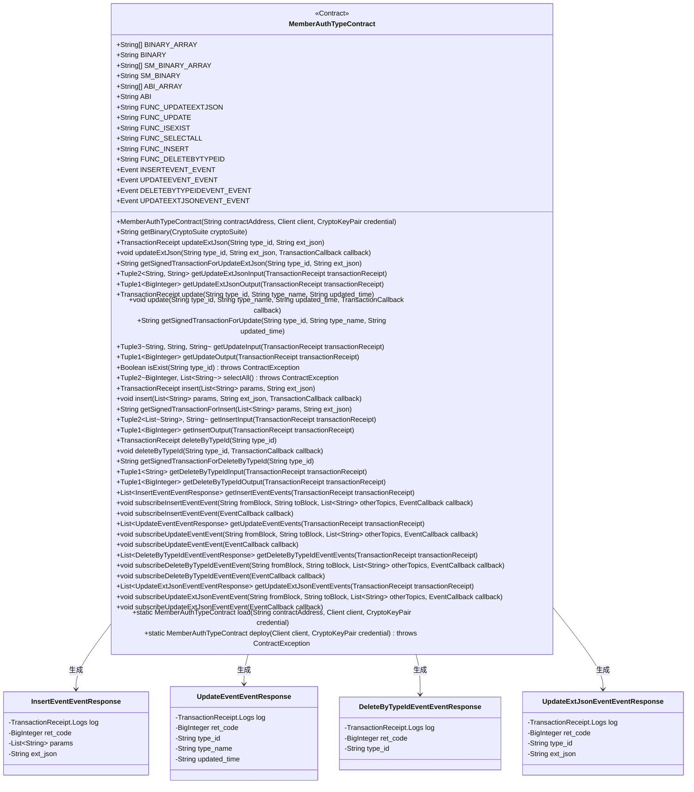

# 基础信息

|      |      |
|------|------|
| 名称 | MemberAuthTypeContract |
| 编码语言 | .java |
| 代码路径 | WeFe/union/union-service/src/main/java/com/welab/wefe/union/service/contract/MemberAuthTypeContract.java |
| 包名 | com.welab.wefe.union.service.contract |
| 依赖项 | ['org.fisco.bcos.sdk.abi.FunctionReturnDecoder', 'org.fisco.bcos.sdk.abi.TypeReference', 'org.fisco.bcos.sdk.abi.datatypes', 'org.fisco.bcos.sdk.abi.datatypes.generated.Int256', 'org.fisco.bcos.sdk.abi.datatypes.generated.tuples.generated.Tuple1', 'org.fisco.bcos.sdk.abi.datatypes.generated.tuples.generated.Tuple2', 'org.fisco.bcos.sdk.abi.datatypes.generated.tuples.generated.Tuple3', 'org.fisco.bcos.sdk.client.Client', 'org.fisco.bcos.sdk.contract.Contract', 'org.fisco.bcos.sdk.crypto.CryptoSuite', 'org.fisco.bcos.sdk.crypto.keypair.CryptoKeyPair', 'org.fisco.bcos.sdk.eventsub.EventCallback', 'org.fisco.bcos.sdk.model.CryptoType', 'org.fisco.bcos.sdk.model.TransactionReceipt', 'org.fisco.bcos.sdk.model.callback.TransactionCallback', 'org.fisco.bcos.sdk.transaction.model.exception.ContractException', 'java.math.BigInteger', 'java.util.ArrayList', 'java.util.Arrays', 'java.util.Collections', 'java.util.List'] |
| 概述说明 | MemberAuthTypeContract是一个智能合约类，用于管理成员认证类型。主要功能包括更新扩展JSON、更新类型信息、检查类型是否存在、查询所有类型、插入新类型和删除类型。合约包含四个事件：insertEvent、updateEvent、deleteByTypeIdEvent和updateExtJsonEvent，用于记录操作结果。支持同步和异步交易，提供输入输出参数解析方法。可通过部署或加载现有合约地址使用。 |

# 说明

这是一个名为`MemberAuthTypeContract`的智能合约Java封装类，主要用于管理成员认证类型。以下是关键信息总结：

1. 合约功能：
- 提供成员认证类型的增删改查操作
- 支持扩展JSON字段的更新
- 包含类型存在性检查
- 支持全量查询所有类型

2. 主要方法：
- updateExtJson：更新类型的扩展JSON
- update：更新类型基本信息
- isExist：检查类型是否存在
- selectAll：查询所有类型
- insert：插入新类型
- deleteByTypeId：删除指定类型

3. 事件监听：
- insertEvent：插入事件
- updateEvent：更新事件
- deleteByTypeIdEvent：删除事件
- updateExtJsonEvent：扩展JSON更新事件

4. 技术特性：
- 支持ECDSA和SM加密算法
- 提供同步和异步交易方式
- 包含交易输入输出解析方法
- 支持事件订阅功能

5. 数据结构：
- 使用Tuple封装多返回值
- 包含4个事件响应内部类
- 使用BigInteger处理大数字

这个封装类为区块链应用提供了完整的成员认证类型管理接口，支持各种操作和事件监听，方便Java开发者与智能合约交互。

# 类列表 Class Summary

| 名称   | 类型  | 说明 |
|-------|------|-------------|
| MemberAuthTypeContract | class | MemberAuthTypeContract是一个智能合约类，用于管理成员认证类型。主要功能包括：更新扩展JSON、更新类型信息、检查类型是否存在、查询所有类型、插入新类型、删除类型等操作。合约包含四个事件：insertEvent、updateEvent、deleteByTypeIdEvent和updateExtJsonEvent，用于记录相关操作。支持ECDSA和SM2两种加密算法，提供同步和异步交易执行方式。可通过ABI和二进制代码部署和加载合约。 |

## 类 MemberAuthTypeContract

|      |      |
|------|------|
| 访问范围 | @SuppressWarnings("unchecked");public |
| 类型 | class |
| 名称 | MemberAuthTypeContract |
| 说明 | MemberAuthTypeContract是一个智能合约类，用于管理成员认证类型。主要功能包括：更新扩展JSON、更新类型信息、检查类型是否存在、查询所有类型、插入新类型、删除类型等操作。合约包含四个事件：insertEvent、updateEvent、deleteByTypeIdEvent和updateExtJsonEvent，用于记录相关操作。支持ECDSA和SM2两种加密算法，提供同步和异步交易执行方式。可通过ABI和二进制代码部署和加载合约。 |

### UML类图

这段代码定义了一个名为`MemberAuthTypeContract`的智能合约类，主要用于成员认证类型的管理。合约包含多个功能方法如更新扩展JSON、更新类型信息、检查类型是否存在、查询所有类型、插入新类型以及删除类型等。同时定义了4种事件响应类用于处理不同类型的事件响应。类图展示了合约与各事件响应类之间的关系，合约通过方法调用生成相应的事件响应对象。

### 内部方法调用关系图

该代码是一个智能合约Java封装类，主要功能包括：
1. 封装了MemberAuthType合约的所有方法调用，包括updateExtJson、update、isExist等业务方法
2. 提供了合约事件的订阅和解析功能
3. 支持合约的部署和加载
4. 包含完整的ABI定义和二进制代码
5. 使用泛型和反射机制处理不同类型参数的编解码
6. 提供同步和异步两种调用方式
7. 自动生成交易签名和输入输出解析

流程图展示了类的主要结构和关系，时序图展示了典型的方法调用过程。代码结构清晰，封装完整，适合作为Java应用与区块链智能合约交互的中间层。

### 字段列表 Field List

| 名称  | 类型  | 说明 |
|-------|-------|------|
| UPDATEEXTJSONEVENT_EVENT = new Event("updateExtJsonEvent",             Arrays.<TypeReference<?>>asList(new TypeReference<Int256>() {}, new TypeReference<Utf8String>() {}, new TypeReference<Utf8String>() {})) | Event | 定义静态常量UPDATEEXTJSONEVENT_EVENT，类型为Event，包含事件名"updateExtJsonEvent"及三个参数类型：Int256、Utf8String、Utf8String。 |
| FUNC_UPDATEEXTJSON = "updateExtJson" | String | 静态常量字符串，功能为更新扩展JSON数据。 |
| DELETEBYTYPEIDEVENT_EVENT = new Event("deleteByTypeIdEvent",             Arrays.<TypeReference<?>>asList(new TypeReference<Int256>() {}, new TypeReference<Utf8String>() {})) | Event | 定义静态常量DELETEBYTYPEIDEVENT_EVENT，类型为Event，包含事件名"deleteByTypeIdEvent"及两个参数类型Int256和Utf8String。 |
| SM_BINARY_ARRAY = {"60806040523480156200001157600080fd5b506110016000806101000a81548173ffffffffffffffffffffffffffffffffffffffff021916908373ffffffffffffffffffffffffffffffffffffffff1602179055506000809054906101000a900473ffffffffffffffffffffffffffffffffffffffff1673ffffffffffffffffffffffffffffffffffffffff1663c92a78016040805190810160405280601081526020017f6d656d6265725f617574685f74797065000000000000000000000000000000008152506040518263ffffffff167c010000000000000000000000000000000000000000000000000000000002815260040162000101919062000270565b602060405180830381600087803b1580156200011c57600080fd5b505af115801562000131573d6000803e3d6000fd5b505050506040513d601f19601f8201168201806040525062000157919081019062000174565b506200031a565b60006200016c8251620002c9565b905092915050565b6000602082840312156200018757600080fd5b600062000197848285016200015e565b91505092915050565b6000620001ad82620002be565b808452620001c3816020860160208601620002d3565b620001ce8162000309565b602085010191505092915050565b6000603482527f747970655f69642c747970655f6e616d652c637265617465645f74696d652c7560208301527f7064617465645f74696d652c6578745f6a736f6e0000000000000000000000006040830152606082019050919050565b6000600682527f6669785f696400000000000000000000000000000000000000000000000000006020830152604082019050919050565b600060608201905081810360008301526200028c8184620001a0565b90508181036020830152620002a18162000239565b90508181036040830152620002b681620001dc565b905092915050565b600081519050919050565b6000819050919050565b60005b83811015620002f3578082015181840152602081019050620002d6565b8381111562000303576000848401525b50505050565b6000601f19601f8301169050919050565b6135bf806200032a6000396000f300608060405260043610610078576000357c0100000000000000000000000000000000000000000000000000000000900463ffffffff168063568fe8851461007d578063583f9478146100ba5780637d71196c146100f75780639b6ba099146101345780639eb03ade14610171578063c181ca36146101ae575b600080fd5b34801561008957600080fd5b506100a4600480360361009f9190810190612b02565b6101da565b6040516100b19190612ee7565b60405180910390f35b3480156100c657600080fd5b506100e160048036036100dc9190810190612b84565b61059e565b6040516100ee9190612f02565b60405180910390f35b34801561010357600080fd5b5061011e60048036036101199190810190612b02565b610a56565b60405161012b9190612f02565b60405180910390f35b34801561014057600080fd5b5061015b60048036036101569190810190612bf0565b610de1565b6040516101689190612f02565b60405180910390f35b34801561017d57600080fd5b50610198600480360361019391908101906129c9565b61139b565b6040516101a59190612f02565b60405180910390f35b3480156101ba57600080fd5b506101c3611b0d565b6040516101d1929190612f1d565b60405180910390f35b6000806000806000809054906101000a900473ffffffffffffffffffffffffffffffffffffffff1673ffffffffffffffffffffffffffffffffffffffff166359a48b656040805190810160405280601081526020017f6d656d6265725f617574685f74797065000000000000000000000000000000008152506040518263ffffffff167c010000000000000000000000000000000000000000000000000000000002815260040161028b9190613061565b602060405180830381600087803b1580156102a557600080fd5b505af11580156102b9573d6000803e3d6000fd5b505050506040513d601f19601f820116820180604052506102dd9190810190612ab0565b92508273ffffffffffffffffffffffffffffffffffffffff1663c74f8caf6040518163ffffffff167c0100000000000000000000000000000000000000000000000000000000028152600401602060405180830381600087803b15801561034357600080fd5b505af1158015610357573d6000803e3d6000fd5b505050506040513d601f19601f8201168201806040525061037b9190810190612a35565b91508173ffffffffffffffffffffffffffffffffffffffff1663ae763db5866040518263ffffffff167c01000000000000000000000000000000000000000000000000000000000281526004016103d29190613176565b600060405180830381600087803b1580156103ec57600080fd5b505af1158015610400573d6000803e3d6000fd5b505050508273ffffffffffffffffffffffffffffffffffffffff1663d8ac59576040805190810160405280600a81526020017f6669785f69645f30303600000000000000000000000000000000000000000000815250846040518363ffffffff167c0100000000000000000000000000000000000000000000000000000000028152600401610490929190613083565b602060405180830381600087803b1580156104aa57600080fd5b505af11580156104be573d6000803e3d6000fd5b505050506040513d601f19601f820116820180604052506104e29190810190612a5e565b905060008173ffffffffffffffffffffffffffffffffffffffff1663d3e9af5a6040518163ffffffff167c0100000000000000000000000000000000000000000000000000000000028152600401602060405180830381600087803b15801561054a57600080fd5b505af115801561055e573d6000803e3d6000fd5b505050506040513d601f19601f820116820180604052506105829190810190612ad9565b11156105915760019350610596565b600093505b505050919050565b6000806000806000806000809054906101000a900473ffffffffffffffffffffffffffffffffffffffff1673ffffffffffffffffffffffffffffffffffffffff166359a48b656040805190810160405280601081526020017f6d656d6265725f617574685f74797065000000000000000000000000000000008152506040518263ffffffff167c01000000000000000000000000000000000000000000000000000000000281526004016106529190613061565b602060405180830381600087803b15801561066c57600080fd5b505af1158015610680573d6000803e3d6000fd5b505050506040513d601f19601f820116820180604052506106a49190810190612ab0565b94508473ffffffffffffffffffffffffffffffffffffffff1663c74f8caf6040518163ffffffff167c0100000000000000000000000000000000000000000000000000000000028152600401602060405180830381600087803b15801561070a57600080fd5b505af115801561071e573d6000803e3d6000fd5b505050506040513d601f19601f820116820180604052506107429190810190612a35565b93508373ffffffffffffffffffffffffffffffffffffffff1663ae763db5896040518263ffffffff167c01000000000000000000000000000000000000000000000000000000000281526004016107999190613176565b600060405180830381600087803b1580156107b357600080fd5b505af11580156107c7573d6000803e3d6000fd5b505050508473ffffffffffffffffffffffffffffffffffffffff16635887ab246040518163ffffffff167c0100000000000000000000000000000000000000000000000000000000028152600401602060405180830381600087803b15801561082f57600080fd5b505af1158015610843573d6000803e3d6000fd5b505050506040513d601f19601f820116820180604052506108679190810190612a87565b92508273ffffffffffffffffffffffffffffffffffffffff16631a391cb4886040518263ffffffff167c01000000000000000000000000000000000000000000000000000000000281526004016108be9190613369565b600060405180830381600087803b1580156108d857600080fd5b505af11580156108ec573d6000803e3d6000fd5b505050508473ffffffffffffffffffffffffffffffffffffffff1663664b37d66040805190810160405280600a81526020017f6669785f69645f3030360000000000000000000000000000000000000000000081525085876040518463ffffffff167c010000000000000000000000000000000000000000000000000000000002815260040161097e939291906130e3565b602060405180830381600087803b15801561099857600080fd5b505af11580156109ac573d6000803e3d6000fd5b505050506040513d601f19601f820116820180604052506109d09190810190612ad9565b9150600090506001821215156109e95760009050610a0d565b7ffffffffffffffffffffffffffffffffffffffffffffffffffffffffffffffffe90505b7f0e1e3faa5d548368037d4312f850b81148f6d5cb74e841160325d7ea90660075818989604051610a4093929190612fc2565b60405180910390a1809550505050505092915050565b60008060008060008093506000809054906101000a900473ffffffffffffffffffffffffffffffffffffffff1673ffffffffffffffffffffffffffffffffffffffff166359a48b656040805190810160405280601081526020017f6d656d6265725f617574685f74797065000000000000000000000000000000008152506040518263ffffffff167c0100000000000000000000000000000000000000000000000000000000028152600401610b0c9190613061565b602060405180830381600087803b158015610b2657600080fd5b505af1158015610b3a573d6000803e3d6000fd5b505050506040513d601f19601f82011682018060405250610b5e9190810190612ab0565b92508273ffffffffffffffffffffffffffffffffffffffff1663c74f8caf6040518163ffffffff167c0100000000000000000000000000000000000000000000000000000000028152600401602060405180830381600087803b158015610bc457600080fd5b505af1158015610bd8573d6000803e3d6000fd5b505050506040513d601f19601f82011682018060405250610bfc9190810190612a35565b91508173ffffffffffffffffffffffffffffffffffffffff1663ae763db5876040518263ffffffff167c0100000000000000000000000000000000000000000000000000000000028152600401610c539190613176565b600060405180830381600087803b158015610c6d57600080fd5b505af1158015610c81573d6000803e3d6000fd5b505050508273ffffffffffffffffffffffffffffffffffffffff166309ff42f06040805190810160405280600a81526020017f6669785f69645f3030360000000000000000000000000000000000000000000081","5250846040518363ffffffff167c0100000000000000000000000000000000000000000000000000000000028152600401610d11929190613083565b602060405180830381600087803b158015610d2b57600080fd5b505af1158015610d3f573d6000803e3d6000fd5b505050506040513d601f19601f82011682018060405250610d639190810190612ad9565b9050600181121515610d785760009350610d9c565b7ffffffffffffffffffffffffffffffffffffffffffffffffffffffffffffffffe93505b7f6b2f980959df7c69484eedc69946c27b3743d020380d5f3600dd0b0f57d0f4b18487604051610dcd929190612f92565b60405180910390a180945050505050919050565b60008060008060008060009450610df7896101da565b1515610e65577fffffffffffffffffffffffffffffffffffffffffffffffffffffffffffffffff94507f231031b5a33d2c7c5550f8174512618ed672d52be443d80b5146746637935cba858a8a8a604051610e559493929190613007565b60405180910390a184955061138f565b6000809054906101000a900473ffffffffffffffffffffffffffffffffffffffff1673ffffffffffffffffffffffffffffffffffffffff166359a48b656040805190810160405280601081526020017f6d656d6265725f617574685f74797065000000000000000000000000000000008152506040518263ffffffff167c0100000000000000000000000000000000000000000000000000000000028152600401610f109190613061565b602060405180830381600087803b158015610f2a57600080fd5b505af1158015610f3e573d6000803e3d6000fd5b505050506040513d601f19601f82011682018060405250610f629190810190612ab0565b93508373ffffffffffffffffffffffffffffffffffffffff1663c74f8caf6040518163ffffffff167c0100000000000000000000000000000000000000000000000000000000028152600401602060405180830381600087803b158015610fc857600080fd5b505af1158015610fdc573d6000803e3d6000fd5b505050506040513d601f19601f820116820180604052506110009190810190612a35565b92508273ffffffffffffffffffffffffffffffffffffffff1663ae763db58a6040518263ffffffff167c01000000000000000000000000000000000000000000000000000000000281526004016110579190613176565b600060405180830381600087803b15801561107157600080fd5b505af1158015611085573d6000803e3d6000fd5b505050508373ffffffffffffffffffffffffffffffffffffffff16635887ab246040518163ffffffff167c0100000000000000000000000000000000000000000000000000000000028152600401602060405180830381600087803b1580156110ed57600080fd5b505af1158015611101573d6000803e3d6000fd5b505050506040513d601f19601f820116820180604052506111259190810190612a87565b91508173ffffffffffffffffffffffffffffffffffffffff16631a391cb4896040518263ffffffff167c010000000000000000000000000000000000000000000000000000000002815260040161117c9190613314565b600060405180830381600087803b15801561119657600080fd5b505af11580156111aa573d6000803e3d6000fd5b505050508173ffffffffffffffffffffffffffffffffffffffff16631a391cb4886040518263ffffffff167c01000000000000000000000000000000000000000000000000000000000281526004016112039190613200565b600060405180830381600087803b15801561121d57600080fd5b505af1158015611231573d6000803e3d6000fd5b505050508373ffffffffffffffffffffffffffffffffffffffff1663664b37d66040805190810160405280600a81526020017f6669785f69645f3030360000000000000000000000000000000000000000000081525084866040518463ffffffff167c01000000000000000000000000000000000000000000000000000000000281526004016112c3939291906130e3565b602060405180830381600087803b1580156112dd57600080fd5b505af11580156112f1573d6000803e3d6000fd5b505050506040513d601f19601f820116820180604052506113159190810190612ad9565b905060018112151561132a576000945061134e565b7ffffffffffffffffffffffffffffffffffffffffffffffffffffffffffffffffe94505b7f231031b5a33d2c7c5550f8174512618ed672d52be443d80b5146746637935cba858a8a8a6040516113839493929190613007565b60405180910390a18095505b50505050509392505050565b60008060008060008093506113c78760008151811015156113b857fe5b906020019060200201516101da565b15611452577fffffffffffffffffffffffffffffffffffffffffffffffffffffffffffffffff93507fcb263a23d186eec891d55f1e0ba96ec8290af8c893d32d644c22dbff0953e51f84888860405161142293929190612f4d565b60405180910390a17fffffffffffffffffffffffffffffffffffffffffffffffffffffffffffffffff9450611b03565b6000809054906101000a900473ffffffffffffffffffffffffffffffffffffffff1673ffffffffffffffffffffffffffffffffffffffff166359a48b656040805190810160405280601081526020017f6d656d6265725f617574685f74797065000000000000000000000000000000008152506040518263ffffffff167c01000000000000000000000000000000000000000000000000000000000281526004016114fd9190613061565b602060405180830381600087803b15801561151757600080fd5b505af115801561152b573d6000803e3d6000fd5b505050506040513d601f19601f8201168201806040525061154f9190810190612ab0565b92508273ffffffffffffffffffffffffffffffffffffffff16635887ab246040518163ffffffff167c0100000000000000000000000000000000000000000000000000000000028152600401602060405180830381600087803b1580156115b557600080fd5b505af11580156115c9573d6000803e3d6000fd5b505050506040513d601f19601f820116820180604052506115ed9190810190612a87565b91508173ffffffffffffffffffffffffffffffffffffffff16631a391cb46040805190810160405280600a81526020017f6669785f69645f303036000000000000000000000000000000000000000000008152506040518263ffffffff167c0100000000000000000000000000000000000000000000000000000000028152600401611679919061328a565b600060405180830381600087803b15801561169357600080fd5b505af11580156116a7573d6000803e3d6000fd5b505050508173ffffffffffffffffffffffffffffffffffffffff16631a391cb48860008151811015156116d657fe5b906020019060200201516040518263ffffffff167c01000000000000000000000000000000000000000000000000000000000281526004016117189190613141565b600060405180830381600087803b15801561173257600080fd5b505af1158015611746573d6000803e3d6000fd5b505050508173ffffffffffffffffffffffffffffffffffffffff16631a391cb488600181518110151561177557fe5b906020019060200201516040518263ffffffff167c01000000000000000000000000000000000000000000000000000000000281526004016117b791906132df565b600060405180830381600087803b1580156117d157600080fd5b505af11580156117e5573d6000803e3d6000fd5b505050508173ffffffffffffffffffffffffffffffffffffffff16631a391cb488600281518110151561181457fe5b906020019060200201516040518263ffffffff167c01000000000000000000000000000000000000000000000000000000000281526004016118569190613255565b600060405180830381600087803b15801561187057600080fd5b505af1158015611884573d6000803e3d6000fd5b505050508173ffffffffffffffffffffffffffffffffffffffff16631a391cb48860038151811015156118b357fe5b906020019060200201516040518263ffffffff167c01000000000000000000000000000000000000000000000000000000000281526004016118f591906131cb565b600060405180830381600087803b15801561190f57600080fd5b505af1158015611923573d6000803e3d6000fd5b505050508173ffffffffffffffffffffffffffffffffffffffff16631a391cb4876040518263ffffffff167c010000000000000000000000000000000000000000000000000000000002815260040161197c9190613369565b600060405180830381600087803b15801561199657600080fd5b505af11580156119aa573d6000803e3d6000fd5b505050508273ffffffffffffffffffffffffffffffffffffffff16634c6f30c06040805190810160405280600a81526020017f6669785f69645f30303600000000000000000000000000000000000000000000815250846040518363ffffffff167c0100000000000000000000000000000000000000000000000000000000028152600401611a3a9291906130b3565b602060405180830381600087803b158015611a5457600080fd5b505af1158015611a68573d6000803e3d6000fd5b505050506040513d601f19601f82011682018060405250611a8c9190810190612ad9565b90506001811415611aa05760009350611ac4565b7ffffffffffffffffffffffffffffffffffffffffffffffffffffffffffffffffe93505b7fcb263a23d186eec891d55f1e0ba96ec8290af8c893d32d644c22dbff0953e51f848888604051611af793929190612f4d565b60405180910390a18094505b5050505092915050565b600060606000806000809054906101000a900473ffffffffffffffffffffffffffffffffffffffff1673ffffffffffffffffffffffffffffffffffffffff166359a48b656040805190810160405280601081526020017f6d656d6265725f617574685f74797065000000000000000000000000000000008152506040518263ffffffff167c0100000000000000000000000000000000000000000000000000000000028152600401611bbf9190613061565b602060405180830381600087803b158015611bd957600080fd5b505af1158015611bed573d6000803e3d6000fd5b505050506040513d601f19601f82011682018060405250611c119190810190612ab0565b91508173ffffffffffffffffffffffffffffffffffffffff1663d8ac59576040805190810160405280600a81526020017f6669785f69645f303036000000000000000000000000000000000000000000008152508473ffffffffffffffffffffffffffffffffffffffff1663c74f8caf6040518163ffffffff167c0100000000000000000000000000000000000000000000000000000000028152600401602060405180830381600087803b158015611cc957600080fd5b505af1158015611cdd573d60","00803e3d6000fd5b505050506040513d601f19601f82011682018060405250611d019190810190612a35565b6040518363ffffffff167c0100000000000000000000000000000000000000000000000000000000028152600401611d3a929190613083565b602060405180830381600087803b158015611d5457600080fd5b505af1158015611d68573d6000803e3d6000fd5b505050506040513d601f19601f82011682018060405250611d8c9190810190612a5e565b90508073ffffffffffffffffffffffffffffffffffffffff1663d3e9af5a6040518163ffffffff167c0100000000000000000000000000000000000000000000000000000000028152600401602060405180830381600087803b158015611df257600080fd5b505af1158015611e06573d6000803e3d6000fd5b505050506040513d601f19601f82011682018060405250611e2a9190810190612ad9565b60001415611e98577ffffffffffffffffffffffffffffffffffffffffffffffffffffffffffffffffd6000604051908082528060200260200182016040528015611e8857816020015b6060815260200190600190039081611e735790505b5081915080905093509350611eab565b6000611ea382611eb1565b819150935093505b50509091565b60608060008060608573ffffffffffffffffffffffffffffffffffffffff1663d3e9af5a6040518163ffffffff167c0100000000000000000000000000000000000000000000000000000000028152600401602060405180830381600087803b158015611f1d57600080fd5b505af1158015611f31573d6000803e3d6000fd5b505050506040513d601f19601f82011682018060405250611f559190810190612ad9565b604051908082528060200260200182016040528015611f8857816020015b6060815260200190600190039081611f735790505b509350600092505b8573ffffffffffffffffffffffffffffffffffffffff1663d3e9af5a6040518163ffffffff167c0100000000000000000000000000000000000000000000000000000000028152600401602060405180830381600087803b158015611ff457600080fd5b505af1158015612008573d6000803e3d6000fd5b505050506040513d601f19601f8201168201806040525061202c9190810190612ad9565b8312156125ac578573ffffffffffffffffffffffffffffffffffffffff16633dd2b614846040518263ffffffff167c01000000000000000000000000000000000000000000000000000000000281526004016120889190612f02565b602060405180830381600087803b1580156120a257600080fd5b505af11580156120b6573d6000803e3d6000fd5b505050506040513d601f19601f820116820180604052506120da9190810190612a87565b91506121cc6121918373ffffffffffffffffffffffffffffffffffffffff16639bca41e86040518163ffffffff167c010000000000000000000000000000000000000000000000000000000002815260040161213590613121565b600060405180830381600087803b15801561214f57600080fd5b505af1158015612163573d6000803e3d6000fd5b505050506040513d6000823e3d601f19601f8201168201806040525061218c9190810190612b43565b6125b8565b6040805190810160405280600181526020017f7c00000000000000000000000000000000000000000000000000000000000000815250612611565b9050612289816122848473ffffffffffffffffffffffffffffffffffffffff16639bca41e86040518163ffffffff167c0100000000000000000000000000000000000000000000000000000000028152600401612228906132bf565b600060405180830381600087803b15801561224257600080fd5b505af1158015612256573d6000803e3d6000fd5b505050506040513d6000823e3d601f19601f8201168201806040525061227f9190810190612b43565b6125b8565b612611565b90506122ca816040805190810160405280600181526020017f7c00000000000000000000000000000000000000000000000000000000000000815250612611565b9050612387816123828473ffffffffffffffffffffffffffffffffffffffff16639bca41e86040518163ffffffff167c010000000000000000000000000000000000000000000000000000000002815260040161232690613235565b600060405180830381600087803b15801561234057600080fd5b505af1158015612354573d6000803e3d6000fd5b505050506040513d6000823e3d601f19601f8201168201806040525061237d9190810190612b43565b6125b8565b612611565b90506123c8816040805190810160405280600181526020017f7c00000000000000000000000000000000000000000000000000000000000000815250612611565b9050612485816124808473ffffffffffffffffffffffffffffffffffffffff16639bca41e86040518163ffffffff167c0100000000000000000000000000000000000000000000000000000000028152600401612424906131ab565b600060405180830381600087803b15801561243e57600080fd5b505af1158015612452573d6000803e3d6000fd5b505050506040513d6000823e3d601f19601f8201168201806040525061247b9190810190612b43565b6125b8565b612611565b90506124c6816040805190810160405280600181526020017f7c00000000000000000000000000000000000000000000000000000000000000815250612611565b90506125838161257e8473ffffffffffffffffffffffffffffffffffffffff16639bca41e86040518163ffffffff167c010000000000000000000000000000000000000000000000000000000002815260040161252290613349565b600060405180830381600087803b15801561253c57600080fd5b505af1158015612550573d6000803e3d6000fd5b505050506040513d6000823e3d601f19601f820116820180604052506125799190810190612b43565b6125b8565b612611565b905080848481518110151561259457fe5b90602001906020020181905250826001019250611f90565b83945050505050919050565b606060006125c5836127e2565b1415612608576040805190810160405280600181526020017f2000000000000000000000000000000000000000000000000000000000000000815250905061260c565b8190505b919050565b606080606080606060008088955087945084518651016040519080825280601f01601f1916602001820160405280156126595781602001602082028038833980820191505090505b50935083925060009150600090505b855181101561271b57858181518110151561267f57fe5b9060200101517f010000000000000000000000000000000000000000000000000000000000000090047f01000000000000000000000000000000000000000000000000000000000000000283838060010194508151811015156126de57fe5b9060200101907effffffffffffffffffffffffffffffffffffffffffffffffffffffffffffff1916908160001a9053508080600101915050612668565b600090505b84518110156127d357848181518110151561273757fe5b9060200101517f010000000000000000000000000000000000000000000000000000000000000090047f010000000000000000000000000000000000000000000000000000000000000002838380600101945081518110151561279657fe5b9060200101907effffffffffffffffffffffffffffffffffffffffffffffffffffffffffffff1916908160001a9053508080600101915050612720565b83965050505050505092915050565b600081519050919050565b600082601f830112151561280057600080fd5b813561281361280e826133cb565b61339e565b9150818183526020840193506020810190508360005b83811015612859578135860161283f88826128c7565b845260208401935060208301925050600181019050612829565b5050505092915050565b600061286f82516134bc565b905092915050565b600061288382516134ce565b905092915050565b600061289782516134e0565b905092915050565b60006128ab82516134f2565b905092915050565b60006128bf8251613504565b905092915050565b600082601f83011215156128da57600080fd5b81356128ed6128e8826133f3565b61339e565b9150808252602083016020830185838301111561290957600080fd5b612914838284613532565b50505092915050565b600082601f830112151561293057600080fd5b813561294361293e8261341f565b61339e565b9150808252602083016020830185838301111561295f57600080fd5b61296a838284613532565b50505092915050565b600082601f830112151561298657600080fd5b81516129996129948261341f565b61339e565b915080825260208301602083018583830111156129b557600080fd5b6129c0838284613541565b50505092915050565b600080604083850312156129dc57600080fd5b600083013567ffffffffffffffff8111156129f657600080fd5b612a02858286016127ed565b925050602083013567ffffffffffffffff811115612a1f57600080fd5b612a2b8582860161291d565b9150509250929050565b600060208284031215612a4757600080fd5b6000612a5584828501612863565b91505092915050565b600060208284031215612a7057600080fd5b6000612a7e84828501612877565b91505092915050565b600060208284031215612a9957600080fd5b6000612aa78482850161288b565b91505092915050565b600060208284031215612ac257600080fd5b6000612ad08482850161289f565b91505092915050565b600060208284031215612aeb57600080fd5b6000612af9848285016128b3565b91505092915050565b600060208284031215612b1457600080fd5b600082013567ffffffffffffffff811115612b2e57600080fd5b612b3a8482850161291d565b91505092915050565b600060208284031215612b5557600080fd5b600082015167ffffffffffffffff811115612b6f57600080fd5b612b7b84828501612973565b91505092915050565b60008060408385031215612b9757600080fd5b600083013567ffffffffffffffff811115612bb157600080fd5b612bbd8582860161291d565b925050602083013567ffffffffffffffff811115612bda57600080fd5b612be68582860161291d565b9150509250929050565b600080600060608486031215612c0557600080fd5b600084013567ffffffffffffffff811115612c1f57600080fd5b612c2b8682870161291d565b935050602084013567ffffffffffffffff811115612c4857600080fd5b612c548682870161291d565b925050604084013567ffffffffffffffff811115612c7157600080fd5b612c7d8682870161291d565b9150509250925092565b6000612c9282613458565b80845260208401935083602082028501612cab8561344b565b60005b84811015612ce4578383038852612cc6838351612d67565b9250612cd182613479565b91506020","88019750600181019050612cae565b508196508694505050505092915050565b612cfe816134a6565b82525050565b612d0d8161350e565b82525050565b612d1c81613520565b82525050565b612d2b816134b2565b82525050565b6000612d3c8261346e565b808452612d50816020860160208601613541565b612d5981613574565b602085010191505092915050565b6000612d7282613463565b808452612d86816020860160208601613541565b612d8f81613574565b602085010191505092915050565b6000600782527f747970655f6964000000000000000000000000000000000000000000000000006020830152604082019050919050565b6000600c82527f757064617465645f74696d6500000000000000000000000000000000000000006020830152604082019050919050565b6000600c82527f637265617465645f74696d6500000000000000000000000000000000000000006020830152604082019050919050565b6000600682527f6669785f696400000000000000000000000000000000000000000000000000006020830152604082019050919050565b6000600982527f747970655f6e616d6500000000000000000000000000000000000000000000006020830152604082019050919050565b6000600882527f6578745f6a736f6e0000000000000000000000000000000000000000000000006020830152604082019050919050565b6000602082019050612efc6000830184612cf5565b92915050565b6000602082019050612f176000830184612d22565b92915050565b6000604082019050612f326000830185612d22565b8181036020830152612f448184612c87565b90509392505050565b6000606082019050612f626000830186612d22565b8181036020830152612f748185612c87565b90508181036040830152612f888184612d31565b9050949350505050565b6000604082019050612fa76000830185612d22565b8181036020830152612fb98184612d31565b90509392505050565b6000606082019050612fd76000830186612d22565b8181036020830152612fe98185612d31565b90508181036040830152612ffd8184612d31565b9050949350505050565b600060808201905061301c6000830187612d22565b818103602083015261302e8186612d31565b905081810360408301526130428185612d31565b905081810360608301526130568184612d31565b905095945050505050565b6000602082019050818103600083015261307b8184612d67565b905092915050565b6000604082019050818103600083015261309d8185612d67565b90506130ac6020830184612d04565b9392505050565b600060408201905081810360008301526130cd8185612d67565b90506130dc6020830184612d13565b9392505050565b600060608201905081810360008301526130fd8186612d67565b905061310c6020830185612d13565b6131196040830184612d04565b949350505050565b6000602082019050818103600083015261313a81612d9d565b9050919050565b6000604082019050818103600083015261315a81612d9d565b9050818103602083015261316e8184612d67565b905092915050565b6000604082019050818103600083015261318f81612d9d565b905081810360208301526131a38184612d31565b905092915050565b600060208201905081810360008301526131c481612dd4565b9050919050565b600060408201905081810360008301526131e481612dd4565b905081810360208301526131f88184612d67565b905092915050565b6000604082019050818103600083015261321981612dd4565b9050818103602083015261322d8184612d31565b905092915050565b6000602082019050818103600083015261324e81612e0b565b9050919050565b6000604082019050818103600083015261326e81612e0b565b905081810360208301526132828184612d67565b905092915050565b600060408201905081810360008301526132a381612e42565b905081810360208301526132b78184612d67565b905092915050565b600060208201905081810360008301526132d881612e79565b9050919050565b600060408201905081810360008301526132f881612e79565b9050818103602083015261330c8184612d67565b905092915050565b6000604082019050818103600083015261332d81612e79565b905081810360208301526133418184612d31565b905092915050565b6000602082019050818103600083015261336281612eb0565b9050919050565b6000604082019050818103600083015261338281612eb0565b905081810360208301526133968184612d31565b905092915050565b6000604051905081810181811067ffffffffffffffff821117156133c157600080fd5b8060405250919050565b600067ffffffffffffffff8211156133e257600080fd5b602082029050602081019050919050565b600067ffffffffffffffff82111561340a57600080fd5b601f19601f8301169050602081019050919050565b600067ffffffffffffffff82111561343657600080fd5b601f19601f8301169050602081019050919050565b6000602082019050919050565b600081519050919050565b600081519050919050565b600081519050919050565b6000602082019050919050565b600073ffffffffffffffffffffffffffffffffffffffff82169050919050565b60008115159050919050565b6000819050919050565b60006134c782613486565b9050919050565b60006134d982613486565b9050919050565b60006134eb82613486565b9050919050565b60006134fd82613486565b9050919050565b6000819050919050565b600061351982613486565b9050919050565b600061352b82613486565b9050919050565b82818337600083830152505050565b60005b8381101561355f578082015181840152602081019050613544565b8381111561356e576000848401525b50505050565b6000601f19601f83011690509190505600a265627a7a72305820b837266e03fdb692682db517e03d9236b8c545482c6440b70e08d828f15d13476c6578706572696d656e74616cf50037"} | String[] | 这是一个名为SM_BINARY_ARRAY的公共静态最终字符串数组，包含智能合约的二进制代码片段。 |
| BINARY = String.join("", BINARY_ARRAY) | String | 将字符串数组BINARY_ARRAY拼接为静态常量字符串BINARY。 |
| FUNC_UPDATE = "update" | String | 静态常量FUNC_UPDATE定义为字符串"update"。 |
| ABI = String.join("", ABI_ARRAY) | String | 将ABI_ARRAY数组合并为一个字符串并赋值给常量ABI。 |
| INSERTEVENT_EVENT = new Event("insertEvent",             Arrays.<TypeReference<?>>asList(new TypeReference<Int256>() {}, new TypeReference<DynamicArray<Utf8String>>() {}, new TypeReference<Utf8String>() {})) | Event | 定义静态常量INSERTEVENT_EVENT，类型为Event，包含事件名"insertEvent"及三个参数类型：Int256、DynamicArray<Utf8String>和Utf8String。 |
| FUNC_SELECTALL = "selectAll" | String | 定义公共静态常量FUNC_SELECTALL，值为"selectAll"。 |
| UPDATEEVENT_EVENT = new Event("updateEvent",             Arrays.<TypeReference<?>>asList(new TypeReference<Int256>() {}, new TypeReference<Utf8String>() {}, new TypeReference<Utf8String>() {}, new TypeReference<Utf8String>() {})) | Event | 定义了一个名为UPDATEEVENT_EVENT的公共静态常量事件，包含四个参数：Int256和三个Utf8String类型。 |
| BINARY_ARRAY = {"60806040523480156200001157600080fd5b506110016000806101000a81548173ffffffffffffffffffffffffffffffffffffffff021916908373ffffffffffffffffffffffffffffffffffffffff1602179055506000809054906101000a900473ffffffffffffffffffffffffffffffffffffffff1673ffffffffffffffffffffffffffffffffffffffff166356004b6a6040805190810160405280601081526020017f6d656d6265725f617574685f74797065000000000000000000000000000000008152506040518263ffffffff167c010000000000000000000000000000000000000000000000000000000002815260040162000101919062000270565b602060405180830381600087803b1580156200011c57600080fd5b505af115801562000131573d6000803e3d6000fd5b505050506040513d601f19601f8201168201806040525062000157919081019062000174565b506200031a565b60006200016c8251620002c9565b905092915050565b6000602082840312156200018757600080fd5b600062000197848285016200015e565b91505092915050565b6000620001ad82620002be565b808452620001c3816020860160208601620002d3565b620001ce8162000309565b602085010191505092915050565b6000600682527f6669785f696400000000000000000000000000000000000000000000000000006020830152604082019050919050565b6000603482527f747970655f69642c747970655f6e616d652c637265617465645f74696d652c7560208301527f7064617465645f74696d652c6578745f6a736f6e0000000000000000000000006040830152606082019050919050565b600060608201905081810360008301526200028c8184620001a0565b90508181036020830152620002a181620001dc565b90508181036040830152620002b68162000213565b905092915050565b600081519050919050565b6000819050919050565b60005b83811015620002f3578082015181840152602081019050620002d6565b8381111562000303576000848401525b50505050565b6000601f19601f8301169050919050565b6135bf806200032a6000396000f300608060405260043610610078576000357c0100000000000000000000000000000000000000000000000000000000900463ffffffff1680630f964d0b1461007d57806331c3e456146100ba5780634d3d096b146100f7578063857cb0eb1461013457806397291150146101605780639a76fa5b1461019d575b600080fd5b34801561008957600080fd5b506100a4600480360361009f9190810190612b84565b6101da565b6040516100b19190612f02565b60405180910390f35b3480156100c657600080fd5b506100e160048036036100dc9190810190612bf0565b610692565b6040516100ee9190612f02565b60405180910390f35b34801561010357600080fd5b5061011e60048036036101199190810190612b02565b610c4c565b60405161012b9190612ee7565b60405180910390f35b34801561014057600080fd5b50610149611010565b604051610157929190612f1d565b60405180910390f35b34801561016c57600080fd5b50610187600480360361018291908101906129c9565b6113b4565b6040516101949190612f02565b60405180910390f35b3480156101a957600080fd5b506101c460048036036101bf9190810190612b02565b611b26565b6040516101d19190612f02565b60405180910390f35b6000806000806000806000809054906101000a900473ffffffffffffffffffffffffffffffffffffffff1673ffffffffffffffffffffffffffffffffffffffff1663f23f63c96040805190810160405280601081526020017f6d656d6265725f617574685f74797065000000000000000000000000000000008152506040518263ffffffff167c010000000000000000000000000000000000000000000000000000000002815260040161028e9190613061565b602060405180830381600087803b1580156102a857600080fd5b505af11580156102bc573d6000803e3d6000fd5b505050506040513d601f19601f820116820180604052506102e09190810190612ab0565b94508473ffffffffffffffffffffffffffffffffffffffff16637857d7c96040518163ffffffff167c0100000000000000000000000000000000000000000000000000000000028152600401602060405180830381600087803b15801561034657600080fd5b505af115801561035a573d6000803e3d6000fd5b505050506040513d601f19601f8201168201806040525061037e9190810190612a35565b93508373ffffffffffffffffffffffffffffffffffffffff1663cd30a1d1896040518263ffffffff167c01000000000000000000000000000000000000000000000000000000000281526004016103d5919061328a565b600060405180830381600087803b1580156103ef57600080fd5b505af1158015610403573d6000803e3d6000fd5b505050508473ffffffffffffffffffffffffffffffffffffffff166313db93466040518163ffffffff167c0100000000000000000000000000000000000000000000000000000000028152600401602060405180830381600087803b15801561046b57600080fd5b505af115801561047f573d6000803e3d6000fd5b505050506040513d601f19601f820116820180604052506104a39190810190612a87565b92508273ffffffffffffffffffffffffffffffffffffffff1663e942b516886040518263ffffffff167c01000000000000000000000000000000000000000000000000000000000281526004016104fa9190613141565b600060405180830381600087803b15801561051457600080fd5b505af1158015610528573d6000803e3d6000fd5b505050508473ffffffffffffffffffffffffffffffffffffffff1663bf2b70a16040805190810160405280600a81526020017f6669785f69645f3030360000000000000000000000000000000000000000000081525085876040518463ffffffff167c01000000000000000000000000000000000000000000000000000000000281526004016105ba939291906130e3565b602060405180830381600087803b1580156105d457600080fd5b505af11580156105e8573d6000803e3d6000fd5b505050506040513d601f19601f8201168201806040525061060c9190810190612ad9565b9150600090506001821215156106255760009050610649565b7ffffffffffffffffffffffffffffffffffffffffffffffffffffffffffffffffe90505b7fecd7e44c82f6933ff1918746a0b82905272e99aee75c80430b6a6b77d237da4c81898960405161067c93929190612fc2565b60405180910390a1809550505050505092915050565b600080600080600080600094506106a889610c4c565b1515610716577fffffffffffffffffffffffffffffffffffffffffffffffffffffffffffffffff94507f0231c8f3a3c3deaaaafc45211385f59dee4db8b34e29d7ff74851d7bc5179d00858a8a8a6040516107069493929190613007565b60405180910390a1849550610c40565b6000809054906101000a900473ffffffffffffffffffffffffffffffffffffffff1673ffffffffffffffffffffffffffffffffffffffff1663f23f63c96040805190810160405280601081526020017f6d656d6265725f617574685f74797065000000000000000000000000000000008152506040518263ffffffff167c01000000000000000000000000000000000000000000000000000000000281526004016107c19190613061565b602060405180830381600087803b1580156107db57600080fd5b505af11580156107ef573d6000803e3d6000fd5b505050506040513d601f19601f820116820180604052506108139190810190612ab0565b93508373ffffffffffffffffffffffffffffffffffffffff16637857d7c96040518163ffffffff167c0100000000000000000000000000000000000000000000000000000000028152600401602060405180830381600087803b15801561087957600080fd5b505af115801561088d573d6000803e3d6000fd5b505050506040513d601f19601f820116820180604052506108b19190810190612a35565b92508273ffffffffffffffffffffffffffffffffffffffff1663cd30a1d18a6040518263ffffffff167c0100000000000000000000000000000000000000000000000000000000028152600401610908919061328a565b600060405180830381600087803b15801561092257600080fd5b505af1158015610936573d6000803e3d6000fd5b505050508373ffffffffffffffffffffffffffffffffffffffff166313db93466040518163ffffffff167c0100000000000000000000000000000000000000000000000000000000028152600401602060405180830381600087803b15801561099e57600080fd5b505af11580156109b2573d6000803e3d6000fd5b505050506040513d601f19601f820116820180604052506109d69190810190612a87565b91508173ffffffffffffffffffffffffffffffffffffffff1663e942b516896040518263ffffffff167c0100000000000000000000000000000000000000000000000000000000028152600401610a2d9190613369565b600060405180830381600087803b158015610a4757600080fd5b505af1158015610a5b573d6000803e3d6000fd5b505050508173ffffffffffffffffffffffffffffffffffffffff1663e942b516886040518263ffffffff167c0100000000000000000000000000000000000000000000000000000000028152600401610ab49190613200565b600060405180830381600087803b158015610ace57600080fd5b505af1158015610ae2573d6000803e3d6000fd5b505050508373ffffffffffffffffffffffffffffffffffffffff1663bf2b70a16040805190810160405280600a81526020017f6669785f69645f3030360000000000000000000000000000000000000000000081525084866040518463ffffffff167c0100000000000000000000000000000000000000000000000000000000028152600401610b74939291906130e3565b602060405180830381600087803b158015610b8e57600080fd5b505af1158015610ba2573d6000803e3d6000fd5b505050506040513d601f19601f82011682018060405250610bc69190810190612ad9565b9050600181121515610bdb5760009450610bff565b7ffffffffffffffffffffffffffffffffffffffffffffffffffffffffffffffffe94505b7f0231c8f3a3c3deaaaafc45211385f59dee4db8b34e29d7ff74851d7bc5179d00858a8a8a604051610c349493929190613007565b60405180910390a18095505b50505050509392505050565b6000806000806000809054906101000a900473ffffffffffffffffffffffffffffffffffffffff1673ffffffffffffffffffffffffffffffffffffffff1663f23f63c96040805190810160405280601081526020017f6d656d6265725f617574685f74797065000000000000000000000000000000008152506040518263ffffffff167c0100000000","000000000000000000000000000000000000000000000000028152600401610cfd9190613061565b602060405180830381600087803b158015610d1757600080fd5b505af1158015610d2b573d6000803e3d6000fd5b505050506040513d601f19601f82011682018060405250610d4f9190810190612ab0565b92508273ffffffffffffffffffffffffffffffffffffffff16637857d7c96040518163ffffffff167c0100000000000000000000000000000000000000000000000000000000028152600401602060405180830381600087803b158015610db557600080fd5b505af1158015610dc9573d6000803e3d6000fd5b505050506040513d601f19601f82011682018060405250610ded9190810190612a35565b91508173ffffffffffffffffffffffffffffffffffffffff1663cd30a1d1866040518263ffffffff167c0100000000000000000000000000000000000000000000000000000000028152600401610e44919061328a565b600060405180830381600087803b158015610e5e57600080fd5b505af1158015610e72573d6000803e3d6000fd5b505050508273ffffffffffffffffffffffffffffffffffffffff1663e8434e396040805190810160405280600a81526020017f6669785f69645f30303600000000000000000000000000000000000000000000815250846040518363ffffffff167c0100000000000000000000000000000000000000000000000000000000028152600401610f02929190613083565b602060405180830381600087803b158015610f1c57600080fd5b505af1158015610f30573d6000803e3d6000fd5b505050506040513d601f19601f82011682018060405250610f549190810190612a5e565b905060008173ffffffffffffffffffffffffffffffffffffffff1663949d225d6040518163ffffffff167c0100000000000000000000000000000000000000000000000000000000028152600401602060405180830381600087803b158015610fbc57600080fd5b505af1158015610fd0573d6000803e3d6000fd5b505050506040513d601f19601f82011682018060405250610ff49190810190612ad9565b11156110035760019350611008565b600093505b505050919050565b600060606000806000809054906101000a900473ffffffffffffffffffffffffffffffffffffffff1673ffffffffffffffffffffffffffffffffffffffff1663f23f63c96040805190810160405280601081526020017f6d656d6265725f617574685f74797065000000000000000000000000000000008152506040518263ffffffff167c01000000000000000000000000000000000000000000000000000000000281526004016110c29190613061565b602060405180830381600087803b1580156110dc57600080fd5b505af11580156110f0573d6000803e3d6000fd5b505050506040513d601f19601f820116820180604052506111149190810190612ab0565b91508173ffffffffffffffffffffffffffffffffffffffff1663e8434e396040805190810160405280600a81526020017f6669785f69645f303036000000000000000000000000000000000000000000008152508473ffffffffffffffffffffffffffffffffffffffff16637857d7c96040518163ffffffff167c0100000000000000000000000000000000000000000000000000000000028152600401602060405180830381600087803b1580156111cc57600080fd5b505af11580156111e0573d6000803e3d6000fd5b505050506040513d601f19601f820116820180604052506112049190810190612a35565b6040518363ffffffff167c010000000000000000000000000000000000000000000000000000000002815260040161123d929190613083565b602060405180830381600087803b15801561125757600080fd5b505af115801561126b573d6000803e3d6000fd5b505050506040513d601f19601f8201168201806040525061128f9190810190612a5e565b90508073ffffffffffffffffffffffffffffffffffffffff1663949d225d6040518163ffffffff167c0100000000000000000000000000000000000000000000000000000000028152600401602060405180830381600087803b1580156112f557600080fd5b505af1158015611309573d6000803e3d6000fd5b505050506040513d601f19601f8201168201806040525061132d9190810190612ad9565b6000141561139b577ffffffffffffffffffffffffffffffffffffffffffffffffffffffffffffffffd600060405190808252806020026020018201604052801561138b57816020015b60608152602001906001900390816113765790505b50819150809050935093506113ae565b60006113a682611eb1565b819150935093505b50509091565b60008060008060008093506113e08760008151811015156113d157fe5b90602001906020020151610c4c565b1561146b577fffffffffffffffffffffffffffffffffffffffffffffffffffffffffffffffff93507f5157dc1ab0b55c7621be94a34b2ae4228f7d16e8271628060cc027b1a513b12f84888860405161143b93929190612f4d565b60405180910390a17fffffffffffffffffffffffffffffffffffffffffffffffffffffffffffffffff9450611b1c565b6000809054906101000a900473ffffffffffffffffffffffffffffffffffffffff1673ffffffffffffffffffffffffffffffffffffffff1663f23f63c96040805190810160405280601081526020017f6d656d6265725f617574685f74797065000000000000000000000000000000008152506040518263ffffffff167c01000000000000000000000000000000000000000000000000000000000281526004016115169190613061565b602060405180830381600087803b15801561153057600080fd5b505af1158015611544573d6000803e3d6000fd5b505050506040513d601f19601f820116820180604052506115689190810190612ab0565b92508273ffffffffffffffffffffffffffffffffffffffff166313db93466040518163ffffffff167c0100000000000000000000000000000000000000000000000000000000028152600401602060405180830381600087803b1580156115ce57600080fd5b505af11580156115e2573d6000803e3d6000fd5b505050506040513d601f19601f820116820180604052506116069190810190612a87565b91508173ffffffffffffffffffffffffffffffffffffffff1663e942b5166040805190810160405280600a81526020017f6669785f69645f303036000000000000000000000000000000000000000000008152506040518263ffffffff167c01000000000000000000000000000000000000000000000000000000000281526004016116929190613176565b600060405180830381600087803b1580156116ac57600080fd5b505af11580156116c0573d6000803e3d6000fd5b505050508173ffffffffffffffffffffffffffffffffffffffff1663e942b5168860008151811015156116ef57fe5b906020019060200201516040518263ffffffff167c01000000000000000000000000000000000000000000000000000000000281526004016117319190613255565b600060405180830381600087803b15801561174b57600080fd5b505af115801561175f573d6000803e3d6000fd5b505050508173ffffffffffffffffffffffffffffffffffffffff1663e942b51688600181518110151561178e57fe5b906020019060200201516040518263ffffffff167c01000000000000000000000000000000000000000000000000000000000281526004016117d09190613334565b600060405180830381600087803b1580156117ea57600080fd5b505af11580156117fe573d6000803e3d6000fd5b505050508173ffffffffffffffffffffffffffffffffffffffff1663e942b51688600281518110151561182d57fe5b906020019060200201516040518263ffffffff167c010000000000000000000000000000000000000000000000000000000002815260040161186f91906132df565b600060405180830381600087803b15801561188957600080fd5b505af115801561189d573d6000803e3d6000fd5b505050508173ffffffffffffffffffffffffffffffffffffffff1663e942b5168860038151811015156118cc57fe5b906020019060200201516040518263ffffffff167c010000000000000000000000000000000000000000000000000000000002815260040161190e91906131cb565b600060405180830381600087803b15801561192857600080fd5b505af115801561193c573d6000803e3d6000fd5b505050508173ffffffffffffffffffffffffffffffffffffffff1663e942b516876040518263ffffffff167c01000000000000000000000000000000000000000000000000000000000281526004016119959190613141565b600060405180830381600087803b1580156119af57600080fd5b505af11580156119c3573d6000803e3d6000fd5b505050508273ffffffffffffffffffffffffffffffffffffffff166331afac366040805190810160405280600a81526020017f6669785f69645f30303600000000000000000000000000000000000000000000815250846040518363ffffffff167c0100000000000000000000000000000000000000000000000000000000028152600401611a539291906130b3565b602060405180830381600087803b158015611a6d57600080fd5b505af1158015611a81573d6000803e3d6000fd5b505050506040513d601f19601f82011682018060405250611aa59190810190612ad9565b90506001811415611ab95760009350611add565b7ffffffffffffffffffffffffffffffffffffffffffffffffffffffffffffffffe93505b7f5157dc1ab0b55c7621be94a34b2ae4228f7d16e8271628060cc027b1a513b12f848888604051611b1093929190612f4d565b60405180910390a18094505b5050505092915050565b60008060008060008093506000809054906101000a900473ffffffffffffffffffffffffffffffffffffffff1673ffffffffffffffffffffffffffffffffffffffff1663f23f63c96040805190810160405280601081526020017f6d656d6265725f617574685f74797065000000000000000000000000000000008152506040518263ffffffff167c0100000000000000000000000000000000000000000000000000000000028152600401611bdc9190613061565b602060405180830381600087803b158015611bf657600080fd5b505af1158015611c0a573d6000803e3d6000fd5b505050506040513d601f19601f82011682018060405250611c2e9190810190612ab0565b92508273ffffffffffffffffffffffffffffffffffffffff16637857d7c96040518163ffffffff167c0100000000000000000000000000000000000000000000000000000000028152600401602060405180830381600087803b158015611c9457600080fd5b505af1158015611ca8573d6000803e3d6000fd5b505050506040513d601f19601f82011682018060405250611ccc9190810190612a35565b91508173ffffffffff","ffffffffffffffffffffffffffffff1663cd30a1d1876040518263ffffffff167c0100000000000000000000000000000000000000000000000000000000028152600401611d23919061328a565b600060405180830381600087803b158015611d3d57600080fd5b505af1158015611d51573d6000803e3d6000fd5b505050508273ffffffffffffffffffffffffffffffffffffffff166328bb21176040805190810160405280600a81526020017f6669785f69645f30303600000000000000000000000000000000000000000000815250846040518363ffffffff167c0100000000000000000000000000000000000000000000000000000000028152600401611de1929190613083565b602060405180830381600087803b158015611dfb57600080fd5b505af1158015611e0f573d6000803e3d6000fd5b505050506040513d601f19601f82011682018060405250611e339190810190612ad9565b9050600181121515611e485760009350611e6c565b7ffffffffffffffffffffffffffffffffffffffffffffffffffffffffffffffffe93505b7f14b8f78bc0056726e64fe4da75cf492532421910d373685f39c105d0cdd501d28487604051611e9d929190612f92565b60405180910390a180945050505050919050565b60608060008060608573ffffffffffffffffffffffffffffffffffffffff1663949d225d6040518163ffffffff167c0100000000000000000000000000000000000000000000000000000000028152600401602060405180830381600087803b158015611f1d57600080fd5b505af1158015611f31573d6000803e3d6000fd5b505050506040513d601f19601f82011682018060405250611f559190810190612ad9565b604051908082528060200260200182016040528015611f8857816020015b6060815260200190600190039081611f735790505b509350600092505b8573ffffffffffffffffffffffffffffffffffffffff1663949d225d6040518163ffffffff167c0100000000000000000000000000000000000000000000000000000000028152600401602060405180830381600087803b158015611ff457600080fd5b505af1158015612008573d6000803e3d6000fd5b505050506040513d601f19601f8201168201806040525061202c9190810190612ad9565b8312156125ac578573ffffffffffffffffffffffffffffffffffffffff1663846719e0846040518263ffffffff167c01000000000000000000000000000000000000000000000000000000000281526004016120889190612f02565b602060405180830381600087803b1580156120a257600080fd5b505af11580156120b6573d6000803e3d6000fd5b505050506040513d601f19601f820116820180604052506120da9190810190612a87565b91506121cc6121918373ffffffffffffffffffffffffffffffffffffffff16639c981fcb6040518163ffffffff167c010000000000000000000000000000000000000000000000000000000002815260040161213590613235565b600060405180830381600087803b15801561214f57600080fd5b505af1158015612163573d6000803e3d6000fd5b505050506040513d6000823e3d601f19601f8201168201806040525061218c9190810190612b43565b6125b8565b6040805190810160405280600181526020017f7c00000000000000000000000000000000000000000000000000000000000000815250612611565b9050612289816122848473ffffffffffffffffffffffffffffffffffffffff16639c981fcb6040518163ffffffff167c010000000000000000000000000000000000000000000000000000000002815260040161222890613314565b600060405180830381600087803b15801561224257600080fd5b505af1158015612256573d6000803e3d6000fd5b505050506040513d6000823e3d601f19601f8201168201806040525061227f9190810190612b43565b6125b8565b612611565b90506122ca816040805190810160405280600181526020017f7c00000000000000000000000000000000000000000000000000000000000000815250612611565b9050612387816123828473ffffffffffffffffffffffffffffffffffffffff16639c981fcb6040518163ffffffff167c0100000000000000000000000000000000000000000000000000000000028152600401612326906132bf565b600060405180830381600087803b15801561234057600080fd5b505af1158015612354573d6000803e3d6000fd5b505050506040513d6000823e3d601f19601f8201168201806040525061237d9190810190612b43565b6125b8565b612611565b90506123c8816040805190810160405280600181526020017f7c00000000000000000000000000000000000000000000000000000000000000815250612611565b9050612485816124808473ffffffffffffffffffffffffffffffffffffffff16639c981fcb6040518163ffffffff167c0100000000000000000000000000000000000000000000000000000000028152600401612424906131ab565b600060405180830381600087803b15801561243e57600080fd5b505af1158015612452573d6000803e3d6000fd5b505050506040513d6000823e3d601f19601f8201168201806040525061247b9190810190612b43565b6125b8565b612611565b90506124c6816040805190810160405280600181526020017f7c00000000000000000000000000000000000000000000000000000000000000815250612611565b90506125838161257e8473ffffffffffffffffffffffffffffffffffffffff16639c981fcb6040518163ffffffff167c010000000000000000000000000000000000000000000000000000000002815260040161252290613121565b600060405180830381600087803b15801561253c57600080fd5b505af1158015612550573d6000803e3d6000fd5b505050506040513d6000823e3d601f19601f820116820180604052506125799190810190612b43565b6125b8565b612611565b905080848481518110151561259457fe5b90602001906020020181905250826001019250611f90565b83945050505050919050565b606060006125c5836127e2565b1415612608576040805190810160405280600181526020017f2000000000000000000000000000000000000000000000000000000000000000815250905061260c565b8190505b919050565b606080606080606060008088955087945084518651016040519080825280601f01601f1916602001820160405280156126595781602001602082028038833980820191505090505b50935083925060009150600090505b855181101561271b57858181518110151561267f57fe5b9060200101517f010000000000000000000000000000000000000000000000000000000000000090047f01000000000000000000000000000000000000000000000000000000000000000283838060010194508151811015156126de57fe5b9060200101907effffffffffffffffffffffffffffffffffffffffffffffffffffffffffffff1916908160001a9053508080600101915050612668565b600090505b84518110156127d357848181518110151561273757fe5b9060200101517f010000000000000000000000000000000000000000000000000000000000000090047f010000000000000000000000000000000000000000000000000000000000000002838380600101945081518110151561279657fe5b9060200101907effffffffffffffffffffffffffffffffffffffffffffffffffffffffffffff1916908160001a9053508080600101915050612720565b83965050505050505092915050565b600081519050919050565b600082601f830112151561280057600080fd5b813561281361280e826133cb565b61339e565b9150818183526020840193506020810190508360005b83811015612859578135860161283f88826128c7565b845260208401935060208301925050600181019050612829565b5050505092915050565b600061286f82516134bc565b905092915050565b600061288382516134ce565b905092915050565b600061289782516134e0565b905092915050565b60006128ab82516134f2565b905092915050565b60006128bf8251613504565b905092915050565b600082601f83011215156128da57600080fd5b81356128ed6128e8826133f3565b61339e565b9150808252602083016020830185838301111561290957600080fd5b612914838284613532565b50505092915050565b600082601f830112151561293057600080fd5b813561294361293e8261341f565b61339e565b9150808252602083016020830185838301111561295f57600080fd5b61296a838284613532565b50505092915050565b600082601f830112151561298657600080fd5b81516129996129948261341f565b61339e565b915080825260208301602083018583830111156129b557600080fd5b6129c0838284613541565b50505092915050565b600080604083850312156129dc57600080fd5b600083013567ffffffffffffffff8111156129f657600080fd5b612a02858286016127ed565b925050602083013567ffffffffffffffff811115612a1f57600080fd5b612a2b8582860161291d565b9150509250929050565b600060208284031215612a4757600080fd5b6000612a5584828501612863565b91505092915050565b600060208284031215612a7057600080fd5b6000612a7e84828501612877565b91505092915050565b600060208284031215612a9957600080fd5b6000612aa78482850161288b565b91505092915050565b600060208284031215612ac257600080fd5b6000612ad08482850161289f565b91505092915050565b600060208284031215612aeb57600080fd5b6000612af9848285016128b3565b91505092915050565b600060208284031215612b1457600080fd5b600082013567ffffffffffffffff811115612b2e57600080fd5b612b3a8482850161291d565b91505092915050565b600060208284031215612b5557600080fd5b600082015167ffffffffffffffff811115612b6f57600080fd5b612b7b84828501612973565b91505092915050565b60008060408385031215612b9757600080fd5b600083013567ffffffffffffffff811115612bb157600080fd5b612bbd8582860161291d565b925050602083013567ffffffffffffffff811115612bda57600080fd5b612be68582860161291d565b9150509250929050565b600080600060608486031215612c0557600080fd5b600084013567ffffffffffffffff811115612c1f57600080fd5b612c2b8682870161291d565b935050602084013567ffffffffffffffff811115612c4857600080fd5b612c548682870161291d565b925050604084013567ffffffffffffffff811115612c7157600080fd5b612c7d8682870161291d565b9150509250925092565b6000612c9282613458565b80845260208401935083602082028501612cab8561344b565b60005b84811015612ce4578383038852612cc6838351612d67565b9250612cd182613479565b91506020","88019750600181019050612cae565b508196508694505050505092915050565b612cfe816134a6565b82525050565b612d0d8161350e565b82525050565b612d1c81613520565b82525050565b612d2b816134b2565b82525050565b6000612d3c8261346e565b808452612d50816020860160208601613541565b612d5981613574565b602085010191505092915050565b6000612d7282613463565b808452612d86816020860160208601613541565b612d8f81613574565b602085010191505092915050565b6000600882527f6578745f6a736f6e0000000000000000000000000000000000000000000000006020830152604082019050919050565b6000600682527f6669785f696400000000000000000000000000000000000000000000000000006020830152604082019050919050565b6000600c82527f757064617465645f74696d6500000000000000000000000000000000000000006020830152604082019050919050565b6000600782527f747970655f6964000000000000000000000000000000000000000000000000006020830152604082019050919050565b6000600c82527f637265617465645f74696d6500000000000000000000000000000000000000006020830152604082019050919050565b6000600982527f747970655f6e616d6500000000000000000000000000000000000000000000006020830152604082019050919050565b6000602082019050612efc6000830184612cf5565b92915050565b6000602082019050612f176000830184612d22565b92915050565b6000604082019050612f326000830185612d22565b8181036020830152612f448184612c87565b90509392505050565b6000606082019050612f626000830186612d22565b8181036020830152612f748185612c87565b90508181036040830152612f888184612d31565b9050949350505050565b6000604082019050612fa76000830185612d22565b8181036020830152612fb98184612d31565b90509392505050565b6000606082019050612fd76000830186612d22565b8181036020830152612fe98185612d31565b90508181036040830152612ffd8184612d31565b9050949350505050565b600060808201905061301c6000830187612d22565b818103602083015261302e8186612d31565b905081810360408301526130428185612d31565b905081810360608301526130568184612d31565b905095945050505050565b6000602082019050818103600083015261307b8184612d67565b905092915050565b6000604082019050818103600083015261309d8185612d67565b90506130ac6020830184612d04565b9392505050565b600060408201905081810360008301526130cd8185612d67565b90506130dc6020830184612d13565b9392505050565b600060608201905081810360008301526130fd8186612d67565b905061310c6020830185612d13565b6131196040830184612d04565b949350505050565b6000602082019050818103600083015261313a81612d9d565b9050919050565b6000604082019050818103600083015261315a81612d9d565b9050818103602083015261316e8184612d31565b905092915050565b6000604082019050818103600083015261318f81612dd4565b905081810360208301526131a38184612d67565b905092915050565b600060208201905081810360008301526131c481612e0b565b9050919050565b600060408201905081810360008301526131e481612e0b565b905081810360208301526131f88184612d67565b905092915050565b6000604082019050818103600083015261321981612e0b565b9050818103602083015261322d8184612d31565b905092915050565b6000602082019050818103600083015261324e81612e42565b9050919050565b6000604082019050818103600083015261326e81612e42565b905081810360208301526132828184612d67565b905092915050565b600060408201905081810360008301526132a381612e42565b905081810360208301526132b78184612d31565b905092915050565b600060208201905081810360008301526132d881612e79565b9050919050565b600060408201905081810360008301526132f881612e79565b9050818103602083015261330c8184612d67565b905092915050565b6000602082019050818103600083015261332d81612eb0565b9050919050565b6000604082019050818103600083015261334d81612eb0565b905081810360208301526133618184612d67565b905092915050565b6000604082019050818103600083015261338281612eb0565b905081810360208301526133968184612d31565b905092915050565b6000604051905081810181811067ffffffffffffffff821117156133c157600080fd5b8060405250919050565b600067ffffffffffffffff8211156133e257600080fd5b602082029050602081019050919050565b600067ffffffffffffffff82111561340a57600080fd5b601f19601f8301169050602081019050919050565b600067ffffffffffffffff82111561343657600080fd5b601f19601f8301169050602081019050919050565b6000602082019050919050565b600081519050919050565b600081519050919050565b600081519050919050565b6000602082019050919050565b600073ffffffffffffffffffffffffffffffffffffffff82169050919050565b60008115159050919050565b6000819050919050565b60006134c782613486565b9050919050565b60006134d982613486565b9050919050565b60006134eb82613486565b9050919050565b60006134fd82613486565b9050919050565b6000819050919050565b600061351982613486565b9050919050565b600061352b82613486565b9050919050565b82818337600083830152505050565b60005b8381101561355f578082015181840152602081019050613544565b8381111561356e576000848401525b50505050565b6000601f19601f83011690509190505600a265627a7a72305820f0d15d644f7226e9fc3a9750df7b17434d6cfa665358dc69a37b39bce3935a866c6578706572696d656e74616cf50037"} | String[] | 二进制数组BINARY_ARRAY包含智能合约字节码，用于成员认证类型相关操作，涉及多个函数调用和数据处理逻辑。 |
| FUNC_DELETEBYTYPEID = "deleteByTypeId" | String | 静态常量字符串FUNC_DELETEBYTYPEID，值为"deleteByTypeId"，用于按类型ID删除操作。 |
| SM_BINARY = String.join("", SM_BINARY_ARRAY) | String | 将字符串数组SM_BINARY_ARRAY拼接为静态常量SM_BINARY。 |
| FUNC_INSERT = "insert" | String | 定义字符串常量FUNC_INSERT，值为"insert"，表示插入操作。 |
| ABI_ARRAY = {"[{\"constant\":false,\"inputs\":[{\"name\":\"type_id\",\"type\":\"string\"},{\"name\":\"ext_json\",\"type\":\"string\"}],\"name\":\"updateExtJson\",\"outputs\":[{\"name\":\"\",\"type\":\"int256\"}],\"payable\":false,\"stateMutability\":\"nonpayable\",\"type\":\"function\"},{\"constant\":false,\"inputs\":[{\"name\":\"type_id\",\"type\":\"string\"},{\"name\":\"type_name\",\"type\":\"string\"},{\"name\":\"updated_time\",\"type\":\"string\"}],\"name\":\"update\",\"outputs\":[{\"name\":\"\",\"type\":\"int256\"}],\"payable\":false,\"stateMutability\":\"nonpayable\",\"type\":\"function\"},{\"constant\":true,\"inputs\":[{\"name\":\"type_id\",\"type\":\"string\"}],\"name\":\"isExist\",\"outputs\":[{\"name\":\"\",\"type\":\"bool\"}],\"payable\":false,\"stateMutability\":\"view\",\"type\":\"function\"},{\"constant\":true,\"inputs\":[],\"name\":\"selectAll\",\"outputs\":[{\"name\":\"\",\"type\":\"int256\"},{\"name\":\"\",\"type\":\"string[]\"}],\"payable\":false,\"stateMutability\":\"view\",\"type\":\"function\"},{\"constant\":false,\"inputs\":[{\"name\":\"params\",\"type\":\"string[]\"},{\"name\":\"ext_json\",\"type\":\"string\"}],\"name\":\"insert\",\"outputs\":[{\"name\":\"\",\"type\":\"int256\"}],\"payable\":false,\"stateMutability\":\"nonpayable\",\"type\":\"function\"},{\"constant\":false,\"inputs\":[{\"name\":\"type_id\",\"type\":\"string\"}],\"name\":\"deleteByTypeId\",\"outputs\":[{\"name\":\"\",\"type\":\"int256\"}],\"payable\":false,\"stateMutability\":\"nonpayable\",\"type\":\"function\"},{\"inputs\":[],\"payable\":false,\"stateMutability\":\"nonpayable\",\"type\":\"constructor\"},{\"anonymous\":false,\"inputs\":[{\"indexed\":false,\"name\":\"ret_code\",\"type\":\"int256\"},{\"indexed\":false,\"name\":\"params\",\"type\":\"string[]\"},{\"indexed\":false,\"name\":\"ext_json\",\"type\":\"string\"}],\"name\":\"insertEvent\",\"type\":\"event\"},{\"anonymous\":false,\"inputs\":[{\"indexed\":false,\"name\":\"ret_code\",\"type\":\"int256\"},{\"indexed\":false,\"name\":\"type_id\",\"type\":\"string\"},{\"indexed\":false,\"name\":\"type_name\",\"type\":\"string\"},{\"indexed\":false,\"name\":\"updated_time\",\"type\":\"string\"}],\"name\":\"updateEvent\",\"type\":\"event\"},{\"anonymous\":false,\"inputs\":[{\"indexed\":false,\"name\":\"ret_code\",\"type\":\"int256\"},{\"indexed\":false,\"name\":\"type_id\",\"type\":\"string\"}],\"name\":\"deleteByTypeIdEvent\",\"type\":\"event\"},{\"anonymous\":false,\"inputs\":[{\"indexed\":false,\"name\":\"ret_code\",\"type\":\"int256\"},{\"indexed\":false,\"name\":\"type_id\",\"type\":\"string\"},{\"indexed\":false,\"name\":\"ext_json\",\"type\":\"string\"}],\"name\":\"updateExtJsonEvent\",\"type\":\"event\"}]"} | String[] | 智能合约ABI包含7个函数和4个事件，功能包括增删改查及JSON更新操作。 |
| FUNC_ISEXIST = "isExist" | String | 静态常量字符串FUNC_ISEXIST定义为"isExist"。 |

### 方法列表

| 名称  | 类型  | 说明 |
|-------|-------|------|
| deleteByTypeId | void | 方法deleteByTypeId根据type_id异步删除数据，通过TransactionCallback回调结果。使用Function封装操作并调用asyncExecuteTransaction执行。 |
| updateExtJson | void | 更新extJson方法，通过异步交易调用FUNC_UPDATEEXTJSON函数，传入type_id和ext_json参数。 |
| getUpdateExtJsonOutput | Tuple1<BigInteger> | 方法解码交易回执输出数据，返回包含BigInteger的元组。 |
| getInsertOutput | Tuple1<BigInteger> | 该方法从交易回执中解码输出数据，返回包含BigInteger值的元组。使用Function和FunctionReturnDecoder处理智能合约函数调用结果。 |
| insert | TransactionReceipt | Java方法insert接收字符串列表和JSON字符串，构造智能合约函数调用并返回交易回执。 |
| subscribeUpdateEventEvent | void | 订阅更新事件的方法，参数包括起始块、结束块、其他主题列表和回调函数，调用内部订阅事件功能。 |
| updateExtJson | TransactionReceipt | 方法updateExtJson通过传入type_id和ext_json参数，构造Function对象并调用executeTransaction执行交易，返回TransactionReceipt结果。 |
| deleteByTypeId | TransactionReceipt | Java方法：根据type_id删除记录，返回交易回执。使用Function构造删除操作，执行交易并返回结果。 |
| getUpdateOutput | Tuple1<BigInteger> | 该方法解码交易回执输出数据，提取并返回BigInteger类型的更新结果。 |
| getSignedTransactionForDeleteByTypeId | String | 该方法生成并返回一个已签名的交易，用于根据类型ID删除数据。它创建一个函数对象，包含目标函数名、类型ID参数和空返回列表，然后调用创建签名交易的方法。 |
| getUpdateEventEvents | List<UpdateEventEventResponse> | 方法从交易收据提取UpdateEvent事件参数，生成包含返回码、类型ID、名称和更新时间的事件响应列表。 |
| selectAll | Tuple2<BigInteger, List<String>> | 该方法定义了一个名为selectAll的函数，返回包含BigInteger和字符串列表的元组。通过调用智能合约函数FUNC_SELECTALL获取结果，并将返回的数据转换为原生类型。可能抛出ContractException异常。 |
| getUpdateInput | Tuple3<String, String, String> | 方法getUpdateInput解析交易回执输入数据，解码后返回包含三个字符串的元组。 |
| getInsertEventEvents | List<InsertEventEventResponse> | 该方法从交易回执中提取INSERTEVENT_EVENT事件参数，遍历每个事件值并构造InsertEventEventResponse对象，包含日志、返回码、参数列表和扩展JSON，最后返回响应列表。 |
| getInsertInput | Tuple2<List<String>, String> | 解析交易输入数据，解码并返回字符串列表和单个字符串。 |
| getSignedTransactionForUpdate | String | 方法getSignedTransactionForUpdate生成更新类型事务的签名，接收类型ID、名称和更新时间参数，调用createSignedTransaction返回签名结果。 |
| getUpdateExtJsonInput | Tuple2<String, String> | 方法从交易收据提取输入数据，解码后返回两个字符串的元组。 |
| getBinary | String | 获取加密套件对应的二进制字符串，ECDSA类型返回BINARY，否则返回SM_BINARY。 |
| getDeleteByTypeIdOutput | Tuple1<BigInteger> | 该方法从交易回执中解码输出数据，使用FunctionReturnDecoder解析指定函数（FUNC_DELETEBYTYPEID）的返回参数，并返回包含BigInteger结果的Tuple1对象。 |
| update | void | 方法update通过异步事务更新类型信息，参数包括type_id、type_name、updated_time和回调callback，使用Function封装请求后调用asyncExecuteTransaction执行。 |
| subscribeInsertEventEvent | void | 订阅插入事件方法，参数包括起始块、结束块、其他主题列表和回调函数，调用内部订阅事件功能。 |
| insert | void | Java方法`insert`接收参数列表、JSON字符串和回调函数，构造动态数组参数后异步执行交易。 |
| subscribeInsertEventEvent | void | 订阅插入事件的方法，通过编码主题并调用subscribeEvent实现回调注册。 |
| isExist | Boolean | 检查指定类型ID是否存在，返回布尔值。调用智能合约函数并处理返回结果。 |
| update | TransactionReceipt | 方法update接收三个字符串参数，构造智能合约函数调用并执行交易，返回交易回执。 |
| getSignedTransactionForUpdateExtJson | String | 方法getSignedTransactionForUpdateExtJson接收type_id和ext_json参数，生成更新扩展JSON的签名交易。调用FUNC_UPDATEEXTJSON函数并返回签名交易结果。 |
| getDeleteByTypeIdInput | Tuple1<String> | 该方法解析交易回执输入数据，解码后返回基于类型ID删除操作的字符串结果。 |
| getSignedTransactionForInsert | String | 方法生成带签名的插入交易：接收参数列表和JSON字符串，构建Function对象并调用createSignedTransaction返回签名交易。 |
| subscribeUpdateEventEvent | void | 订阅更新事件的方法，通过编码主题并调用订阅事件函数实现回调。 |
| getDeleteByTypeIdEventEvents | List<DeleteByTypeIdEventEventResponse> | 该方法从交易收据中提取特定事件参数，生成包含返回码和类型ID的事件响应列表。 |
| subscribeDeleteByTypeIdEventEvent | void | 订阅删除类型ID事件的方法，参数包括起始块、结束块、其他主题和回调函数，调用内部订阅事件功能。 |
| subscribeDeleteByTypeIdEventEvent | void | 订阅删除类型ID事件的回调方法，通过编码主题并调用订阅事件函数实现。 |
| getUpdateExtJsonEventEvents | List<UpdateExtJsonEventEventResponse> | 方法从交易回执中提取事件参数，生成包含日志、返回码、类型ID和扩展JSON的响应列表。 |
| subscribeUpdateExtJsonEventEvent | void | 订阅更新扩展JSON事件的方法，参数包括起始块、结束块、其他主题列表和回调函数，内部调用订阅事件功能。 |
| subscribeUpdateExtJsonEventEvent | void | 订阅更新扩展JSON事件的方法，接收回调函数，编码主题后调用订阅事件。 |
| load | MemberAuthTypeContract | 加载会员认证类型合约，需提供合约地址、客户端和密钥凭证。 |
| deploy | MemberAuthTypeContract | 部署MemberAuthTypeContract合约的静态方法，需传入客户端和密钥凭证，可能抛出合约异常。 |

