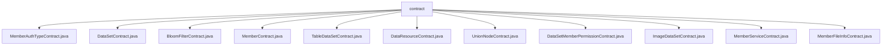

# 基础信息

|      |      |
|------|------|
| 名称 | contract |
| 编码语言 | .java |
| 代码路径 | WeFe/union/union-service/src/main/java/com/welab/wefe/union/service/contract |
| 包名 | docs.union.union-service.src.main.java.com.welab.wefe.union.service.contract |
| 概述说明 | MemberAuthTypeContract：管理成员认证类型，支持增删改查、扩展JSON更新和事件监听，使用ECDSA/SM加密。  DataSetContract：数据集管理合约，提供增删改查功能，支持ECDSA/SM2加密和事件通知。  BloomFilterContract：布隆过滤器合约，支持数据增删改查和哈希函数更新，提供事件订阅。  MemberContract：成员管理合约，支持CRUD操作、分页查询和事件监听，使用ECDSA/SM加密。  TableDataSetContract：数据表管理合约，提供增删改查和事件订阅，支持国密/非国密算法。  DataResourceContract：数据资源管理合约，支持状态更新、查询和事件监听，使用泛型处理类型。  UnionNodeContract：联盟节点管理合约，支持节点CRUD操作和状态更新，提供6种事件监听。  DataSetMemberPermissionContract：数据权限管理合约，支持权限查询和操作，使用ECDSA/SM2加密。  ImageDataSetContract：图像数据集管理合约，提供增删改查和扩展JSON更新，支持事件订阅。  MemberServiceContract：成员服务管理合约，支持服务CRUD操作和事件通知，含ABI和二进制代码。  MemberFileInfoContract：成员文件管理合约，支持文件信息更新和查询，提供4种事件监听。 |

# 说明

## 概述  
该模块是一组基于FISCO BCOS的智能合约Java封装类，核心职责为提供联盟链环境下的成员管理、数据资源操作和权限控制功能，类似企业级RBAC系统的链上实现。接口规范统一包含CRUD操作、扩展JSON更新、存在性检查和事件订阅，支持ECDSA/SM2双算法和同步/异步交易模式。关键数据结构包括事件响应内部类、Tuple多返回值封装和BigInteger数值处理。外部依赖项主要为FISCO BCOS SDK和国密算法库。例如MemberContract实现成员全生命周期管理，DataSetContract提供数据集分页查询。

## 主要业务场景  
模块支持三类典型场景：1)成员体系管理（如认证类型更新、文件信息维护），2)数据资源操作（如图像数据集CRUD、布隆过滤器维护），3)权限控制（如数据集成员权限校验）。业务流程通过事件总线模式通知状态变更，例如insertEvent触发后续审计流程。API集成案例包括联合节点管理（UnionNodeContract）和服务注册（MemberServiceContract），形成完整的联盟链治理方案。所有合约均遵循ABI规范，支持Java应用通过类型安全接口访问链上数据。

### 包内部结构视图

该流程图展示了WeFe项目中union-service模块下的contract目录结构，包含11个Java合约文件，涉及成员认证、数据集、布隆过滤器、数据资源等多种合约类型。所有文件均直接隶属于contract节点，呈现扁平化结构，反映该目录下专注于定义各类服务合约接口的设计模式。

# 文件列表

| 名称   | 类型  | 说明 |
|-------|------|-------------|
| [MemberAuthTypeContract.java](MemberAuthTypeContract.md) | file | MemberAuthTypeContract是一个智能合约类，用于管理成员认证类型。主要功能包括更新扩展JSON、更新类型信息、检查类型是否存在、查询所有类型、插入新类型和删除类型。合约包含四个事件：insertEvent、updateEvent、deleteByTypeIdEvent和updateExtJsonEvent，用于记录操作结果。支持同步和异步交易，提供输入输出参数解析方法。可通过部署或加载现有合约地址使用。 |
| [DataSetContract.java](DataSetContract.md) | file | DataSetContract是一个智能合约类，继承自Contract，包含数据集的增删改查功能。提供插入、更新、删除、查询等操作，支持事件监听和回调。合约包含ABI和二进制代码，适用于ECDSA和SM2加密。关键功能包括按ID查询、分页查询、更新扩展JSON等。 |
| [BloomFilterContract.java](BloomFilterContract.md) | file | BloomFilterContract是一个智能合约类，提供布隆过滤器功能，包含插入、查询、更新和删除操作。支持事件监听，适用于数据资源管理场景。 |
| [MemberContract.java](MemberContract.md) | file | MemberContract是一个智能合约类，继承自Contract类，用于管理成员信息。主要功能包括更新成员扩展信息、更新排除logo、查询成员信息、删除成员、检查成员是否存在、更新成员logo、更新最后活动时间、更新公钥、更新排除公钥、统计成员数量、查询所有成员、插入新成员、分页查询成员等。合约支持事件监听，如插入事件、更新事件等。提供部署和加载合约的方法，支持ECDSA和SM加密算法。 |
| [TableDataSetContract.java](TableDataSetContract.md) | file | TableDataSetContract是一个智能合约类，用于管理表格数据集。主要功能包括：1. 数据操作：- selectById：根据ID查询数据- update：更新数据- isExist：检查数据是否存在- deleteByDataResourceId：删除数据- updateExtJson：更新扩展JSON- insert：插入新数据2. 事件监听：- insertEvent：插入事件- updateEvent：更新事件- updateExtJsonEvent：更新JSON事件- deleteByDataResourceIdEvent：删除事件3. 合约部署：- 支持普通部署和加载已有合约- 支持ECDSA和SM2加密算法4. 辅助功能：- 获取交易输入/输出参数- 生成签名交易- 异步交易回调该合约使用ABI编码与区块链交互，提供完整的数据增删改查功能。 |
| [DataResourceContract.java](DataResourceContract.md) | file | DataResourceContract 是一个智能合约类，继承自 Contract 类，提供了数据资源管理的功能。主要特点包括：1. 包含数据资源的增删改查操作：   - insert - 插入新数据资源   - update - 更新数据资源   - deleteByDataResourceId - 删除数据资源   - selectById - 查询数据资源   - isExist - 检查数据资源是否存在2. 支持扩展功能：   - updateEnable - 更新启用状态   - updateExtJson - 更新扩展JSON数据3. 包含5个事件：   - insertEvent   - updateEvent     - updateExtJsonEvent   - updateEnableEvent   - deleteByDataResourceIdEvent4. 支持ECDSA和SM2两种加密算法5. 提供了完整的ABI和二进制代码6. 支持异步交易回调7. 提供事件订阅功能这个合约适用于需要管理结构化数据的区块链应用场景。 |
| [UnionNodeContract.java](UnionNodeContract.md) | file | UnionNodeContract是一个智能合约类，用于管理联盟节点信息。主要功能包括：1. 节点增删改查：   - 插入新节点(insert)   - 更新节点信息(update)   - 删除节点(deleteByUnionNodeId)   - 查询节点是否存在(isExist)   - 查询所有节点(selectAll)2. 节点属性更新：   - 更新启用状态(updateEnable)   - 更新公钥(updatePublicKey)   - 更新扩展JSON(updateExtJson)3. 事件通知：   - 插入事件(InsertEvent)   - 更新事件(UpdateEvent)   - 启用状态更新事件(UpdateEnableEvent)   - 公钥更新事件(UpdatePublicKeyEvent)   - 删除事件(DeleteByUnionNodeIdEvent)   - 扩展JSON更新事件(UpdateExtJsonEvent)合约支持ECDSA和SM2两种加密算法，提供了完整的Java SDK接口，包括同步/异步交易执行、事件订阅等功能。 |
| [DataSetMemberPermissionContract.java](DataSetMemberPermissionContract.md) | file | DataSetMemberPermissionContract是一个智能合约类，用于管理数据集成员权限。主要功能包括：查询成员权限、更新扩展JSON、检查存在性、分页查询、插入和更新权限记录、删除数据集权限等。合约支持事件监听，如插入、更新、删除操作的事件响应。适用于区块链环境中的权限管理场景。 |
| [ImageDataSetContract.java](ImageDataSetContract.md) | file | ImageDataSetContract是一个智能合约类，用于管理图像数据集。主要功能包括：1. 数据操作：- selectById：根据ID查询数据- update：更新数据- insert：插入新数据- deleteByDataResourceId：删除数据- updateExtJson：更新扩展JSON数据2. 状态检查：- isExist：检查数据是否存在3. 事件通知：- 插入、更新、删除等操作都有对应的事件通知合约使用ABI编码与区块链交互，支持ECDSA和SM2两种加密算法。提供了同步和异步两种调用方式，并支持交易回执解析和事件订阅功能。 |
| [MemberServiceContract.java](MemberServiceContract.md) | file | MemberServiceContract是一个智能合约类，提供成员服务相关功能。包含查询、更新、删除等操作，支持事件监听。主要功能包括：按ID查询服务、更新服务信息、检查服务是否存在、删除服务、更新扩展JSON数据等。合约包含二进制代码和ABI定义，支持普通和国密两种加密方式。 |
| [MemberFileInfoContract.java](MemberFileInfoContract.md) | file | MemberFileInfoContract是一个智能合约类，继承自Contract基类，用于管理成员文件信息。主要功能包括：1. 提供文件启用状态更新、存在性检查、扩展JSON更新、数据插入和文件ID查询功能。2. 包含4个事件：插入事件、更新事件、启用状态更新事件和扩展JSON更新事件。3. 支持普通交易和异步交易两种执行方式。4. 提供事件订阅功能，可监听合约事件。5. 同时支持ECDSA和SM2两种加密算法。关键点：文件信息管理、多种查询和更新操作、事件监听、双加密算法支持。 |

