# 基础信息

|      |      |
|------|------|
| 名称 | dto |
| 编码语言 | .java |
| 代码路径 | WeFe/union/union-service/src/main/java/com/welab/wefe/union/service/dto |
| 包名 | docs.union.union-service.src.main.java.com.welab.wefe.union.service.dto |
| 概述说明 | TrustCertsQueryOutput类表示证书查询结果，含证书ID、内容等字段。模块管理数据资源元信息，支持CRUD操作。实名认证模块处理协议模板和SM2签名数据。成员管理模块封装成员信息响应。基础输入模块处理分页和成员ID参数。 |

# 说明

## 概述  
该模块核心职责是统一管理联合学习中的多领域数据，包括数据资源元信息、实名认证协议、成员信息和基础查询参数。接口规范采用分层设计，例如`AbstractTimedApiOutput`作为基类提供时间戳能力，`ApiDataResourceQueryOutput`扩展基础结构支持标签统计。关键数据结构涵盖证书ID（`TrustCertsQueryOutput`）、资源标签（`TagsDTO`）、成员详情（`MemberQueryOutput`）和分页参数（`PageInput`）。外部依赖仅涉及Java基础库和抽象类如`AbstractApiOutput`。例如`RealNameAuthFileUploadOutput`通过`fileId`实现文件标识，类似云存储回调机制。

## 主要业务场景  
模块支持联合学习全链路操作，类似分布式系统数据总线。业务流程包括：数据资源管理（如`DataResourcePutInput`更新描述）、实名认证（如SM2签名参数封装）、成员信息查询（如`MemberQueryOutput`返回20+字段）和分页控制（如`PageInput`设置默认值）。交互模式统一采用Getter/Setter，通过继承复用公共字段。典型应用包括证书查询（`TrustCertsQueryOutput`标识CA证书）、标签聚合（`ApiTagsQueryOutput`统计使用频率）和文件上传（`RealNameAuthFileUploadOutput`返回凭证）。API类型覆盖基础DTO、分页控制和扩展输出三类，例如`ApiTableDataSetQueryOutput`在基础结构上追加列特征。

### 包内部结构视图

```mermaid
graph TD
    dto --> cert
    dto --> dataresource
    dto --> common
    dto --> member
    dto --> base
    cert --> TrustCertsQueryOutput.java
    dataresource --> bloomfilter
    dataresource --> dataset
    dataresource --> ApiDataResourceQueryOutput.java
    dataresource --> ApiTagsQueryOutput.java
    dataresource --> TagsDTO.java
    dataresource --> ApiDataResourceDetailInput.java
    dataresource --> DataResourcePutInput.java
    dataresource --> ApiDataResourceQueryInput.java
    bloomfilter --> ApiBloomFilterQueryOutput.java
    dataset --> image
    dataset --> table
    image --> ApiImageDataSetQueryOutput.java
    table --> ApiTableDataSetQueryOutput.java
    table --> ApiDataSetQueryOutput.java
    table --> DataSetDetailOutput.java
    table --> DataSetOutput.java
    table --> ApiDataSetDefaultTagOutput.java
    common --> RealnameAuthAgreementTemplateOutput.java
    common --> SM2SignedApiInput.java
    member --> MemberOutput.java
    member --> RealNameAuthFileUploadOutput.java
    member --> ApiMemberServiceQueryOutput.java
    member --> MemberQueryOutput.java
    base --> BaseInput.java
    base --> PageInput.java
```

该流程图展示了WeFe项目中union-service模块的DTO层结构，以dto为根节点，向下分为cert、dataresource、common、member和base五个主要分支。其中dataresource分支最为复杂，包含bloomfilter和dataset两个子目录，dataset又进一步分为image和table两类。每个分支末端都连接着具体的输出/输入类文件，共包含25个节点，完整呈现了DTO层的完整组织结构。

# 文件列表

| 名称   | 类型  | 说明 |
|-------|------|-------------|
| [cert](cert/_module.md) | package | TrustCertsQueryOutput类继承AbstractTimedApiOutput，包含证书ID、序列号、内容、父证书ID、颁发者和主题信息，以及标识是否为CA或根证书的布尔字段。 |
| [common](common/_module.md) | package | RealnameAuthAgreementTemplateOutput类含模板文件ID和名称属性及对应方法。SM2SignedApiInput类继承AbstractApiInput，含节点ID、签名和数据属性及方法。 |
| [dataresource](dataresource/_module.md) | package | ApiBloomFilterQueryOutput继承ApiDataResourceQueryOutput，含ExtraData内部类存储hashFunction。ApiDataResourceQueryOutput包含资源ID、名称等属性。TagsDTO类封装标签数据。输入类如ApiDataResourceDetailInput含必填字段dataResourceId和dataResourceType。模块提供数据集查询标准化输出，支持联合学习元数据管理。 |
| [base](base/_module.md) | package | BaseInput继承AbstractApiInput，含curMemberId及其getter/setter。PageInput继承BaseInput，含默认pageSize(10)和pageIndex(0)及其getter/setter。 |
| [member](member/_module.md) | package | MemberOutput是空实现的API输出子类。RealNameAuthFileUploadOutput处理实名认证文件上传，含fileId属性。ApiMemberServiceQueryOutput包含服务相关属性。MemberQueryOutput封装成员查询结果，含基本信息和状态标识。 |

