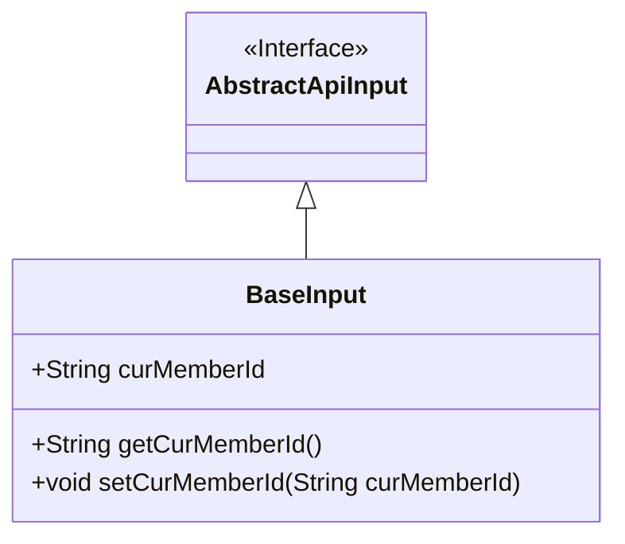
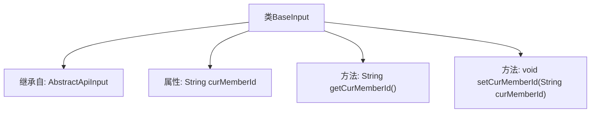

# 基础信息

|      |      |
|------|------|
| 名称 | BaseInput |
| 编码语言 | .java |
| 代码路径 | WeFe/union/union-service/src/main/java/com/welab/wefe/union/service/dto/base/BaseInput.java |
| 包名 | com.welab.wefe.union.service.dto.base |
| 依赖项 | ['com.welab.wefe.common.web.dto.AbstractApiInput'] |
| 概述说明 | BaseInput类继承AbstractApiInput，包含成员变量curMemberId及其getter和setter方法。 |

# 说明

BaseInput类继承自AbstractApiInput，包含一个字符串类型的成员变量curMemberId，并提供了对应的getter和setter方法用于访问和修改该变量的值。

# 类列表 Class Summary

| 名称   | 类型  | 说明 |
|-------|------|-------------|
| BaseInput | class | BaseInput类继承AbstractApiInput，包含成员变量curMemberId及其getter和setter方法。 |

## 类 BaseInput

|      |      |
|------|------|
| 访问范围 | public |
| 类型 | class |
| 名称 | BaseInput |
| 说明 | BaseInput类继承AbstractApiInput，包含成员变量curMemberId及其getter和setter方法。 |

### UML类图

这段类图展示了BaseInput类继承自AbstractApiInput接口的结构。BaseInput包含一个公有字符串字段curMemberId，以及对应的getter和setter方法。箭头方向表示BaseInput实现了AbstractApiInput接口，符合面向对象设计中子类扩展父类的原则。该结构常用于API输入参数的基类设计，通过继承实现参数标准化。

### 内部方法调用关系图

这段代码展示了一个简单的Java类`BaseInput`，它继承自`AbstractApiInput`类。类中包含一个字符串类型的成员变量`curMemberId`，以及对应的getter和setter方法。流程图清晰地展示了类的继承关系和内部结构，包括属性定义和方法声明。通过继承，`BaseInput`获得了`AbstractApiInput`的所有特性，同时扩展了自己的特定功能。

### 字段列表 Field List

| 名称  | 类型  | 说明 |
|-------|-------|------|
| curMemberId | String | 当前成员ID的字符串变量。 |

### 方法列表

| 名称  | 类型  | 说明 |
|-------|-------|------|
| getCurMemberId | String | 这是一个Java方法，返回当前成员ID字符串。 |
| setCurMemberId | void | 设置当前成员ID的方法，将参数curMemberId赋值给类的同名成员变量。 |

