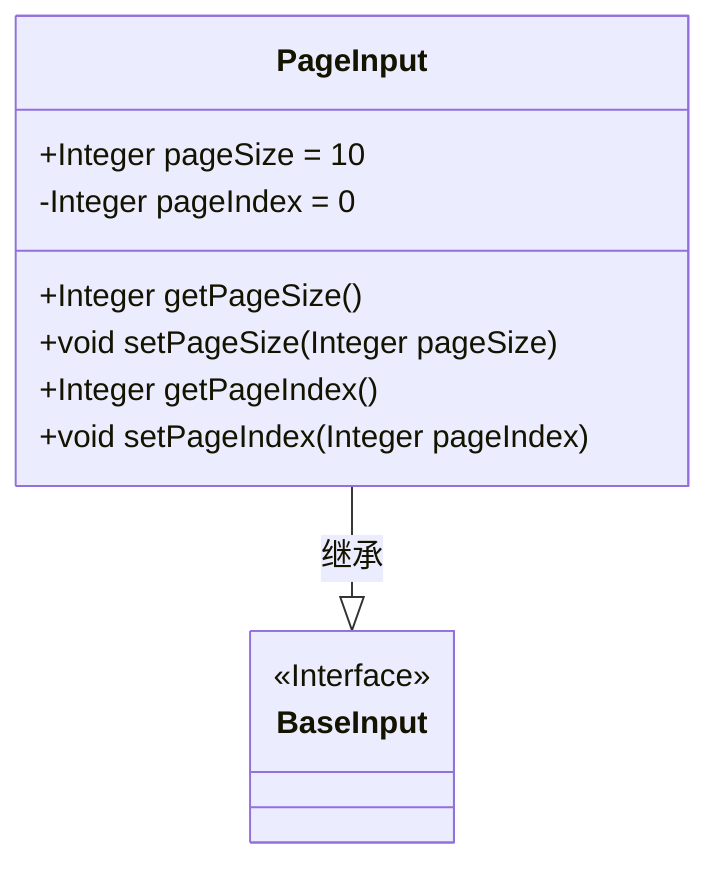
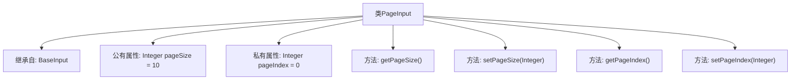

# 基础信息

|      |      |
|------|------|
| 名称 | PageInput |
| 编码语言 | .java |
| 代码路径 | WeFe/union/union-service/src/main/java/com/welab/wefe/union/service/dto/base/PageInput.java |
| 包名 | com.welab.wefe.union.service.dto.base |
| 依赖项 | [] |
| 概述说明 | PageInput类继承BaseInput，包含pageSize和pageIndex属性及其getter/setter方法，默认值分别为10和0。 |

# 说明

PageInput类继承自BaseInput，用于处理分页输入参数。该类包含两个属性：pageSize表示每页大小，默认值为10；pageIndex表示当前页码，默认值为0。提供了getter和setter方法来访问和修改这两个属性。pageSize是公开属性，pageIndex是私有属性。

# 类列表 Class Summary

| 名称   | 类型  | 说明 |
|-------|------|-------------|
| PageInput | class | PageInput类继承BaseInput，包含默认页大小10和页索引0，提供getter和setter方法。 |

## 类 PageInput

|      |      |
|------|------|
| 访问范围 | public |
| 类型 | class |
| 名称 | PageInput |
| 说明 | PageInput类继承BaseInput，包含默认页大小10和页索引0，提供getter和setter方法。 |

### UML类图

这段类图展示了PageInput类继承自BaseInput接口的结构。PageInput包含两个整型属性：公有属性pageSize（默认值10）和私有属性pageIndex（默认值0），以及对应的getter和setter方法。BaseInput被标记为接口，PageInput通过实线空心三角箭头表示继承关系。该设计实现了分页参数的基础封装，便于统一管理页码和页大小。

### 内部方法调用关系图

这段代码定义了一个名为PageInput的类，它继承自BaseInput类。PageInput类包含两个属性：公有属性pageSize（默认值为10）和私有属性pageIndex（默认值为0）。类中提供了四个方法：getPageSize()用于获取pageSize的值，setPageSize(Integer)用于设置pageSize的值，getPageIndex()用于获取pageIndex的值，setPageIndex(Integer)用于设置pageIndex的值。这个类主要用于处理分页相关的输入参数，通过继承BaseInput类可以复用基类的功能。

### 字段列表 Field List

| 名称  | 类型  | 说明 |
|-------|-------|------|
| pageSize = 10 | Integer | 定义整型变量pageSize，默认值为10。 |
| pageIndex = 0 | Integer | 定义整型变量pageIndex，初始值为0。 |

### 方法列表

| 名称  | 类型  | 说明 |
|-------|-------|------|
| getPageIndex | Integer | 这是一个Java方法，返回整型变量pageIndex的值。 |
| getPageSize | Integer | 获取当前页大小的整数值。 |
| setPageSize | void | 这是一个Java方法，用于设置页面大小，将传入的pageSize参数赋值给类的pageSize成员变量。 |
| setPageIndex | void | 设置当前页码的整数值。 |

