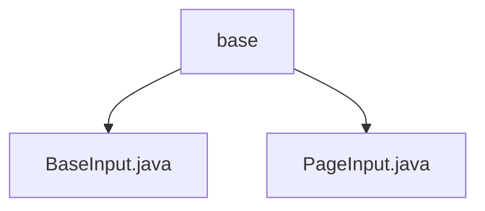

# 基础信息

|      |      |
|------|------|
| 名称 | base |
| 编码语言 | .java |
| 代码路径 | WeFe/union/union-service/src/main/java/com/welab/wefe/union/service/dto/base |
| 包名 | docs.union.union-service.src.main.java.com.welab.wefe.union.service.dto.base |
| 概述说明 | BaseInput继承AbstractApiInput，含curMemberId及其getter/setter。PageInput继承BaseInput，含默认pageSize(10)和pageIndex(0)及其getter/setter。 |

# 说明

## 概述  
该模块核心职责是提供基础输入参数处理能力，包括成员标识管理和分页控制。接口规范统一采用Java Bean风格，通过Getter/Setter暴露属性，例如BaseInput的curMemberId和PageInput的pageSize/pageIndex。关键数据结构包含字符串类型的成员ID和整型分页参数。无外部依赖项。

## 主要业务场景  
主要用于构建分页查询请求，类似前端表格控件的后端适配层。典型应用模式是通过继承BaseInput扩展业务参数，例如PageInput添加分页控制能力。API类型均为DTO类，集成案例包括设置默认分页值（pageSize=10）和页码归零处理。

### 包内部结构视图

该流程图展示了WeFe项目中union-service模块的DTO基础类结构。base目录下包含两个基础输入类：BaseInput.java作为所有输入参数的基类，PageInput.java扩展了分页查询功能。这种层级关系体现了良好的代码组织方式，便于统一管理基础数据传输对象。

# 文件列表

| 名称   | 类型  | 说明 |
|-------|------|-------------|
| [BaseInput.java](BaseInput.md) | file | BaseInput类继承AbstractApiInput，包含成员变量curMemberId及其getter和setter方法。 |
| [PageInput.java](PageInput.md) | file | PageInput类继承BaseInput，包含pageSize和pageIndex属性及其getter/setter方法，默认值分别为10和0。 |

