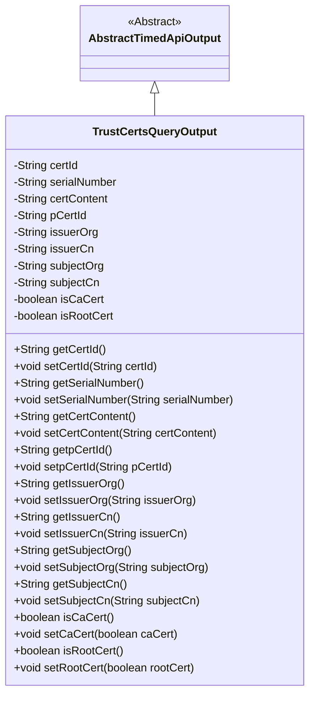

# 基础信息

|      |      |
|------|------|
| 名称 | TrustCertsQueryOutput |
| 编码语言 | .java |
| 代码路径 | WeFe/union/union-service/src/main/java/com/welab/wefe/union/service/dto/cert/TrustCertsQueryOutput.java |
| 包名 | com.welab.wefe.union.service.dto.cert |
| 依赖项 | ['com.welab.wefe.common.web.dto.AbstractTimedApiOutput'] |
| 概述说明 | TrustCertsQueryOutput类继承AbstractTimedApiOutput，包含证书ID、序列号、内容、父证书ID、颁发者和主题信息，以及标识是否为CA或根证书的布尔字段。 |

# 说明

TrustCertsQueryOutput类继承自AbstractTimedApiOutput，用于表示信任证书查询结果。包含证书ID、序列号、证书内容、父证书ID等字段。记录颁发者组织和通用名、主题组织和通用名信息。提供CA证书和根证书的布尔标识。所有字段均通过getter和setter方法进行访问和修改。

# 类列表 Class Summary

| 名称   | 类型  | 说明 |
|-------|------|-------------|
| TrustCertsQueryOutput | class | TrustCertsQueryOutput类继承AbstractTimedApiOutput，包含证书ID、序列号、内容、父证书ID、颁发者和主题信息，以及CA和根证书标识。 |

## 类 TrustCertsQueryOutput

|      |      |
|------|------|
| 访问范围 | public |
| 类型 | class |
| 名称 | TrustCertsQueryOutput |
| 说明 | TrustCertsQueryOutput类继承AbstractTimedApiOutput，包含证书ID、序列号、内容、父证书ID、颁发者和主题信息，以及CA和根证书标识。 |

### UML类图

该代码定义了一个名为TrustCertsQueryOutput的类，用于表示信任证书查询的输出结果。该类继承自AbstractTimedApiOutput，包含多个私有字段如证书ID、序列号、证书内容等，并提供了对应的getter和setter方法。类图清晰地展示了继承关系和类的成员结构，反映了该类的核心功能是封装和管理证书相关的数据信息。

### 内部方法调用关系图

```mermaid
graph TD
    A["类TrustCertsQueryOutput"]
    B["继承自: AbstractTimedApiOutput"]
    C["属性: String certId"]
    D["属性: String serialNumber"]
    E["属性: String certContent"]
    F["属性: String pCertId"]
    G["属性: String issuerOrg"]
    H["属性: String issuerCn"]
    I["属性: String subjectOrg"]
    J["属性: String subjectCn"]
    K["属性: boolean isCaCert"]
    L["属性: boolean isRootCert"]
    M["方法: getCertId/setCertId"]
    N["方法: getSerialNumber/setSerialNumber"]
    O["方法: getCertContent/setCertContent"]
    P["方法: getpCertId/setpCertId"]
    Q["方法: getIssuerOrg/setIssuerOrg"]
    R["方法: getIssuerCn/setIssuerCn"]
    S["方法: getSubjectOrg/setSubjectOrg"]
    T["方法: getSubjectCn/setSubjectCn"]
    U["方法: isCaCert/setCaCert"]
    V["方法: isRootCert/setRootCert"]

    A --> B
    A --> C
    A --> D
    A --> E
    A --> F
    A --> G
    A --> H
    A --> I
    A --> J
    A --> K
    A --> L
    A --> M
    A --> N
    A --> O
    A --> P
    A --> Q
    A --> R
    A --> S
    A --> T
    A --> U
    A --> V
```

该流程图展示了TrustCertsQueryOutput类的完整结构，包含其继承关系和所有属性与方法。该类继承自AbstractTimedApiOutput，包含10个字符串和布尔类型的私有属性，每个属性都有对应的getter和setter方法。这些方法用于获取和设置证书ID、序列号、证书内容、父证书ID、颁发者组织、颁发者通用名、主体组织和主体通用名等信息，以及标识是否为CA证书和根证书的布尔值。

### 字段列表 Field List

| 名称  | 类型  | 说明 |
|-------|-------|------|
| subjectCn | String | 私有字符串变量，存储中文主题信息。 |
| isRootCert | boolean | 字段isRootCert表示是否为根证书。 |
| certId | String | 声明一个私有字符串变量certId。 |
| serialNumber | String | 私有字符串变量serialNumber。 |
| issuerCn | String | 声明一个私有字符串变量issuerCn，用于存储证书颁发者的通用名称。 |
| subjectOrg | String | 声明一个私有字符串变量subjectOrg。 |
| issuerOrg | String | 声明一个私有字符串变量issuerOrg，用于存储发行方机构信息。 |
| pCertId | String | 声明一个私有字符串变量pCertId。 |
| isCaCert | boolean | 声明一个布尔变量isCaCert，表示是否为CA证书。 |
| certContent | String | 私有字符串变量certContent，用于存储证书内容。 |

### 方法列表

| 名称  | 类型  | 说明 |
|-------|-------|------|
| getCertId | String | 获取证书ID的方法，返回certId字符串。 |
| setIssuerCn | void | 设置颁发者通用名称的方法。 |
| setSubjectCn | void | 设置中文主题字段的方法，将输入参数赋值给类的成员变量subjectCn。 |
| getSubjectCn | String | 获取中文主题名称的方法，直接返回属性subjectCn的值。 |
| getpCertId | String | 方法getpCertId返回字符串类型变量pCertId的值。 |
| getCertContent | String | 方法getCertContent返回字符串certContent的值。 |
| setpCertId | void | 这是一个Java方法，用于设置对象的pCertId属性值。方法接收一个字符串参数pCertId，并将其赋值给当前对象的同名属性。 |
| setSubjectOrg | void | 设置主题组织字段的方法。 |
| getIssuerOrg | String | 获取发行者组织的字符串方法。 |
| getSerialNumber | String | 获取序列号的方法，返回字符串类型变量serialNumber。 |
| getIssuerCn | String | 获取证书颁发者的通用名称。 |
| setCertId | void | 设置证书ID的方法，将输入参数certId赋值给类的成员变量certId。 |
| isCaCert | boolean | 方法isCaCert返回布尔值，表示是否为CA证书。 |
| getSubjectOrg | String | 获取subjectOrg字符串值的方法。 |
| setIssuerOrg | void | 设置证书颁发机构名称的方法。 |
| setSerialNumber | void | 设置设备序列号的方法，将输入参数赋值给成员变量serialNumber。 |
| setCertContent | void | 设置证书内容的方法，将输入字符串赋值给类成员变量certContent。 |
| setCaCert | void | 设置证书是否为CA证书的方法，参数caCert决定状态。 |
| isRootCert | boolean | 方法isRootCert返回布尔值，表示是否为根证书。 |
| setRootCert | void | 设置根证书状态的方法，参数rootCert决定是否为根证书。 |

