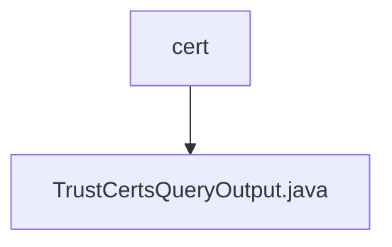

# 基础信息

|      |      |
|------|------|
| 名称 | cert |
| 编码语言 | .java |
| 代码路径 | WeFe/union/union-service/src/main/java/com/welab/wefe/union/service/dto/cert |
| 包名 | docs.union.union-service.src.main.java.com.welab.wefe.union.service.dto.cert |
| 概述说明 | TrustCertsQueryOutput类继承AbstractTimedApiOutput，包含证书ID、序列号、内容、父证书ID、颁发者和主题信息，以及标识是否为CA或根证书的布尔字段。 |

# 说明

TrustCertsQueryOutput类继承自AbstractTimedApiOutput，用于表示信任证书查询结果。包含证书ID、序列号、证书内容、父证书ID等字段。记录颁发者组织和通用名、主题组织和通用名信息。提供CA证书和根证书的布尔标识。所有字段均通过getter和setter方法进行访问和修改。

### 包内部结构视图

该流程图展示了WeFe项目中union-service模块下cert目录与其中Java文件的层级关系。cert作为父目录节点，包含一个子文件TrustCertsQueryOutput.java，该文件是证书查询功能的输出数据传输对象。整个结构简洁明了，体现了DTO层中证书相关类的单一文件存储方式。

# 文件列表

| 名称   | 类型  | 说明 |
|-------|------|-------------|
| [TrustCertsQueryOutput.java](TrustCertsQueryOutput.md) | file | TrustCertsQueryOutput类继承AbstractTimedApiOutput，包含证书ID、序列号、内容、父证书ID、颁发者和主题信息，以及标识是否为CA或根证书的布尔字段。 |

