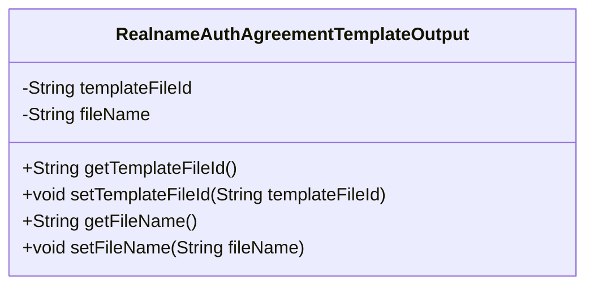
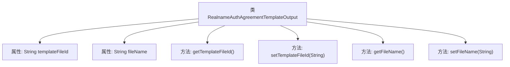

# 基础信息

|      |      |
|------|------|
| 名称 | RealnameAuthAgreementTemplateOutput |
| 编码语言 | .java |
| 代码路径 | WeFe/union/union-service/src/main/java/com/welab/wefe/union/service/dto/common/RealnameAuthAgreementTemplateOutput.java |
| 包名 | com.welab.wefe.union.service.dto.common |
| 依赖项 | [] |
| 概述说明 | 这是一个实名认证协议模板类，包含模板文件ID和文件名属性及其getter和setter方法。 |

# 说明

这是一个名为RealnameAuthAgreementTemplateOutput的Java类，用于表示实名认证协议模板的输出信息。该类包含两个私有字符串属性：templateFileId（模板文件ID）和fileName（文件名称）。为这两个属性分别提供了对应的getter和setter方法，用于获取和设置属性值。这个类主要用于封装与实名认证协议模板相关的文件标识和名称信息。

# 类列表 Class Summary

| 名称   | 类型  | 说明 |
|-------|------|-------------|
| RealnameAuthAgreementTemplateOutput | class | 这是一个Java类，用于实名认证协议模板输出，包含模板文件ID和文件名两个属性及其getter和setter方法。 |

## 类 RealnameAuthAgreementTemplateOutput

|      |      |
|------|------|
| 访问范围 | public |
| 类型 | class |
| 名称 | RealnameAuthAgreementTemplateOutput |
| 说明 | 这是一个Java类，用于实名认证协议模板输出，包含模板文件ID和文件名两个属性及其getter和setter方法。 |

### UML类图

这段代码定义了一个名为RealnameAuthAgreementTemplateOutput的类，用于存储实名认证协议模板的输出信息。该类包含两个私有字段：templateFileId（模板文件ID）和fileName（文件名），并提供了对应的getter和setter方法用于访问和修改这些字段值。这是一个典型的数据传输对象（DTO），用于封装和传递协议模板相关的文件信息。

### 内部方法调用关系图

该流程图展示了RealnameAuthAgreementTemplateOutput类的结构，包含两个私有属性templateFileId和fileName，以及对应的getter和setter方法。类通过set方法修改属性值，通过get方法获取属性值，实现了对模板文件ID和文件名的封装管理，符合JavaBean规范的数据访问控制模式。

### 字段列表 Field List

| 名称  | 类型  | 说明 |
|-------|-------|------|
| templateFileId | String | 私有字符串变量templateFileId，用于存储模板文件ID。 |
| fileName | String | 私有字符串变量fileName，用于存储文件名。 |

### 方法列表

| 名称  | 类型  | 说明 |
|-------|-------|------|
| setFileName | void | 这是一个Java方法，用于设置文件名属性。方法接受一个字符串参数fileName，并将其赋值给当前对象的fileName成员变量。 |
| getFileName | String | 方法返回文件名。 |
| getTemplateFileId | String | 获取模板文件ID的方法，返回字符串类型的templateFileId。 |
| setTemplateFileId | void | 设置模板文件ID的方法，将传入的templateFileId赋值给当前对象的同名属性。 |

