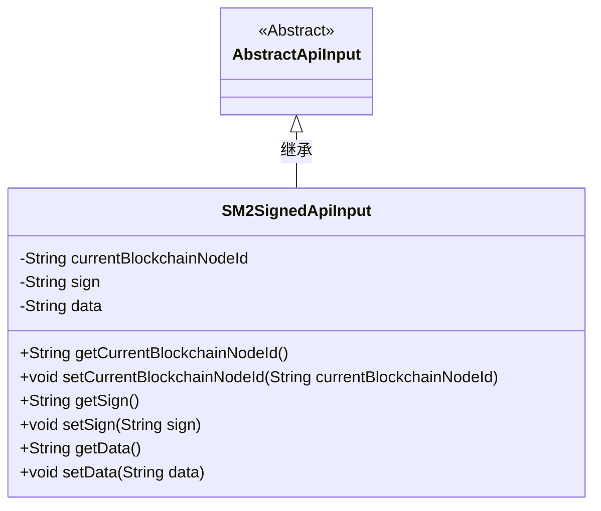
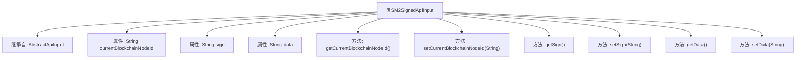

# 基础信息

|      |      |
|------|------|
| 名称 | SM2SignedApiInput |
| 编码语言 | .java |
| 代码路径 | WeFe/union/union-service/src/main/java/com/welab/wefe/union/service/dto/common/SM2SignedApiInput.java |
| 包名 | com.welab.wefe.union.service.dto.common |
| 依赖项 | ['com.welab.wefe.common.web.dto.AbstractApiInput'] |
| 概述说明 | SM2签名API输入类，包含区块链节点ID、签名和数据字段及其getter和setter方法。 |

# 说明

SM2SignedApiInput类继承自AbstractApiInput，包含三个私有字符串属性：currentBlockchainNodeId表示当前区块链节点ID，sign存储签名信息，data保存待处理数据。每个属性均配有对应的getter和setter方法用于访问和修改其值。该类主要用于封装SM2签名API的输入参数。

# 类列表 Class Summary

| 名称   | 类型  | 说明 |
|-------|------|-------------|
| SM2SignedApiInput | class | SM2签名API输入类，包含当前区块链节点ID、签名和数据字段及其getter和setter方法。 |

## 类 SM2SignedApiInput

|      |      |
|------|------|
| 访问范围 | public |
| 类型 | class |
| 名称 | SM2SignedApiInput |
| 说明 | SM2签名API输入类，包含当前区块链节点ID、签名和数据字段及其getter和setter方法。 |

### UML类图

这段代码展示了一个SM2签名API输入类SM2SignedApiInput，它继承自抽象类AbstractApiInput。该类包含三个私有字符串属性：currentBlockchainNodeId（当前区块链节点ID）、sign（签名）和data（数据），并为每个属性提供了公有的getter和setter方法。类图清晰地表示了继承关系和类的成员结构，体现了面向对象设计中封装和继承的特性。

### 内部方法调用关系图

该流程图展示了SM2SignedApiInput类的结构，该类继承自AbstractApiInput，包含三个字符串属性（currentBlockchainNodeId、sign和data）以及对应的getter和setter方法。每个属性都有独立的方法对，用于获取和设置属性值，体现了标准的JavaBean设计模式。类继承关系清晰，方法映射准确，整体结构简洁明了。

### 字段列表 Field List

| 名称  | 类型  | 说明 |
|-------|-------|------|
| sign | String | 私有字符串变量sign。 |
| currentBlockchainNodeId | String | 当前区块链节点ID的私有字符串变量。 |
| data | String | 私有字符串类型变量data。 |

### 方法列表

| 名称  | 类型  | 说明 |
|-------|-------|------|
| setData | void | 设置字符串数据到当前对象。 |
| setCurrentBlockchainNodeId | void | 设置当前区块链节点ID的方法，将参数值赋给类的成员变量currentBlockchainNodeId。 |
| getSign | String | 获取sign字符串的方法。 |
| getCurrentBlockchainNodeId | String | 获取当前区块链节点ID的方法，返回字符串类型节点ID。 |
| setSign | void | 这是一个Java方法，用于设置类的sign属性值。方法接收一个字符串参数sign，并将其赋值给当前对象的sign成员变量。 |
| getData | String | 获取数据方法，返回字符串类型变量data的值。 |

